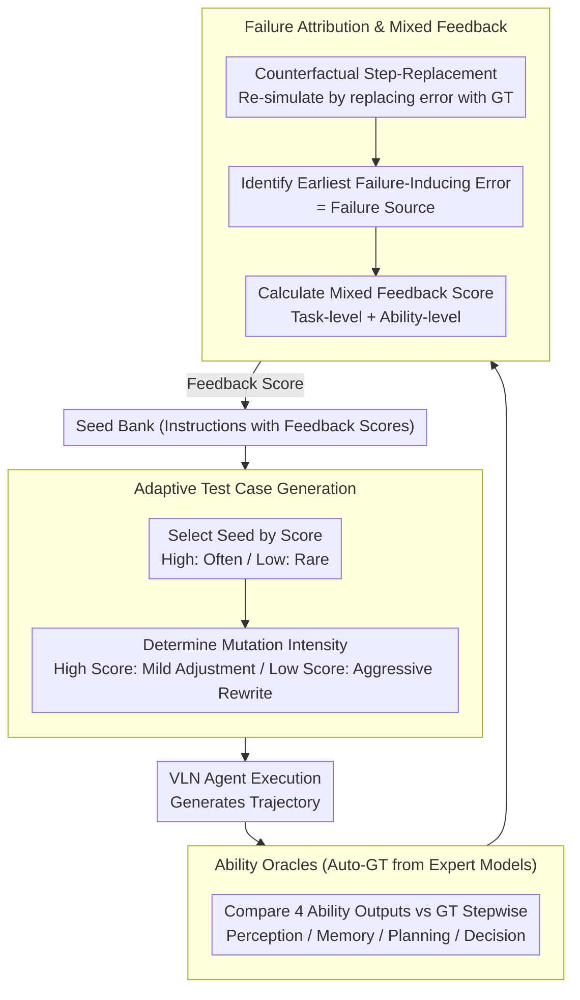

# Ability-Oriented Failure Attribution for Vision-Language Navigation Agents

**Conference**: ACL 2026  
**arXiv**: [2604.25161](https://arxiv.org/abs/2604.25161)  
**Code**: https://github.com/JMChen121/CanTest/  
**Area**: Robotics / Embodied AI / Navigation  
**Keywords**: Vision-Language Navigation, Ability Failure Diagnosis, Testing Framework, Embodied Agents, Fuzz Testing

## TL;DR

This paper addresses multi-level ability failures in embodied agents (specifically Vision-Language Navigation VLN agents) by proposing the CanTest framework. Through ability-oriented test oracles and failure attribution mechanisms, it precisely localizes specific ability defects (Perception/Memory/Planning/Decision-making) leading to task failure, discovering 23–34% more failure cases than existing methods.

## Background & Motivation

**Background**: The reliability assessment of embodied agents in safety-critical applications (e.g., Vision-Language Navigation, household robots) primarily relies on task-level metrics (path length, execution time, etc.), lacking in-depth testing of the agent's internal ability structure.

**Limitations of Prior Work**:

- VLN agents integrate four abilities—Perception, Memory, Planning, and Decision-making—which are tightly coupled and interdependent.
- During failure, upstream ability errors propagate to downstream ones in a cascade (e.g., perception errors lead to memory confusion, which then leads to planning errors).
- It is difficult to trace the initial source of failure over long trajectories.
- Developers cannot precisely locate weak points for targeted improvements.

**Key Challenge**: There is a significant gap between system-level failure detection ("task failed") and ability-level failure diagnosis ("which ability caused it"). For long-sequence embodied tasks, knowing only that a failure occurred without knowing its root cause provides almost no guidance for improvement.

**Goal**: Develop an **ability-oriented testing method** that can: (1) automatically generate test cases likely to expose specific ability defects; (2) construct independent evaluation standards (oracles) for each ability; (3) accurately attribute failures to a specific ability and its first moment of error within long trajectories.

**Key Insight**: The long-trajectory failure attribution problem is transformed into counterfactual reasoning: for each detected ability error, an attempt is made to replace it with the correct output from the oracle to see if the trajectory becomes successful. If it does, this error is a "failure-inducing error." Among multiple inducing errors, the one that appears earliest is the source of the failure.

**Core Idea**: Combine fuzzing with ability-level oracles and counterfactual causal reasoning to design an adaptive feedback scoring mechanism.

## Method

### Overall Architecture

The goal of CanTest is to not only report "failure" when a VLN agent fails a task over a long trajectory but also point out "which ability (Perception/Memory/Planning/Decision-making) failed first and at which step." It drives this process via a fuzzing loop—maintaining a seed bank with feedback scores. Each round, it selects a seed instruction and performs strong or weak mutations to generate new instructions for the agent. After execution, four ability oracles compare the agent's output with expert GT step-by-step to identify the earliest error that truly induced the failure. This diagnosis is converted into a feedback score and fed back into the seed bank, guiding the next round to generate instructions more likely to expose weak abilities. These three stages—generation, scoring, and attribution—are connected end-to-end for increasing precision.

### Key Designs

**1. Adaptive Test Case Generation: Following "How Easily a Seed Fails"**

Failures in VLN agents are sparse events; blind random mutation of instructions rarely hits defects efficiently. CanTest uses the historical feedback score of each seed as a signal for resource allocation: when selecting seeds, it normalizes scores into probabilities $p_{cs_i} = \max(F_{cs_i}, 0) / \sum_{i=1}^{N} F_{cs_i}$, so high-score seeds are chosen more frequently. During mutation, it determines intensity via $p_m = (F_{cs} - \min(\mathbf{F})) / (\max(\mathbf{F}) - \min(\mathbf{F}))$. High-score seeds (already proven to induce failure) use mild mutations for fine-tuning to preserve and refine the failure mode; low-score seeds use aggressive mutations to push the agent onto entirely different routes to detect other unexplored defects. This allows for both "deep diving" into known weaknesses and "broad searching" for unknown blind spots.

**2. Ability Oracle Construction: Custom Measurement for Four Heterogeneous Abilities**

To attribute failure to a specific ability, one must independently judge if each ability's output is correct. However, the output formats of Perception, Memory, Planning, and Decision-making differ significantly. CanTest leverages expert models in simulated environments to automatically obtain ground truth (GT)—a navigation expert for optimal paths, an image tagging model (RAM) for perception GT, and archived visual annotations for memory GT—then customizes a distance metric for each. The Perception oracle fuses LLM semantic similarity with Bounding Box IoU: $\epsilon_t^p = \frac{1}{N}\sum_n (\|VA_{t,n} - VA_{t,n}^{gt}\|_{\mathbb{L}} - |P_{t,n} \cap P_{t,n}^{gt}| / |P_{t,n} \cup P_{t,n}^{gt}|)$; the Planning oracle uses normalized Dynamic Time Warping to measure path deviation $\epsilon_t^{pl} = 1 - \text{nDTW}(\tau_t^{pl}, \tau_{t,\ldots,n}^{gt})$; and the Decision oracle compares actual actions with planned actions $\epsilon_t^d = 1 - \|D_t - D_t^{pl}\|$. Since GT is automatically produced by expert models, the entire suite of oracles can operate at scale without manual annotation.

**3. Failure Attribution & Mixed Feedback: Finding the Root Cause via Counterfactual "Step Replacement"**

Because the four abilities are tightly coupled, upstream errors cascade downstream; looking only at the final failure makes it impossible to identify the culprit. CanTest first uses oracles to scan all timesteps $t$, collecting the set of all ability errors $C^{errors}$. It then performs counterfactual intervention for each error $(C_x, t)$—replacing the agent's output at that step with the oracle's correct output and re-simulating the remaining trajectory. If the trajectory flips from failure to success, the error is identified as a "failure-inducing error." Among all such errors, the earliest one is chosen as the root cause $(C_x^*, t^*) = \arg\min_{(C_x', t') \in \mathbb{C}(\tau)} t$, representing the "first falling domino." Finally, the diagnosis is converted into a mixed feedback score $F_{cs} = F^f + \lambda^{C_x} F^c$: $F^f \in \{0, 1\}$ is the task-level success/failure signal, $F^c = \text{Norm}(\epsilon_{t^*}^x)$ is the normalized error intensity of the root ability at the root time, and the adaptive weight $\lambda^{C_x} = \overline{N^{C_y}} / N^{C_x}$ dynamically lowers the weight of fully explored abilities and raises it for under-explored ones to avoid getting stuck in a local loop of a single ability.

## Key Experimental Results

Using the Habitat 3 VLN simulation environment, the HM3D dataset provides 216 large-scale indoor 3D scenes with semantic annotations. Three advanced VLN models (ApexNav, MGDM, Mem2Ego) were tested against three baselines: Random, BehAVExplor, and VLATest.

### Main Results: Comparison of Discovered Failure Cases

| Method | ApexNav | MGDM | Mem2Ego | Avg. Gain |
|------|---------|------|---------|---------|
| Random | ~20–25 | ~23–28 | ~18–22 | Base |
| BehAVExplor + OA | ~41–49 | ~42–51 | ~37–46 | Base |
| VLATest + OA | ~52–58 | ~56–63 | ~50–58 | Base |
| **CanTest (Ours)** | **72–75** | **74–76** | **61–65** | **+23–34%** |

Note: OA indicates integrating CanTest's oracles and attribution mechanism as a plugin into the baseline. CanTest consistently outperforms all baselines across all models.

### Breakdown of Ability-Level Failure Cases

| Ability | ApexNav | MGDM | Mem2Ego | Description |
|------|---------|------|---------|------|
| Perception Failure | 72.2 | 74.7 | 61.4 | CanTest is strongest at finding perception failures |
| Memory Failure | 66.3 | 56.1 | 42.8 | Memory capacity varies significantly across models |
| Planning Failure | 52.5 | 49.3 | 66.1 | Fewer planning failures overall |
| Decision Failure | 59.5 | 64.7 | 63.4 | Decision-making failures are relatively stable |

### Repair Experiment: Fixing Failure Cases with Oracle GT

| Ability | ApexNav Repair Rate | MGDM Repair Rate | Mem2Ego Repair Rate |
|------|---------|---------|---------|
| Perception | 84.35% | 83.53% | 85.83% |
| Memory | 81.30% | 82.35% | 83.64% |
| Planning | 87.05% | 86.41% | 89.71% |
| Decision | 95.13% | 94.90% | 96.69% |

Repair rates > 81% indicate high oracle credibility. Upstream abilities (Perception, Memory) have slightly lower repair rates because errors propagating downstream can trigger multi-stage issues.

### Key Findings

- **High Oracle Fidelity**: Repair rates > 81% show that auto-constructed oracles capture real ability errors.
- **Upstream Errors are More Damaging**: Perception/Memory repair rates are lower than Planning/Decision because upstream errors cascade across the trajectory.
- **High Diversity**: Manual analysis of 100 failure cases covered 8 fine-grained failure types, compared to only 6 for the baseline.
- **Ablation**: Removing failure-oriented feedback, ability-oriented feedback, or both resulted in failure discovery counts of 62–68, 62–70, and 45–55, respectively, proving both signals contribute to failure discovery.

## Highlights & Insights

- **Clever Application of Counterfactual Reasoning**: By replacing erroneous ability outputs with GT to determine if it causes failure, the method elegantly and explainably identifies the root cause in long trajectories.
- **Automatic Ability Oracle Framework**: Instead of manually designing evaluation criteria for every ability, it utilizes expert models to auto-acquire GT. This is highly practical for scenarios lacking human annotation.
- **Adaptive Feedback Weights for Balanced Exploration**: Using $\lambda^{C_x}$ to dynamically adjust weights prevents test generation from falling into local loops of a single ability.
- **Detailed Failure Diversity Analysis**: Beyond reporting ability-level counts, the manual labeling of 8 fine-grained failure types provides a much sharper diagnostic view than just "Perception/Memory/Planning/Decision."

## Limitations & Future Work

**Limitations acknowledged by authors**:

1. **Reliance on Expert Models**: Constructing oracles requires GT, such as optimal path planning and perception labels. Obtaining this privileged information in real-world environments is difficult.
2. **Sim-to-Real Gap**: Current evaluations are performed in the Habitat simulation environment; noise and dynamism in the real world might invalidate existing oracle designs.

**Perspective on future directions**:

1. Oracles are currently based on expert model GT; future work could explore weakly supervised oracles (using signals from demonstrations, correction feedback, or safety monitors).
2. Embodied tasks beyond VLN (e.g., robotic arm manipulation, multi-agent collaboration) might require different ability definitions and oracle designs, needing a more generalized framework.
3. Currently, it handles only the earliest failure source; future attribution models could consider multiple concurrent failure sources.

## Related Work & Insights

- **vs BehAVExplor**: BehAVExplor uses behavior-guided fuzzing to generate diverse test cases, but feedback signals come only from system-level success/failure, making it unable to distinguish the root cause. CanTest's ability-level feedback results in +23% failure discovery.
- **vs VLATest**: VLATest is a SOTA framework for robot manipulation; CanTest customizes ability oracles and counterfactual attribution for VLN, providing stronger diagnostic power for multimodal embodied agents compared to generic operator methods.
- **vs Traditional Software Testing**: CanTest borrows the idea of counterfactual causal reasoning to use reverse simulation for root cause localization, representing an innovative application of causal reasoning in embodied AI testing.

## Rating

- **Novelty**: ⭐⭐⭐⭐⭐ First to systematically combine ability-level testing, automatic oracle construction, and counterfactual failure attribution in embodied agent testing.
- **Experimental Thoroughness**: ⭐⭐⭐⭐ Comprehensive across three VLN models, three baselines, ablation studies, repair rate verification, and manual diversity analysis; lacks real-world validation.
- **Writing Quality**: ⭐⭐⭐⭐ Clear motivation, thorough explanation of methods, and explicit experimental conclusions.
- **Value**: ⭐⭐⭐⭐⭐ Significant inspiration for testing and diagnosis in embodied AI; the oracle framework is transferable to other multi-ability systems.

<!-- RELATED:START -->

## Related Papers

- [\[ACL 2026\] Breaking Down and Building Up: Mixture of Skill-Based Vision-and-Language Navigation Agents](breaking_down_and_building_up_mixture_of_skill-based_vision-and-language_navigat.md)
- [\[ICLR 2026\] Self-Refining Vision Language Model for Robotic Failure Detection and Reasoning](../../ICLR2026/robotics/self-refining_vision_language_model_for_robotic_failure_detection_and_reasoning.md)
- [\[ACL 2026\] VLN-NF: Feasibility-Aware Vision-and-Language Navigation with False-Premise Instructions](vln-nf_feasibility-aware_vision-and-language_navigation_with_false-premise_instr.md)
- [\[NeurIPS 2025\] SAFE: Multitask Failure Detection for Vision-Language-Action Models](../../NeurIPS2025/robotics/safe_multitask_failure_detection_for_vision-language-action_models.md)
- [\[ICLR 2026\] Uncertainty-Aware Gaussian Map for Vision-Language Navigation](../../ICLR2026/robotics/uncertainty-aware_gaussian_map_for_vision-language_navigation.md)

<!-- RELATED:END -->
