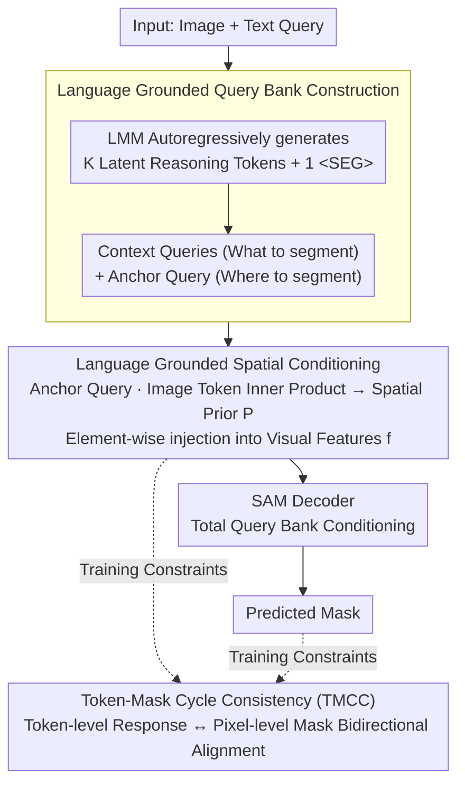

# AnchorSeg: Language Grounded Query Banks for Reasoning Segmentation

**Conference**: ACL 2026  
**arXiv**: [2604.18562](https://arxiv.org/abs/2604.18562)  
**Code**: [https://github.com/rui-qian/AnchorSeg](https://github.com/rui-qian/AnchorSeg)  
**Area**: Reasoning Segmentation / Multimodal VLM  
**Keywords**: Reasoning Segmentation, Language Grounded Query Banks, Spatial Prior, Token-Mask Consistency, SAM

## TL;DR

The authors propose AnchorSeg, which reformulates reasoning segmentation as a structured conditional generation process based on language-grounded query banks. By explicitly decoupling spatial localization and semantic reasoning via anchor queries and incorporating a Token-Mask cycle consistency training objective, AnchorSeg achieves state-of-the-art (SOTA) performance on ReasonSeg (67.7% gIoU, 68.1% cIoU).

## Background & Motivation

**Background**: Reasoning segmentation requires models to predict pixel-level masks based on complex, implicit text queries (e.g., "the objects providing shade in this scene"). Methods like LISA introduce a `<SEG>` token and use its hidden state as a single query fed into the SAM decoder for mask prediction.

**Limitations of Prior Work**: Existing methods compress both semantic reasoning and spatial localization into the hidden representation of a single `<SEG>` token. This implicit compression limits the model's ability to explicitly distinguish between "what to segment" (semantic reasoning) and "where to segment" (spatial localization), resulting in limited performance in complex reasoning scenarios.

**Key Challenge**: A single embedding must simultaneously encode two essentially different types of information: semantic understanding and spatial location. This creates a representation bottleneck—as the reasoning becomes more complex, it becomes harder for a single vector to carry both signals simultaneously.

**Goal**: The goal of this work is to redefine reasoning segmentation as a structured conditional generation problem, explicitly modeling spatial localization at the image token level and providing conditions through language-grounded queries.

**Key Insight**: The authors introduce multiple learnable tokens to form a "query bank," allowing different tokens to take on different roles—context queries handle semantic reasoning, while anchor queries handle spatial localization.

**Core Idea**: Replace the single `<SEG>` token with a language-grounded query bank to explicitly decouple spatial localization (anchor queries) and semantic modulation (context queries) through factorized conditional distributions.

## Method

### Overall Architecture

Given an input image and a text query, the LMM (e.g., LLaVA) autoregressively generates $K$ latent reasoning tokens and one segmentation anchor token `<SEG>`, forming a query bank $\mathbf{Q} = (\boldsymbol{q}_1, ..., \boldsymbol{q}_K, \boldsymbol{q}_{anc})$. The similarity between the anchor query and image tokens is computed to generate a spatial prior. After injecting this into the visual features, the entire query bank is fed into the SAM decoder to predict the final mask.

### Key Designs

**1. Language Grounded Query Bank Construction: Splitting "What to Reason" and "Where" into Different Tokens**

The old paradigm forced both semantic reasoning and spatial localization into a single `<SEG>` token, which becomes a bottleneck as reasoning complexity increases. AnchorSeg expands the LMM vocabulary by introducing $K$ latent reasoning tokens `<LAT_1>,...,<LAT_K>` and a segmentation token `<SEG>`. During autoregressive generation, `<SEG>` is explicitly conditioned on the preceding reasoning tokens: context queries $\boldsymbol{q}_{1:K}$ are responsible for encoding intermediate reasoning states (corresponding to "what to segment"), while the anchor query $\boldsymbol{q}_{anc}$ specifically carries the spatial signals for "where to segment." This naturally forms an ordered division of labor within the model—"reason first, then localize"—so that a single embedding no longer bears two distinct types of information.

**2. Language Grounded Spatial Conditioning: Generating a Spatial Prior Map via Anchor Query and Image Tokens**

Simply splitting the anchor query is insufficient; it must be converted into an explicit localization signal for the decoder. AnchorSeg models spatial localization as a factorized conditional distribution over image tokens $p(\boldsymbol{S}|\mathbf{Q}) = \prod_i p(s_i | \boldsymbol{i}_i, \boldsymbol{q}_{1:K}, \boldsymbol{q}_{anc})$. In practice, this is implemented as the inner product between the anchor query and each image token to compute the spatial response $s_i = \boldsymbol{i}_i^\top \boldsymbol{q}_{anc}$, which is reshaped into a spatial prior map $\mathbf{P}$. This map is element-wise added back to the visual features $\tilde{\mathbf{f}} = \mathbf{f} \oplus \mathbf{P}$ before being input to the SAM decoder. The anchor query directly produces the localization response, while context queries implicitly shape the anchor query's content via the autoregressive chain. Consequently, semantic modulation of space occurs explicitly at the feature level rather than being buried in an indecomposable vector.

**3. Token-Mask Cycle Consistency (TMCC): Bridging the Resolution Gap Between Token-level Response and Pixel-level Mask**

Spatial responses are computed on a low-resolution token grid, whereas supervision comes from high-resolution pixel masks. Discrepancies between these levels can hinder training. TMCC introduces bidirectional constraints to tie them together: Token-to-Mask upsamples the token-level response to the image resolution and aligns it with the Gaussian-smoothed GT mask using BCE+Dice losses; Mask-to-Token conversely downsamples the GT mask to the token resolution to align it with the token-level response. This bidirectional calibration ensures that spatial reasoning remains consistent across semantic and visual levels, preventing training divergence.

### Loss & Training

The total loss consists of three parts: the autoregressive text generation loss $\mathcal{L}_{txt}$, the SAM mask prediction loss $\mathcal{L}_{mask}$ (BCE+Dice), and the TMCC loss $\mathcal{L}_{T2M} + \mathcal{L}_{M2T}$. The BCE and Dice weights for TMCC are shared with the mask loss.

The total loss consists of three parts: the autoregressive text generation loss $\mathcal{L}_{txt}$, the SAM mask prediction loss $\mathcal{L}_{mask}$ (BCE+Dice), and the TMCC loss $\mathcal{L}_{T2M} + \mathcal{L}_{M2T}$. The BCE and Dice weights for TMCC are shared with the mask loss.

## Key Experimental Results

### Main Results

Performance on the ReasonSeg test set:

| Method | gIoU | cIoU |
|------|------|------|
| LISA-7B | 54.3 | 58.1 |
| GSVA-7B | 55.6 | 59.4 |
| READ-7B | 57.2 | 60.5 |
| RSVP-7B | 63.7 | 64.8 |
| **AnchorSeg-7B** | **67.7** | **68.1** |

### Ablation Study

| Configuration | gIoU | Description |
|------|------|------|
| Single SEG token (baseline) | 54.3 | Original LISA design |
| + Query Bank (No Spatial Prior) | ~62 | Multi-token reasoning is helpful |
| + Spatial Prior Injection | ~65 | Explicit localization signal provides large gain |
| + TMCC | 67.7 | Bidirectional consistency further improves results |

### Key Findings

- The improvement moving from a single SEG token to a query bank is most significant, indicating that the multi-token reasoning structure is a core contribution.
- Explicit injection of the spatial prior (rather than just using it as a query) brings clear additional benefits, validating the necessity of the decoupling design.
- The bidirectional consistency constraint of TMCC, while providing a smaller numerical gain, effectively prevents training instability.
- The method also shows competitiveness on RefCOCO/+/g, demonstrating strong generalizability.

## Highlights & Insights

- The modeling approach using factorized conditional distributions is elegant: modeling spatial localization explicitly as "the relevance of each image token" provides a clear mathematical expression and physical meaning. This token-level spatial reasoning could be transferred to other multimodal tasks requiring precise localization.
- The division of roles within the query bank (context queries vs. anchor queries) mimics the human cognitive process: first understanding the semantics of the problem, then performing spatial localization, and finally fine-grained segmentation.
- The cross-resolution consistency constraint in TMCC is a simple yet effective regularization method that could be applied in any scenario involving the alignment of representations at different resolutions.

## Limitations & Future Work

- The value of $K$ in the query bank (number of latent reasoning tokens) is a hyperparameter; queries of varying complexity may require different numbers of reasoning tokens.
- The spatial prior is only computed through a simple inner product, which might not be powerful enough for complex spatial reasoning (e.g., occlusion relationships).
- Currently, the method is only evaluated on reasoning segmentation and referring segmentation; generalization to other tasks like Visual Question Answering (VQA) has not been explored.
- The method relies on SAM as a mask decoder and is thus limited by SAM’s own inherent capabilities.

## Related Work & Insights

- **vs LISA**: LISA uses a single SEG token where semantic and spatial information are compressed together; AnchorSeg explicitly decouples them via a query bank, improving gIoU by 13.4 points.
- **vs GSVA**: GSVA extends to multi-object reasoning and non-existent object rejection but still follows the single-token paradigm; AnchorSeg fundamentally changes the representation structure.
- **vs RSVP**: RSVP introduces multimodal CoT reasoning, but the reasoning process is coupled with the segmentation module; AnchorSeg's factorized design is more modular and interpretable.

## Rating
- Novelty: ⭐⭐⭐⭐⭐ The design of the query bank + factorized spatial conditioning is highly novel.
- Experimental Thoroughness: ⭐⭐⭐⭐ Comprehensively evaluated on ReasonSeg and RefCOCO.
- Writing Quality: ⭐⭐⭐⭐ Clarifies formalisms well, though some notation is heavy.
- Value: ⭐⭐⭐⭐ Provides a more structured paradigm for the reasoning segmentation field.

<!-- RELATED:START -->

## Related Papers

- [\[ICLR 2026\] RegionReasoner: Region-Grounded Multi-Round Visual Reasoning](../../ICLR2026/segmentation/regionreasoner_region-grounded_multi-round_visual_reasoning.md)
- [\[ICCV 2025\] VEGGIE: Instructional Editing and Reasoning Video Concepts with Grounded Generation](../../ICCV2025/segmentation/veggie_instructional_editing_and_reasoning_video_concepts_with_grounded_generati.md)
- [\[NeurIPS 2025\] LangHOPS: Language Grounded Hierarchical Open-Vocabulary Part Segmentation](../../NeurIPS2025/segmentation/langhops_language_grounded_hierarchical_open-vocabulary_part_segmentation.md)
- [\[ECCV 2024\] VISA: Reasoning Video Object Segmentation via Large Language Models](../../ECCV2024/segmentation/visa_reasoning_video_object_segmentation_via_large_language_models.md)
- [\[CVPR 2026\] PixDLM: A Dual-Path Multimodal Language Model for UAV Reasoning Segmentation](../../CVPR2026/segmentation/pixdlm_uav_reasoning_segmentation.md)

<!-- RELATED:END -->
