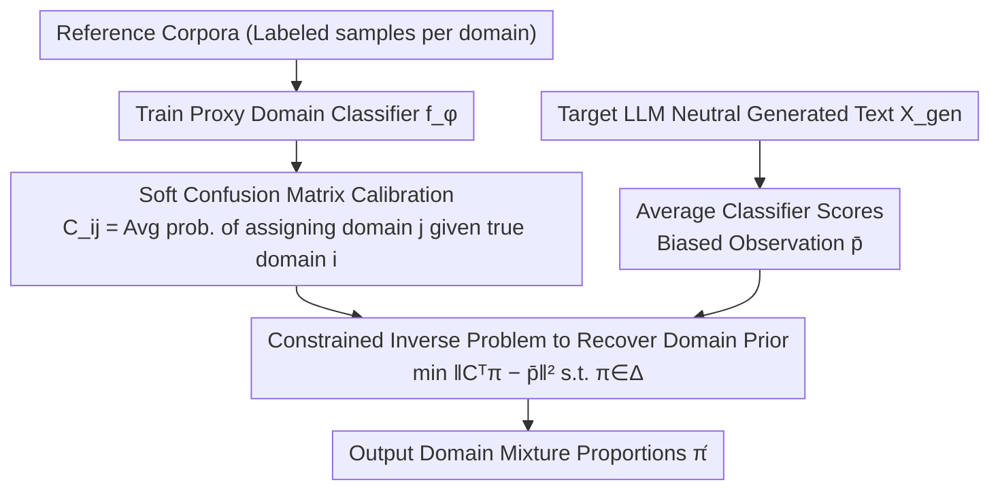

# LLMSurgeon: Diagnosing Data Mixture of Large Language Models

**Conference**: ACL2026  
**arXiv**: [2605.30348](https://arxiv.org/abs/2605.30348)  
**Code**: Paper labels Code & Data: LLMSurgeon; specific URL not provided in the cache.  
**Area**: LLM Transparency / Training Data Auditing / Model Governance  
**Keywords**: Data mixture auditing, training corpus composition, label shift, confusion matrix, black-box auditing  

## TL;DR
LLMSurgeon formalizes the question "what data was this LLM trained on" as Data Mixture Surgery. By using the soft confusion matrix of a proxy classifier to invert the domain distribution within generated text, it estimates pre-training data mixture proportions while only requiring access to model outputs.

## Background & Motivation
**Background**: The behavior, bias, and capabilities of Large Language Models (LLMs) largely stem from their pre-training data composition, yet real data recipes are often kept private. Existing transparency tools primarily focus on membership inference, which determines whether a specific sample appeared in the training set.

**Limitations of Prior Work**: Membership inference can answer "has this sample been seen," but struggles to answer "what percentage of the training corpus is Web, Code, Books, Papers, or Forums." Aggregating individual membership inference results is computationally expensive, prone to error accumulation, and suffers from systematic biases due to varying inference difficulty across domains.

**Key Challenge**: Auditing training corpora requires macro-level distribution estimation, whereas existing tools mostly provide micro-level sample signals. Furthermore, closed-source or fixed models do not provide access to training loops, raw corpora, or internal weight states, requiring methods to operate solely on black-box generated text.

**Goal**: The authors propose Data Mixture Surgery (DMS): given a predefined set of domains and generated samples from a target LLM, estimate the effective domain prior $\pi$ implied by the model. The goal is not open-ended discovery of unknown categories, but rather recovering mixture proportions under a defined taxonomy.

**Key Insight**: The paper adopts a label-shift hypothesis: while domain proportions change from the training corpus to the generated text, the linguistic features within the same domain remain approximately invariant. Consequently, the distribution obtained after passing generated text through a proxy domain classifier is an observation "blurred" by the classifier's confusion matrix, which can be corrected via an inverse problem.

**Core Idea**: First, estimate a soft confusion matrix for a proxy classifier using reference corpora. Then, treat the average classifier output of the target model's generated text as a biased observation, and recover the latent training data mixture proportions through constrained linear inversion.

## Method
The LLMSurgeon approach resembles a "compositional CT scan" for black-box models: instead of searching for specific training samples, the model is prompted naturally under neutral conditions. The distribution of these outputs is observed through a predefined domain classifier, and the true domain proportions are back-calculated using the classifier's own error patterns.

### Overall Architecture
The input includes a predefined domain set $\mathcal{Y}=\{1,\dots,K\}$, reference corpora for each domain, neutral generated text from the target LLM, and ground truth data recipes from public documentation for evaluation. The output is an estimated vector $\hat{\pi}$ on the simplex, representing the domain mixture proportions reflected in the model's behavior. The pipeline consists of three steps: first, train a proxy domain classifier $f_\phi$ on reference corpora and calibrate its soft confusion matrix $C$ on held-out data; during inference, have the target model generate a batch of text $X_{gen}$, score each sample with the classifier to obtain the average biased observation vector $\bar{p}$; finally, solve a constrained least squares problem $\min_{\pi\in\Delta^{K-1}} \|C^\top\pi-\bar{p}\|_2^2$ (where $\sum_k\pi_k=1, \pi_k\ge 0$) to restore the observations to the true proportions.

### Key Designs

**1. Data Mixture Surgery Problem Definition: Elevating Audit from "Sample Seen" to "Domain Proportion"**

Membership inference only identifies if a single sample was trained, but governance, copyright, and bias analysis are concerned with the overall proportions of Web, Code, Books, and Forums in the corpus. Aggregating membership inference is costly and accumulates errors. LLMSurgeon formalizes this as DMS: assuming the training corpus is a mixture of domain distributions $p_\alpha(x)=\sum_i \alpha_i p_i(x)$, the model's generation distribution can be approximated as $q_\pi(x)=\sum_i \pi_i p_i(x)$. The auditing goal is to directly estimate this domain prior $\pi$. It avoids open-ended discovery and focuses on recovering mixture proportions within a defined taxonomy, turning vague "auditing" into a well-defined statistical inverse problem.

**2. Soft Confusion Matrix Calibration: Acknowledging and Recording Classifier Errors**

If the average classifier output on generated text were taken directly as the domain proportion, systematic confusion between similar domains (e.g., C vs. C++, C4 vs. Common Crawl) would be misinterpreted as real proportions, biasing the estimate. LLMSurgeon explicitly models this confusion: using reference samples where the true domain is $i$, it calculates the average probability the classifier assigns to each domain $j$, $C_{ij}=\mathbb{E}_{x\sim p_i}[f_\phi(x)_j]$. The matrix $C$ characterizes how the classifier "scatters" when the true domain is $i$. This error map allows the classifier's bias to be subtracted from the observations rather than being accepted as ground truth.

**3. Constrained Inverse Problem to Recover Domain Prior: Restoring "Blurred" Observations via Inversion**

Under the label-shift hypothesis, domain proportions change from training to generation, but internal linguistic features for each domain remain stable. Thus, the expected classifier output for generated text satisfies $\mathbb{E}_{x\sim q_\pi}[f_\phi(x)]=C^\top\pi$—the observation $\bar{p}$ is essentially the true prior $\pi$ "blurred" by the confusion matrix $C$. LLMSurgeon solves a non-negative, sum-to-one constrained least squares problem $\min_{\pi}\|C^\top\pi-\bar{p}\|_2^2$ on the probability simplex to back-solve for $\pi$. This inversion step is the core gain over naive audit-by-aggregation: it corrects the classifier's inherent bias using only black-box generation, without requiring access to the training loop, raw corpus, or weights.

### Loss & Training
The proxy classifier is trained on reference domain data. The core estimation objective is not a standard end-to-end loss, but a constrained linear inversion $\min_{\pi\in\Delta^{K-1}} \|C^\top\pi-\bar{p}\|_2^2$. In experiments, the Coarse-Grained setup uses SlimPajama-627B-DC, sampling 5,000 documents per domain across 6 categories to train the classifier; Mid-Grained uses 17 categories from The Pile; Fine-Grained uses 87 programming languages from The Stack. Metrics include Overlap Accuracy, MAE, and $R^2$.

## Key Experimental Results

### Main Results

| Setup / Model | Granularity | LLMSurgeon Overlap Accuracy | Strong or Representative Baseline | Description |
|--------|------|-----------------------------|------------------------|------|
| OLMo-1B | 6-class Coarse | 94.46% | Recall 48.05% | Coarse corpus boundaries are clear; inversion provides a huge advantage. |
| LLaMA1-7B | 6-class Coarse | 95.14% | Neighbor 40.13% | Close to recovering the public data recipe. |
| Amber-13B | 6-class Coarse | 78.87% | Recall 41.55% | Still significantly higher than MIA aggregation methods. |
| LLaMA1-65B | 6-class Coarse | 94.26% | GradNorm 46.52% | Performance remains stable across model scales. |
| GPT-Neo-2.7B | 17-class Mid | 61.86% | GradNorm 58.78% | Advantage narrows at mid-granularity. |
| Pythia-12B | 17-class Mid | 65.98% | Recall 52.63% | Finer taxonomies increase confusion. |
| StarCoder-15.5B | 87-class Fine | 30.37% | GradNorm 27.54% | Similar languages like C/C++ make the inverse problem ill-posed. |

### Ablation Study

| Ablation Item | Configuration | Key Result | Conclusion |
|------|------|---------|------|
| Classifier Backbone | DistilBERT vs Transformer / TF-IDF / MLP | DistilBERT 95.14%, Transformer 90.22%, TF-IDF 86.83%, MLP 82.97% on LLaMA1-7B | Proxy classifier quality directly impacts final recovery. |
| Number of Samples | 100 / 1,000 / 5,000 / 10,000 per domain | StarCoder: 20.15/25.62/30.37/29.51; LLaMA1-7B: 85.78/93.68/95.14/92.44 | 5,000 is a good trade-off between accuracy and cost. |
| Inverse Correction | w/o Inverse Correction vs LLMSurgeon | StarCoder: 26.47% → 30.37%; OLMo: 92.77% → 94.46% | Soft confusion matrix inversion definitely provides gains. |
| Merging Similar Categories | Separate C4&CC vs Merge C4&CC | LLaMA1-7B: 42.42% → 99.14% | Semantically inseparable sources should be merged to avoid unstable estimates. |
| Held-out OLMo-3 | Transfer to fixed early protocol | OLMo-3 overlap accuracy 86.41%, Web 76.88 → 75.37 | Method shows some out-of-protocol generalization capability. |
| Toxicity Injection Audit | GPT-2 5% / 10% / 20% toxic | Estimated 7.90% / 12.00% / 22.73%, Toxic Est. Accuracy 97.10% / 98.00% / 97.27% | Useful as a low-cost safety triage signal. |

### Key Findings
- DMS and MIA have different objectives: MIA is suited for checking sample existence, while DMS is suited for checking domain proportions.
- LLMSurgeon is strongest in coarse-grained, semantically separable domains; once categories overlap heavily, the inversion matrix becomes ill-posed, and accuracy drops.
- Neutral sampling is most stable for general models, e.g., reaching 95.14% for LLaMA1-7B; however, for specialized models like StarCoder, neutral prompts may not sufficiently trigger the target distribution.
- Classifier accuracy and final estimation accuracy are strongly positively correlated, with the paper reporting an average correlation greater than 0.9 and a Pearson coefficient exceeding 0.85 in another analysis.

## Highlights & Insights
- The paper's greatest strength is converting black-box data auditing into a clear statistical inverse problem rather than simply stacking membership inference scores. This formalization clarifies the problem, assumptions, and failure boundaries.
- The soft confusion matrix is a practical design: it accepts that the proxy classifier will make mistakes and incorporates that error structure into the estimation rather than treating classifier outputs as ground truth.
- The value of LLMScan lies not just in evaluating LLMSurgeon, but in providing a "recipe-verifiable" data auditing benchmark, avoiding the pitfall of proving effectiveness solely on synthetic mixtures.
- The requirement for "semantic separability of categories" is crucial. It reminds future researchers that taxonomy design is not a trivial preprocessing step; the domain definition itself determines whether the audit is solvable.

## Limitations & Future Work
- The method relies on the label-shift hypothesis, assuming neutral generation reflects the pre-training prior; models processed via RLHF, instruction tuning, or strong system prompts may deviate from this.
- The method uses a closed-world taxonomy and cannot discover new domains outside the predefined categories or automatically point out taxonomy gaps.
- Fine-grained, semantically overlapping categories lead to ill-conditioned confusion matrices (e.g., C4 vs. Common Crawl, C vs. C++), limiting interpretability resolution.
- Generation sampling styles affect estimation stability; neutral prompts work for general models but may be insufficient for specialized ones.
- Future work could investigate hierarchical taxonomies, non-linear transport, inverse alignment correction, and verification across languages, modalities, and more closed-source models.

## Related Work & Insights
- **vs Membership Inference Attack**: MIA determines if a single sample is in the training set; LLMSurgeon estimates macro domain proportions. The former is a micro privacy tool; the latter is a macro transparency tool.
- **vs DUCI**: DUCI estimates the usage proportion of specific candidate datasets; LLMSurgeon recovers a global mixture across multiple domains without requiring access to the original training sets.
- **vs Data Mixture Optimization**: Data mixture optimization selects or re-weights corpora before training; LLMSurgeon performs post-hoc auditing on trained models.
- **vs Direct Classifier Aggregation**: Direct aggregation of $\bar{p}$ retains classifier bias; LLMSurgeon corrects this bias using $C^\top\pi$ inversion.

## Rating
- Novelty: ⭐⭐⭐⭐☆ The combination of the DMS problem setting and soft confusion matrix inversion is clear and a useful advancement in transparency.
- Experimental Thoroughness: ⭐⭐⭐⭐☆ Covers 8 models with known recipes, three granularities, sampling styles, sample sizes, held-out data, and toxicity injection, though still dependent on closed-world taxonomy.
- Writing Quality: ⭐⭐⭐⭐☆ Formulas and experimental designs are easy to follow, with clear explanations of strengths and boundaries.
- Value: ⭐⭐⭐⭐⭐ Highly practical for model governance, training data transparency, and safety auditing.

<!-- RELATED:START -->

## Related Papers

- [\[ICCV 2025\] Improving Large Vision and Language Models by Learning from a Panel of Peers](../../ICCV2025/self_supervised/improving_large_vision_and_language_models_by_learning_from_a_panel_of_peers.md)
- [\[NeurIPS 2025\] M-GRPO: Stabilizing Self-Supervised Reinforcement Learning for Large Language Models with Momentum-Anchored Policy Optimization](../../NeurIPS2025/self_supervised/m-grpo_stabilizing_self-supervised_reinforcement_learning_for_multimodal_underst.md)
- [\[ICLR 2026\] PonderLM: Pretraining Language Models to Ponder in Continuous Space](../../ICLR2026/self_supervised/ponderlm_pretraining_language_models_to_ponder_in_continuous_space.md)
- [\[CVPR 2026\] Spectral Mixture-of-Experts for Continual Learning](../../CVPR2026/self_supervised/spectral_mixture-of-experts_for_continual_learning.md)
- [\[ICLR 2026\] Better Together: Leveraging Unpaired Multimodal Data for Stronger Unimodal Models](../../ICLR2026/self_supervised/better_together_leveraging_unpaired_multimodal_data_for_stronger_unimodal_models.md)

<!-- RELATED:END -->
