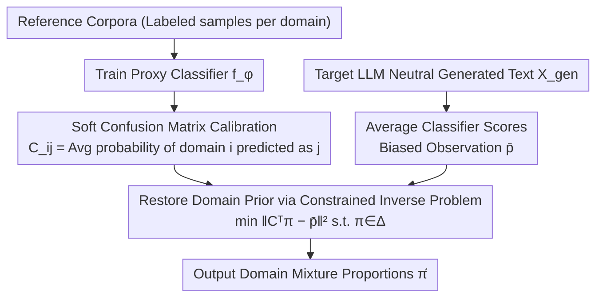

# LLMSurgeon: Diagnosing Data Mixture of Large Language Models

**Conference**: ACL2026  
**arXiv**: [2605.30348](https://arxiv.org/abs/2605.30348)  
**Code**: The paper notes Code & Data: LLMSurgeon; specific URL not provided.  
**Area**: LLM Transparency / Training Data Audit / Model Governance  
**Keywords**: Data mixture auditing, training corpus composition, label shift, confusion matrix, black-box auditing  

## TL;DR
LLMSurgeon formalizes the question of "what data was this LLM trained on" as Data Mixture Surgery. By using the soft confusion matrix of a proxy classifier to invert the domain distribution in generated text, it estimates pre-training data mixture proportions while only requiring access to model outputs.

## Background & Motivation
**Background**: The behaviors, biases, and capabilities of Large Language Models (LLMs) largely stem from their pre-training data composition, yet actual data recipes are frequently undisclosed. Existing transparency tools mainly focus on membership inference—determining whether a specific sample appeared in the training set.

**Limitations of Prior Work**: Membership inference answers "has this sample been seen," but it struggled to answer "how much of the total training corpus consists of Web, Code, Books, Papers, or Forums." Directly aggregating membership inference results is computationally expensive, prone to error accumulation, and suffers from systematic biases due to varying inference difficulties across domains.

**Key Challenge**: Auditing training corpora requires macro-level distribution estimation, whereas most existing tools provide micro-level sample signals. Furthermore, closed-source or fixed models do not allow access to training loops, raw corpora, or internal weight states, necessitating methods that operate on black-box generated text.

**Goal**: The authors propose Data Mixture Surgery (DMS): given a predefined set of domains and samples generated by a target LLM, estimate the model's implicit effective domain prior $\pi$. The objective is not open-ended discovery of unknown categories, but the recovery of mixture proportions within a defined taxonomy.

**Key Insight**: The paper adopts the label-shift hypothesis: while domain proportions change from the training corpus to the generated text, the linguistic features within the same domain remain approximately invariant. Consequently, the distribution obtained by passing generated text through a proxy classifier is an observed distribution "blurred" by the classifier's confusion matrix, which can be corrected as an inverse problem.

**Core Idea**: A proxy classifier's soft confusion matrix is first estimated using reference corpora. Then, the average classification output of the target model's generated text is treated as a biased observation, and the latent training data mixture proportions are recovered through constrained linear inversion.

## Method
The LLMSurgeon approach resembles a "compositional CT scan" for black-box models: it does not attempt to identify specific training samples. Instead, it prompts the model to generate text naturally under neutral conditions, observes the distribution of these texts through a predefined domain classifier, and back-calculates the true domain proportions using the classifier’s own error patterns.

### Overall Architecture
Inputs include a predefined domain set $\mathcal{Y}=\{1,\dots,K\}$, reference corpora for each domain, neutral generated text from the target LLM, and ground-truth data recipes from public documentation for evaluation. The output is an estimated vector $\hat{\pi}$ on the simplex, representing the domain mixture proportions reflected in the model's behavior. The pipeline consists of three steps: first, training a proxy domain classifier $f_\phi$ on reference corpora and calibrating its soft confusion matrix $C$ on held-out data; during inference, the target model generates a batch of text $X_{gen}$, which the classifier scores to obtain the average biased observation vector $\bar{p}$; finally, a constrained least squares problem $\min_{\pi\in\Delta^{K-1}} \|C^\top\pi-\bar{p}\|_2^2$ (where $\sum_k\pi_k=1$ and $\pi_k\ge 0$) is solved to restore the observation to true proportions.

### Key Designs

**1. Data Mixture Surgery Problem Definition: Elevating Audit from "Sample Visibility" to "Domain Proportion"**

Membership inference can only determine if a single sample was used for training. However, governance, copyright, and bias analysis are concerned with the proportions of Web, Code, Books, and Forums in the total corpus. Aggregating membership inference results is expensive and accumulates error. LLMSurgeon formalizes this as DMS: assuming the training corpus is a mixture of domain distributions $p_\alpha(x)=\sum_i \alpha_i p_i(x)$ and the model's generation distribution is approximately $q_\pi(x)=\sum_i \pi_i p_i(x)$, the audit goal is to directly estimate the domain prior $\pi$. It avoids open-ended category discovery in favor of recovering proportions under a defined taxonomy, transforming ambiguous "auditing" into a well-defined statistical inverse problem.

**2. Soft Confusion Matrix Calibration: Acknowledging and Accounting for Classifier Errors**

If the average output of a classifier on generated text were used directly as domain proportions, systematic confusion between similar domains (e.g., C vs. C++, C4 vs. Common Crawl) would be misinterpreted as true proportions, biasing the estimate. LLMSurgeon explicitly models this confusion: for reference samples where the true domain is $i$, the average probability of the classifier predicting domain $j$ is calculated as $C_{ij}=\mathbb{E}_{x\sim p_i}[f_\phi(x)_j]$. The matrix $C$ characterizes how the classifier disperses predictions when the truth is $i$. This "map of errors" allows the classifier's bias to be subtracted from the observations.

**3. Restoring Domain Priors via Constrained Inverse Problem: Reversing the "Blurry" Observations**

Under the label-shift hypothesis, while domain proportions change from training to generation, linguistic features within each domain remain stable. Thus, the expected output of the classifier on generated text satisfies $\mathbb{E}_{x\sim q_\pi}[f_\phi(x)]=C^\top\pi$—the observation $\bar{p}$ is the result of the true prior $\pi$ being "blurred" by the confusion matrix $C$. LLMSurgeon solves a non-negative, sum-to-one constrained least squares problem $\min_{\pi}\|C^\top\pi-\bar{p}\|_2^2$ on the probability simplex to recover $\pi$. This inversion is the core advantage over naive audit-by-aggregation: it corrects for the classifier's own bias and uses only black-box generation, requiring no access to training loops, raw data, or weights.

### Loss & Training
The proxy classifier is trained on reference domain data. The core estimation objective is not a standard end-to-end loss but a constrained linear inversion $\min_{\pi\in\Delta^{K-1}} \|C^\top\pi-\bar{p}\|_2^2$. In experiments, the Coarse-Grained setup uses SlimPajama-627B-DC with 5,000 documents sampled per domain for training. Mid-Grained uses 17 categories from The Pile, and Fine-Grained uses 87 programming languages from The Stack. Metrics include Overlap Accuracy, MAE, and $R^2$.

## Key Experimental Results

### Main Results

| Setup / Model | Granularity | LLMSurgeon Overlap Accuracy | Baseline (Strong/Representative) | Description |
|--------|------|-----------------------------|------------------------|------|
| OLMo-1B | 6-class Coarse | 94.46% | Recall 48.05% | High inversion advantage in distinct domains |
| LLaMA1-7B | 6-class Coarse | 95.14% | Neighbor 40.13% | Near recovery of public data recipes |
| Amber-13B | 6-class Coarse | 78.87% | Recall 41.55% | Significantly outperforms MIA aggregation |
| LLaMA1-65B | 6-class Coarse | 94.26% | GradNorm 46.52% | Reliable across model scales |
| GPT-Neo-2.7B | 17-class Mid | 61.86% | GradNorm 58.78% | Advantage narrows at mid-granularity |
| Pythia-12B | 17-class Mid | 65.98% | Recall 52.63% | Finer taxonomies increase confusion |
| StarCoder-15.5B | 87-class Fine | 30.37% | GradNorm 27.54% | Similar languages (C/C++) lead to ill-posedness |

### Ablation Study

| Ablation Item | Configuration | Key Result | Conclusion |
|------|------|---------|------|
| Classifier Backbone | DistilBERT vs Transformer / TF-IDF / MLP | DistilBERT: 95.14%, Transformer: 90.22%, TF-IDF: 86.83%, MLP: 82.97% | Proxy quality directly impacts recovery |
| Sample Size | 100 / 1,000 / 5,000 / 10,000 per domain | StarCoder: 20.15 / 25.62 / 30.37 / 29.51; LLaMA1: 85.78 / 93.68 / 95.14 / 92.44 | 5,000 document samples offer best trade-off |
| Inverse Correction | w/o vs w/ LLMSurgeon | StarCoder: 26.47% → 30.37%; OLMo: 92.77% → 94.46% | Confusion matrix inversion provides gains |
| Merging Similar Classes | Separate C4&CC vs Merge C4&CC | LLaMA1-7B: 42.42% → 99.14% | Merging inseparable sources stabilizes estimates |
| Held-out OLMo-3 | Transfer with early protocol | OLMo-3 overlap accuracy: 86.41% | Method shows out-of-protocol generalization |
| Toxicity Injection | GPT-2 5% / 10% / 20% toxic | Estimates: 7.90% / 12.00% / 22.73% | Effective as a low-cost safety triage signal |

### Key Findings
- DMS and MIA serve different purposes: MIA identifies specific samples, while DMS determines domain proportions.
- LLMSurgeon is most effective on coarse-grained, semantically distinct domains; high overlap leads to ill-posed inversion matrices and lower accuracy.
- Neutral sampling is most stable for general-purpose models (e.g., LLaMA1-7B reaching 95.14%); however, for specialized models like StarCoder, neutral prompts may not sufficiently trigger the target distribution.
- Classifier accuracy is strongly correlated with the final estimation accuracy (Pearson correlation > 0.85).

## Highlights & Insights
- The primary contribution is the shift from aggregating membership scores to framing black-box auditing as a statistical inverse problem. This formalization clarifies assumptions and failure modes.
- The soft confusion matrix is a practical design: it admits the proxy classifier will fail and incorporates that failure structure into the estimate rather than treating outputs as ground truth.
- The value of the LLMScan benchmark lies in providing an "auditable recipe" for data auditing, avoiding methods that only prove effective on synthetic mixtures.
- Semantic separability is critical. It suggests that taxonomy design is not just pre-processing but determines whether the audit problem is solvable.

## Limitations & Future Work
- The method relies on the label-shift hypothesis; models heavily modified by RLHF, instruction tuning, or strong system prompts may deviate from this.
- As a closed-world taxonomy approach, it cannot discover new domains or automatically identify gaps in the taxonomy.
- Fine-grained or semantically overlapping categories (e.g., C vs. C++) result in ill-conditioned matrices, limiting the resolution of the audit.
- Generation sampling styles affect stability; neutral prompts work for general models but may be insufficient for specialized ones.
- Future work could explore hierarchical taxonomies, non-linear transport, inverse alignment correction, and validation on multi-modal or more closed-source models.

## Related Work & Insights
- **vs Membership Inference Attack**: MIA determines if a single sample is in the training set; LLMSurgeon estimates macro domain proportions. MIA is for privacy; LLMSurgeon is for transparency.
- **vs DUCI**: DUCI estimates the usage of specific candidate datasets, while LLMSurgeon recovers a global mixture across multiple domains without needing the original training data.
- **vs Data Mixture Optimization**: Optimization selects corpora before training; LLMSurgeon performs post-hoc auditing of trained models.
- **vs Direct Classifier Aggregation**: Direct aggregation of $\bar{p}$ retains classifier bias; LLMSurgeon corrects this via inversion of $C^\top\pi$.

## Rating
- Novelty: ⭐⭐⭐⭐☆ The combination of the DMS problem setting and soft confusion matrix inversion is a significant advancement in transparency.
- Experimental Thoroughness: ⭐⭐⭐⭐☆ Covers 8 models with known recipes, multi-granularity, sampling styles, and toxicity injection, though still constrained by a closed-world taxonomy.
- Writing Quality: ⭐⭐⭐⭐☆ Formulas and experimental designs are clear; strengths and boundaries are well-articulated.
- Value: ⭐⭐⭐⭐⭐ Highly valuable for model governance, training data transparency, and safety auditing.

<!-- RELATED:START -->

## Related Papers

- [\[ICCV 2025\] Improving Large Vision and Language Models by Learning from a Panel of Peers](../../ICCV2025/self_supervised/improving_large_vision_and_language_models_by_learning_from_a_panel_of_peers.md)
- [\[NeurIPS 2025\] M-GRPO: Stabilizing Self-Supervised Reinforcement Learning for Large Language Models with Momentum-Anchored Policy Optimization](../../NeurIPS2025/self_supervised/m-grpo_stabilizing_self-supervised_reinforcement_learning_for_multimodal_underst.md)
- [\[ICLR 2026\] PonderLM: Pretraining Language Models to Ponder in Continuous Space](../../ICLR2026/self_supervised/ponderlm_pretraining_language_models_to_ponder_in_continuous_space.md)
- [\[CVPR 2026\] Quantized Residuals to Continuous Prompts for Few-Shot Class Incremental Learning in Vision-Language Models](../../CVPR2026/self_supervised/quantized_residuals_to_continuous_prompts_for_few-shot_class_incremental_learning.md)
- [\[ICML 2025\] Towards Benchmarking Foundation Models for Tabular Data With Text](../../ICML2025/self_supervised/towards_benchmarking_foundation_models_for_tabular_data_with_text.md)

<!-- RELATED:END -->
