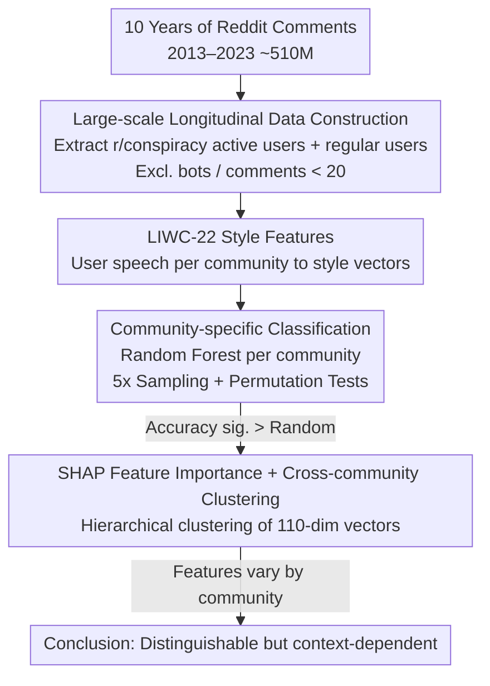

# Among Us: Language of Conspiracy Theorists on Mainstream Reddit

**Conference**: ACL 2026  
**arXiv**: [2506.05086](https://arxiv.org/abs/2506.05086)  
**Code**: None  
**Area**: Social Computing / Computational Linguistics  
**Keywords**: Conspiracy theories, Linguistic features, Reddit analysis, Psycholinguistics, Community adaptation

## TL;DR

Analyzing 10 years of longitudinal data from 510 million Reddit comments, the study finds that users active in conspiracy communities exhibit detectable unique linguistic patterns even in mainstream communities (average 87% classification accuracy). However, these patterns are highly dependent on community context, with community-specific models outperforming global models by up to 17 percentage points.

## Background & Motivation

**Background**: Conspiracy theories are not just marginal beliefs—they are linked to vaccine hesitancy, public health risks, and even threats to democratic institutions (e.g., the 2021 Capitol Hill incident). Existing research primarily focuses on the detection of conspiracy content but neglects the linguistic behavior of conspiracy believers in mainstream spaces.

**Limitations of Prior Work**: (1) While it is known that conspiracy theorists use specific rhetorical styles and vocabularies, it is unclear whether these patterns are confined to conspiracy spaces or leak into mainstream communication; (2) Existing detection methods mostly focus on the content level (e.g., topic words), ignoring linguistic style features that are independent of the discussion topic.

**Key Challenge**: Do conspiracy theorists possess a "monological worldview" that permeates all communication, or can they fully adapt to the linguistic norms of different communities?

**Goal**: To systematically examine the linguistic distinguishability of conspiracy community users in mainstream spaces using large-scale longitudinal data.

**Key Insight**: Build user linguistic profiles using LIWC-22 psycholinguistic features (rather than topic words) and train classifiers separately for 22 mainstream communities.

**Core Idea**: The language of conspiracy users is indeed distinguishable, but the patterns of distinction are highly community-dependent—no single global model can capture these patterns, necessitating community-specific analysis.

## Method

### Overall Architecture

This work aims to answer whether users frequenting conspiracy communities "reveal their tracks" when they enter mainstream communities—even when not discussing conspiracy topics, can their linguistic style still be identified? The overall process is as follows: first, extract two types of users (active r/conspiracy users and regular users) from ten years of Reddit comments; use the LIWC-22 psycholinguistic dictionary to compress each user's speech in a specific mainstream community into a set of style feature vectors; then, train a separate classifier for each community to distinguish between the two types of users; finally, use SHAP to decompose which features distinguish each community and compare whether the distinction patterns are consistent across different communities.

### Key Designs

**1. Large-scale Longitudinal Data Construction: Using a decade of comments to build stable linguistic profiles and avoid short-term noise**

Judging a person's "linguistic style" cannot rely on only a few comments—small amounts of data are easily dominated by momentary topics or emotions, resulting in unstable profiles. To this end, the authors extracted approximately $5.1 \times 10^8$ comments from the Pushshift Reddit dataset between 2013 and 2023, covering 980,000 users from r/conspiracy and 22 mainstream communities, and excluded bot accounts and low-activity users with $<20$ comments. Only with sufficient speech volume do LIWC feature vectors for each user in a community converge into a profile representing their stable style.

**2. Community-specific Classification: Using classifiers as "probes" to quantify distinguishability, not as an end in itself**

What needs to be verified is not "whether an excellent classifier can be built," but "whether conspiracy users have identifiable linguistic traces in mainstream spaces." The classifier is merely a proxy tool to quantify this distinguishability. Specifically, a Random Forest is trained **separately** for each mainstream community: the positive class consists of users who have commented in r/conspiracy, and the negative class consists of an equal number of regular users randomly sampled from the same community, with 5 random samplings to reduce variance. The key is not the final accuracy itself, but confirming via permutation tests that the accuracy is significantly higher than random—as long as it is significant, it indicates that there are indeed distinguishable differences in linguistic styles between the two groups in that community.

**3. SHAP Feature Importance and Cross-community Clustering: Determining if "conspiracy language" is globally uniform or community-dependent**

Even if every community is distinguishable, two distinct interpretations remain: either there is a universal set of "conspiracy language," or each community relies on different features in a context-adaptive manner. To distinguish these, authors calculated SHAP values for each community model to obtain a 110-dimensional feature importance vector and used cosine similarity plus hierarchical clustering to compare these vectors across communities. If the important features across communities were highly consistent, it would support the "global conspiracy language" hypothesis; if the features vary by community, it indicates that while linguistic traces exist, they are dynamically adjusted according to community norms—which is the basis for the "distinguishable but context-dependent" conclusion.

### Loss & Training

Random Forest was tuned using grid search with 5-fold cross-validation, with an 80/20 train/test split. Feature normalization was fitted only on the training set to prevent leakage, and statistical significance was evaluated using 100 permutation tests.

## Key Experimental Results

### Main Results

| Metric | Value | Description |
|------|------|------|
| Avg. Classification Accuracy | 87% | Binary classification across 20+ communities |
| Community-specific vs. Global | Up to +17pp | Community-specific models significantly outperform global models |
| Statistical Significance | p < 0.01 | All community permutation tests were significant |

### Ablation Study

| Configuration | Key Metric | Description |
|------|---------|------|
| Activity Threshold | High activity yields better results | More comments → More stable linguistic profiles |
| r/AskReddit Positive Class | Accuracy ~ Random | Users in general communities are indistinguishable (Negative Control) |
| r/MensRights Positive Class | Moderate Accuracy | Ideological communities also show some distinguishability |

### Key Findings
- The language of conspiracy users is indeed detectable in mainstream spaces—averaging 87% accuracy, far exceeding random.
- However, no single global model can capture these patterns—community-specific models perform up to 17 percentage points better than global ones.
- This indicates that the linguistic expression of conspiracy users is dynamically adaptive—though they have unique features, they adjust based on community norms.
- Users from r/AskReddit (negative control) could not be distinguished, validating the specificity of the effect.

## Highlights & Insights
- "Distinguishable but context-dependent" is a subtle finding—it supports the existence of a "conspiracy mindset" while showing it is not a simple global label.
- There are direct implications for content moderation strategies—unified detection models are insufficient; community-tailored approaches are required.
- The use of LIWC psycholinguistic features (rather than topic words) ensures the analysis targets linguistic style rather than discussion content.

## Limitations & Future Work
- Equating "having commented in r/conspiracy" with being a "conspiracy believer" might be too broad.
- LIWC's dictionary-based approach might miss emerging linguistic patterns.
- Analysis is limited to Reddit; patterns on other social media platforms might differ.
- Future work could combine content analysis and style analysis for more fine-grained research.

## Related Work & Insights
- **vs. Content Detection Methods**: Focuses on linguistic style rather than content, revealing deeper cognitive characteristics.
- **vs. User Pathway Research**: Instead of tracking how users enter conspiracy communities, it analyzes their behavior in mainstream spaces.
- **vs. Community Detection**: Reveals behavioral adaptability across communities, complementing studies on community boundaries.

## Rating
- Novelty: ⭐⭐⭐⭐ Researching cross-community behavior of conspiracy users from a linguistic style perspective.
- Experimental Thoroughness: ⭐⭐⭐⭐⭐ 510 million comments, 10-year longitudinal study, 22 communities, statistical testing.
- Writing Quality: ⭐⭐⭐⭐ Rigorous research design with robust negative controls.
- Value: ⭐⭐⭐⭐ Practical guidance for social media governance and conspiracy theory research.

<!-- RELATED:START -->

## Related Papers

- [\[ACL 2025\] Conspiracy Theories and Where to Find Them on TikTok](../../ACL2025/social_computing/conspiracy_theories_and_where_to_find_them_on_tiktok.md)
- [\[ACL 2026\] Inertia in Moral and Value Judgments of Large Language Models](inertia_in_moral_and_value_judgments_of_large_language_models.md)
- [\[ACL 2026\] Bayesian Social Deduction with Graph-Informed Language Models](bayesian_social_deduction_with_graph-informed_language_models.md)
- [\[ACL 2026\] SPAGBias: Uncovering and Tracing Structured Spatial Gender Bias in Large Language Models](spagbias_uncovering_and_tracing_structured_spatial_gender_bias_in_large_language.md)
- [\[ACL 2026\] FigSIM: A Dataset for Fine-grained Suicide Severity and Figurative Language in Suicide Memes](figsim_a_dataset_for_fine-grained_suicide_severity_and_figurative_language_in_su.md)

<!-- RELATED:END -->
