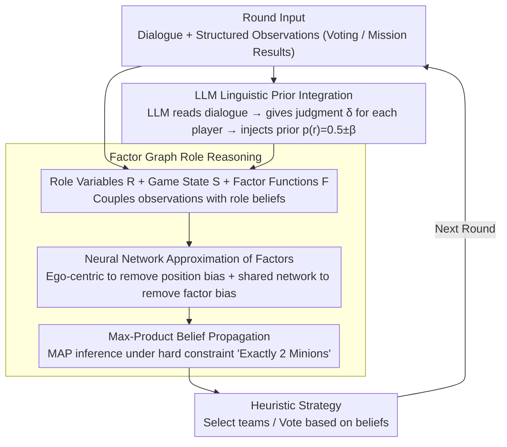

# Bayesian Social Deduction with Graph-Informed Language Models

**Conference**: ACL 2026  
**arXiv**: [2506.17788](https://arxiv.org/abs/2506.17788)  
**Code**: [Project Page](https://camp-lab-purdue.github.io/bayesian-social-deduction)  
**Area**: LLM Agent / Social Reasoning  
**Keywords**: Social Reasoning, Probabilistic Graphical Models, Theory of Mind, Game Agents, Human-Computer Interaction

## TL;DR

This paper proposes GRAIL (Graph Reasoning Agent Informed through Language), a hybrid reasoning framework that externalizes probabilistic reasoning to a factor graph model while utilizing LLMs for language understanding and interaction. GRAIL defeated human players for the first time in the social deduction game Avalon (67% win rate), with resource consumption significantly lower than large-scale reasoning models.

## Background & Motivation

**Background**: LLMs excel in general reasoning, but social reasoning in multi-agent hidden-information scenarios—inferring others' beliefs, intentions, and deception—remains an open challenge. Social deduction games (e.g., Avalon) provide a structured environment to evaluate this capability.

**Limitations of Prior Work**: (1) The largest reasoning models (e.g., DeepSeek-R1 671B) can solve simple reasoning but require massive tokens and computation; (2) Performance drops sharply when distilled to smaller models; (3) Pure LLM methods struggle with constrained probabilistic reasoning over long time horizons; (4) High latency of large models prevents real-time interaction with humans.

**Key Challenge**: Social deduction requires constrained probabilistic reasoning (e.g., hard constraints like "exactly 2 Minions") and long-range belief tracking. However, LLMs are inherently token-level reasoners and are not adept at such structured reasoning.

**Goal**: To build a social deduction agent capable of competing with humans in real-time, achieving or exceeding the performance of large reasoning models even when using smaller models.

**Key Insight**: A hybrid architecture—externalizing belief reasoning to a probabilistic graphical model (Factor Graph + Belief Propagation) while focusing the LLM on language understanding and dialogue generation.

**Core Idea**: Decouple structured reasoning from linguistic capability: factor graphs track role beliefs (interpretable and efficient), while LLMs provide linguistic priors and dialogue generation.

## Method

### Overall Architecture

GRAIL aims to solve the problem where LLMs in hidden-identity games like Avalon struggle to perform long-range probabilistic reasoning under hard constraints (e.g., "exactly 2 Minions") while simultaneously processing dialogue and natural interaction. The approach **decouples** these tasks: structured belief reasoning is offloaded to a factor graph (using belief propagation for precise MAP inference under hard constraints), while language understanding and dialogue generation are handled by the LLM. A set of heuristic policies translates current beliefs into specific game actions (team selection, voting). For each round of dialogue, the LLM converts social signals into "prior perturbations" for the factor graph, which then updates beliefs for the next action.

### Key Designs

**1. Factor Graph Role Reasoning: Offloading hard constraints and long-range tracking from the LLM**

LLMs struggle to maintain hard constraints like "exactly 2 Minions" consistently over multiple rounds. GRAIL externalizes this to a factor graph: variable nodes $\mathcal{R} = \{r_1,...,r_6\}$ represent each player's role (0=Good/1=Evil), game state variables $\mathcal{S}$ record team compositions, votes, and mission results, and factor functions $F = p(r_j\mid\{p_i,v_i,o_i\})$ couple these observations with role beliefs. Max-product belief propagation is then used for MAP inference. Factor graphs naturally support hard constraints and incremental updates, making beliefs interpretable and accumulative rather than requiring the LLM to "rethink" from scratch every round.

**2. LLM Linguistic Prior Integration: Feeding social cues from dialogue back into probabilistic reasoning**

Factor graphs only process structured observations like votes and mission results, but the true game in Avalon lies in the dialogue—who contradicts themselves or implies alliances. GRAIL directs the LLM to read each round of dialogue and provide a judgment $\delta_j^t$ ("more suspicious / more trustworthy / neutral") for each player. This is converted into a prior $p(r_j^t) = 0.5 \pm \beta^t$ and injected into the factor graph. Here, $\beta^t$ increases as the game progresses, meaning early dialogue evidence results in conservative priors (near 0.5), while later information allows for stronger deviations. This utilizes dialogue cues without being misled by insufficient information early on.

**3. Neural Network Approximation of Factor Functions: Computable high-dimensional probabilities**

The conditional dimension of the factor function $p(r_j\mid\text{game state})$ is very high, making traditional conditional probability tables infeasible. GRAIL uses a simple feed-forward network to estimate these, applying two debiasing techniques: an ego-centric input transformation to eliminate player seat position bias, and a shared network across all factors to eliminate factor-specific bias. This allows for a flexible approximation trained on only 2.5K–5K games.

### Key Experimental Results

### Main Results (Agent-Agent)

| Good Agent | Opponent Type | Average Win Rate |
|------------|---------------|------------------|
| Random | Various Evil | 0.00 |
| ReCon (GPT-4.1) | Various Evil | 0.43 |
| GPT-o4-mini (Reasoning) | Various Evil | 0.40 |
| DeepSeek-R1 (671B) | Various Evil | 0.71 |
| **GRAIL (GPT-4.1)** | **Various Evil** | **0.75** |

### Human Experiments

| Condition | Win Rate | Contribution Score | Helpfulness Score |
|-----------|----------|-------------------|-------------------|
| GRAIL vs Humans | **67%** | Higher than reasoning baseline & some humans | Higher than reasoning baseline & some humans |
| GPT-o4-mini vs Humans | 27% | Lower | Lower |

### Ablation Study

| Configuration | Finding |
|---------------|---------|
| Graph Only | Robust to model size; 8B models still achieve 75% win rate |
| LLM Only | Highly sensitive to model size; 8B performance drops significantly |
| GRAIL 8B Llama vs Reasoning 70B DS-R1 | GRAIL 8B achieves a higher win rate |

### Key Findings

- GRAIL outputs over 10x fewer tokens than reasoning baselines, demonstrating extreme computational efficiency.
- The factor graph provides a "performance floor," maintaining high win rates even with minimal LLM sizes.
- Linguistic priors accelerate belief convergence—reaching high confidence by Round 3 with priors versus Round 4–5 without.
- Reasoning agents exhibit counter-intuitive phenomena: the 405B Llama performed worse than the 70B due to sycophancy bias.
- GRAIL's hallucination rate is lower than that of reasoning agents across all model sizes.

## Highlights & Insights

- First language agent to defeat human players in controlled experiments (67% win rate).
- The hybrid architecture successfully offloads tasks LLMs are poor at, playing to the strengths of each component.
- The combination of Factor Graphs and Belief Propagation represents an elegant revival of classical AI methods in the LLM era.
- Human participants, unaware they were playing with an AI, rated GRAIL higher than some of their human teammates.

## Limitations & Future Work

- Evaluated only as part of the "Good" camp; deception and lying capabilities were not tested.
- Special roles (e.g., Merlin) were excluded, simplifying the game complexity.
- Training factor functions requires a significant amount of historical game data.
- Future work could extend this to more complex games with incomplete information.

## Related Work & Insights

- DeepRole (Serrino et al., 2019): Avalon agent trained via self-play (no dialogue).
- ReCon (Wang et al., 2023): LLM-based reasoning agent for Avalon.
- Applications of Probabilistic Graphical Models in social reasoning (Xu et al., 2024a).
- Hybrid neuro-symbolic reasoning is a critical research direction—dedicated models combined with LLMs outperform pure large models on structured reasoning tasks.

## Rating

- Novelty: ⭐⭐⭐⭐⭐ Hybrid architecture beats humans; elegant integration of classical AI and LLMs.
- Experimental Thoroughness: ⭐⭐⭐⭐⭐ Comprehensive Agent-Agent, human experiments, and multi-dimensional ablations.
- Writing Quality: ⭐⭐⭐⭐ Clear problem setting and rigorous human experiment design.
- Value: ⭐⭐⭐⭐⭐ A significant breakthrough in LLM social reasoning capabilities.

<!-- RELATED:START -->

## Related Papers

- [\[ACL 2026\] Inertia in Moral and Value Judgments of Large Language Models](inertia_in_moral_and_value_judgments_of_large_language_models.md)
- [\[ICLR 2026\] Language and Experience: A Computational Model of Social Learning in Complex Tasks](../../ICLR2026/social_computing/language_and_experience_a_computational_model_of_social_learning_in_complex_task.md)
- [\[ICLR 2026\] Measuring and Mitigating Rapport Bias of Large Language Models under Multi-Agent Social Interactions](../../ICLR2026/social_computing/measuring_and_mitigating_rapport_bias_of_large_language_models_under_multi-agent.md)
- [\[ACL 2025\] Measuring Social Biases in Masked Language Models by Proxy of Prediction Quality](../../ACL2025/social_computing/measuring_social_biases_in_masked_language_models_by_proxy_of_prediction_quality.md)
- [\[ACL 2026\] SPAGBias: Uncovering and Tracing Structured Spatial Gender Bias in Large Language Models](spagbias_uncovering_and_tracing_structured_spatial_gender_bias_in_large_language.md)

<!-- RELATED:END -->
