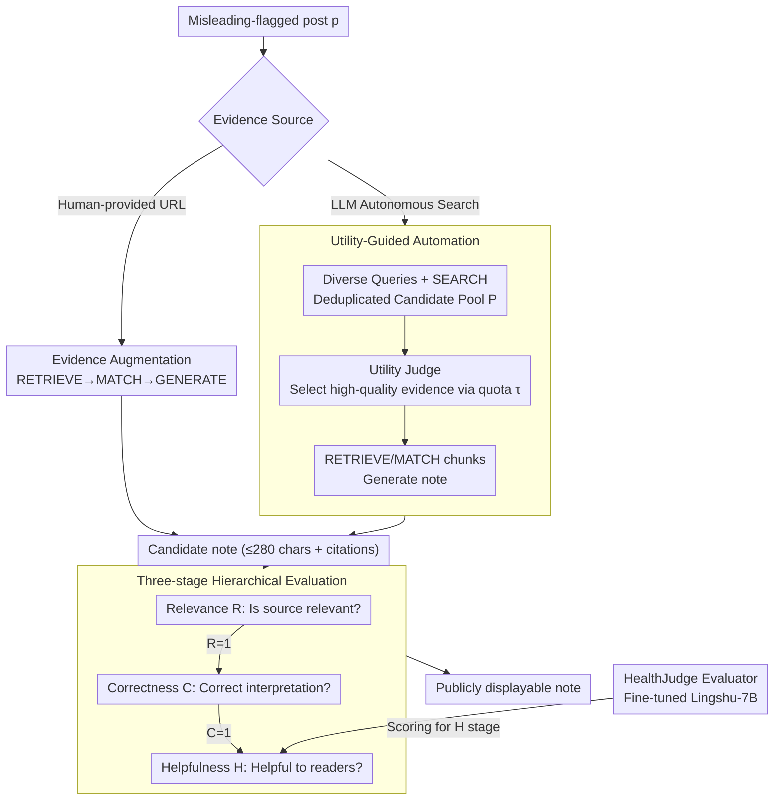

# Beyond the Crowd: LLM-Augmented Community Notes for Governing Health Misinformation

**Conference**: ACL 2026  
**arXiv**: [2510.11423](https://arxiv.org/abs/2510.11423)  
**Code**: https://github.com/jiayingwu19/CrowdNotesPlus (Available)  
**Area**: Social Computing / Health Misinformation Governance / LLM Applications  
**Keywords**: Community Notes, Misinformation Governance, Retrieval Augmentation, Hierarchical Evaluation, LLM-as-judge

## TL;DR
The authors perform an empirical analysis of 30.8K health-related Community Notes from X, revealing systematic slow-response issues: a median delay of 17.6 hours for the first helpful verdict and 87.9% of notes remaining unrated. They propose the CrowdNotes+ framework, utilizing (1) **Evidence Augmentation** and (2) **Utility-Guided Automation** modes for LLM-generated notes, paired with a "Relevance → Correctness → Helpfulness" three-stage evaluation. 15 LLMs on the new HealthNotes benchmark significantly outperform the 73.19% helpfulness of human notes (with the o3 model reaching 81.15%).

## Background & Motivation

**Background**: Community Notes on X is currently the most influential **crowdsourced fact-checking system**, where users flag suspicious posts, write supplementary notes, and vote. Only notes with a "Currently Rated Helpful" status are displayed publicly. Previous research focused on voting dynamics, consensus formation, and polarization, often assuming the existence of notes.

**Limitations of Prior Work**: Based on a time-series analysis of 30,791 health notes over four years, the authors identify two systematic bottlenecks: (1) **Slow note emergence**—a median delay of 10.4 hours from a misleading post to the first note, and another 7.2 hours to the first verdict; (2) **Low rating coverage**—87.9% of notes remain in "Needs More Ratings" and are never shown. The dissemination window for health misinformation (vaccines, outbreaks) is often only a few hours.

**Key Challenge**: The trade-off between "breadth (anyone can write)" and "depth (sufficient voting for every note)" is difficult to balance in fast-moving health misinformation scenarios. Manual fact-checking (e.g., FactCheck.org) is high-quality but slow; pure LLM alternatives (Singh et al. 2025) fail on emerging rumors due to a lack of web retrieval, and De et al. 2025 require multiple human notes as input.

**Goal**: (1) Accelerate note creation via LLM-assisted or fully automated generation; (2) Improve evaluation accuracy to prevent voters from equating "fluency" with "correctness."

**Key Insight**: An analysis of notes marked "Helpful" reveals a "loophole" in current voting: 11.7% have irrelevant citations and 14.0% misinterpret citations, suggesting voters often vote "Helpful" simply because a note is well-written. Breaking evaluation into "Relevance → Correctness → Helpfulness" stages can close this gap.

**Core Idea**: **Utilize LLM agents to accelerate the entire Community Notes pipeline (writing + evaluating) and decompose the evaluation using hierarchical conditional probabilities to prevent fluency from masking helpfulness judging.**

## Method

### Overall Architecture

CrowdNotes+ aims to solve the "slow writing, coarse evaluation" problem. Given a post $p$ flagged as misleading, it outputs a concise note (≤280 characters) with citation URLs. It offers two modes: **Evidence Augmentation** (human provides URL $\mathcal{E}_h$, LLM follows RETRIEVE→MATCH→GENERATE to synthesize note $n_h$) and **Utility-Guided Automation** (LLM retrieves evidence autonomously). Both sit under a three-stage evaluation framework.

### Key Designs

**1. Utility-Guided Automation: Autonomous "what to search → what to select → what to write"**

Pure RAG often retrieves redundant or low-quality sources. Drawing on "diverse query complementary retrieval" (Santos et al. 2015), CrowdNotes+ generates diverse queries $\mathcal{Q}$ from $p$, deduplicates results to form $\mathcal{P}$, and uses a utility judge to iteratively select the most effective snippets (title+summary) $\mathcal{E}_m$ based on a quota $\tau$, finally generating note $n_m$. Ablation shows that removing either query diversity or utility judging drops helpfulness by ~7–11pp.

**2. Three-stage Hierarchical Evaluation: Decomposing helpfulness into gates**

Original voting mixes relevance, interpretation, and helpfulness. CrowdNotes+ enforces conditional dependencies using binary indicators $R/C/H$. The joint probability is decomposed as:

$$P(R=1,C=1,H=1)=P(H=1\mid C=1,R=1) \cdot P(C=1\mid R=1) \cdot P(R=1)$$

The first two gates use GPT-4.1, while the final gate uses **HealthJudge** (Lingshu-7B). This captures "false positives" where fluent but incorrect notes were previously rated helpful by humans.

**3. HealthNotes Benchmark + HealthJudge Evaluator**

General LLM-judges are unreliable for professional medical judgments. The authors curated **HealthNotes**, a benchmark of 1,268 post-note pairs (634 Helpful, 634 Not Helpful) across 7 categories (vaccines, policy, etc.). **HealthJudge**, fine-tuned on expert-annotated data, captures medical guidelines and clinical evidence levels more effectively than closed-source APIs.

### Loss & Training
The generator models are not trained; instead, SFT is performed on HealthJudge (Lingshu-7B) using expert data. All notes are strictly truncated to 280 characters to match platform constraints. Retrieval quotas and time windows for the automation mode are strictly aligned with human baselines for fairness.

## Key Experimental Results

### Main Results: 15 LLMs vs. Human Baseline on HealthNotes (C=Correctness, H=Helpfulness, R=Relevance, in %)

| Model Group | Model | Aug. C (Helpful) | Aug. H (Helpful) | Auto. H (Helpful) | Auto. H (Not Helpful) | Overall H |
|---|---|---|---|---|---|---|
| — | **Human baseline** | 75.24 | 73.19 | 73.19 | 5.52 | 39.36 |
| G1 LRM | o3† | 87.70 | 86.91 ↑ | 92.11 ↑ | 70.19 ↑ | **81.15** ↑ |
| G1 LRM | Gemini-2.5-pro† | 88.64 | 85.65 ↑ | 91.17 ↑ | 69.24 ↑ | 80.21 ↑ |
| G1 LRM | Grok-4† | 86.44 | 82.65 ↑ | 88.17 ↑ | 67.19 ↑ | 77.68 ↑ |
| G2 LLM | GPT-4.1 | 87.85 | 85.80 ↑ | 88.49 ↑ | 69.87 ↑ | 79.18 ↑ |
| G2 LLM | Claude-4-Opus | 85.17 | 83.60 ↑ | 85.96 ↑ | 64.51 ↑ | 75.24 ↑ |
| G3 open | Qwen3-32B | 81.39 | 76.66 ↑ | 70.35 ↓ | 55.84 ↑ | 63.10 ↑ |
| G3 open | Llama-3.1-8B | 67.98 | 61.36 ↓ | 49.05 ↓ | 36.28 ↑ | 42.67 ↑ |
| G4 medical | MedGemma-27B | 84.38 | 79.02 ↑ | 79.81 ↑ | 58.68 ↑ | **69.25** ↑ |

→ **Models >14B generally outperform humans in helpfulness.** The closed-source LRM (o3) is particularly effective on "hard cases," outperforming humans by 64.7pp on the Not Helpful subset.

### Ablation Study: Component Contributions to Utility-Guided Automation (H, %)

| Configuration | Helpful | Not Helpful | Overall |
|---|---|---|---|
| **CrowdNotes+ (o3) Full** | **92.11** | **70.19** | **81.15** |
| — Query Diversity | 79.50 | 69.09 | 74.30 (-6.85) |
| — Utility Judgment | 79.02 | 64.83 | 71.93 (-9.22) |

### Key Findings
- **Utility judgment is more critical than query diversity**: Removing the utility module caused a larger drop (9.22–10.89pp) than removing query diversity.
- **Reasoning models > General LLMs > Med-tuned LLMs**: o3 is the only model to break 80% overall helpfulness, suggesting explicit reasoning traces help in evidence selection.
- **87% human preference for CrowdNotes+**: In blind tests against human notes, o3 won 87% of the time, followed by GPT-4.1 at 77%.
- **89 human "Helpful" notes were actually erroneous**: Errors were split between lack of evidence, misinterpretation, and overgeneralization.

## Highlights & Insights
- **Elegant Hierarchical Evaluation**: The $P(R) \cdot P(C|R) \cdot P(H|C,R)$ decomposition is auditable and rejects invalid notes at each step, a framework transferable to any "AI-augmented governance" scenario.
- **Fluency Bias Discovery**: Quantifying the gap between human voting and hierarchical judging provides empirical evidence that voters often mistake fluency for correctness.
- **Reusable Utility Module**: Selecting top-$\tau$ evidence snippets via a reranker approach is superior to simple cosine similarity for RAG systems.
- **Domain-Specific Judge**: Fine-tuning Lingshu-7B for helpfulness avoids expensive APIs and captures specialized signals like clinical evidence levels.

## Limitations & Future Work
- The study is limited to English X; multilingual and cross-platform verification is needed.
- Using GPT-4.1 as both a baseline and part of the judge potentially introduces **self-preference bias**.
- Fixed 280-character truncation might penalize notes that require more context to remain coherent.
- Future work: Multi-turn dialogues for notes, explicit weighting of source reliability (e.g., Journals > Social Media), and online A/B testing.

## Related Work & Insights
- **vs. De et al. 2025**: They require human notes for aggregation; ours supports full automation.
- **vs. Singh et al. 2025**: They rely on internal knowledge; we use utility-guided web retrieval to handle emerging rumors.
- **vs. Hu et al. 2024 / Pan et al. 2023**: These works treat LLMs as independent fact-checkers; CrowdNotes+ positions them as "draft assistants" with hierarchical safeguarding.

## Rating
- Novelty: ⭐⭐⭐⭐ Combination of dual modes + hierarchical evaluation is systematic and novel for this domain.
- Experimental Thoroughness: ⭐⭐⭐⭐⭐ 15 LLMs × 2 modes × 3 dimensions + human evaluation + error analysis.
- Writing Quality: ⭐⭐⭐⭐⭐ Clear progression from empirical analysis to framework and evaluation.
- Value: ⭐⭐⭐⭐⭐ Directly applicable to social governance; open-sourced HealthNotes and HealthJudge.

<!-- RELATED:START -->

## Related Papers

- [\[ACL 2025\] Can Community Notes Replace Professional Fact-Checkers?](../../ACL2025/social_computing/can_community_notes_replace_professional_fact-checkers.md)
- [\[ACL 2026\] Diagnosing LLM Arbitration Behavior over Pre-evidence Epistemic States in RAG-based Fact-Checking](diagnosing_llm_arbitration_behavior_over_pre-evidence_epistemic_states_in_rag-ba.md)
- [\[ACL 2026\] MM-StanceDet: Retrieval-Augmented Multi-modal Multi-agent Stance Detection](mm-stancedet_retrieval-augmented_multi-modal_multi-agent_stance_detection.md)
- [\[AAAI 2026\] T2Agent: A Tool-augmented Multimodal Misinformation Detection Agent with Monte Carlo Tree Search](../../AAAI2026/social_computing/t2agent_a_tool-augmented_multimodal_misinformation_detection_agent_with_monte_ca.md)
- [\[ACL 2026\] Explain the Flag: Contextualizing Hate Speech Beyond Censorship](explain_the_flag_contextualizing_hate_speech_beyond_censorship.md)

<!-- RELATED:END -->
