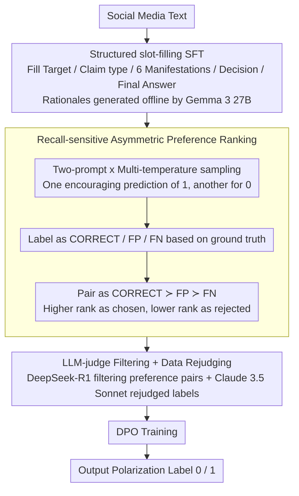

# BITS Pilani at SemEval-2026 Task 9: Structured Supervised Fine-Tuning with DPO Refinement for Polarization Detection

**Conference**: ACL 2026 (SemEval workshop)  
**arXiv**: [2604.11121](https://arxiv.org/abs/2604.11121)  
**Code**: https://github.com/atharva7-g/POLAR-SemEval-Submission  
**Area**: Multilingual NLP / SemEval shared task / Polarization Detection  
**Keywords**: Polarization detection, structured SFT, DPO, SemEval-2026, Qwen2.5 / Mistral-Nemo

## TL;DR
This paper proposes a two-stage pipeline consisting of "structured slot-filling SFT + DPO preference optimization" for the SemEval-2026 POLAR polarization detection task (English subset). The Qwen2.5-7B system submitted during the competition achieved a Macro-F1 of 0.7664. Post-competition, replacing the base model with Mistral-Nemo-12B and using preference pairs filtered by an LLM-judge improved the Macro-F1 to 0.8162, surpassing the organiser baseline (0.7802).

## Background & Motivation

**Background**: Online polarization detection is a content moderation task. Traditional approaches include fine-tuning BERT/DistilBERT for binary classification, prompt-based ICL, and LLM zero-shot inference. SemEval-2026 Task 9 (POLAR) standardizes this task across multilingual, multicultural, and multi-event scenarios, though this work specifically covers the English subset (3,222 training / 160 validation / 1,452 test samples).

**Limitations of Prior Work**: (1) Polarized language often contains implicit framing ("I can accept X, but not Y"), where keyword dictionaries fail; (2) Annotation costs are high and classes are imbalanced (approx. 36% positive samples); (3) Pure SFT tend to treat the majority class (non-polarized) as a prior, leading to low recall and frequent missed detections; (4) ICL prompts often cause models to output an "overly conservative" 0, where false negatives are more harmful in moderation scenarios (polarized content continues to spread vs. misjudgments can be retracted via human review).

**Key Challenge**: When SFT optimizes likelihood, long reasoning chains can dilute the gradient signal of the final-label token, making reasoning SFT potentially worse than label-only SFT. However, reasoning is a prerequisite for constructing high-quality DPO preference pairs (rationales are needed to judge quality).

**Goal**: (1) Design a structured rationale schema to allow models to output interpretable, batch-scorable intermediate results; (2) Use DPO to rank false negatives lower than false positives, pushing the decision boundary towards "recall sensitivity"; (3) Explore the gains brought by LLM-judge filtering of preference pairs.

**Key Insight**: The authors transform polarization detection from "single-label classification" into a "slot-filling generation task." The model must fill the target, claim type, a 6-item manifestation checklist, and decision basis before producing a label. This provides a "rationale dimension" for DPO comparison and an auditable paper trail for the LLM judge.

**Core Idea**: By combining "structured slot-filling generation + DPO ranking of three output types (CORRECT / FP / FN) + LLM-judge filtering," the classification problem is converted into an RLHF-style decision boundary adjustment problem specifically targeting false negatives.

## Method

### Overall Architecture
A two-stage pipeline:

- **Stage 1 (Structured SFT)**: Qwen2.5-7B-Instruct (competition) / Mistral-Nemo-Instruct-2407 (post-competition) are fine-tuned via LoRA on a fixed slot-filling template. Input consists of social media text, and output is a JSON-like structure: [Target referenced / Claim type / 6-class Manifestations checklist / Decision basis / Final Answer (0 or 1)]. Training rationales were generated offline using Gemma 3 27B.

- **Stage 2 (DPO Preference Optimization)**: Starting from the SFT checkpoint, a batch of completions is generated using a two-prompt strategy (one prompt encouraging a 1 prediction, the other a 0) with multi-temperature sampling. Each completion is labeled as CORRECT, FP, or FN based on the ground truth. Pairs are formed according to the preference $\mathrm{CORRECT} \succ \mathrm{FP} \succ \mathrm{FN}$ (higher rank is "chosen", lower rank is "rejected") and trained via DPO loss.

Post-competition enhancements: (1) Rejudged Sonnet—Claude 3.5 Sonnet was used to re-judge training labels, resulting in 6.2% of samples being relabeled and an overall increase in polarization ratio; (2) DeepSeek-R1 LLM judge was used to filter preference pairs into a balanced set of 299 pairs (62:38 FP:FN).

### Key Designs

**1. Structured slot-filling rationale schema: Converting classification into alignable generation**

Pure label SFT provides only a 0/1 signal, making it impossible to construct fine-grained preference pairs. Meanwhile, open-ended free-form CoT has high variance and is difficult to align for scoring. The solution is a fixed slot-filling template forcing the model to fill intermediate fields: Target referenced / Claim type / 6-class Manifestation checklist (Stereotype / Vilification / Dehumanization / Extreme Language / Lack of Empathy / Invalidation) / Decision basis / Final Answer. Chain-of-thought for all training samples is generated offline by Gemma 3 27B using this template, and the final label is extracted via regex.

This fixed schema achieves two goals: every completion provides 6 segments for alignment, allowing DPO to pair completions based on fine-grained quality, and the output serves as an auditable paper trail for the LLM judge.

**2. Recall-sensitive asymmetric preference ranking $\mathrm{CORRECT} \succ \mathrm{FP} \succ \mathrm{FN}$: Pushing the boundary toward recall**

In moderation, the cost of a missed detection (FN) is far higher than a false alarm (FP). However, standard SFT often favors the majority class (non-polarized). Directly adding class weights to SFT was found ineffective. This work instead adjusts the boundary via preferences: for each input, completions are sampled using two prompts (pro-polarized and anti-polarized) and categorized. By ranking FN systematically behind FP, the model is told "over-reporting is better than under-reporting," causing DPO to push the decision boundary globally towards aggressive polarization prediction. In experiments, recall rose from 0.5085 to 0.7797, while precision fell from 0.8333 to 0.7077.

**3. LLM-as-a-judge filtering + Rejudged training data: Quality over quantity**

Automatically constructed preference pairs are noisy. Including low-quality pairs can degrade performance—experiments showed 721 unfiltered pairs resulted in an F1 of 0.7637, lower than the SFT baseline (0.7795). DeepSeek-R1 was employed as a judge to score pairs as valid/invalid, removing inconsistent reasoning or label mismatches, reducing the set to 299 high-quality pairs. Additionally, Claude 3.5 Sonnet re-judged the training set, correcting labels in 6.2% of cases. Progress was monotonic: 330 filtered pairs yielded 0.7889, while 299 R1-filtered pairs yielded 0.8162.

### Loss & Training
SFT used standard causal LM cross-entropy (LoRA rank=8, alpha=16, dropout=0.05, target=q/k/v/o_proj, lr=5e-5, 3-10 epochs). DPO used the standard Rafailov et al. (2024) preference contrastive loss with $\beta=0.1$ (competition) / $\beta=0.3$ (best post-competition), lr=5e-6, 2 epochs.

## Key Experimental Results

### Main Results: English Dev + Test Set F1

| Method | English Dev F1 | English Test Macro-F1 | Notes |
|------|---------------|-----------------------|------|
| Zero-shot baseline | 0.7105 | — | No fine-tuning |
| DistilBERT (SLM) | 0.7149 | — | Small model baseline |
| Qwen2.5-7B SFT (reasoning) | 0.738 | — | SFT stage only |
| Qwen2.5-7B SFT + DPO (submitted) | 0.7893 | **0.7664** | Submitted system, rank 52/60 |
| POLAR organiser baseline | — | 0.7802 | Official baseline |
| Highest-ranked system | — | 0.8252 | Top of board |
| Mistral-Nemo SFT (Rejudged) | — | 0.8097 | Post-competition large model |
| Mistral-Nemo + DPO (β=0.3, R1-filtered) | — | **0.8162** | Final best result |

### Ablation Study: Stage 1-Stage 2 Gains & Structured Rationale (English test, n=1,452)

| Configuration | Accuracy | P(1) | R(1) | Macro-F1 |
|------|----------|------|------|----------|
| Label-only SFT | 0.792 | 0.777 | 0.788 | 0.781 |
| Label-only + DPO | 0.720 | 0.618 | 0.625 | 0.699 |
| Reasoning SFT | 0.793 | 0.745 | 0.662 | 0.771 |
| Reasoning + DPO (Ours) | **0.802** | 0.732 | 0.704 | **0.789** |

### DPO Pair Quantity vs. Quality Ablation

| Preference Pair Config | F1 | FN Count | FP Count |
|-----------|----|----|----|
| SFT only (No DPO) | 0.7795 | 158 | 137 |
| DPO 330 pairs (filtered) | 0.7889 | 132 | 155 |
| DPO 721 pairs (unfiltered) | 0.7637 | 64 | **274** |

### Key Findings
- **DPO systematically boosts recall from 0.5085 to 0.7797** (dev set) at the cost of precision dropping from 0.8333 to 0.7077, aligning with the "recall-sensitive" design.
- **The true value of rationales lies in enabling DPO**: Label-only SFT is strongest alone (0.781) but collapses to 0.699 with DPO. Reasoning SFT is weakest alone (0.771) but improves to 0.789 with DPO. This suggests rationales provide the "comparable fine-grained differences" DPO requires.
- **Pair quality outperforms quantity**: The 721 unfiltered pairs performed 2.5 F1 points worse than the 330 filtered pairs, highlighting that the bottleneck for RLHF/DPO is curation quality.
- **Scaling effects are evident**: Mistral-Nemo 12B benefited more from reasoning SFT than Qwen2.5 7B, indicating that reasoning capability correlates with model scale.

## Highlights & Insights
- **"Rationale for DPO" Perspective**: The authors clarify that while rationales may dilute final label gradients during SFT, they provide indispensable fine-grained dimensions for comparison in DPO. This understanding of different roles across stages is highly transferable.
- **Two-prompt Preference Generation**: Using "pro-polarized" and "anti-polarized" sampling paths covers the decision boundary more systematically than single-prompt multi-temperature sampling.
- **$\beta$ Insensitivity**: Macro-F1 remained stable (0.8065-0.8162) across nine $\beta$ values (0.1-0.5), suggesting that pair quality, not hyperparameter tuning, is the binding constraint.

## Limitations & Future Work
- **English Only**: The POLAR benchmark covers 22 languages; this system has not been tested for multilingual transfer.
- **Mistral-Nemo results were not submitted to CodaBench**: The 0.8162 score is post-competition and lacks official leaderboard comparability.
- **Coupled enhancements**: Post-competition improvements modified both the base model and training labels simultaneously, making it hard to decouple individual contributions.
- **Precision remains low (~0.73)**: The boundary between polarized and "strongly worded but neutral" remains difficult; external knowledge or RAG might be required.
- **DPO instability on 7B models**: Future work could explore reference-free methods like SimPO/KTO or loss masking to recover recall loss from reasoning SFT.

## Related Work & Insights
- **vs. SemEval-2019 HatEval**: Traditional hate speech detection often used BERT; this work upgrades the formulation to generation + decision making via LLM + DPO.
- **vs. Gunel et al. (2021) Supervised Contrastive**: Contrastive learning improves robustness but requires semantic distance mapping; DPO via ranking is more straightforward.
- **vs. Maggini et al. (2025)**: Consistent with findings that fine-tuning > ICL for polarization; this work further proves that a three-layer stack of SFT + DPO + LLM-judge filtering is superior.
- **vs. Shi et al. (2025)**: While Shi et al. use masking to emphasize key answer tokens, this work circumvents the gradient dilution problem via DPO.

## Rating
- Novelty: ⭐⭐⭐ (Combining structured generation, DPO, and LLM-judge for a specific task; the diagnostic insights are the primary contribution)
- Experimental Thoroughness: ⭐⭐⭐⭐ ($\beta$ sweep, quality sweep, rationale ablation, and label vs. reasoning comparisons)
- Writing Quality: ⭐⭐⭐⭐ (Standard SemEval structure, honest about limitations, clear findings)
- Value: ⭐⭐⭐ (A practical, reproducible pipeline with open-source code; serves as a template for SFT+DPO in production)

<!-- RELATED:START -->

## Related Papers

- [\[ACL 2026\] mdok-style at SemEval-2026 Task 9: Finetuning LLMs for Multilingual Polarization Detection](mdok-style_at_semeval-2026_task_9_finetuning_llms_for_multilingual_polarization_.md)
- [\[ACL 2026\] YEZE at SemEval-2026 Task 9: Detecting Multilingual, Multicultural and Multievent Online Polarization via Heterogeneous Ensembling](yeze_at_semeval-2026_task_9_detecting_multilingual_multicultural_and_multievent_.md)
- [\[ACL 2026\] PSK@EEUCA 2026: Fine-Tuning Large Language Models with Synthetic Data Augmentation for Multi-Class Toxicity Detection in Gaming Chat](pskeeuca_2026_fine-tuning_large_language_models_with_synthetic_data_augmentation.md)
- [\[ACL 2026\] Prompt-Level Distillation: A Non-Parametric Alternative to Model Fine-Tuning for Efficient Reasoning](prompt-level_distillation_a_non-parametric_alternative_to_model_fine-tuning_for_.md)
- [\[ACL 2026\] ClaimDB: A Fact Verification Benchmark over Large Structured Data](claimdb_a_fact_verification_benchmark_over_large_structured_data.md)

<!-- RELATED:END -->
