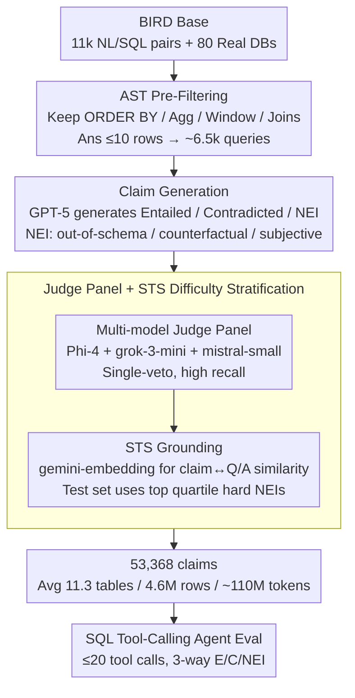

# ClaimDB: A Fact Verification Benchmark over Large Structured Data

**Conference**: ACL 2026  
**arXiv**: [2601.14698](https://arxiv.org/abs/2601.14698)  
**Code**: https://claimdb.github.io  
**Area**: Fact Verification / Structured Data / LLM Evaluation  
**Keywords**: Fact-checking benchmark, Large-scale structured data, Tool-calling agents, NEI abstention capability, SQL reasoning

## TL;DR
ClaimDB is the first fact-verification benchmark to scale evidence to 80 real-world databases, averaging 11 tables / 4.6 million rows / 110 million tokens per claim. This forces methods to utilize executable programs (SQL) for compositional reasoning. Evaluations of tool-calling agents across 30 SOTA LLMs reveal that over half have an accuracy below 55%; closed models rarely "abstain," while open-source models over-abstain, identifying NEI handling as the primary weakness.

## Background & Motivation

**Background**: Existing fact-verification benchmarks have evolved from FEVER (text) to TabFact and FEVEROUS (small tables) and then to SCITAB (scientific tables). All assume evidence can fit within the LLM context window, supporting a "read-then-reason" paradigm.

**Limitations of Prior Work**: Real-world high-impact claims (e.g., political claims regarding inflation or crime rates) rely on evidence from million-line CSVs or multi-table databases (e.g., BLS, police departments) that cannot be read entirely. Even a 1–2M token context window is 2–3 orders of magnitude smaller than the required 110M tokens.

**Key Challenge**: A significant gap exists between real-world fact-checking distributions and the "small evidence" assumption of current benchmarks. This causes models that appear SOTA on existing leaderboards to fail on real databases. Once "reading all evidence" becomes impossible, the paradigm must shift to "symbolic processing of massive data via executable programs + reasoning," yet this neuro-symbolic capability lacks adequate benchmarks and systematic evaluation.

**Goal**: Construct a large-scale fact-verification benchmark where **(1) evidence significantly exceeds LLM context, (2) compositional reasoning (aggregation/sorting/joins) is mandatory, and (3) realistic NEI categories are included**, and systematically evaluate 30 LLMs as tool-calling agents.

**Key Insight**: Leverage BIRD (an NL2SQL benchmark with 11k NL/SQL pairs and real databases). The SQL queries themselves indicate "questions requiring compositional reasoning." GPT-5 is used to generate entailed/contradicted/NEI claims based on these, with quality controlled by a multi-LLM judge panel.

**Core Idea**: Use SQL AST filtering to identify queries involving "aggregation, sorting, multi-table joins, or window functions." Convert execution results into claims, apply quality control via an LLM-as-judge panel, and mandate the use of SQL tool-calling agents for evaluation.

## Method

### Overall Architecture
The ClaimDB construction pipeline consists of five stages:

- **Step 1: BIRD Starting Point**: Utilize BIRD's 11k NL/SQL pairs and 80 real-world databases.
- **Step 2: Pre-Filtering**: Convert SQL to AST and retain only queries with `ORDER BY`, aggregates (`AVG`, `SUM`), window functions, or multi-table joins, where answer rows $\le 10$ (approx. 6.5k queries).
- **Step 3: Claim Generation**: For each Q/A pair, GPT-5 generates entailed, contradicted, and NEI claims. NEI is subdivided into out-of-schema, counterfactual, and subjective.
- **Step 4: Quality Control**: A judge panel (Phi-4 + grok-3-mini + mistral-small) evaluates each claim for label correctness, self-containment, and NEI validity using a **single-veto system**.
- **Step 5: NEI Grounding**: Calculate similarity between claims and Q/A using gemini-embedding-001. Only top quartile "hard" NEI examples are sampled for the test split.

The final dataset contains 53,368 claims (E: 12,855 / C: 16,529 / NEI: 23,984), with an average per claim of 11.3 tables, 4.6M rows, and ~110M tokens. Agents are provided a SQL execution tool (Google MCP toolbox) with a 20-call limit for 3-way classification (E/C/NEI), reporting Macro-F1 and Accuracy.

### Key Designs

**1. AST-based Pre-Filtering: Enforcing compositional reasoning through verifiable syntax rules**

Relying solely on LLM prompts for claim generation cannot guarantee that the underlying evidence is massive or requires cross-table aggregation. ClaimDB parses BIRD SQL into ASTs and retains only queries satisfying: (a) `ORDER BY` or superlatives (MAX, TOP-K); (b) aggregate functions (`AVG`, `SUM`, `COUNT`); (c) window functions; or (d) joins involving three or more tables. This ensures any successful method must perform cross-table aggregation rather than simple lookups.

**2. Three-class + Three-subclass NEI Claim Generation: Diagnostic failure modes for "Inadequate Evidence"**

In real fact-checking, "Not-Enough-Info" (NEI) is the most common and dangerous determination. ClaimDB subdivides NEI into **Out-of-Schema** (concepts absent from the DB), **Counterfactual** (what-if scenarios), and **Subjective** (value judgments). E/C claims are constrained by the actual answers, while NEI claims are generated zero-shot relative to schema metadata to ensure they remain conceptually relevant but unanswerable.

**3. LLM Judge Panel + STS Grounding: Cost-effective quality control and difficulty stratification**

Manual annotation of 64k claims is infeasible. A panel of three distinct small model families (Phi-4, grok-3-mini, mistral-small) is used to avoid OpenAI self-enhancement bias. A single-veto system optimizes for recall on bad claims (100% recall on 150 manual samples). STS grounding then uses embeddings to ensure NEI claims are semantically close to the database content, forcing models to actually query the DB rather than rejecting based on common sense.

## Key Experimental Results

### Main Results (30 LLMs × 1000 Public Test Claims, SQL Tool-calling, 20-call Limit)

| Model | Acc. | Macro-F1 | F1_E | F1_C | F1_NEI |
|------|------|----------|------|------|--------|
| gpt-5-mini | **0.827** | **0.828** | 0.810 | 0.815 | 0.860 |
| claude-haiku-4-5 | 0.809 | 0.811 | 0.815 | 0.814 | 0.805 |
| gemini-3-flash | 0.801 | 0.800 | 0.776 | 0.832 | 0.792 |
| gpt-5-nano | 0.787 | 0.787 | 0.777 | 0.794 | 0.790 |
| gemini-2.5-flash | 0.793 | 0.793 | 0.755 | 0.777 | 0.849 |
| gpt-oss:20b (open) | 0.740 | 0.739 | 0.749 | 0.710 | 0.758 |
| qwen3-coder:30b | 0.672 | 0.672 | 0.691 | 0.641 | 0.685 |
| nemotron-3-nano:30b | 0.667 | 0.671 | 0.681 | 0.658 | 0.673 |
| ministral-3:14b | 0.623 | 0.623 | 0.605 | 0.608 | 0.655 |
| qwen3:32b | 0.574 | 0.561 | 0.512 | 0.544 | 0.626 |
| llama3.1:8b | 0.344 | 0.288 | 0.269 | 0.133 | 0.461 |
| qwen3:1.7b | 0.366 | 0.239 | 0.110 | 0.089 | 0.518 |

**Key Statistics**: 17 out of 30 models (>50%) have Acc and Macro-F1 below 55%. Most open-source models do not exceed 68%.

### Analysis

| Dimension | Observation | Implication |
|---------|---------|------|
| Contamination Test | gpt-5-mini without tools: Macro-F1=0.253, Acc=0.367 | Performance relies on tools, not parametric knowledge. |
| Tool Call Frequency | Quadratic fit shows optimal performance at ~4–8 calls. | Excessive calls lead to loss of focus or context flooding. |
| SQL Success Rate | gpt-5-mini 93%, claude 99% | Failures in strong models occur at the reasoning level, not syntax. |
| Abstention (NEI) | Closed models rarely predict NEI; open models over-predict NEI. | Closed models "hallucinate knowledge," open models "slack off." |

### Key Findings
- **Most SOTA LLMs fail ClaimDB (< 55% Acc)**, indicating that "large structured data + compositional reasoning" is a major blind spot not covered by existing benchmarks.
- **Scaling returns are weak (log-linear)**: Increasing parameters alone does not solve ClaimDB.
- **NEI behavior is polarized**: Closed models avoid abstention (overconfidence), while open models over-abstain (passivity).
- **Tool call "sweet spot"**: 4–8 SQL calls are optimal; agents require specific optimization for session length.

## Highlights & Insights
- **Orders of magnitude leap**: Jumping from thousands of tokens in TabFact to 110M tokens forces a paradigm shift to neuro-symbolic methods.
- **Reusable Quality Pipeline**: The three-stage process (AST filter → Judge panel → STS stratification) is a blueprint for synthesizing high-quality evaluation sets from large-scale data.
- **Anti-consensus Judge Strategy**: Unlike standard LLM-judges seeking human agreement, this work prioritizes recall on bad samples via conservative prompting ("answer no if unsure").
- **Systematic Abstention Diagnosis**: Subdividing NEI into three categories reveals specific calibration issues in trustworthy AI that simple abstention rates miss.

## Limitations & Future Work
- **Ours**: (1) Dependence on BIRD (errors propagate); (2) Single modality (no free text/charts); (3) Static snapshots (DBs might be outdated); (4) SQL tool bias (favors code-centric models).
- **Additional Considerations**: (1) GPT-5 generation bias; (2) Imbalanced NEI subclasses; (3) Evaluated only on public tests.
- **Future Directions**: Include multi-modal evidence (PDFs, time-series), use multiple base models for generation, and compare SQL agents against Python/Pandas agents.

## Related Work & Insights
- **vs FEVER/TabFact**: ClaimDB increases evidence scale by 3 orders of magnitude, shifting the task from "reading" to "querying."
- **vs BIRD (NL2SQL)**: Ours "recycles" BIRD by treating SQL as the ground truth for compositional reasoning rather than the prediction target.
- **vs Program of Thoughts**: ClaimDB provides a rigorous stress test for neuro-symbolic methods, where such approaches are expected to outperform pure in-context reading.

## Rating
- Novelty: ⭐⭐⭐⭐⭐ First 110M-scale benchmark forcing neuro-symbolic paradigm shift.
- Experimental Thoroughness: ⭐⭐⭐⭐⭐ Comprehensive 30-model eval with detailed failure mode analysis.
- Writing Quality: ⭐⭐⭐⭐⭐ High-clarity pipeline and taxonomies; excellent real-world grounding.
- Value: ⭐⭐⭐⭐⭐ Provides a standard metric for trustworthy LLMs on big data.

<!-- RELATED:START -->

## Related Papers

- [\[ACL 2026\] SPAGBias: Uncovering and Tracing Structured Spatial Gender Bias in Large Language Models](spagbias_uncovering_and_tracing_structured_spatial_gender_bias_in_large_language.md)
- [\[ACL 2026\] VeriTaS: The First Dynamic Benchmark for Multimodal Automated Fact-Checking](veritas_the_first_dynamic_benchmark_for_multimodal_automated_fact-checking.md)
- [\[ICLR 2026\] BiasFreeBench: a Benchmark for Mitigating Bias in Large Language Model Responses](../../ICLR2026/social_computing/biasfreebench_a_benchmark_for_mitigating_bias_in_large_language_model_responses.md)
- [\[ACL 2026\] SMARTER: A Data-efficient Framework to Improve Toxicity Detection with Explanation via Self-augmenting Large Language Models](smarter_a_data-efficient_framework_to_improve_toxicity_detection_with_explanatio.md)
- [\[ICML 2025\] OR-Bench: An Over-Refusal Benchmark for Large Language Models](../../ICML2025/social_computing/or-bench_an_over-refusal_benchmark_for_large_language_models.md)

<!-- RELATED:END -->
