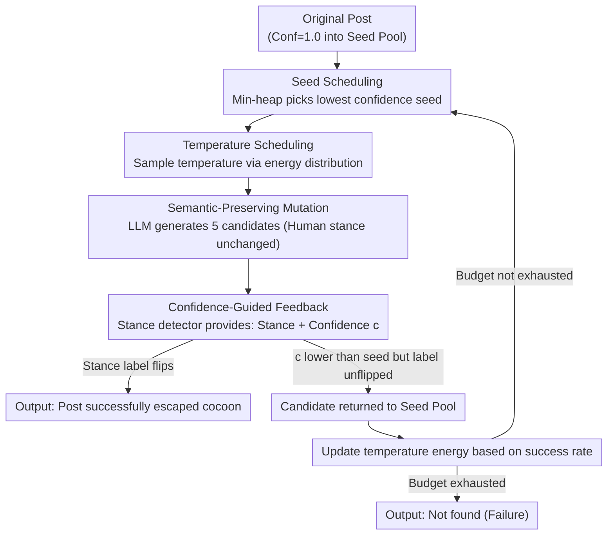

# Content Fuzzing for Escaping Information Cocoons on Social Media

**Conference**: ACL 2026 Findings  
**arXiv**: [2604.05461](https://arxiv.org/abs/2604.05461)  
**Code**: None  
**Area**: Social Computing / Adversarial Learning  
**Keywords**: Information Cocoon, Stance Detection, Fuzzing, Content Rewriting, Recommender Systems

## TL;DR
The authors propose ContentFuzz, a confidence-guided fuzzing framework from a content creator's perspective. It leverages LLMs to rewrite posts such that they flip machine-inferred stance labels while maintaining the same meaning for human readers, thereby breaking through social media information cocoons.

## Background & Motivation

**Background**: Social media platforms use stance detection as a primary signal in recommendation and ranking pipelines, routing posts mainly to audiences with the same viewpoints and reducing cross-stance exposure. This limits the reach of dissenting opinions and hinders constructive discussion.

**Limitations of Prior Work**: Existing methods to break information cocoons are primarily platform-side algorithmic interventions (e.g., diversity re-ranking). However, these methods are controlled by platforms; individual users and content creators cannot modify recommendation algorithms nor observe how posts are filtered, ranked, and distributed. Creators lack tools to proactively expand their content's reach.

**Key Challenge**: There is a fundamental conflict between the need for creators/users to increase cross-group exposure and the lack of actionable technical means—the only element under their control is the content itself.

**Goal**: From the creator's perspective, this work explores how to break information cocoons through content rewriting—identifying semantic-preserving rewrites that maintain human-interpreted stances but alter machine-classified stances.

**Key Insight**: Borrowing methodology from software testing, the stance detection model is treated as a "System Under Test" (SUT), iteratively discovering input variants that cause classification flips.

**Core Idea**: The framework uses confidence feedback from the stance detection model to guide LLMs in generating semantic-preserving rewrites. A drop in confidence indicates that the rewrite is exploring the vicinity of the classifier's decision boundary. Iteration continues until the label flips or the budget is exhausted.

## Method

### Overall Architecture
ContentFuzz treats the stance detector as a "System Under Test" and performs iterative fuzzing starting from the original post. In each round, **Seed Scheduling** uses a min-heap to select the seed with the lowest current confidence (closest to flipping). Then, **Temperature Scheduling** samples a rewrite temperature based on historical success rates. An LLM performs **Semantic-Preserving Mutation** to generate 5 candidates that maintain human-interpreted meaning. These candidates are fed into the stance detector to obtain predicted stances and confidence scores (**Confidence-Guided Feedback**). If a candidate's stance label flips, the process succeeds immediately. Candidates that lower the confidence but haven't flipped yet are returned to the seed pool for future iterations, and the energy of each temperature is updated based on success rates. This loop continues until a label flip occurs or the iteration budget is exhausted.

### Key Designs

**1. Confidence-Guided Feedback: Using the classifier's "hesitation" as a search compass**

Blindly rewriting posts to flip labels is highly inefficient because there is no signal indicating which rewrite "approaches" the classifier's decision boundary. ContentFuzz feeds candidates into the stance detector after each mutation to obtain the predicted stance and confidence $c$. If a new candidate’s $c$ is lower than its seed, it signifies the model is being pushed away from its current judgment and toward the boundary; such candidates are added to the seed pool. Once a label flips, success is returned. Lower confidence translates to higher proximity to the boundary, transforming the search from a random walk into a directional descent, significantly improving efficiency.

**2. Seed Scheduling: Prioritizing the seeds closest to the boundary via Min-Heap**

With limited computational budget for fuzzing, wasting mutations on seeds far from the boundary is inefficient. ContentFuzz organizes all candidates into a min-heap based on confidence. Each round, it selects the seed with the global minimum confidence for mutation—lower confidence indicates a higher probability of flipping with minimal changes. Concentrating the budget on the most promising directions is crucial for ContentFuzz to converge within a small number of iterations.

**3. Semantic-Preserving Mutation: Escaping cocoons, not deceiving classifiers**

This is the essential distinction between ContentFuzz and adversarial attacks. While adversarial attacks allow perturbations that might be illegible to humans, ContentFuzz requires that the rewrite's meaning remains entirely unchanged for human readers. ContentFuzz employs a single strict rewrite operator (using Gemini-2.5-Flash-Lite) with specialized prompts to preserve core viewpoints and attitudes while altering only surface features like phrasing. To accelerate exploration and prevent pool stagnation, the operator generates 5 candidates simultaneously. Because the constraint is "human-interpreted stance remains, machine-judged stance flips," the output consists of natural posts that allow creators to reach across groups, rather than distorted adversarial samples.

**4. Temperature Scheduling: Adaptive regulation of "creativity" via energy feedback**

Fixed generation temperatures are suboptimal as different platforms and topics require varying degrees of divergence. If a strict operator uses a fixed temperature, it fails to balance exploration and exploitation. ContentFuzz discretizes temperature as $\mathcal{T}=\{0.0, 0.1, \dots, 2.0\}$ and assigns an energy value $E_t$ (initially 1) to each. Each round samples a temperature via $P(t)=E_t / \sum_{t'} E_{t'}$. After the round, energy is updated as $E_t \leftarrow E_t + s/N$, where $s/N$ is the ratio of candidates that successfully reduced confidence. Consequently, temperatures that historically produce effective variants are sampled more frequently, allowing the framework to adapt across platforms and topics without manual tuning (corresponding to `UpdateEnergy` in the algorithm).

### Loss & Training
ContentFuzz is an inference-time framework and requires no training. The optimization objective is to minimize the stance detector's confidence in the original label until the label flips.

## Key Experimental Results

### Main Results

| Setting | Stance Model | Success Rate | Semantic Preservation | Fluency |
|------|---------|-------|---------|-------|
| English Dataset | BERT-based | High | Strong | High |
| English Dataset | LLM-based | High | Strong | High |
| Chinese Dataset | BERT-based | High | Strong | High |
| Cross-topic Transfer | Multi-model | Stable | Stable | Stable |

### Ablation Study

| Configuration | Effect | Description |
|------|------|------|
| No Confidence Feedback (Random) | Low Success Rate | Directionless exploration is highly inefficient |
| No Seed Scheduling (Uniform) | Decreased | Resources wasted on low-potential seeds |
| Full ContentFuzz | **Optimal** | Synergy between feedback and scheduling |

### Key Findings
- ContentFuzz is effective across 3 datasets, 2 languages, and 4 stance detection models.
- Rewrites successfully flip machine stance labels while maintaining semantic integrity.
- Minor phrasing changes significantly impact stance detector outputs, revealing the vulnerability of these models.

## Highlights & Insights
- **Perspective Shift** is the primary highlight: Moving from "how platforms break cocoons" to "how creators break out" is an overlooked but practically actionable direction.
- **Cross-domain Transfer of Fuzzing Methodology**: The seamless application of software testing concepts (iterative mutation, feedback guidance, seed scheduling) to NLP is ingenious.
- **Reveals Stance Model Vulnerability**: The fact that semantic-preserving rewrites can flip predictions raises serious concerns regarding the reliability of recommendation systems.

## Limitations & Future Work
- Dependency on black-box/gray-box access to stance models—completely black-box recommendation systems might not provide confidence scores.
- Whether successful rewrites truly alter distribution decisions in real-world recommendation algorithms remains unverified on actual platforms.
- Potential for misuse in public opinion manipulation—ethical boundaries must be considered.

## Related Work & Insights
- **vs. Adversarial Attacks**: Adversarial attacks seek minimal perturbations to flip labels; ContentFuzz seeks natural, semantic-preserving rewrites.
- **vs. Platform-side Intervention**: These are complementary—platforms control algorithms, while creators control content.

## Rating
- Novelty: ⭐⭐⭐⭐⭐ First content-side framework for breaking information cocoons with a unique perspective.
- Experimental Thoroughness: ⭐⭐⭐⭐ Comprehensive validation across multiple languages and models.
- Writing Quality: ⭐⭐⭐⭐ Clear motivation and appropriate methodological analogies.
- Value: ⭐⭐⭐⭐ Dual value for both information diversity and recommendation system robustness.

<!-- RELATED:START -->

## Related Papers

- [\[ACL 2026\] Synthia: Scalable Grounded Persona Generation from Social Media Data](synthia_scalable_grounded_persona_generation_from_social_media_data.md)
- [\[ACL 2026\] DIA-HARM: Dialectal Disparities in Harmful Content Detection Across 50 English Dialects](dia-harm_dialectal_disparities_in_harmful_content_detection_across_50_english_di.md)
- [\[ACL 2026\] Bayesian Social Deduction with Graph-Informed Language Models](bayesian_social_deduction_with_graph-informed_language_models.md)
- [\[ACL 2026\] The Proxy Presumption: From Semantic Embeddings to Valid Social Measures](the_proxy_presumption_from_semantic_embeddings_to_valid_social_measures.md)
- [\[NeurIPS 2025\] Precise Information Control in Long-Form Text Generation](../../NeurIPS2025/social_computing/precise_information_control_in_long-form_text_generation.md)

<!-- RELATED:END -->
