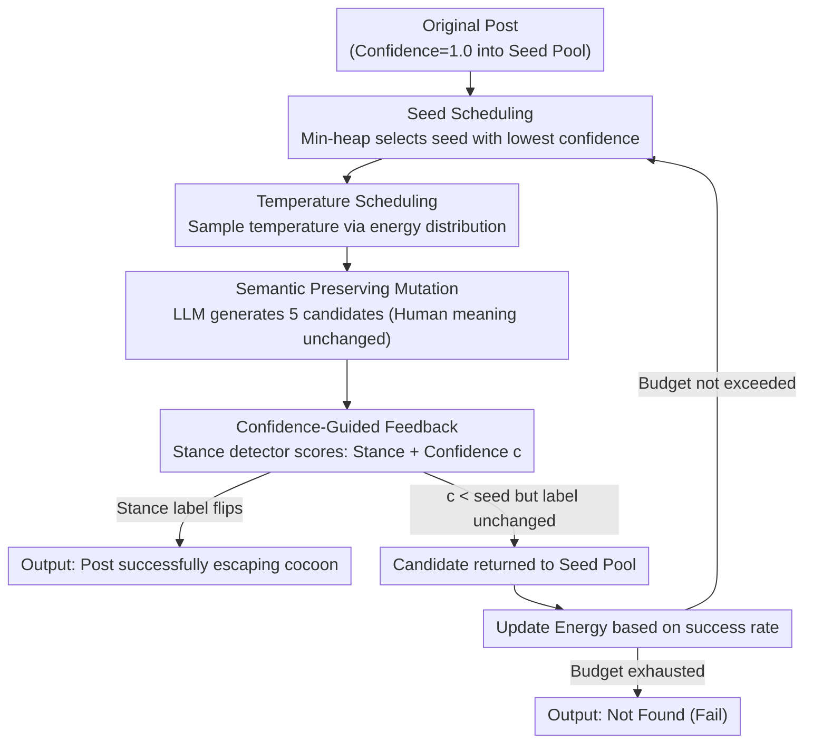

# Content Fuzzing for Escaping Information Cocoons on Social Media

**Conference**: ACL 2026 Findings  
**arXiv**: [2604.05461](https://arxiv.org/abs/2604.05461)  
**Code**: None  
**Area**: Social Computing / Adversarial Learning  
**Keywords**: Information Cocoon, Stance Detection, Fuzzing, Content Rewriting, Recommender Systems

## TL;DR
Proposes ContentFuzz, a confidence-guided fuzzing framework from the content creator's perspective. It uses LLMs to rewrite posts to flip machine-inferred stance labels while keeping human-interpreted meaning unchanged, thereby breaking social media information cocoons.

## Background & Motivation

**Background**: Social media platforms use stance detection as an essential signal in recommendation and ranking pipelines, routing posts primarily to like-minded audiences and reducing cross-stance exposure. This limits the reach of differing opinions and hinders constructive discussion.

**Limitations of Prior Work**: Existing methods for breaking information cocoons are mainly platform-side algorithmic interventions (e.g., diversity re-ranking). However, these are controlled by platforms; individual users and creators cannot modify recommendation algorithms or see how posts are filtered, ranked, and distributed. Creators lack proactive tools to expand their content's reach.

**Key Challenge**: There is a demand from users and creators to increase cross-group exposure, but they lack actionable technical means—the only element they can control is the content itself.

**Goal**: From the creator's perspective, explore how to break information cocoons through content rewriting—finding semantic-preserving rewrites that maintain human-interpreted stances but change machine-classified stance labels.

**Key Insight**: Borrow methodology from software fuzzing, treating the stance detection model as the "system under test" (SUT) to iteratively discover input variants that flip classification results.

**Core Idea**: Use the confidence feedback from stance detection models to guide LLMs in generating semantic-preserving rewrites—a drop in confidence indicates the rewrite is exploring near the classifier's decision boundary. Iterate until the label flips or the budget is exhausted.

## Method

### Overall Architecture
ContentFuzz treats the stance detector as the "system under test" and performs iterative fuzzing starting from the original post. In each round, **Seed Scheduling** uses a min-heap to select the seed with the lowest current confidence (closest to flipping). **Temperature Scheduling** samples a rewriting temperature based on historical success rates. An LLM then performs **Semantic Preserving Mutation** to generate 5 candidates while maintaining the human-interpreted meaning. These candidates are sent to the stance detector for **Confidence-Guided Feedback** (predicted stance and confidence). Success is returned immediately if a candidate's stance label flips; candidates that lower the confidence but do not flip the label are returned to the seed pool for future iteration, and the energy for each temperature is updated based on the success rate of the round. This cycle continues until a candidate changes the machine-judged stance label or the iteration budget is exhausted.

### Key Designs

**1. Confidence-Guided Feedback: Using the classifier's "hesitation" as a compass for search**

Blindly rewriting posts to flip labels is highly inefficient because there is no signal telling the LLM which rewrite is "closer" to the classifier's decision boundary. ContentFuzz feeds candidates into the stance detector after each mutation to obtain the predicted stance and confidence $c$. If the new candidate's $c$ is lower than its seed, it indicates the model is being pushed away from its current judgment toward the decision boundary, and the candidate is added to the seed pool. If a label flips, success is returned. Lower confidence acts as a guide, turning random exploration into directional descent, significantly improving efficiency.

**2. Seed Scheduling: Using a min-heap to prioritize seeds closest to the boundary**

Fuzzing resources are limited, and wasting mutations on seeds far from the boundary is inefficient. ContentFuzz organizes all candidates into a min-heap based on confidence. Each round, it selects the seed with the lowest confidence in the pool for mutation—lower confidence means it is closer to the detector's decision boundary and more likely to flip with a single change. This scheduling concentrates the iteration budget on the most promising directions, which is key to ContentFuzz's convergence within a few iterations.

**3. Semantic Preserving Mutation: Escaping cocoons, not deceiving classifiers**

This is the essential difference between ContentFuzz and adversarial attacks: adversarial attacks allow perturbations that humans cannot understand, whereas ContentFuzz requires that the rewrite's meaning remains identical for human readers. ContentFuzz employs a single strict mutation operator (using Gemini-2.5-Flash-Lite) with a specialized prompt template to preserve core viewpoints and attitudes while only altering surface features like phrasing or sentence structure. To accelerate exploration and prevent the seed pool from drying up, the operator generates 5 candidates at once per round. Because it is constrained to "human-interpreted stance unchanged but machine-judged stance flipped," the output is a natural post that allows creators to reach cross-group audiences, rather than a distorted adversarial sample.

**4. Temperature Scheduling: Adaptively adjusting "creativity" via energy feedback**

Fixed generation temperatures are suboptimal—different platforms and topics require different levels of divergence. ContentFuzz discretizes temperatures into $\mathcal{T}=\{0.0, 0.1, \dots, 2.0\}$ and assigns an energy value $E_t$ (initially 1) to each. In each round, a temperature is sampled according to $P(t)=E_t / \sum_{t'} E_{t'}$. After the round, the energy is updated as $E_t \leftarrow E_t + s/N$, where $s/N$ is the proportion of candidates that successfully lowered the confidence. Consequently, temperatures that historically produce effective variants are sampled more frequently, allowing the framework to adapt across platforms and topics without manual parameter tuning (corresponding to `UpdateEnergy` in the algorithm).

### Loss & Training
ContentFuzz is an inference-time framework and requires no training. The optimization goal is to minimize the stance detector's confidence in the original label until the label flips.

## Key Experimental Results

### Main Results

| Setting | Stance Model | Success Rate | Semantic Preservation | Fluency |
|------|---------|-------|---------|-------|
| English Dataset | BERT-based | High | Strong | High |
| English Dataset | LLM-based | High | Strong | High |
| Chinese Dataset | BERT-based | High | Strong | High |
| Cross-topic Transfer | Multi-model | Stable | Stable | Stable |

### Ablation Study

| Configuration | Effect | Description |
|------|------|------|
| No Confidence Feedback (Random) | Low Success Rate | Directionless exploration is extremely inefficient |
| No Seed Scheduling (Uniform) | Decreased | Resources wasted on low-potential seeds |
| Full ContentFuzz | **Optimal** | Synergy between feedback and scheduling |

### Key Findings
- ContentFuzz is effective across 3 datasets, 2 languages, and 4 stance detection models.
- Rewriting successfully flips machine stance labels while maintaining semantic integrity.
- Minor wording changes significantly impact stance detector output, revealing the vulnerability of these models.

## Highlights & Insights
- **Perspective Shift** is the main highlight: moving from "how platforms break cocoons" to "how creators break out," an overlooked but actionable direction.
- **Cross-domain Transfer of Fuzzing Methodology** is clever—seamlessly applying core software testing concepts (iterative mutation, feedback guidance, seed scheduling) to NLP.
- **Reveals Stance Detection Vulnerability**—semantic-preserving rewrites can flip predictions, questioning the reliability of recommendation systems.

## Limitations & Future Work
- Dependency on black-box/gray-box access to stance models—completely black-box recommendation systems might not provide confidence scores.
- Whether successful rewrites truly change distribution decisions in real-world recommendation algorithms has not been verified on live platforms.
- Potential misuse for opinion manipulation—ethical boundaries need consideration.

## Related Work & Insights
- **vs. Adversarial Attacks**: Adversarial attacks seek minimal perturbations to flip labels; ContentFuzz seeks natural, semantic-preserving rewrites.
- **vs. Platform-side Intervention**: A complementary relationship—platforms control algorithms, whereas creators control content.

## Rating
- Novelty: ⭐⭐⭐⭐⭐ First content-side information cocoon breaking framework with a unique perspective.
- Experimental Thoroughness: ⭐⭐⭐⭐ Comprehensive verification across multiple languages and models.
- Writing Quality: ⭐⭐⭐⭐ Clear motivation and appropriate methodological analogies.
- Value: ⭐⭐⭐⭐ Dual value for information diversity and recommendation system robustness.

<!-- RELATED:START -->

## Related Papers

- [\[ACL 2026\] Synthia: Scalable Grounded Persona Generation from Social Media Data](synthia_scalable_grounded_persona_generation_from_social_media_data.md)
- [\[ICML 2026\] Three Years of r/ChatGPT: Societal Impact Evaluations from Social Media Data](../../ICML2026/social_computing/three_years_of_rchatgpt_societal_impact_evaluations_from_social_media_data.md)
- [\[ACL 2026\] DIA-HARM: Dialectal Disparities in Harmful Content Detection Across 50 English Dialects](dia-harm_dialectal_disparities_in_harmful_content_detection_across_50_english_di.md)
- [\[ICLR 2026\] The Value of Information in Human-AI Decision-Making](../../ICLR2026/social_computing/the_value_of_information_in_human-ai_decision-making.md)
- [\[ACL 2026\] Bayesian Social Deduction with Graph-Informed Language Models](bayesian_social_deduction_with_graph-informed_language_models.md)

<!-- RELATED:END -->
