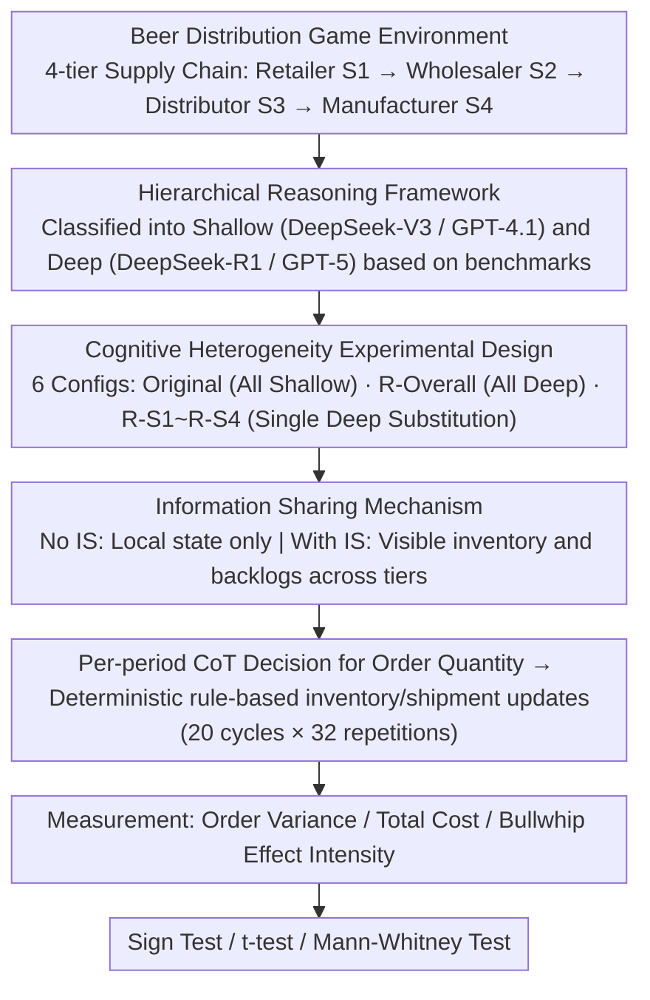

# Dynamics of Cognitive Heterogeneity: Investigating Behavioral Biases in Multi-Stage Supply Chains with LLM-Based Simulation

**Conference**: ACL 2026  
**arXiv**: [2604.17220](https://arxiv.org/abs/2604.17220)  
**Code**: None  
**Area**: Others  
**Keywords**: Supply Chain Simulation, Cognitive Heterogeneity, Bullwhip Effect, LLM Agents, Beer Distribution Game

## TL;DR

This study utilizes LLM agents (DeepSeek/GPT series) to simulate multi-stage supply chains in the classic Beer Distribution Game. It systematically investigates the impact of cognitive heterogeneity (differences in reasoning capabilities) on system behavior, finding that LLM agents replicate human-like bullwhip effects and myopic behavior, while information sharing effectively mitigates these negative effects.

## Background & Motivation

**Background**: Behavioral experiments like the Beer Distribution Game reveal supply chain inefficiencies caused by cognitive biases (e.g., the bullwhip effect). However, traditional human experiments face constraints regarding scalability, cost, and experimental control. The potential of LLMs as behavioral proxies is currently being explored.

**Limitations of Prior Work**: (1) Most LLM multi-agent research focuses on static or structurally simple settings, failing to explore highly dynamic multi-period environments; (2) existing studies typically deploy homogeneous agents, ignoring the impact of cognitive heterogeneity (a mix of agents with different reasoning capabilities) on collective behavior; (3) there is a lack of rigorous statistical validation.

**Key Challenge**: Strategic diversity is both prevalent and critical in real organizations, yet its interactive effects in synthetic environments have not been sufficiently studied.

**Goal**: Construct an LLM-driven supply chain simulation paradigm to systematically study how cognitive heterogeneity affects collective behavior.

**Key Insight**: Utilize LLMs with different reasoning capabilities (Base vs. Reasoning-enhanced) to represent distinct cognitive levels, deploying heterogeneous agents at different positions within the supply chain.

**Core Idea**: LLM agents can replicate human behavioral biases; cognitive heterogeneity exacerbates system inefficiency, while information sharing serves as an effective mitigation strategy.

## Method

### Overall Architecture

The study adapts the classic Beer Distribution Game (a 4-tier linear supply chain: Retailer → Wholesaler → Distributor → Manufacturer) to LLM agents. Each tier is played by an LLM that independently decides order quantities upstream each period for 20 continuous cycles. The core variable is "Cognitive Depth"—using different LLMs to represent shallow and deep cognition. Heterogeneous agents are deployed at various chain positions to observe changes in order fluctuations, costs, and the bullwhip effect. Each configuration is run for 32 independent trials to support statistical testing.

### Key Designs

**1. Hierarchical Reasoning Framework: Using Base/Reasoning-enhanced LLMs as Empirical Anchors for "Cognitive Depth"**

To study "Cognitive Heterogeneity," a credible standard for cognitive stratification is required. The study categorizes agents into Shallow (DeepSeek-V3, GPT-4.1) and Deep (DeepSeek-R1, GPT-5) levels based on consistent performance gaps in reasoning benchmarks like AIME and GPQA. A dual-family design (DeepSeek and GPT series) is adopted to control for architecture-specific biases and verify if findings hold across different model families.

> ⚠️ The original text lists "GPT-5" as a representative "Deep" model; names are kept as per the source.

**2. Cognitive Heterogeneity Experimental Design: Isolating Causal Effects via Single-Position Substitutions**

Randomly mixing agents of different abilities makes it impossible to attribute changes to specific roles or positions. Six configurations are used for controlled variation: two homogeneous baselines (Original: All Shallow, R-Overall: All Deep) and four stratified conditions (R-S1 through R-S4), where only one specific position is assigned a Deep agent while others remain Shallow. Each configuration is tested under two information conditions (No IS / With IS) using CoT prompting for structured decision-making. This allows the movement of a single variable (position of deep cognition) to map clearly to differences in system behavior.

**3. Information Sharing Mechanism: Verifying if Transparency Suppresses the Bullwhip Effect**

Information asymmetry is a classic cause of the bullwhip effect in human experiments. This study tests if LLM agents behave similarly. Under information sharing (IS), each agent views not only its local state but also the inventory and backlog levels of other tiers. Fluctuations, costs, and bullwhip intensity are compared between IS and non-IS conditions. Significant reductions in volatility and cost under IS would indicate that LLM biases are rooted in information structures rather than just individual intelligence.

### Loss & Training

No model training is involved; agents use off-the-shelf LLMs deployed in a zero-shot manner. Results are validated using standard statistical methods including sign tests, t-tests, and Mann-Whitney tests.

## Key Experimental Results

### Main Results

Reproduction of the bullwhip effect (Homogeneous conditions, No IS):

| Configuration | Order Variance Increase | p-value | Description |
|---------------|-------------------------|---------|-------------|
| DeepSeek-Original | 82.3% | <0.001 | Significant Bullwhip Effect |
| DeepSeek-R-Overall | 79.8% | <0.001 | Persists despite reasoning enhancement |
| GPT-Original | 74.2% | <0.001 | Consistent across families |
| GPT-R-Overall | 74.3% | <0.001 | Consistency verification |

### Ablation Study

Mitigation effect of Information Sharing (IS):

| Condition | Total Cost (No IS) | Total Cost (With IS) | Reduction |
|-----------|--------------------|----------------------|-----------|
| DeepSeek-Original | 39.43 | 20.15 | ~49% |
| DeepSeek-R-Overall | 29.43 | 17.71 | ~40% |

### Key Findings

- LLM agents successfully replicate the bullwhip effect observed in human experiments ($p < 0.001$), validating their credibility as behavioral proxies.
- Compared to human data, LLM agent decisions are more stable (lower variance) with clearer statistical signals.
- Cognitive enhancement (R1/GPT-5) reduces total costs but does not eliminate the bullwhip effect—even "smarter" agents exhibit myopic behavior.
- Information sharing is the most effective intervention: it consistently reduces costs by 40-50% across all configurations.
- Self-interested behavior (each agent minimizing its own cost) is the fundamental cause of system inefficiency.

## Highlights & Insights

- Simulating behavioral experiments with LLMs is a highly promising paradigm: compared to human experiments, it is orders of magnitude cheaper, allows for large-scale repetition, and offers precise control over variables. This is transformative for operations management and behavioral economics.
- The insight that cognitive enhancement cannot eliminate the bullwhip effect is profound: the issue lies not in individual intelligence deficits but in information structures and incentive mechanisms—highly consistent with real-world organizational dynamics.
- The dual-family verification design (DeepSeek + GPT) ensures the cross-platform robustness of the findings.

## Limitations & Future Work

- Whether the "cognitive biases" of LLM agents are fundamentally identical to those of humans remains questionable—they might be learned behavioral patterns from training data rather than true cognitive constraints.
- While classic, the Beer Distribution Game is highly simplified; real supply chain complexity (multi-product, stochasticity, contractual constraints) far exceeds this setup.
- The temperature parameter was fixed at 1; behavior might vary at different temperatures (though prior stability results were cited).
- Only linear 4-tier chains were studied; behavior in networked supply chains could be entirely different.

## Related Work & Insights

- **vs. Kirshner (2024)**: A pioneer in deploying LLM agents in supply chains, but used homogeneous setups; this study is the first to introduce cognitive heterogeneity.
- **vs. Park et al. (2023) (Generative Agents)**: Focuses on social interaction simulation; this study extends LLM agents to structured economic environments.
- **vs. Traditional RL Methods (IPPO/MAPPO)**: RL requires strict state space definitions and heavy training; LLM agents exhibit human-like behavior with zero training.

## Rating
- Novelty: ⭐⭐⭐⭐ New perspective on cognitive heterogeneity + supply chain simulation.
- Experimental Thoroughness: ⭐⭐⭐⭐⭐ Rigorous statistical validation with 32 repetitions × 6 configs × 2 info conditions.
- Writing Quality: ⭐⭐⭐⭐ Clear experimental design and solid statistical analysis.
- Value: ⭐⭐⭐⭐ Opens a new direction for LLM agents in organizational behavior research.

<!-- RELATED:START -->

## Related Papers

- [\[ACL 2026\] Probing Multimodal Large Language Models on Cognitive Biases in Chinese Short-Video Misinformation](probing_multimodal_large_language_models_on_cognitive_biases_in_chinese_short-vi.md)
- [\[ACL 2026\] Why Are We Moral? An LLM-based Agent Simulation Approach to Study Moral Evolution](why_are_we_moral_an_llm-based_agent_simulation_approach_to_study_moral_evolution.md)
- [\[ACL 2026\] Point of Order: Action-Aware LLM Persona Modeling for Realistic Civic Simulation](point_of_order_action-aware_llm_persona_modeling_for_realistic_civic_simulation.md)
- [\[ACL 2026\] Investigating Counterfactual Unfairness in LLMs towards Identities through Humor](investigating_counterfactual_unfairness_in_llms_towards_identities_through_humor.md)
- [\[ACL 2026\] MM-StanceDet: Retrieval-Augmented Multi-modal Multi-agent Stance Detection](mm-stancedet_retrieval-augmented_multi-modal_multi-agent_stance_detection.md)

<!-- RELATED:END -->
