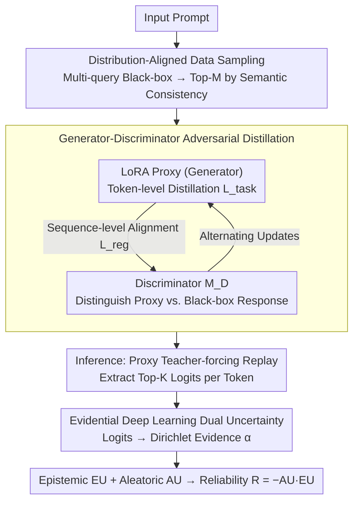

# Estimating the Black-box LLM Uncertainty with Distribution-Aligned Adversarial Distillation

**Conference**: ACL 2026  
**arXiv**: [2605.05777](https://arxiv.org/abs/2605.05777)  
**Code**: https://github.com/huizi-Cui/DisAAD  
**Area**: LLM Calibration / Uncertainty / Black-box Models / Distillation  
**Keywords**: Black-box Uncertainty, Adversarial Distillation, Proxy Model, Evidential Deep Learning, Hallucination Detection

## TL;DR
DisAAD is proposed: a small proxy model (only 1% of the target model's size) learns whether a "black-box LLM knows the answer" through "distribution alignment + adversarial distillation." By leveraging Evidential Deep Learning (EDL) to decompose proxy logits into epistemic and aleatoric uncertainty, real-time uncertainty for closed-source models like GPT-4/Claude can be estimated with a single response. This achieves an average AUROC improvement of 18.2% and AUPR improvement of 22.9% over black-box baselines.

## Background & Motivation

**Background**: Although LLMs have made rapid progress in complex reasoning and generation, hallucinations remains the biggest obstacle to deployment. Uncertainty Quantification (UQ) is the core mechanism for models to "show weakness" when unreliable. Mainstream approaches include: (1) self-evaluation, where models evaluate themselves (requires fine-tuning and lacks reliability); (2) multi-sample consistency (Semantic Entropy / EigV / CoCoA / SAR); (3) single-sample methods that directly access token probabilities, logits, or hidden states (LogTokU / CCP / Focus).

**Limitations of Prior Work**: (1) Multi-sample methods require multiple inferences for the same prompt, leading to high deployment costs and latency, and they fail when the model is "consistently wrong"; (2) Single-sample methods require access to internal logits or hidden states, which is **completely inapplicable to commercial closed-source models like GPT-4 / Claude** that only expose APIs; (3) Self-evaluation has poor accuracy, and larger, more instructive LLMs (especially commercial ones) tend to "pretend to be confident," providing plausible-sounding wrong answers, making hallucinations harder to detect than in smaller models.

**Key Challenge**: Commercial black-box LLMs are the main force in real-world deployment. They provide zero exposure to internal states and tend toward overconfidence. Existing single-sample UQ requires internal logits and assumes well-calibrated models, neither of which holds true for these systems.

**Goal**: (1) Estimate real-time uncertainty with a single response without accessing internal states or repeated sampling; (2) Use a small proxy model to "expose" uncertainty signals on behalf of the black-box model; (3) Decompose uncertainty into epistemic (knowledge gap) and aleatoric (data noise) dimensions using EDL.

**Key Insight**: The authors cite findings from Zhou 2024 / Steyvers 2025 stating that smaller LLMs more frequently refuse to answer difficult questions and are better calibrated. Since using a small model to measure a large model's uncertainty might be more reliable than self-evaluation, the key is to precisely align the proxy's output distribution with the black-box's high-probability regions.

**Core Idea**: Train a LoRA-based small proxy via adversarial distillation (generator + discriminator) to learn "what the black-box model answers" in the prompt space. Then, use the proxy's exposed logits to derive AU+EU via evidential learning.

## Method

### Overall Architecture

DisAAD addresses the problem of real-time uncertainty estimation for black-box models like GPT-4 / Claude. Its core logic is: since internal logits are inaccessible, train a proxy model (1% the size) to precisely mimic "what the black-box would answer," and let this fully transparent proxy expose logits instead. The process consists of two stages: first, align the LoRA proxy with the black-box's high-probability regions using "distribution-aligned sampling + adversarial distillation." During inference, the proxy performs teacher-forcing to "replay" the actual response from the target model, deriving epistemic (EU) and aleatoric (AU) uncertainty from token-level logits via EDL. This provides a real-time estimate from a single response.

### Key Designs

**1. Distribution-Aligned Data Sampling: Directing distillation data to the black-box's true high-probability regions.**

The true output distribution of black-box models is long-tailed. Including all sampled responses in the distillation set for a prompt would allow long-tail noise to dilute training signals. This method queries the black-box $\mathcal{M}_B$ multiple times for each prompt $\bm{x}^{(i)}$, ranks responses by mutual semantic consistency, and keeps only the Top-$M$ as representatives of the high-probability mass. The distillation pairs $\{(\bm{x}^{(i)}, \bm{y}_B^{(i,j)})\}$ cover both open-domain and task-specific data. This filtering ensures the proxy aligns with responses the black-box "genuinely intends" to give, saving query budget and avoiding noise.

**2. Generator-Discriminator Adversarial Distillation: Achieving token-level and sequence-level alignment.**

Pure next-token cross-entropy only aligns on a token-by-token basis, often resulting in sequence-level drift where the proxy's overall semantics deviate, causing uninformative logits during replay. DisAAD uses the proxy $\mathcal{M}_p$ with LoRA $W=W_0+BA$ as a generator and adds a discriminator $\mathcal{M}_D$. The training objective is $\min_\theta \mathcal{L}(\theta)=\mathcal{L}_{\text{task}}(\theta)+\lambda \mathcal{L}_{\text{reg}}(\theta)$. Here, $\mathcal{L}_{\text{task}}=-\frac{1}{NM}\sum_{i,j}\sum_t \log P_\theta(y_t\mid y_{<t})$ is standard distillation, and $\mathcal{L}_{\text{reg}}=-\frac{1}{NM}\sum_{i,j}\log\mathcal{M}_D(\bm{x}^{(i)}, \bm{y}_P^{(i,j)}; \phi)$ encourages the proxy to fool the discriminator. The discriminator minimizes $\mathcal{L}_D(\phi)$ to separate proxy outputs from black-box responses. This alternating update forces sequence-level alignment, ensuring the proxy's logit distribution captures the discriminative power needed for UQ.

**3. Dual Uncertainty from Evidential Deep Learning: Decomposing logits into interpretable dimensions.**

Softmax normalization discards absolute evidence scales, making it impossible to distinguish "low-evidence confidence" from "high-evidence confidence." DisAAD takes top-K logits during teacher-forcing replay and converts them to Dirichlet evidence $\alpha_k=\text{ReLU}(\bm{z}_{t,k})$, with $\alpha_0=\sum_k \alpha_k$. Aleatoric uncertainty $\text{AU}(u_t)=-\sum_k \frac{\alpha_k}{\alpha_0}(\psi(\alpha_k+1)-\psi(\alpha_0+1))$ reflects distribution sharpness, while epistemic uncertainty $\text{EU}(u_t)=\frac{K}{\sum_k(\alpha_k+1)}$ reflects total evidence strength. Total reliability is $R(u_t)=-\text{AU}(u_t)\cdot\text{EU}(u_t)$. This decoupling identifies overconfidence; for example, a wrong answer "France" might show High EU + Low AU (knowledge gap + consistent bias), whereas "America" shows Low EU + Low AU (certain and unique).

### Loss & Training

The joint loss $\mathcal{L}(\theta)=\mathcal{L}_{\text{task}}+\lambda\mathcal{L}_{\text{reg}}$ and the discriminator loss $\mathcal{L}_D(\phi)$ are minimized alternatively. LoRA rank $r\ll d$. Distillation data is sampled from dialogue and task sets, using Top-$M$ consistent responses per prompt. During inference, top-K logits are used to calculate Dirichlet parameters.

## Key Experimental Results

### Main Results

Compared to black-box baselines across QA and hallucination detection tasks:

| Setup | DisAAD Gain vs. Strongest Black-box Baseline (Avg) |
|------|----------------------------------------|
| AUROC | **+18.2%** |
| AUPR | **+22.9%** |
| Proxy Model Size | **1%** of Target LLM |
| Sample Count | **1** (Single response) |

Comparison in black-box hallucination detection / reliability prediction:

| Method | Internal Access | Multi-sample | AUROC (Rel.) | Notes |
|------|----------|-----------|-------------|------|
| Self-evaluation (Kadavath 2022) | No | No | Baseline | LLM Self-assessment |
| Semantic Entropy (Farquhar 2024) | No | Yes | > Self-eval | Entropy of multi-samples |
| EigV (Lin 2023) | No | Yes | Similar to SE | Graph-based |
| LogTokU (Ma 2025) | **Yes** | No | Strongest White-box | Not for GPT-4/Claude |
| Focus / CCP | **Yes** | No | Strong | Not for black-box |
| **DisAAD (Ours)** | **No** | **No** | **+18.2% over SOTA** | Single response, 1% size |

### Ablation Study

| Configuration | Key Effect | Interpretation |
|------|---------|------|
| Full DisAAD (Adv + AU+EU) | Best AUROC / AUPR | Complete model |
| w/o discriminator (Only $\mathcal{L}_{\text{task}}$) | Significant AUROC drop | Missing sequence alignment; uncalibrated logits |
| w/o distribution-aligned sampling | Performance drop | Long-tail noise contaminates high-prob mass |
| Only AU / Only EU | Both worse than $R=-\text{AU}\cdot\text{EU}$ | Dual uncertainties are complementary |
| Proxy size 1% → 0.1% | Further performance drop | Proxy too small to absorb distribution |
| Proxy size 1% → 10% | Minimal gain | 1% is near the efficiency inflection point |

### Key Findings
- Achieving an 18.2% AUROC boost with a 1% size proxy and a single response challenges the notion that black-box UQ requires multi-sampling. This suggests that precision in distribution alignment is more valuable than sample count.
- The adversarial discriminator is essential: without it, logit calibration collapses, showing that next-token loss biases are fatal for UQ at the sequence level.
- AU and EU provide orthogonal signals: High AU + Low EU = "Ambiguous but consistent"; Low AU + High EU = "Wrong answer with high confidence (knowledge gap)." Their product $R$ distinguishes overconfidence from genuine certainty.
- Distribution-aligned sampling (Top-$M$ consistency) significantly outperforms random sampling, confirming that data quality in the high-probability region is more critical than raw volume.

## Highlights & Insights
- Using a small proxy to expose logits for a black-box model is an elegant cognitive inversion. It converts the fundamental barrier of "no internal access" into a proxy task of "finding an equivalent accessible distribution," making white-box UQ techniques applicable to commercial APIs.
- The combination of adversarial alignment and token loss provides sequence-level constraints and a natural termination signal (when indistinguishable), avoiding manual stopping rules.
- The AU vs. EU decomposition maps directly to "Ambiguity" vs. "Knowledge Gap," offering actionable value for RAG or Self-Refine systems (e.g., retrieve info when EU is high).
- The 1% proxy size suggests that even as black-box models scale, the cost of UQ remains relatively constant, which is significant for production deployment.

## Limitations & Future Work
- The distillation phase requires multiple black-box API queries, creating a one-time data collection cost, particularly for niche domains or long prompts.
- The proxy aligns with the black-box's common responses under a specific distribution; reliability for out-of-distribution (OOD) inputs has not been fully verified.
- The ReLU + top-K conversion involves several hyperparameters (K, Dirichlet smoothing constants) whose transferability across different black-box models may require tuning.
- There is no discussion on whether the proxy needs retraining when the target model is updated (e.g., GPT-4 to GPT-4 Turbo).

## Related Work & Insights
- **vs. Multi-sample (Semantic Entropy, etc.)**: These require multiple queries, raising latency and cost. DisAAD uses a single response and identifies consistent errors where multi-sampling fails.
- **vs. White-box Single-sample (LogTokU, etc.)**: These require internal logits. DisAAD "transfers" these signals to a proxy, making white-box techniques indirectly applicable to closed-source models.
- **vs. Self-evaluation**: Self-evaluation is unreliable as instruction-tuned models often overestimate themselves. DisAAD uses an objective proxy score to bypass overconfidence bias.
- **vs. LogTokU**: Borrows the mathematical framework of logits-as-evidence but decouples it from the target model's own logits to a proxy model's logits.

## Rating
- Novelty: ⭐⭐⭐⭐ Combines UQ with adversarial distillation and evidential learning to fill the gap in real-time black-box UQ.
- Experimental Thoroughness: ⭐⭐⭐⭐ Multiple tasks, black-box models, and baselines; includes theoretical analysis in the appendix.
- Writing Quality: ⭐⭐⭐⭐ Clear motivation and intuitive frameworks (Figures 1 and 2).
- Value: ⭐⭐⭐⭐⭐ High engineering value for enabling real-time UQ for commercial LLMs like GPT-4/Claude.

<!-- RELATED:START -->

## Related Papers

- [\[ACL 2026\] ToxiTrace: Gradient-Aligned Training for Explainable Chinese Toxicity Detection](toxitrace_gradient-aligned_training_for_explainable_chinese_toxicity_detection.md)
- [\[ACL 2026\] Prompt-Level Distillation: A Non-Parametric Alternative to Model Fine-Tuning for Efficient Reasoning](prompt-level_distillation_a_non-parametric_alternative_to_model_fine-tuning_for_.md)
- [\[ICML 2026\] IDO: Incongruity-Aware Distribution Optimization for Multimodal Fake News Detection](../../ICML2026/social_computing/ido_incongruity-aware_distribution_optimization_for_multimodal_fake_news_detecti.md)
- [\[ICML 2025\] Learning Survival Distributions with the Asymmetric Laplace Distribution](../../ICML2025/social_computing/learning_survival_distributions_with_the_asymmetric_laplace_distribution.md)
- [\[ACL 2026\] Beyond the Crowd: LLM-Augmented Community Notes for Governing Health Misinformation](beyond_the_crowd_llm-augmented_community_notes_for_governing_health_misinformati.md)

<!-- RELATED:END -->
