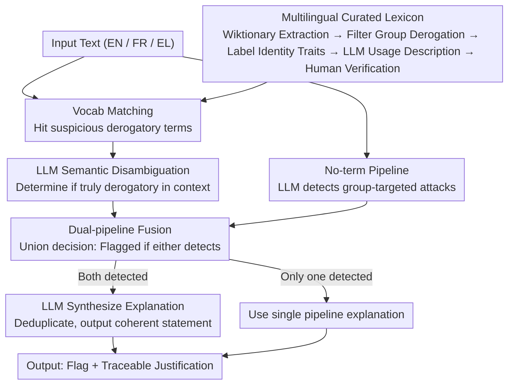

# Explain the Flag: Contextualizing Hate Speech Beyond Censorship

**Conference**: ACL 2026 Findings  
**arXiv**: [2604.14970](https://arxiv.org/abs/2604.14970)  
**Code**: [GitHub](https://github.com/ails-lab/detoex)  
**Area**: Social Computing / Hate Speech  
**Keywords**: Hate speech detection, explainability, multilingual vocabulary, contextualized explanation, hybrid systems

## TL;DR
This paper proposes a hybrid approach combining LLMs with manually curated vocabularies in three languages (English, French, and Greek) to detect and explain hate speech. The "term pipeline" identifies inherently derogatory terms through vocabulary matching and LLM semantic disambiguation, while the "no-term pipeline" employs LLMs to detect group-targeted content; both are integrated to generate evidence-based explanations.

## Background & Motivation

**Background**: Automated hate speech detection systems are widely used for moderation on online platforms, yet most focus on censorship or removal, lacking transparency and explainability—users are flagged without knowing the specific reasons.

**Limitations of Prior Work**: (1) Pure removal lacks transparency, hindering users' understanding of why their language is harmful; (2) moderation decisions may appear arbitrary or biased; (3) hate speech manifests in two forms—inherently derogatory terms (e.g., slurs) and group-targeted content (harmful even without insults)—requiring different detection strategies; (4) low-resource languages (e.g., Greek) lack sufficient resources.

**Key Challenge**: Moderation needs to balance "blocking harmful content" with "explaining the harm"—pure LLM approaches lack stable knowledge of specific terms, while pure lexical approaches lack contextual understanding.

**Goal**: To build a hybrid system capable of detecting and explaining hate speech across English, French, and Greek.

**Key Insight**: A dual-pipeline design where the term pipeline utilizes curated vocabularies for precise matching and LLM-based disambiguation, while the no-term pipeline uses LLMs for context-aware detection of group-targeted attacks.

**Core Idea**: Curated vocabularies (semantic definitions + identity trait labeling) + LLM contextual reasoning $\rightarrow$ evidence-based explanations.

## Method

### Overall Architecture
The system aims to "flag and explain" rather than "flag and delete," covering English, French, and Greek. It bifurcates hate speech into two forms: inherently derogatory terms are processed via the **term pipeline** (matching suspicious terms in a lexicon, followed by LLM-based contextual disambiguation), and content attacking groups without insults is processed via the **no-term pipeline** (LLM detection of identity-based attacks). Results from both pipelines are merged: content is flagged if either pipeline detects harm; if both detect harm, the LLMs synthesize the two explanations into a coherent statement.

### Key Designs

**1. Multilingual Curated Lexicon: Filling LLM Knowledge Gaps in Rare and Culturally Specific Derogatory Terms**

LLMs are familiar with common insults but often lack knowledge of rare or culturally specific derogatory terms (especially in low-resource languages like Greek), leading to omissions. This work constructs a three-language lexicon as an external knowledge base, extracting terms with "derogatory/offensive/vulgarities" tags from Wiktionary. The collection underwent a five-step refinement: initial collection (11,310 EN / 3,749 FR / 965 EL) $\rightarrow$ filtering for group-targeted derogatory terms $\rightarrow$ classification of targeted identity traits $\rightarrow$ LLM generation of descriptions covering both controversial and non-controversial usage $\rightarrow$ human verification. The final results include 3,904 EN, 1,644 FR, and 288 EL entries. Crucially, each entry includes "semantic definitions + identity trait labeling," providing the basis for disambiguation and explanation.

**2. LLM Semantic Disambiguation: Distinguishing "Lexical Match" from "Actual Malice"**

Many derogatory terms are polysemous; simple string matching results in many false positives. The term pipeline proceeds beyond matching: once a term is hit, the source text and the lexicon's semantic description (including controversial and non-controversial usages) are passed to the LLM. The LLM then determines if the term is used derogatorily and provides an explanation. This handles polysemy (e.g., "bitch" as a female dog vs. an insult) and reclaimed language (terms used by the target group that do not constitute an attack), upgrading from "existence in a list" to "intent in context."

**3. Fusion and Explanation Generation: Synthesizing Complementary Paths into Traceable Accounts**

The two pipelines have distinct blind spots—the term pipeline excels at catching derogatory terms but misses group attacks without insults, while the no-term pipeline excels at contextual attacks but may miss rare terms. Detection is based on the union of both: content is safe only if both pipelines agree. If one detects harm, its explanation is used; if both detect harm, the LLM merges the explanations to remove redundancy and provide a unified account. This ensures the output is always a "flag + traceable reason" rather than an isolated label.

### Loss & Training
The hybrid system does not involve training. Claude Sonnet 3.7 is used as the primary LLM, with Llama series as lightweight open-source alternatives.

## Key Experimental Results

### Main Results

| Language | Model | Precision | Recall | F1 (Safe) |
|----------|-------|-----------|--------|-----------|
| English  | Claude (Hybrid) | 0.92 | 0.89 | 0.90 |
| English  | Llama (Hybrid) | 0.82 | 0.82 | 0.82 |
| French   | Claude (Hybrid) | 0.96 | 0.91 | 0.93 |
| Greek    | Claude (Hybrid) | - | - | Above baseline |

### Ablation Study

| Config | Key Metric | Description |
|--------|------------|-------------|
| No-term Only (LLM-only) | Lower | Misses rare/culturally specific terms |
| Term-pipeline Only | Lower | Misses group attacks without insults |
| Hybrid System | Optimal | Pipelines are complementary |

### Key Findings
- The hybrid system consistently outperforms pure LLM baselines, proving that curated lexicons enhance LLM performance.
- Human evaluation indicates high explanation quality—users can understand why content was flagged.
- Claude significantly outperforms the Llama series, though Llama remains practical for low-resource deployment (single GPU).
- The lexicon provides particularly significant gains for Greek, a low-resource language.

## Highlights & Insights
- The shift from **censorship to explanation** offers significant social value—explaining harm is more effective at promoting user understanding and behavioral change than simple deletion.
- The hybrid pattern of "Curated Lexicon + LLM" is a generalizable paradigm applicable to any task requiring "precise domain knowledge + contextual understanding."
- The methodology for building multilingual lexicons (Wiktionary + LLM filtering + human verification) serves as a reusable resource construction workflow.

## Limitations & Future Work
- Lexicons require continuous maintenance to cover emerging derogatory terms.
- Evaluation was limited to tweets (short text); performance may vary in long-form content.
- Handling reclaimed language (e.g., terms reclaimed by the LGBTQ community) remains challenging without user identity information.
- Automated evaluation metrics for explanations are limited, necessitating heavy reliance on human assessment.

## Related Work & Insights
- **vs. Pure LLM Detection**: Lacks stable knowledge of specific terms and may miss rare insults.
- **vs. Pure Lexical Methods**: Lacks contextual understanding, leading to high false-positive rates.
- **vs. Menis Mastromichalakis et al. (2025)**: While they explore explainable hate speech, they do not utilize multilingual lexicons.

## Rating
- Novelty: ⭐⭐⭐ The hybrid approach is not entirely new, but the multilingual lexicon is a valuable resource contribution.
- Experimental Thoroughness: ⭐⭐⭐⭐ Coverage of three languages, human assessment of both detection and explanation, and multi-model comparisons.
- Writing Quality: ⭐⭐⭐⭐ Clear structure with strong social motivation.

<!-- RELATED:START -->

## Related Papers

- [\[ACL 2026\] RV-HATE: Reinforced Multi-Module Voting for Implicit Hate Speech Detection](rv-hate_reinforced_multi-module_voting_for_implicit_hate_speech_detection.md)
- [\[ACL 2026\] Confident, Calibrated, or Complicit: Safety Alignment and Ideological Bias in LLM Hate Speech Detection](confident_calibrated_or_complicit_safety_alignment_and_ideological_bias_in_llm_h.md)
- [\[ACL 2025\] ImpliHateVid: Implicit Hate Speech Detection in Videos](../../ACL2025/social_computing/implihatevid_video_hate.md)
- [\[ACL 2025\] Silencing Empowerment, Allowing Bigotry: Auditing the Moderation of Hate Speech on Twitch](../../ACL2025/social_computing/silencing_empowerment_allowing_bigotry_auditing_the_moderation_of_hate_speech_on.md)
- [\[ACL 2025\] HateDay: Insights from a Global Hate Speech Dataset Representative of a Day on Twitter](../../ACL2025/social_computing/hateday_global_hate_speech.md)

<!-- RELATED:END -->
