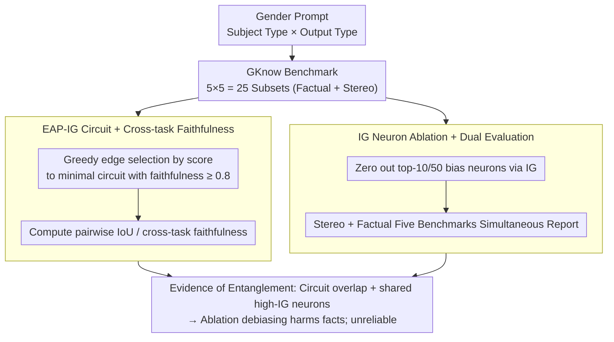

# GKnow: Measuring the Entanglement of Gender Bias and Factual Gender

**Conference**: ACL 2026  
**arXiv**: [2605.12299](https://arxiv.org/abs/2605.12299)  
**Code**: https://github.com/leonorv/gknow  
**Area**: Fairness / Gender Bias / Mechanistic Interpretability  
**Keywords**: Gender Bias, Factual Gender, Circuit Analysis, Neuron Ablation, EAP-IG

## TL;DR
This paper introduces the **GKnow** benchmark and a suite of circuit-neuron dual-level mechanistic analyses. It demonstrates that "stereotypical gender" and "factual gender" in LLMs exhibit significantly overlapping IoU and high cross-task faithfulness at the circuit level, while sharing the same high-IG neurons at the neuron level. Consequently, simple "ablation of bias neurons" simultaneously weakens factual gender capabilities. While this appears as "successful debiasing" on bias-only benchmarks, it warns that such debiasing is unreliable.

## Background & Motivation

**Background**: The mechanistic interpretability (MI) community has recently employed tools such as causal mediation, edge attribution patching, and neuron attribution to locate internal components of "gender bias," using the "ablation of the most relevant bias neurons" as a lightweight debiasing method (Liu et al. 2024, Yu & Ananiadou 2025, etc.). This approach is gaining popularity as it does not rely on expensive data or fine-tuning.

**Limitations of Prior Work**: Existing gender MI work (i) mostly focuses on single tasks (most commonly "pronoun prediction"), and (ii) fails to distinguish between "factual gender" (semantic gender like woman→she, brother→he) and "stereotypical gender" (nurse→she, pilot→he). This leads to a hidden side effect—ablating "bias neurons" damages the model's ability to recognize *factual gender*, a performance drop that remains invisible on standard single-bias benchmarks.

**Key Challenge**: Bias signals and factual gender signals are likely entangled in model representations, yet the community lacks systematic evidence at the circuit level. Furthermore, there is a lack of fine-grained benchmarks that simultaneously cover "factual/stereotypical × different gender prediction types."

**Goal**: (1) Build GKnow, a fine-grained English gender benchmark organized by "subject type × output type"; (2) Quantify whether factual vs stereotypical circuits overlap using EAP-IG; (3) Verify whether ablating bias neurons truly debiases without harming factual capabilities through IG neuron ablation.

**Key Insight**: The authors argue that if entanglement is shown to be significant at the circuit or neuron scale, the "success" seen in ablation-based debiasing on benchmarks that do not evaluate factual gender is an illusion—"good results" on StereoSet may be accompanied by the collapse of factual gender capabilities.

**Core Idea**: Transform "entanglement" into a measurable quantity (cross-task circuit faithfulness + shared high-IG neurons + dual factual vs. stereo ablation) and evaluate both aspects together using the unified GKnow benchmark.

## Method

### Overall Architecture
The study addresses whether "stereotypical gender" and "factual gender" share the same internal mechanism in LLMs—if so, ablating bias neurons will inevitably degrade factual capabilities. It constructs GKnow, a fine-grained benchmark with 25 subsets cross-mapped by "subject type × output type," and validates entanglement at two scales. At the circuit level, it extracts minimal faithful circuits using EAP-IG and measures "cross-task faithfulness" to see if one task's circuit can solve another. At the neuron level, it identifies bias neurons using Integrated Gradients, zeros them out, and reports metrics across both bias and factual benchmarks. All experiments are conducted on Llama-3.1-8B and Olmo-7B without weight updates.

### Key Designs

**1. GKnow: A fine-grained gender benchmark on dual axes of subject × output, forcing "dual reporting" for any debiasing method**

Existing gender benchmarks either only measure pronoun prediction or only look at stereotypes, thus failing to answer how much factual gender knowledge is removed by ablation. GKnow addresses this by categorizing a prompt's "subject" and "expected output" into 5 types of gender expression (pronoun / gender word / gendered name / lexically gendered noun / stereotypically gendered noun). Their cross-product yields 25 subsets, finely slicing the semantic source of the "subject-output" relationship. The combination of factual (blue) and stereo (red) cells allows the same subset to be tested as either a stereotypical or factual task—e.g., `pronoun_prediction_based_on_stereo` is "The nurse is nice, isn't [she]". With 91,490 examples (6,294 train + 698 test used in experiments), GKnow systematically aligns factual/stereotypical tasks across types for the first time.

**2. EAP-IG Circuit + cross-task faithfulness: Quantifying whether the "stereo circuit" and "factual circuit" are the same subgraph**

To prove entanglement beyond neuron overlap, the authors provide evidence at the circuit level. They use EAP-IG (edge attribution patching with integrated gradients) to score each edge $(u,v)$ in the computational graph:

$$(z'_u - z_u)\cdot \frac{1}{m}\sum_{k=1}^{m}\frac{\partial L(z' + \frac{k}{m}(z-z'))}{\partial z_v}$$

where $z, z'$ are clean / corrupted activations and $m=5$. For each GKnow subset, edges are greedily accumulated until the faithfulness $\geq 0.8$, yielding minimal faithful circuits. They then compute the Jaccard IoU and cross-task faithfulness (embedding the circuit of task A into task B to measure recovery). While IoU might miss functional equivalence, cross-task faithfulness directly measures functional interchangeability, aligning closer to the definition of entanglement. The strongest evidence shows that the `gender_prediction_based_on_stereo` circuit achieves 1.0 faithfulness on `gender_prediction_based_on_pronoun`.

**3. Dual factual vs. stereo evaluation for IG neuron ablation: Placing "debiasing success" and "factual harm" on the same scale**

Previous neuron ablation works only reported positive indicators on stereo benchmarks (e.g., increase in $\%opp$). This study selects top-10/50 neurons via IG on the `gender_prediction_based_on_stereo` training set, zeros them, and **synchronously** measures metrics across GKnow Stereo, GKnow Factual, StereoSet, DiFair Neutral, and DiFair Specific. By forcing simultaneous reporting on factual benchmarks, the truth—that "success" on bias sets often comes with factual collapse—is exposed.

### Loss & Training
The method does not update model weights; no training loss is involved. Neuron localization uses standard IG implementation ($m$ steps). Ablation involves zeroing out corresponding FFN hidden neuron activations. Circuits are selected greedily via EAP-IG on counterfactual prompts. Significance is measured via paired $t$ tests ($p<0.05$).

## Key Experimental Results

### Main Results (Llama-3.1-8B Neuron Ablation)

| Dataset | $P_{exp}$ (N=0) | $P_{exp}$ (N=50) | $\Delta_{f,m}$ (N=0) | $\Delta_{f,m}$ (N=50) | Conclusion |
|--------|-----------------|------------------|----------------------|------------------------|------|
| GKnow Stereo | 67.66 | 47.03 (↓20.64) | 21.81 | 7.45 (↓14.36) | "Debiasing" looks effective |
| **GKnow Factual** | 91.49 | 79.86 (↓11.63) | 43.77 | 18.03 (↓25.76) | Factual ability significantly degrades |
| StereoSet | 65.26 | 62.60 (↓2.66) | — | — | Bias benchmark looks slightly improved |
| DiFair Neutral | — | — | 6.48 | 2.23 (↓4.25) | Neutral gender prediction confidence plunges |
| **DiFair Specific** | — | — | 45.57 | 15.30 (↓30.26) | Sentences with explicit gender cues collapse |

Trends for Olmo-7B are consistent: GKnow Factual $P_{exp}$ dropped from 90.07→82.80 (−7.27), and $\Delta_{f,m}$ dropped from 40.01→23.37 (−16.64).

### Ablation Study (Circuit cross-task faithfulness)

| Setting | Key Metrics | Description |
|------|----------|------|
| Within same prediction type | avg faithfulness 77.2 (gender→gender) | Circuits are highly interchangeable within task types |
| Across prediction types | avg 72.9 (gender→pronoun) | Over 72% recovery across tasks, strong circuit overlap |
| `stereo` → `pronoun` prediction | **faithfulness = 1.0** | Stereo circuit can fully solve factual tasks |
| `based_on_lex` → `based_on_stereo` | High faithfulness | Lexical circuit has strongest universality for stereo subsets |
| `based_on_name` circuit | Lowest recovery | Name-based circuits are the most specialized/less interchangeable |

Circuit IoU between stereo/factual subsets also maintained high Jaccard scores, consistent with faithfulness results.

### Key Findings
- **Entanglement extends from circuits to neurons**: High circuit IoU and cross-task faithfulness are mirrored at the neuron level, where high-IG neurons are shared. (Table 4 identifies Olmo L31N8077 as explaining gender across tasks, with tokens such as `she/her/woman`).
- **The "False Success" of Debiasing**: Improvements in $\%opp$ on StereoSet/GKnow Stereo would typically be interpreted as successful debiasing, but the collapse of $\Delta$ from 45.57 to 15.30 in DiFair Specific (factual) remains unseen without dual reporting.
- **$P_{other}$ increases reveal "decontextualization"**: At N=50, the $\%other$ for GKnow Stereo jumps from 0 to 30%, suggesting ablation does not switch "he" to "she," but pushes the model toward neutral/irrelevant tokens, damaging linguistic capability.
- **Architectural differences in gender paths**: Llama relies more on attention-centric connections in middle layers, while Olmo utilizes more MLP-to-MLP connections, showing architectural variance in concept representation.
- **`based_on_lex` circuits are most universal**: Because lexical subjects (family/occupation) are diverse, their circuits show high transferability, suggesting they are the best candidates for "universal gender probes."

## Highlights & Insights
- **The dual-axis benchmark design** is a simple but powerful research tool: by combining 5×5 subsets, it naturally enforces a "dual reporting" evaluation protocol for debiasing.
- **First use of EAP-IG to prove entanglement**: Unlike previous works using circuits to understand "how models succeed," this work uses cross-task faithfulness as quantitative evidence of whether two functions share the same circuit.
- **A critique of the "neuron ablation debiasing" school**: While prior works reported positive results on StereoSet, this study proves those results are illusions caused by an evaluation gap.
- **Logit-lens verification of interpretability**: The evidence that the same neurons represent gender while simultaneously influencing both lexical and pronoun tasks provides strong support for the superposition hypothesis.

## Limitations & Future Work
- **English and binary gender only**: Does not address grammatical gender languages (e.g., German/Spanish) or non-binary pronouns, which the authors acknowledge may exacerbate the invisibility of non-binary identities.
- **Model size (7B/8B)**: The degree of entanglement in larger models or different architectures (e.g., MoE) remains unknown.
- **Stereotype scope**: Limited to occupation and adjective stereotypes; religious or racial intersectional gender bias was not covered.
- **Ablation method**: Only zero-ablation was tested; more complex schemes like mean ablation or SAE feature ablation were not compared.

## Related Work & Insights
- **vs. DiFair (Zakizadeh et al. 2023)**: DiFair first disentangled bias/knowledge using Wikipedia/Reddit sentences; GKnow provides a template-based controlled version with 5×5 subsets better suited for mechanistic analysis.
- **vs. Liu et al. 2024 / Yu & Ananiadou 2025**: These works used attribution to ablate neurons and reported gains on StereoSet; this study replicates their setup but adds factual evaluation to prove the trade-off.
- **vs. Bolukbasi et al. 2016 / Limisiewicz & Mareček 2022**: Earlier efforts tried to "preserve factual knowledge while debiasing"; this work explains mechanistically why it is difficult—circuits are inherently entangled.

## Rating
- **Novelty**: ⭐⭐⭐⭐ Quantitative dual-layer evidence for entanglement; effective dual-axis benchmark design.
- **Experimental Thoroughness**: ⭐⭐⭐⭐ Multiple models, benchmarks, and metrics with logit-lens analysis; lacks comparison with MoE or larger scales.
- **Writing Quality**: ⭐⭐⭐⭐ Clear conceptual distinctions; Tables 1-3 provide excellent summaries.
- **Value**: ⭐⭐⭐⭐⭐ Directly challenges a popular debiasing paradigm and provides reusable evaluation standards for future work.

<!-- RELATED:START -->

## Related Papers

- [\[ACL 2026\] SPAGBias: Uncovering and Tracing Structured Spatial Gender Bias in Large Language Models](spagbias_uncovering_and_tracing_structured_spatial_gender_bias_in_large_language.md)
- [\[ACL 2025\] GG-BBQ: German Gender Bias Benchmark for Question Answering](../../ACL2025/social_computing/gg-bbq_german_gender_bias_benchmark_for_question_answering.md)
- [\[ACL 2025\] taz2024full: Analysing German Newspapers for Gender Bias and Discrimination across Decades](../../ACL2025/social_computing/taz2024full_analysing_german_newspapers_for_gender_bias_and_discrimination_acros.md)
- [\[ACL 2025\] Exploring Gender Bias in Large Language Models: An In-depth Dive into the German Language](../../ACL2025/social_computing/exploring_gender_bias_in_large_language_models_an_in-depth_dive_into_the_german_.md)
- [\[ACL 2025\] Translate With Care: Addressing Gender Bias, Neutrality, and Reasoning in Large Language Model Translations](../../ACL2025/social_computing/translate_with_care_addressing_gender_bias_neutrality_and_reasoning_in_large_lan.md)

<!-- RELATED:END -->
