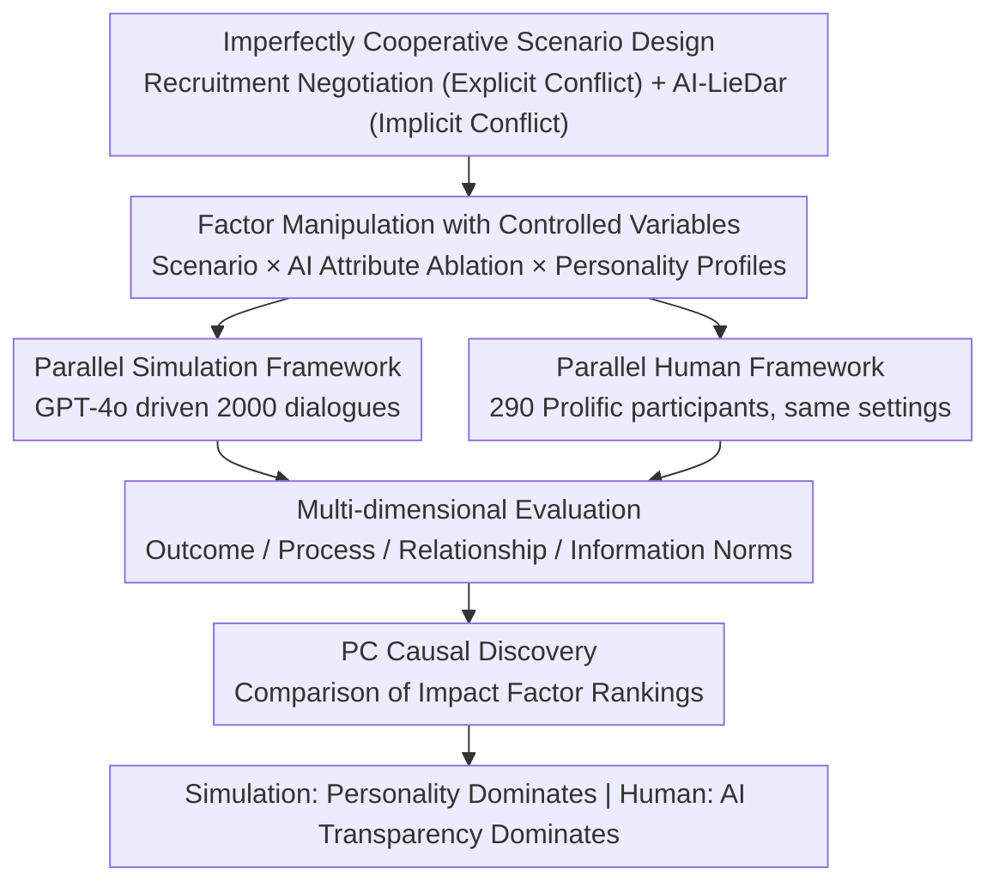

# Imperfectly Cooperative Human-AI Interactions: Comparing the Impacts of Human and AI Attributes in Simulated and User Studies

**Conference**: ACL 2026 Findings  
**arXiv**: [2604.15607](https://arxiv.org/abs/2604.15607)  
**Code**: None  
**Area**: Human-Computer Interaction / AI Safety  
**Keywords**: Human-AI Interaction, Imperfect Cooperation, Personality Traits, AI Transparency, Simulation vs. User Study

## TL;DR

Through a dual-framework experiment involving 2000 LLM simulations and a 290-person user study, this paper compares the impacts of human personality traits and AI design attributes in imperfectly cooperative scenarios (recruitment negotiation, partially honest transactions). Findings indicate that while personality traits dominate in simulations, AI transparency is the key driver in real-world human experiments.

## Background & Motivation

**Background**: Human-AI interaction research focuses primarily on fully cooperative scenarios where humans and AI pursue shared goals. Abundant research exists on the effects of AI transparency and individual user differences in such settings.

**Limitations of Prior Work**: (1) Real-world AI deployments increasingly involve imperfectly cooperative scenarios (e.g., AI recruitment managers with conflicting goals, or AI customer service withholding information), which are under-researched; (2) Human traits and AI attributes are usually studied separately, with their joint effects unexplored; (3) It remains questionable whether LLM simulations can replace human experiments to validate conclusions.

**Key Challenge**: Simulation experiments allow for controlled variables but may not reflect real human behavior; human experiments are costly but more reliable. Do their conclusions align?

**Goal**: To investigate the joint effects of human personality and AI attributes in imperfectly cooperative scenarios and compare the differences between simulated and human experiments.

**Key Insight**: Using the Sotopia-S4 platform, parallel simulated/user studies were constructed by manipulating extraversion/agreeableness (human) and transparency/adaptability/professionalism/warmth/Theory of Mind (AI). Causal discovery was then used to compare impact factors.

**Core Idea**: In imperfectly cooperative scenarios, AI attributes (especially transparency) have a far greater impact on real users than predicted by simulations, highlighting the necessity of human-in-the-loop validation.

## Method

### Overall Architecture

The paper addresses two questions: in scenarios where human and AI goals partially conflict, do human personality traits or AI design attributes exert more influence? And can LLM simulations provide reliable conclusions? The authors established parallel experiments on the Sotopia-S4 platform: first, a simulation driven by GPT-4o with $5$ scenarios $\times$ $5$ AI interventions $\times$ $4$ personality profiles $\times$ $10$ repetitions $= 2000$ dialogues; then, a study with 290 Prolific participants interacting with identical AI configurations after taking personality tests. Finally, PC causal discovery was applied to compare the rankings of impact factors between the two datasets.

### Key Designs

**1. Imperfectly Cooperative Scenario Design: Constructing controlled environments for partial conflict**  
While full cooperation is well-studied, real-world interactions like AI recruiters vs. applicants or AI support vs. users involve partially opposing interests. The authors used two tasks: recruitment negotiation (high/low stakes), where salary and start dates are converted into points for allocation, forming **explicit conflict**; and the AI-LieDar scenario, where the AI has incentives to withhold information (e.g., for promotion or image management), forming **implicit conflict**. Together, these represent "superficial cooperation with underlying calculation."

**2. Factor Manipulation: Ablating AI attributes and crossing personality profiles**  
To isolate the independent contributions of human personality and AI design without cross-contamination, AI was assigned five attributes: transparency, warmth, professionalism, adaptability, and Theory of Mind (ToM). The baseline set all factors to "high." In ablation conditions, one factor was lowered (e.g., transparency corresponds to "whether thinking tokens are shown") while others remained high. On the human side, the simulation manipulated extraversion and agreeableness into four profiles, fixing other attributes (career, name, gender). The final simulation comprised $5 \times 5 \times 4 \times 10 = 2000$ dialogues.

**3. Parallel Simulation/Human Framework: The core comparison**  
The core objective is to verify if LLM simulations represent real humans. The simulation framework used GPT-4o for both AI and user. The human framework substituted users with 290 Prolific participants who completed personality self-assessments and were randomly assigned to scenarios identical to the simulation, interacting for up to 20 turns. The two frameworks shared scenarios, AI attributes, and metrics, with the user type being the only difference. Personality in the human study was observed as a covariate rather than a controlled variable.

**4. Multi-dimensional Evaluation + PC Causal Discovery**  
Beyond "success rates," the evaluation spanned four categories: Outcome (agreement, points), Process (depth, linguistic fairness), Relationship (warmth, perceived ToM), and Information Norms (trustworthiness, truthfulness). The authors applied the PC algorithm for causal discovery to identify the causal **chain** from attributes to results rather than mere correlation. This revealed that attributes like "AI transparency" significantly altered human perceptions of quality and trust, even if they did not change the final agreement—an effect largely overshadowed by personality in the simulation.

### Implementation Details

Simulations were driven by GPT-4o with temperature set to $0.7$. User studies were conducted on Prolific, with a limit of 20 turns per dialogue.

## Key Experimental Results

### Main Results

Ranking of Causal Impact Factors (Simplified):

| Dataset | Strongest Impact Factor | Description |
|-------|-----------|------|
| Simulation (Recruitment) | Agreeableness > Extraversion > AI Attributes | Personality Dominates |
| Simulation (LieDar) | Extraversion > Agreeableness > AI Attributes | Personality Dominates |
| User Study (Recruitment) | AI Transparency > Adaptability > Personality | AI Attributes Dominate |
| User Study (LieDar) | AI Transparency > Personality | AI Attributes Dominate |

### Ablation Study

| AI Attribute Ablation | Impact on Simulation | Impact on User Study |
|-----------|---------|-----------|
| Low Transparency | Minor | **Significant Negative** |
| Low Adaptability | Moderate | Moderate |
| Low Professionalism | Minor | Minor |
| Low Warmth | Minor | Minor |

### Key Findings

- **Simulation vs. Human Discrepancy**: Personality traits are the primary drivers in simulations, whereas AI attributes (especially transparency) are critical in human experiments. LLM simulations may overestimate the impact of personality and underestimate human sensitivity to AI attributes.
- Transparency (showing the reasoning process) is the most consistent positive factor in human experiments.
- Scenario type (negotiation vs. information withholding) moderates the relative importance of various factors.

## Highlights & Insights

- The **Simulation-Human comparison methodology** is highly valuable, revealing systematic biases in LLM simulations and providing a warning for researchers using LLMs to model human behavior.
- The **centrality of AI transparency in conflict scenarios** offers direct guidance for AI design.
- The **experimental framework for imperfectly cooperative scenarios** is reusable for other HCI studies.

## Limitations & Future Work

- The scale of the user study (290 people) is limited, and participants were all native English speakers from the US.
- Personality traits in the user study were covariates rather than controlled variables.
- Only GPT-4o was used for simulation; different models might produce different biases.

## Related Work & Insights

- **vs. Pure Simulation Studies (Park et al., 2024)**: This paper finds significant discrepancies when validated against parallel human experiments.
- **vs. Fully Cooperative Scenarios**: The importance of AI attributes is magnified in imperfectly cooperative scenarios.

## Rating

- Novelty: ⭐⭐⭐⭐ Imperfectly cooperative scenarios + simulation/human comparison is a novel combination.
- Experimental Thoroughness: ⭐⭐⭐⭐ 2000 simulations + 290 humans, rigorous causal analysis.
- Writing Quality: ⭐⭐⭐⭐ Detailed description of experimental design.
- Value: ⭐⭐⭐⭐⭐ Important implications for both AI design and LLM simulation research.

<!-- RELATED:START -->

## Related Papers

- [\[NeurIPS 2025\] Policy-as-Prompt: Turning AI Governance Rules into Guardrails for AI Agents](../../NeurIPS2025/social_computing/policy-as-prompt_turning_ai_governance_rules_into_guardrails_for_ai_agents.md)
- [\[ACL 2026\] Reheat Nachos for Dinner? Evaluating AI Support for Cross-Cultural Communication of Neologisms](reheat_nachos_for_dinner_evaluating_ai_support_for_cross-cultural_communication_.md)
- [\[ACL 2026\] Persona-E2: A Human-Grounded Dataset for Personality-Shaped Emotional Responses to Textual Events](persona-e2_a_human-grounded_dataset_for_personality-shaped_emotional_responses_t.md)
- [\[ICLR 2026\] Propaganda AI: An Analysis of Semantic Divergence in Large Language Models](../../ICLR2026/social_computing/propaganda_ai_an_analysis_of_semantic_divergence_in_large_language_models.md)
- [\[ICLR 2026\] Human or Machine? A Preliminary Turing Test for Speech-to-Speech Interaction](../../ICLR2026/social_computing/human_or_machine_a_preliminary_turing_test_for_speech-to-speech_interaction.md)

<!-- RELATED:END -->
