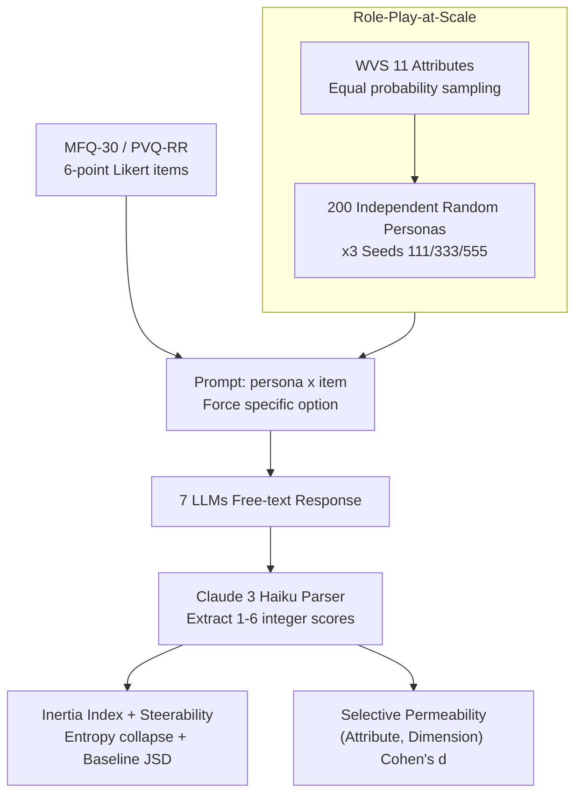

# Inertia in Moral and Value Judgments of Large Language Models

**Conference**: ACL 2026  
**arXiv**: [2408.09049](https://arxiv.org/abs/2408.09049)  
**Code**: TBD (Authors state it will be released at camera-ready)  
**Area**: LLM Alignment / Values / Safety / Evaluation  
**Keywords**: Role-Playing, Value Inertia, Steerability, Persona Injection, Moral Foundations

## TL;DR
This paper systematically measures "Value Inertia" across 7 mainstream LLMs using a "Large-scale random persona × Moral/Value questionnaire" paradigm. It finds highly stable inertia in the Harm/Fairness dimensions—where personas struggle to shift the model's response direction—and introduces two quantifiable metrics, Inertia Index and Steerability, to reveal that these preferences are unevenly distributed and aligned with safety training objectives.

## Background & Motivation

**Background**: Currently, persona injection is the most common steerable generation technique for users unable to fine-tune models—placing "You are a 70-year-old retired worker" in the prompt to elicit responses from that demographic's perspective. The research community also widely uses value questionnaires like MFQ/PVQ to probe whether LLMs can simulate diverse human moralities.

**Limitations of Prior Work**: Existing studies have found that LLM value expressions remain surprisingly stable across different prompt variants. However, these studies mostly focus on single personas or single questions, lacking systematic "large-scale random persona × multi-model × multi-dimension" measurements. Furthermore, "stability" has not been formalized into comparable scalar metrics—it remains unknown which specific dimensions are stable, to what extent, and whether this stability stems from intentional alignment or data bias.

**Key Challenge**: The design assumption of persona injection is that "the prompt determines the output distribution." However, RLHF and pretraining have essentially "welded" certain value directions inside the model, creating a tension of "surface diversity, core consistency"—if one asks the same question using a thousand personas, the answers still cluster around the same point.

**Goal**: (1) Establish a reproducible and scalable role-play-at-scale methodology; (2) Provide two quantitative metrics to locate the degree of inertia; (3) Distinguish which dimensions of high inertia are desired by alignment and which represent potential "under-representation of populations."

**Key Insight**: Persona injection is expanded from a "specific behavior trigger" into a "large-scale sampler," borrowing from clustering concepts—while individual points may fluctuate, the collective mean is highly concentrated, and that center represents the model's default orientation.

**Core Idea**: Utilize 200 random personas × multi-model × MFQ-30 + PVQ-RR, combined with the Inertia Index $I(d) = 1 - H(p_d)/\log_2 6$ and Steerability JSD, to turn "how easily an LLM is moved by a persona in different moral dimensions" into a comparable scalar.

## Method

### Overall Architecture

Input: (a) Random personas sampled with "equal probability per category" based on 11 attributes derived from the World Values Survey (WVS) (gender, age 20-80, income 1-10, parents, marital status, education, employment, occupation, ethnicity, religion, country); (b) 6-point Likert scale items from MFQ-30 (covering Harm/Fairness/Ingroup/Authority/Purity) and PVQ-RR (covering Schwartz's 10 universal value dimensions). Output: A 1-6 integer rating for each (persona, item) pair, extracted from LLM free-text by a Claude 3 Haiku parser.

Mechanism: Each persona is independently combined with each question into a prompt (no dialogue history), with a forced constraint at the end: "Your response should always point to a specific letter option." Each model runs 200 unique personas × all items; this is repeated with 3 different seeds (111/333/555) to verify results are not accidental to the persona set. A baseline without a persona serves as a reference.

Tested 7 models: Claude 3 Opus / Sonnet / Haiku, GPT-4o, GPT-3.5 Turbo, LLaMA-3 70B Inst, LLaMA-3 8B Inst.

### Key Designs

**1. Role-Play-at-Scale: Observing the model's default landing point through a dual lens of "Macro Aggregation vs. Micro Fluctuation"**

Traditional persona experiments ask "can the model play X," but observations of single personas and single questions fluctuate too much to reveal the underlying core. The authors expand persona prompting from a "specific behavior trigger" into a "large-scale sampler"—sampling $200$ independent random personas per model per questionnaire. They first look at the micro level (heatmap: persona on x-axis, items on y-axis, color as option) and then the macro level (mean and distribution for each dimension). The criterion is intuitive: if horizontal stripes appear in the heatmap, it indicates the "option is independent of the persona," meaning the model answers in the same range regardless of the identity. To rule out accidental persona sets, the authors resample $3$ sets of personas, verifying mean correlation coefficients $> 0.99$ across seeds. In other words, this design asks not "can the model obey a role," but "where does the model default to regardless of the role," which is key to locating internal bias.

**2. Inertia Index + Steerability: Quantitative scalars for cross-model and cross-dimension comparison**

Simply stating a "model is stable" prevents horizontal comparison. The authors quantify this with two complementary scalars. For each dimension $d$, let $p_d$ be the distribution of answers across all personas for items in that dimension. The Inertia Index is defined as:

$$I(d) = 1 - \frac{H(p_d)}{\log_2 6} \in [0,1]$$

where $H(p_d)$ is Shannon entropy and $\log_2 6$ is the maximum entropy for a 6-point Likert scale. A larger $I(d)$ indicates the distribution collapses into fewer options. Steerability is measured using the Jensen-Shannon divergence $\text{JSD}(p_d^{\text{base}}, p_d^{\text{persona}})$ between the baseline (no persona) and the persona-injected distribution; a smaller value indicates the persona is less able to shift that dimension. Both metrics are necessary: looking at Inertia alone might misinterpret an "inherently extreme model" as being "locked down." Steerability helps distinguish "built-in preference" from "prompt failure." The authors acknowledge the lack of a formal definition for LLM values, positioning behavioral consistency as the first step in mechanistic research.

**3. Selective Permeability Analysis: Identifying "which attributes should change which dimensions, but don't"**

Looking at dimension means or entropy alone doesn't answer whether such stability is reasonable or problematic. The authors perform conditional sampling on PVQ-RR based on attributes like religion, ethnicity, and gender, calculating the Cohen's $d$ effect size for each (attribute, dimension) pair. The results are highly discriminative: religion has a large effect on the Tradition dimension ($d=1.42$, rising from $2.48$ for non-religious to $4.32$ for Orthodox), but only $d=0.32$ for Universalism. Gender effects across all dimensions were $\leq 0.17$. A Pearson $r=0.77$ between original and randomized item orders rules out "inertia as purely item-order bias." The value of this analysis lies in splitting inertia into two types—gender shifting a Harm score would look like discrimination (shouldn't move but did), whereas religion shifting Tradition represents reasonable representation (should move)—directly informing alignment on which inertias to keep and which to fix.

### Loss & Training

This is an evaluation study and does not involve training models; all tests use black-box APIs. The only "model" utilized is the Claude 3 Haiku parser, which maps free text to 1-6 integers. The accuracy of the five candidate parsers ranged from 93% to 100%. The paper verified that the parser itself does not introduce significant bias (Haiku ranked 5th in inertia among the 7 tested models, with the two most inertial models being non-Claude models).

## Key Experimental Results

### Main Results (Inertia per MFQ-30 dimension, average of 7 models × 3 seeds)

| Dimension | Inertia Index $I(d)$ | Steerability JSD | Top-2 Concentration (%) |
|-----------|----------------------|------------------|-------------------------|
| Fairness  | **0.499**            | **0.288**        | **90.6**                |
| Harm      | **0.460**            | **0.285**        | **88.5**                |
| Ingroup   | 0.201                | 0.470            | 68.1                    |
| Authority | 0.186                | 0.476            | 66.0                    |
| Purity    | 0.166                | 0.432            | 61.9                    |

Overall, an average of 60% of responses converged to a single option, reaching > 95% in extreme cases. For Harm/Fairness, ~90% of answers fell within two adjacent Likert points. The correlation of means between the three seeds was $> 0.99$ (e.g., GPT-4o at $0.997, p < 0.001$), confirming inertia is an intrinsic property of the model rather than an artifact of the persona set.

### Ablation Study

| Configuration | Phenomenon | Conclusion |
|---------------|------------|------------|
| Full role-play-at-scale | Avg. 60% single-option concentration | Baseline |
| Three-seed resampling (111/333/555) | Inter-model correlation 0.989-0.997 | Rules out persona randomness |
| Question order randomization (MFQ-30, 60 personas) | Pearson $r=0.77$; Harm +0.60→+0.14, Authority -0.54→-0.08 | Order matters but macro direction remains stable |
| Forced Choice vs. No Forced Choice | Spearman $\rho = 0.90$-0.98 | Forced choice merely surfaces internal rankings |
| Conditional: Religion on Tradition | $d = 1.42$ | Culturally-coupled dimensions show selective permeability |
| Conditional: Religion on Universalism | $d = 0.32$ | Safety-related dimensions barely move even with strong attributes |
| Conditional: Gender on all dimensions | $d \leq 0.17$ | Overall gender effect is negligible |

### Key Findings

- Inertia distribution is highly consistent with alignment goals: Harm + Fairness are dimensions heavily reinforced by RLHF, and they exhibit the highest inertia and lowest steerability—this is essentially "successful alignment," which the authors suggest preserving.
- However, the same set of inertia simultaneously suppresses dimensions like Authority/Tradition that should vary across cultures. Models do respond to religious attributes ($d=1.42$), but the center of preference remains biased towards Western individualism. The judgment that "whether inertia is desirable depends on the dimension" is the most valuable insight of the paper.
- The more role-play iterations, the smaller the variance (Figure 5): variance in most dimensions stabilizes after 500 personas, proving that small-sample persona experiments only provide noisy signals. Researching LLM preferences requires a larger $N$ than previously assumed.
- Forced choice merely "manifests" rather than "creates" inertia—Spearman $\rho$ between baseline and persona conditions for dimension rankings was $0.90$-0.98.

## Highlights & Insights

- The dual perspective of "Macro Aggregation vs. Micro Fluctuation" is compelling—while "signs" of playing a role are visible at the single-persona level, pulling back to the mean of 200 personas shows the core remains unchanged. This macro lens should become the default paradigm for evaluating LLM values and biases.
- The Inertia Index + Steerability are genuine contributions to the evaluation community, offering much higher dimensionality than binary "can it play X" questions. Future alignment reports should include these metrics.
- The binary distinction of "Desirable inertia vs. concerning inertia" categorizes alignment safety and cultural representation into different quadrants, making it both policy- and engineering-friendly—developers can see that "high inertia in Harm/Fairness should be kept, while high inertia in Tradition/Authority should be addressed."
- Using Cohen's $d$ on an (attribute, dimension) grid to identify "cells that should respond but didn't" is a highly transferable diagnostic tool, applicable to auditing representation blind spots in RAG, Agents, and retrieval systems.

## Limitations & Future Work

- Evaluation is single-turn; multi-turn dialogues, long backstories, or few-shot demonstrations might embed personas more deeply into the model's context. The authors explicitly state multi-turn is out of scope.
- Persona attribute sampling is independent, lacking intersectionality (e.g., the specificity of "South Asian + Female + Muslim"), thus the "persona effect" should be read as "conditioning under simplified role instructions."
- WVS 11 attributes represent a finite dimensional space, and category sampling is equal-probability rather than reflecting real demographic marginal distributions; "effect" data cannot be directly extrapolated to deployment scenarios.
- Using an LLM (Claude 3 Haiku) as a parser introduces potential self-bias. The authors counter this by showing the parser's itself ranks 5th in inertia and parser accuracy was 93-100%, but suggest using structured output APIs to access logits in the future.
- Adversarial or jailbreak prompts were not tested; the study proves benign personas cannot shift the model but doesn't prove that *no* prompt can.

## Related Work & Insights

- **vs. Kovač et al. 2024 (LLM value stability)**: They also observed LLM value stability under prompt variations; this paper formalizes "stability" into quantifiable Inertia/Steerability metrics and decomposes them by dimension.
- **vs. Mazeika et al. 2025 (emergent utility systems)**: Both identify embedded preferences in LLMs; this paper approaches from behavioral evaluation while they approach from mechanistic utility, making them complementary.
- **vs. Russo et al. 2025 (human-LLM moral gap)**: They quantify the gap; this paper provides a mechanistic explanation for why the gap is hard to close (inertia is concentrated in alignment reinforcement zones).
- **vs. Role-playing benchmarks (CharacterEval / RoleLLM)**: They focus on "whether a specific role can be played," while this paper focuses on "where the statistical landing point is across all roles," offering a complementary methodology.

## Rating
- Novelty: ⭐⭐⭐⭐ The combination of quantitative metrics and large-scale persona methodology is novel, though the observation of "LLM value stability" had appeared previously.
- Experimental Thoroughness: ⭐⭐⭐⭐⭐ 7 models × 2 questionnaires × 200 personas × 3 seeds, plus PVQ-RR Cohen's $d$, question order randomization, forced-choice ablation, and parser self-consistency, essentially closing all confounding loops.
- Writing Quality: ⭐⭐⭐⭐ The chain of argumentation is tight, and the Discussion clearly distinguishes "when inertia should exist vs. when it shouldn't"; marks deducted for key figures (heatmaps, variance curves) being hidden in the appendix.
- Value: ⭐⭐⭐⭐⭐ Direct implications for alignment, steerable generation, social simulation, and AI governance. The Inertia Index can be integrated into any alignment evaluation pipeline almost immediately.

<!-- RELATED:START -->

## Related Papers

- [\[ACL 2026\] Why Are We Moral? An LLM-based Agent Simulation Approach to Study Moral Evolution](why_are_we_moral_an_llm-based_agent_simulation_approach_to_study_moral_evolution.md)
- [\[ACL 2026\] SPAGBias: Uncovering and Tracing Structured Spatial Gender Bias in Large Language Models](spagbias_uncovering_and_tracing_structured_spatial_gender_bias_in_large_language.md)
- [\[ACL 2026\] Probing Multimodal Large Language Models on Cognitive Biases in Chinese Short-Video Misinformation](probing_multimodal_large_language_models_on_cognitive_biases_in_chinese_short-vi.md)
- [\[ICLR 2026\] Propaganda AI: An Analysis of Semantic Divergence in Large Language Models](../../ICLR2026/social_computing/propaganda_ai_an_analysis_of_semantic_divergence_in_large_language_models.md)
- [\[ICML 2026\] Self-Debias: Self-correcting for Debiasing Large Language Models](../../ICML2026/social_computing/self-debias_self-correcting_for_debiasing_large_language_models.md)

<!-- RELATED:END -->
