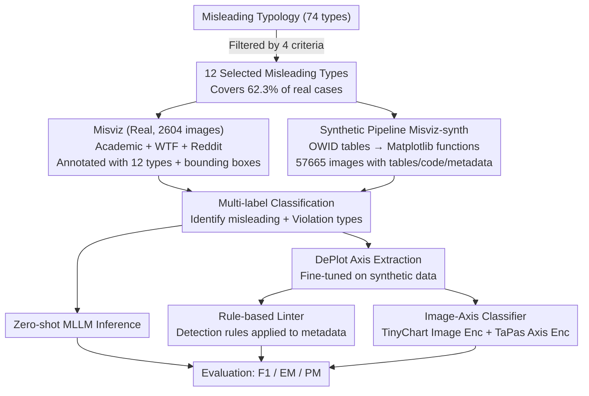

# Is this chart lying to me? Automating the detection of misleading visualizations

**Conference**: ACL 2026  
**arXiv**: [2508.21675](https://arxiv.org/abs/2508.21675)  
**Code**: [GitHub](https://github.com/UKPLab/acl2026-misviz)  
**Area**: Visualization/Misinformation Detection  
**Keywords**: Misleading visualizations, chart detection, multimodal large language models, data visualization, multi-label classification

## TL;DR

Proposes the Misviz (2,604 real-world misleading visualizations) and Misviz-synth (57,665 synthetic visualizations) benchmarks covering 12 misleading types. Systematically evaluates the performance of MLLMs, rule checkers, and image classifiers in detecting misleading charts, revealing that this task remains highly challenging.

## Background & Motivation

**Background**: Misleading visualizations are significant vehicles for misinformation on social media. They distort data and mislead readers into drawing incorrect conclusions by violating chart design principles, such as truncating axes, using 3D effects, or employing inconsistent scale intervals. Research has shown that both humans and MLLMs are easily deceived by such visualizations.

**Limitations of Prior Work**: Training and evaluating automatic detection of misleading visualizations and identifying specific violation types are limited by the lack of large-scale, diverse, and open datasets. Existing datasets are either small (e.g., 150 images), proprietary, or cover only a few misleading types, restricting comparability between methods and research progress.

**Key Challenge**: Misleading features are often hidden in subtle visual details (e.g., axis scale intervals) and are highly diverse (recent taxonomies identify 70+ types), making automated detection extremely difficult.

**Goal**: Construct the first large-scale open misleading visualization benchmark to systematically evaluate the strengths and weaknesses of different detection methods.

**Key Insight**: Collect real-world charts from three sources (academic corpora, WTF Visualizations website, and Reddit communities) and combine them with synthetic generation based on real data tables to build complementary benchmark pairs.

**Core Idea**: Define misleading visualization detection as a multi-label classification problem and systematically compare three detection paths: zero-shot MLLMs, rule checkers based on axis metadata, and image-axis classifiers.

## Method

### Overall Architecture

This paper addresses the problem of "automatically determining whether a chart is visually misleading and identifying specific violation types." The approach centers on two complementary benchmarks: Misviz, which contains 2,604 real-world visualizations (70% misleading + 30% normal), each annotated with 12 misleading types and bounding boxes for misleading regions; and Misviz-synth, which uses real data tables to synthesize 57,665 visualizations, each provided with its data table, Matplotlib code, and axis metadata as ground truth supervision. The task is unified as "multi-label classification," comparing three detection paths: zero-shot MLLM inference, rule-based linters using DePlot to extract axis metadata, and direct training of image (+axis) classifiers.

### Key Designs

**1. Selection of 12 Misleading Types: Identifying a "common and detectable" subset from 74 categories**

The latest taxonomy of misleading techniques identifies over 70 types. Full coverage is impractical for annotation and evaluation, requiring convergence on a meaningful subset. The authors filtered the 74 categories from Lo et al. based on four criteria: frequency in the real world (n $\ge$ 15), direct violation of explicit design rules (excluding subjective reasoning), actual data distortion (excluding poor readability), and domain-agnostic judgment. The resulting 12 types cover 62.3% of real-world cases, ensuring the benchmark has high practical coverage while allowing for reliable human annotation and objective model detection.

**2. Synthetic Data Generation Pipeline (Misviz-synth): Creating misleading charts with perfect metadata**

Real-world misleading charts are expensive to annotate and scarce, making them insufficient for training and fine-grained evaluation. The authors constructed a two-step synthesis pipeline. First, real data tables are scraped from Our World in Data to determine valid column combinations and chart types. Second, for each (chart type, misleading type) combination, hand-written Matplotlib functions are called to generate the visualization. Since each synthetic instance includes the original table, code, and axis metadata, it provides noise-free labels and structural information for large-scale training.

**3. Axis Metadata-based Rule Checker (Linter): Converting "visual judgment" to "axis rule checking"**

Many misleading types hide in the axes—truncated axes not starting at 0, or inconsistent scale intervals—which are structured clues that can be precisely determined by rules. The authors fine-tuned DePlot to extract axis metadata (labels, positions, names) from images to be used by a linter with handcrafted rules: e.g., truncated axis checks if the $y$-axis start value is 0; inconsistent intervals check if the numerical difference between adjacent ticks is constant. This extraction step is shared between the linter and the classifier. While the rule checker only covers 6 types detectable from axis metadata, it provides strong interpretability and objective evidence, performing exceptionally well on synthetic data with accurate metadata.

**4. Image-Axis Classifier: Fusing visual and structural features**

MLLMs focus on images, while rule checkers only use axis metadata for 6 categories. The authors trained a classifier to fuse both signals as a third detection path. Two versions were trained: image-only and image+axis. Images are encoded using a frozen TinyChart encoder, while axis metadata is encoded via a frozen TaPas table encoder. The fused version concatenates the `[CLS]` tokens of both embeddings and feeds them into a trainable head. Like the linter, the classifier excels on in-distribution synthetic data but suffers on real charts because axis extractors struggle to generalize—revealing the "synthetic-to-real" generalization gap.

## Key Experimental Results

### Main Results (Misviz Test Set)

| Method | F1 | EM (Exact Match) | PM (Partial Match) |
|------|-----|------------|------------|
| GPT-o3 | **71.3** | **24.0** | **38.2** |
| GPT-4.1 | 67.7 | 22.1 | 36.2 |
| Qwen2.5-VL-72B | 59.0 | 13.2 | 22.3 |
| InternVL3-38B | 58.3 | 6.1 | 19.9 |
| Linter (GT Axis) | — | — | — |
| Image Classifier | ~55 | — | — |

### Misviz-synth Test Set

| Method | F1 | EM |
|------|-----|-----|
| Image-Axis Classifier (GT Axis) | **~85** | **~75** |
| Linter (GT Axis) | ~80 | ~70 |
| GPT-o3 | ~70 | ~45 |

### Key Findings
- MLLMs are strongest on real charts (F1 71.3), but rule checkers and classifiers perform better on synthetic charts due to specialized training.
- Axis extractors trained on synthetic data do not generalize well to real charts, limiting the linter and classifier performance on Misviz.
- Even the best models achieve only 24% EM, indicating that precise identification of all misleading types is extremely difficult.
- "Misrepresentation" is the most common misleading type (32%) but also the hardest to detect—it requires comparing visual encoding with annotated values.
- Most visualizations contain 1 misleading type (85%), while 14% have 2, and 1% have 3.

## Highlights & Insights
- **Filling the Data Gap**: First large-scale open misleading visualization benchmark, over 15x larger than previous public datasets.
- **Comprehensive Methodology**: Systematically compares three distinct detection paths, revealing their respective strengths and weaknesses.
- **Synthetic-Real Gap Analysis**: In-depth analysis shows synthetic data has training value but struggles to generalize to real-world visual variance.
- **Social Value**: Automated detection has direct applications in combatting the spread of misinformation and improving data literacy.

## Limitations & Future Work
- **Coverage**: Only 12 of 74 misleading types are covered; rare or domain-specific types remain unaddressed.
- **Synthetic-to-Real Generalization**: Axis extractors lack sufficient accuracy on real-world charts.
- **Low Exact Match**: Even top models struggle with EM (24%), showing significant room for improvement.
- Future directions include expanding type coverage, improving generalization, and combining LLM reasoning with rule-based checkers.

## Related Work & Insights
- **vs. Lo and Qu (2025)**: They evaluate MLLMs on only 150 real visuals; Misviz is 15x larger with a more comprehensive methodology.
- **vs. Maciborski et al. (2025)**: They use synthetic data + CNN but only for 5 types and lack real-world evaluation.
- **vs. Traditional Linters**: Conventional linters require data tables or code; Ours' linter extracts axis metadata directly from images, making it more practical.

## Rating
- Novelty: ⭐⭐⭐⭐ First large-scale open benchmark with a complete comparative framework.
- Experimental Thoroughness: ⭐⭐⭐⭐⭐ Covers 9+ MLLMs, multiple methods, two datasets, and detailed error analysis.
- Writing Quality: ⭐⭐⭐⭐ Clear structure with intuitive visual examples of the 12 misleading types.
- Value: ⭐⭐⭐⭐ Significant practical value for anti-misinformation and data visualization education.

<!-- RELATED:START -->

## Related Papers

- [\[NeurIPS 2025\] Worse than Zero-shot? A Fact-Checking Dataset for Evaluating the Robustness of RAG Against Misleading Retrievals](../../NeurIPS2025/social_computing/worse_than_zero-shot_a_fact-checking_dataset_for_evaluating_the_robustness_of_ra.md)
- [\[ACL 2026\] MM-StanceDet: Retrieval-Augmented Multi-modal Multi-agent Stance Detection](mm-stancedet_retrieval-augmented_multi-modal_multi-agent_stance_detection.md)
- [\[ACL 2026\] LiveFact: A Dynamic, Time-Aware Benchmark for LLM-Driven Fake News Detection](livefact_a_dynamic_time-aware_benchmark_for_llm-driven_fake_news_detection.md)
- [\[ACL 2026\] DIA-HARM: Dialectal Disparities in Harmful Content Detection Across 50 English Dialects](dia-harm_dialectal_disparities_in_harmful_content_detection_across_50_english_di.md)
- [\[ACL 2026\] Confident, Calibrated, or Complicit: Safety Alignment and Ideological Bias in LLM Hate Speech Detection](confident_calibrated_or_complicit_safety_alignment_and_ideological_bias_in_llm_h.md)

<!-- RELATED:END -->
