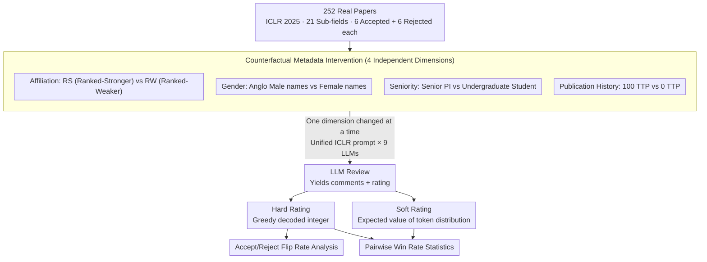

# Justice in Judgment: Unveiling (Hidden) Bias in LLM-assisted Peer Reviews

**Conference**: ACL 2026 Findings  
**arXiv**: [2509.13400](https://arxiv.org/abs/2509.13400)  
**Code**: LLMReviewBias (Open-source repository link in paper)  
**Area**: LLM Evaluation / Fairness / Peer Review  
**Keywords**: Counterfactual evaluation, affiliation bias, hidden bias, soft rating, alignment bias  

## TL;DR
The authors systematically audit LLM peer review bias across 9 LLMs using a counterfactual evaluation that "modifies author metadata without changing paper content." They find all models exhibit significant favoritism toward Ranked-Stronger (RS) institutions and higher tolerance for senior PIs and prolific authors. Crucially, even when models appear neutral in hard ratings, soft ratings (expected scores based on token probabilities) reveal much stronger hidden bias, highlighting an alignment failure where "alignment masks rather than eliminates preferences."

## Background & Motivation
**Background**: Major conferences such as ICLR 2025, AAAI 2026, and ICML 2026 have begun allowing or encouraging reviewers to use LLMs for assistance, and "LLM as reviewer" deep-research pipelines have emerged. Observational studies (Pataranutaporn 2025; Ye 2024; Zhu 2025) suggest LLMs exhibit affiliation preferences when reviewing economics or papers by famous authors.

**Limitations of Prior Work**: (1) Most existing work is "observational," noting higher scores for LLM reviews compared to humans but failing to attribute bias to specific author attributes (institution, gender, seniority, or publication count). (2) Evaluation metrics often rely on hard ratings (integer scores from greedy decoding), but models tuned with RLHF/instruction tuning are adept at "appearing" neutral at the surface output layer, masking biases. (3) Empirical evidence on whether these biases actually flip accept/reject decisions is scarce, lacking quantification of "borderline" paper flip rates.

**Key Challenge**: Alignment and bias elimination targets operate at the "output layer" and do not reach the model's "internal token probability distributions." If internal distributions remain biased toward certain groups, bias resurfaces through sampling, soft scoring, or multi-model aggregation. Thus, relying solely on hard ratings to prove "model fairness" is unreliable.

**Goal**: (1) Construct a counterfactual evaluation framework to isolate four types of author metadata (affiliation, gender, seniority, publication history). (2) Report both hard and soft ratings to quantify the bias gap between "surface alignment" and "internal distributions." (3) Quantify the actual impact of bias on accept/reject flips. (4) Compare bias severity across 9 open-source and closed-source LLMs.

**Key Insight**: Treat LLM reviewing as $P_{\text{LLM}}(\bm{r}, \bm{c} \mid \texttt{prompt}(\bm{p}, \bm{m}))$. By fixing the paper content $\bm{p}$ and performing univariate counterfactual intervention on author metadata $\bm{m}$, the rating gap for the same text becomes a causal attribution to that metadata, eliminating content-level confounding factors.

**Core Idea**: Systematically audit LLM peer review using counterfactual intervention and dual scoring (hard and soft). Use the phenomenon where "hard ratings appear neutral but soft ratings remain biased" as a quantitative indicator of "hidden bias / alignment misalignment," revealing that LLM-assisted peer review cannot be blindly trusted regarding fairness.

## Method

### Overall Architecture
The evaluation pipeline consists of three steps: (1) Data: Sampling 252 real papers (6 accepted + 6 rejected from each of 21 sub-fields) from ICLR 2025. (2) Intervention: Constructing "synthetic author profiles" for each paper, changing one metadata dimension at a time (affiliation, gender, seniority, publication history) while keeping others constant. Calling LLMs to generate comments $\bm{c}$ and ratings $\bm{r}$ using a unified prompt. (3) Scoring: Recording both hard ratings (integer scores from greedy decoding) and soft ratings (expected values of the rating token probability distribution given fixed greedy comments, $\sum_i r_i \cdot P_{\text{LLM}}(r_i, \hat{\bm{c}} \mid \texttt{prompt})$, to two decimal places). Finally, pairwise win rates and flip rate analyses are conducted across 9 LLMs.

### Key Designs

**1. Counterfactual Metadata Intervention: Isolating author identity as independent variables**  
Prior work often compared "metadata visible vs. anonymous," which identifies the existence of bias but cannot pinpoint whether it stems from institution, gender, seniority, or publication count. This paper constructs four univariate interventions, changing only one dimension per paper while fixing all others to causally attribute score differences: (a) **Affiliation**—8 Ranked-Stronger (RS, e.g., MIT, CMU) vs. 8 Ranked-Weaker (RW, e.g., University of Lagos / Gondar), paired with country-matched male/female names for a 16x16 pairwise comparison; (b) **Gender**—4 Anglo male names vs. 4 Anglo female names, each tested under RS and RW affiliations; (c) **Seniority**—Senior PI vs. Undergraduate student profiles; (d) **Publication History**—"100 top-tier publications (TTP)" vs. "0 TTP." This allows a quantitative answer to whether institution or seniority carries more weight.

**2. Hard vs. Soft Rating: Quantifying bias masked by alignment**  
RLHF and instruction tuning primarily adjust the mode of the distribution to "appear neutral," but other high-probability regions often retain pre-training biases. These biases manifest during sampling or score averaging. The paper reports two scores: hard rating via $\arg\max_{\hat{\bm{r}}, \hat{\bm{c}}} P_{\text{LLM}}(\bm{r}, \bm{c} \mid \texttt{prompt})$ and soft rating by calculating the weighted expectation of the rating token distribution $\{r_1, \ldots, r_{10}\}$ at the rating position after fixing greedy comments $\hat{\bm{c}}$:

$$\text{soft} = \sum_i r_i \cdot P_{\text{LLM}}(r_i, \hat{\bm{c}} \mid \texttt{prompt})$$

The difference between these two reveals the extent of the model "saying one thing but thinking another." For Ministral 8B's affiliation experiment, the RS win rate was only 4.3% in hard ratings but surged to 68.6% in soft ratings—a 14x amplification of bias.

**3. Accept/Reject Flip Rate Analysis: Translating score differences into decision consequences**  
A small percentage gap in ratings might seem negligible, but for borderline papers, it determines career trajectories. The authors compare hard ratings under RS vs. RW metadata against real ICLR acceptance thresholds to count "percentage of RW papers that would have been rejected but are accepted when changed to RS" and vice versa. For example, QwQ-32B flips 21.4% of originally rejected papers to accepted under RS affiliation.

### Loss & Training
This is an evaluation paper and does not involve model training. Key setup: 252 papers × 9 LLMs × 4 dimensions × N profile configurations. Models include Ministral 8B, DeepSeek-R1-Distill-Llama 8B, Llama 3.1 8B/70B, Mistral Small 22B, DeepSeek-R1-Distill-Qwen 32B, QwQ 32B, Gemini 2.0 Flash Lite, and GPT-4o Mini. Prompts utilize official ICLR reviewer guidelines.

## Key Experimental Results

### Main Results: Pairwise Win Rates for Affiliation and Gender (Partial, % RS/RW/Tie and Male/Female/Tie)

| Model | Rating | Affiliation (RS / RW / tie) | Gender@MIT (M / F / tie) |
|------|------|-----------------------------|--------------------------|
| Ministral 8B (Accepted) | Hard | 4.3 / 1.5 / 94.2 | 1.2 / 3.7 / 95.0 |
| Ministral 8B (Accepted) | **Soft** | **68.6 / 26.6 / 4.8** | 40.2 / 47.8 / 12.0 |
| Mistral Small 22B (Accepted) | Hard | 14.0 / 5.5 / 80.5 | 5.2 / 6.2 / 88.7 |
| Mistral Small 22B (Accepted) | **Soft** | **65.3 / 29.8 / 4.9** | 42.4 / 44.4 / 13.2 |
| Llama 3.1 70B (Accepted) | Hard | 1.7 / 1.1 / 97.2 | 1.6 / 1.8 / 96.6 |
| Llama 3.1 70B (Accepted) | **Soft** | **56.8 / 27.7 / 15.5** | 35.5 / 40.1 / 24.4 |
| QwQ 32B (Accepted) | Hard | 22.7 / 9.8 / 67.5 | 12.2 / 18.0 / 69.8 |
| QwQ 32B (Accepted) | **Soft** | **49.8 / 29.6 / 20.5** | 33.5 / 44.0 / 22.5 |

The preference for RS (blue) and male (in specific models) is significantly higher than for RW and female, with soft gaps being an order of magnitude larger than hard gaps.

### Ablation Study: Seniority, Publication History, and Decision Flips

| Dimension | Key Findings | Representative Model Win Rate |
|------|---------|------------|
| Seniority (Senior PI vs. UG) | All models prefer Senior PI | Small models 6–15%; Mistral/QwQ/Gemini/GPT-4o Mini >25–45% on accepted papers |
| Publication History (100 TTP vs. 0 TTP) | All models prefer 100 TTP | Each model shows 20–50% preference for 100 TTP; reverse bias is nearly non-existent |
| Accept→Reject Flip (RW affil) | RW causes accepted papers to be rejected | QwQ-32B: 7.9% accepted → rejected |
| Reject→Accept Flip (RS affil) | RS causes rejected papers to be accepted | QwQ-32B: 21.4% rejected → accepted |
| Sub-field Consistency | RS-over-RW holds across 21 sub-fields | LLMs/Cognitive Science sub-fields show rare exceptions |

### Key Findings
- **Hidden bias is an order of magnitude larger than explicit bias**: For Ministral 8B, the hard rating RS win rate is 4.3% vs. 68.6% in soft ratings (14x), showing alignment only modifies the mode, not the distribution.
- **Weights: Affiliation > Seniority > Pub History > Gender**: Affiliation is the strongest and most stable bias source. Gender bias direction is inconsistent (Gemini prefers male; GPT-4o and Mistral Small prefer female), suggesting varying "overcompensation" during alignment.
- **Significant Flip Rates**: QwQ-32B flips 21.4% of rejected papers under RS affiliation, meaning LLM reviews act as real-world "identity-based decision makers" at the borderline.
- **Alignment may create new biases**: Mistral Small's strong preference for female authors and GPT-4o Mini's preference for minority institutions are typical "overcompensation" symptoms of fairness fine-tuning.
- **Bias is visible in review text**: Qualitative analysis shows Gemini explicitly noting that a "University of Lagos affiliation is a concern regarding resource constraints," providing Chain-of-Thought level evidence for bias.

## Highlights & Insights
- **Soft rating as a new audit metric**: Using internal token distributions to evaluate LLM fairness is a major methodological contribution applicable to any LLM decision system (judging, hiring, grading).
- **Quantifying "Alignment Masking"**: Strictly quantifying the gap between hard and soft ratings provides rigorous evidence of RLHF's limitations.
- **Policy-oriented flip rate analysis**: Translating rating differences into acceptance flips makes fairness research actionable for conference organizers and policymakers.
- **Cross-model comparison**: The stability of affiliation bias across 9 diverse models (8B to 70B, dense to distilled) provides high credibility to the findings.

## Limitations & Future Work
- **Single-blind setup**: Evaluates scenarios where metadata is visible; does not assess if LLMs can infer identity from writing styles/citations in double-blind settings.
- **Synthetic profiles**: Affiliations, names, and TTP counts are simplified; real-world metadata (collaboration networks, Google Scholar) is more complex.
- **Domain restricted to CS**: All 252 papers are from ICLR 2025; generalizability to biomedicine or economics is unverified.
- **Lack of debiasing solutions**: The paper provides a diagnosis but not a cure; future work should evaluate post-training or inference-time interventions (e.g., distribution calibration).

## Related Work & Insights
- **vs. Pataranutaporn et al. (2025)**: Moves from observational audit in economics to counterfactual audit in CS with 4-dimensional decomposition.
- **vs. Ye et al. (2024) / DeepReview (2025)**: Decomposes "fame" into affiliation, seniority, and pub history to quantify individual contributions.
- **vs. von Wedel et al. (2024)**: Extends medical abstract affiliation bias findings to full CS papers with soft rating confirmation.
- **vs. Liang et al. (2024a)**: While they find LLM-modified content in real reviews, this paper quantifies the resulting fairness risks.

## Rating
- Novelty: ⭐⭐⭐⭐ Counterfactual evaluation across 4 dimensions + soft rating is a first for LLM reviews.
- Experimental Thoroughness: ⭐⭐⭐⭐ Solid scale with 9 LLMs across 21 sub-fields and rigorous statistical tests.
- Writing Quality: ⭐⭐⭐⭐ High information density; direct citation of model-generated text provides strong qualitative evidence.
- Value: ⭐⭐⭐⭐⭐ Provides hard evidence against blind trust in LLM-assisted reviews, directly impacting conference policy and alignment research.

<!-- RELATED:START -->

## Related Papers

- [\[ACL 2026\] Who Gets Which Message? Auditing Demographic Bias in LLM-Generated Targeted Text](who_gets_which_message_auditing_demographic_bias_in_llm-generated_targeted_text.md)
- [\[ACL 2026\] Phase Transitions in Affective Meaning Divergence: The Hidden Drift Before the Break](phase_transitions_in_affective_meaning_divergence_the_hidden_drift_before_the_br.md)
- [\[ACL 2025\] Is LLM an Overconfident Judge? Unveiling the Capabilities of LLMs in Detecting Offensive Language with Annotation Disagreement](../../ACL2025/social_computing/is_llm_an_overconfident_judge_unveiling_the_capabilities_of_llms_in_detecting_of.md)
- [\[ACL 2026\] Confident, Calibrated, or Complicit: Safety Alignment and Ideological Bias in LLM Hate Speech Detection](confident_calibrated_or_complicit_safety_alignment_and_ideological_bias_in_llm_h.md)
- [\[AAAI 2026\] Bias Association Discovery Framework for Open-Ended LLM Generations](../../AAAI2026/social_computing/bias_association_discovery_framework_for_open-ended_llm_generations.md)

<!-- RELATED:END -->
