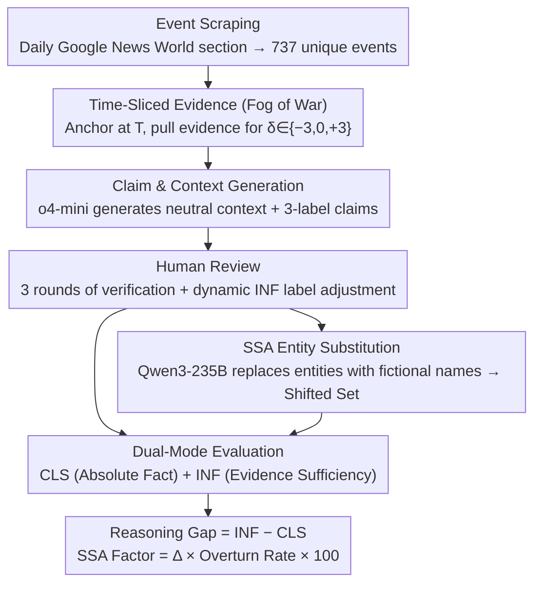

# LiveFact: A Dynamic, Time-Aware Benchmark for LLM-Driven Fake News Detection

**Conference**: ACL 2026  
**arXiv**: [2604.04815](https://arxiv.org/abs/2604.04815)  
**Code**: https://github.com/bebxy/livefact  
**Area**: Social Computing / Fake News Detection / LLM Evaluation  
**Keywords**: Dynamic benchmark, Time-aware, benchmark contamination, cognitive humility, Fog of War  

## TL;DR
LiveFact upgrades "fake news detection" from static binary classification to a dynamic reasoning benchmark updated monthly with time-sliced evidence. It evaluates both factual judgment and cognitive humility ("knowing when to say I don't know") via a dual Classification + Inference mode, while explicitly monitoring benchmark contamination through SSA entity substitution.

## Background & Motivation
**Background**: LLMs have shifted fake news detection from "features + classifiers" to "complex reasoning based on multi-hop evidence." However, evaluation remains largely stagnant on datasets like LIAR, FEVER, or FakeNewsNet—static datasets where LLMs are provided with "perfect" evidence to output a Real/Fake label.

**Limitations of Prior Work**: First, static data is repeatedly used in pre-training, leading to severe Benchmark Data Contamination (BDC); LLMs may simply "memorize answers" rather than truly reason. Second, the "god-view" setting where all evidence is provided at once is detached from the real world—journalists receive incomplete, time-evolving fragments. Third, it is difficult to distinguish whether high performance stems from factual understanding or "confident guessing."

**Key Challenge**: The static nature of evaluation (one-time snapshots) fundamentally contradicts the dynamic processes of continuous LLM pre-training and news generation. Consequently, higher leaderboard scores may indicate better memorization rather than superior reasoning.

**Goal**: To construct an evaluation system that is continuously updated, simulates the "Fog of War," and quantifies BDC risks, ensuring scores reflect both (a) reasoning capability and (b) the ability to admit "unknown" when evidence is insufficient.

**Key Insight**: Evidence for each news item is sliced into three time windows ($E^{(-3)}$, $E^{(0)}$, $E^{(+3)}$) relative to the event date $T$, forcing models to answer under varying information densities. By using Classification (absolute fact) and Inference ("can it be judged given current evidence") modes, the framework distinguishes true reasoning from mere guessing.

**Core Idea**: Reshape static classification benchmarks into dynamic, time-aware, and anti-contamination reasoning benchmarks through monthly updates, time-sliced evidence, dual-mode evaluation, and entity substitution-based contamination monitoring.

## Method

### Overall Architecture
LiveFact employs a five-stage monthly pipeline and a dual-mode evaluation:
1. **Event Scraping**: Google News API is used to scrape the World section daily at 00:00 GMT; 737 unique events were clustered in November 2025.
2. **Temporal Evidence Construction**: Using the headline date $T$ as an anchor, evidence is retrieved for three windows: $\delta\in\{-3,0,+3\}$, totaling 25,064 entries.
3. **Claim and Context Generation**: o4-mini reads the events and evidence to generate neutral contexts and three-label claims (Real/Fake/Ambiguous), totaling 4,392 entries.
4. **Human Review**: Three rounds of independent verification are conducted. For the Inference mode, ground truths are dynamically adjusted based on whether the "current evidence is sufficient."
5. **BDC Monitoring**: Qwen3-235B-A22B is used to perform entity substitution (e.g., Trump $\rightarrow$ Wannetta) via the SSA framework to generate parallel "shifted" datasets.

Formally, for each claim $c_i$, the LLM $f_\theta$ is given an input triplet $(c_i, E_i^{(\delta)}, k_i)$ and outputs $\hat y_i^{(\delta)} \in \{\text{Real},\text{Fake},\text{Ambiguous}\}$. Evaluation measures Acc and Macro-F1 under two modes.

### Key Designs

**1. Time-Sliced Evidence (Fog of War): Simulating "Information Manifestation"**

In the real world, journalists receive fragmented and evolving evidence, whereas static benchmarks provide complete evidence. LiveFact anchors news to date $T$ and slices evidence into three windows: 3 days before, the day of, and 3 days after the event. This 3-day window is based on information rate analysis, where evidence density peaks at $T\pm 48{\sim}72$h. In early windows ($\delta=-3$), the proportion of "Ambiguous" labels in Inference mode spikes to 85%, allowing researchers to isolate model behavior under information scarcity.

**2. Dual-Mode Evaluation (Classification + Inference): Measuring "Cognitive Humility"**

When using absolute factual labels (CLS), models often "luck into" correct answers via parametric memory. LiveFact assigns two ground truths to the same claim: CLS (time-independent absolute fact) and INF (time-dependent label of whether evidence supports the conclusion). At $\delta=-3$, most INF labels are changed to "Ambiguous." A high CLS score at $\delta=-3$ signals "hallucinatory confidence." The framework defines $\text{Reasoning Gap} = \text{INF Acc} - \text{CLS Acc}$, where positive values indicate cognitive humility and negative values reveal a tendency to guess.

**3. SSA Entity Substitution + Overturn Rate (BDC Monitoring): Quantifying Memorization**

To detect if models are simply recalling training data, the authors use Entity Shift to replace named entities with fictional names (e.g., Trump $\rightarrow$ Wannetta) to create a shifted dataset. The flip rate is defined as:

$$\text{OTR}=\frac{1}{N}\sum_i \mathbb{1}\!\left[\hat y_i^{(\delta)}\neq \hat y_i'^{(\delta)}\right]$$

The $\text{SSA Factor}=\Delta\times\text{OTR}\times 100$, where $\Delta$ is the performance difference. High factors indicate heavy reliance on specific entities rather than evidence, signaling high contamination risk.

### Loss & Training
LiveFact is an evaluation benchmark and does not involve training. Evaluation utilizes `TEMPERATURE=0.0`, `TOP_P=1.0`, and `MAX_NEW_TOKENS=128` (extended to 1024 for reasoning models like Kimi-K2-Thinking). Outputs are required in `[[LABEL]]` format for automated parsing.

## Key Experimental Results

### Main Results
Comprehensive scores of 18 LLMs on the 2025/11 dataset (Avg is the mean across 12 metrics):

| Model | Acc$_0^{cls}$ | Acc$_{-3}^{inf}$ | Acc$_{+3}^{cls}$ | Avg |
|------|---------------|-------------------|------------------|-----|
| Qwen3-235B-A22B-Instruct-2507 | 79.76 | 66.67 | 82.08 | **72.40** |
| gpt-oss-120b⋆ | 79.94 | 62.23 | 81.81 | 72.13 |
| gpt-5.1-2025-11-13 | 78.60 | 68.44 | 81.01 | 72.02 |
| gpt-5.2-2025-12-11 | 76.34 | 80.71 | 77.32 | 71.52 |
| Qwen3-30B-A3B-Instruct-2507 | 75.05 | 64.55 | 77.00 | 69.46 |
| gpt-4o-2024-08-06 | 72.29 | 74.61 | 73.98 | 67.11 |
| DeepSeek-V3.1 | 64.44 | 78.03 | 63.73 | 61.48 |
| Llama-3.1-70B (base) | 33.45 | 7.90 | 33.47 | 22.16 |

Notable discovery: The open-source MoE flagship Qwen3-235B-A22B outperformed closed-source models like GPT-5.1/5.2. Pure dense base models (e.g., Llama-3.1-70B) failed primarily due to non-compliance with output formatting.

### Ablation Study (Reasoning Gap: INF Acc − CLS Acc at $\delta=-3$)

| Model Type | Exemplar Model | Reasoning Gap | Behavioral Type |
|----------|----------|---------------|----------|
| Uncertainty Aware | Llama-3.1-8B-Instruct | +38% | Correctly identifies Ambiguous |
| Uncertainty Aware | Qwen3-32B | +37% | Correctly identifies Ambiguous |
| Overconfident | Llama-3.3-70B-Instruct | ~ −20% | Forces Real/Fake guesses |
| Overconfident | Qwen3-4B-Instruct | Negative / Near 0 | Forces Real/Fake guesses |
| Format-Failed | Llama-3.1-70B | Negative | Format non-compliant |

### Key Findings
- High CLS scores at $\delta=-3$ are not evidence of strong reasoning but rather a "hallucination stress test"—the model is forced into a binary choice without evidence.
- MoE architectures (Qwen3, DeepSeek, gpt-oss) systematically outperform dense models in these knowledge-retrieval and reasoning tasks.
- "Thinking Mode" models (Kimi-K2, GPT-OSS) are ineffective at low token limits but jump to top-tier performance at 1024 tokens.
- Base models fail not due to a lack of reasoning but because of a lack of instruction alignment for formatting.

## Highlights & Insights
- Breaks the implicit assumption that benchmarks must be static, offering a sustainable monthly update scheme applicable to any time-sensitive task.
- The Reasoning Gap provides a clear scalar to distinguish "overconfidence" from "cognitive humility," more informative than Accuracy alone.
- The SSA Factor provides a quantifiable metric for contamination on leaderboards, moving beyond post-hoc audits.
- MoE mid-sized models like Qwen3-30B offer a 14× cost advantage over GPT-5.2 with only a 3-point performance drop, suggesting they are optimal for real-world deployment.

## Limitations & Future Work
- Currently English-only; localized misinformation patterns in other languages (dialects, regional contexts) are not covered.
- Limited to text modality; deepfakes and manipulated media are not yet included.
- Human review and Ambiguous label determination are bottlenecks; the authors plan to use calibrated judge models for semi-automation.
- Potential concern: SSA might break common-sense consistency in low-probability events.

## Related Work & Insights
- **vs LIAR / FEVER**: Those are one-time snapshots; LiveFact is continuous and time-anchored.
- **vs LiveBench**: Similar in intent, but LiveBench focuses on general tasks rather than the specific evidence-chain structure of news.
- **vs TripleFact / AdvFake**: LiveFact is the first to combine monthly updates, time-slicing, and BDC monitoring.
- **vs SSA Original Work**: This work integrates SSA into a production pipeline as a monthly contamination monitor.

## Rating
- Novelty: ⭐⭐⭐⭐⭐ 
- Experimental Thoroughness: ⭐⭐⭐⭐ 
- Writing Quality: ⭐⭐⭐⭐ 
- Value: ⭐⭐⭐⭐⭐ 

<!-- RELATED:START -->

## Related Papers

- [\[ICML 2026\] IDO: Incongruity-Aware Distribution Optimization for Multimodal Fake News Detection](../../ICML2026/social_computing/ido_incongruity-aware_distribution_optimization_for_multimodal_fake_news_detecti.md)
- [\[ACL 2026\] VeriTaS: The First Dynamic Benchmark for Multimodal Automated Fact-Checking](veritas_the_first_dynamic_benchmark_for_multimodal_automated_fact-checking.md)
- [\[AAAI 2026\] FactGuard: Event-Centric and Commonsense-Guided Fake News Detection](../../AAAI2026/social_computing/factguard_event-centric_and_commonsense-guided_fake_news_detection.md)
- [\[ACL 2025\] Detection of Human and Machine-Authored Fake News in Urdu](../../ACL2025/social_computing/detection_of_human_and_machine-authored_fake_news_in_urdu.md)
- [\[ACL 2026\] Diagnosing LLM Arbitration Behavior over Pre-evidence Epistemic States in RAG-based Fact-Checking](diagnosing_llm_arbitration_behavior_over_pre-evidence_epistemic_states_in_rag-ba.md)

<!-- RELATED:END -->
