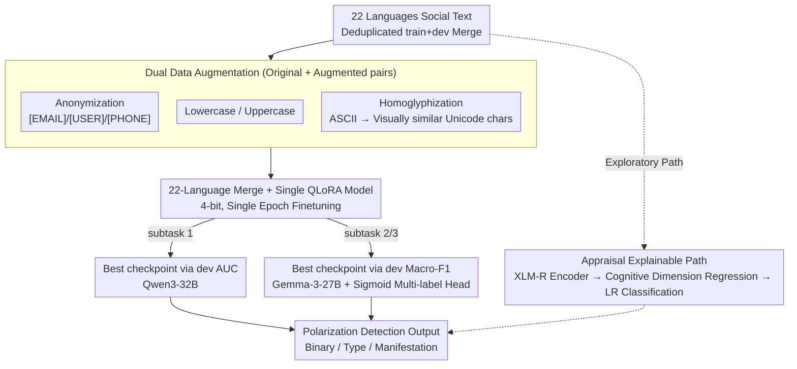

# mdok-style at SemEval-2026 Task 9: Finetuning LLMs for Multilingual Polarization Detection

**Conference**: ACL 2026 (SemEval-2026 Task 9 system paper)  
**arXiv**: [2605.02695](https://arxiv.org/abs/2605.02695)  
**Code**: https://github.com/kinit-sk/mdok-style-polar2026  
**Area**: Multilingual NLP / Text Classification / SemEval System Paper  
**Keywords**: Polarization Detection, Multilingual, QLoRA, Data Augmentation, Homoglyph Attack  

## TL;DR
This paper transfers the mdok system (originally designed for multilingual machine-generated text detection, utilizing QLoRA finetuned Qwen3-32B / Gemma-3-27B) to SemEval-2026 Task 9 for multilingual polarization detection. By incorporating four types of "dual" data augmentation (anonymization, casing, and homoglyphs), the system achieves an average Macro-F1 score 3–4% higher than the official baseline across 22 languages.

## Background & Motivation
**Background**: Online polarization is a precursor to hate speech and social fragmentation; automated detection is critical for mitigation. SemEval-2026 Task 9 (POLAR) decomposes this into three subtasks: subtask 1 (binary classification: polarized or not), subtask 2 (polarization type: Political / Racial / Religious / Gender / Other), and subtask 3 (manifestation: Stereotyping / Vilification / Dehumanization / Extreme Language / Lack of Empathy / Invalidation), covering 22 languages (including low-resource languages like Amharic, Hausa, and Odia).

**Limitations of Prior Work**: Many of the 22 languages are low-resource with sparse and imbalanced training data. Small BERT-like models struggle with both low-resource scenarios and cross-lingual transfer. Furthermore, social media text is rife with noise (irregular casing, emojis, @mentions, etc.) and adversarial **homoglyph attacks** (replacing ASCII with visually similar characters from different Unicode blocks), which break tokenizers and invalidate classifiers.

**Key Challenge**: (1) The need for a unified model to cover 22 languages and share signals from low-resource data requires sufficient model capacity; (2) Achieving robustness against visual obfuscation when such samples are nearly absent in training data.

**Goal**: To transfer the mdok pipeline—which achieved double 1st place finishes in machine-generated text detection at PAN@CLEF 2025 (QLoRA finetuned medium-sized multilingual LLMs + robustness enhancement)—directly to polarization detection to test the hypothesis that "robust detectors are task-agnostic toolboxes."

**Key Insight**: While polarization detection and machine-generated text detection appear different, both are fundamentally "robust sequence classification tasks for short texts." Robustness techniques, particularly homoglyph defense, should be transferable.

**Core Idea**: The mdok paradigm = 4-bit QLoRA finetuning of 27–32B multilingual LLMs + four "dual" text augmentations (original + augmented versions each occupying half of the training set), merging data from 22 languages to enhance cross-lingual transfer.

## Method

### Overall Architecture
The system takes social media text in any language as input and outputs logits for subtask 1, or multi-labels for subtasks 2 and 3. The pipeline consists of four steps: (1) Deduplicating and merging train+dev sets across 22 languages; (2) Applying four types of data augmentation (anonymization, decapitalization, capitalization, and homoglyphization), expanding the training set by ~20%; (3) Single-epoch finetuning using QLoRA on the merged data; (4) Selecting the best checkpoint based on validation AUC (subtask 1) or Macro-F1 (subtasks 2/3). Qwen3-32B was chosen as the backbone for subtask 1, while Gemma-3-27B-pt was used for subtasks 2/3 due to Qwen3's instability during multi-label head training. An explainable appraisal pathway was also explored.

### Key Designs

**1. Dual Data Augmentation: Adversarial Perturbations as Regularization**

Social media text contains significant noise, but the most challenging are homoglyph attacks. These cause BPE/SentencePiece tokenizers to segment the same word into entirely different subword sequences. Instead of using Unicode normalization during inference (which discards visual adversarial signals), the authors generate an augmented copy $T(x)$ for each original sample $x$. Both $(x, y)$ and $(T(x), y)$ are used for training. The four transforms $T$ are: (a) **Anonymization** (replacing PII with tokens like `[USER]`); (b) **Lowercase**; (c) **Uppercase**; (d) **Homoglyphization** (replacing ASCII with visually identical characters from other Unicode blocks). This forces the model to learn that "a word with replaced characters is still the same word," providing robustness with zero extra inference overhead.

**2. 22-Language Merge + Single QLoRA Model: Model Capacity for Cross-lingual Transfer**

Monolingual data for low-resource languages (e.g., Hausa, Khmer) is insufficient to finetune a 32B model. This system mixes all training data into a single pool to share stabilization signals across languages. Using 4-bit QLoRA, the model is trained with a constant learning rate of $2 \times 10^{-5}$ and a single epoch to prevent overfitting to surface cues. Merging data forces the model to learn "task representations rather than language representations." The choice of Qwen3-32B and Gemma-3-27B-pt (supporting 140+ languages) ensures that cross-lingual alignment is already built into the backbone.

**3. Appraisal Labels as Interpretability Path (Exploratory)**

The authors explored an explainable bypass using cognitive appraisal dimensions (e.g., pleasantness, predictability, control). An XLM-Roberta model was used to encode text, followed by a multi-task regression head to predict 5 binary appraisal dimensions and 4 event descriptors. Finally, a Logistic Regression classifier was trained on these appraisal features. While its Macro-F1 was near random, the threshold-independent AUC for each label was generally >0.65, suggesting that appraisal dimensions capture discriminative cognitive signals relevant to polarization.

### Loss & Training
Subtask 1 uses standard cross-entropy; subtasks 2/3 use BCE-with-logits for multi-label classification. QLoRA 4-bit quantization was implemented via `bitsandbytes`, with LoRA adapters applied to all attention and MLP projections. Training was strictly limited to one epoch.

## Key Experimental Results

### Main Results (Macro-F1 of the submitted system across 22 languages and Gain vs. Official Baseline)

| Language (subset) | Subtask 1 | Subtask 2 | Subtask 3 | Gain vs Baseline (S1/S2/S3) |
|---|---|---|---|---|
| zho (Chinese) | 0.9237 | 0.8199 | 0.4912 | +0.055 / +0.150 / +0.491 |
| nep (Nepali) | 0.8915 | 0.8026 | 0.5669 | +0.012 / +0.081 / +0.436 |
| tel (Telugu) | 0.8818 | 0.2573 | 0.2143 | +0.238 / -0.057 / -0.460 |
| mya (Burmese) | 0.8788 | 0.6835 | — | +0.058 / +0.206 / — |
| ben (Bengali) | 0.8415 | 0.3050 | 0.1272 | -0.011 / +0.016 / +0.040 |
| eng (English) | 0.8058 | 0.4519 | 0.3697 | +0.026 / +0.119 / -0.040 |
| hau (Hausa) | 0.7401 | 0.1689 | 0.0000 | -0.035 / -0.035 / -0.746 |
| khm (Khmer) | 0.6293 | 0.6323 | 0.2482 | -0.030 / +0.005 / -0.361 |
| amh (Amharic) | 0.6619 | 0.5116 | 0.4310 | -0.053 / +0.140 / -0.012 |
| **22-Lang Avg vs Baseline** | **+0.033** | **+0.043** | **−0.001** | — |

The system outperformed the baseline by 3–4% in subtasks 1 and 2, remaining on par in subtask 3. Notable achievements include 1st place in Italian subtask 1 and 3rd place in Nepali subtask 2.

### Ablation Study (Fine-grained performance by label)

| Subtask / Category | Chinese (zho) | English (eng) | Hindi (hin) | Hardest Category (Avg) |
|---|---|---|---|---|
| S2 Political | 0.8571 | 0.8014 | 0.8019 | 0.74+ |
| S2 Religious | 0.9651 | 0.7535 | 0.9214 | Easiest to distinguish |
| S2 "Other" | 0.8294 | 0.5194 | 0.6536 | **Hardest** (~0.58) |
| S3 Vilification | 0.8696 | 0.7821 | 0.7407 | — |
| S3 Dehumanization | 0.7958 | 0.5391 | 0.7130 | **Very Hard** |
| S3 Lack of empathy | 0.5491 | 0.5742 | 0.6554 | **Hardest** |
| S3 Invalidation | 0.5937 | 0.4894 | 0.7480 | Second hardest |

### Key Findings
- **Task Difficulty Gradient**: Subtask 1 avg ~0.79, Subtask 2 ~0.53, Subtask 3 ~0.36; multi-label classification remains the primary bottleneck.
- **"Other" is the Weak Point**: In Subtask 2, the "Other" category performs worst as it acts as a semantic "catch-all" with inconsistent features.
- **Language Disparity**: Performance is strong in Chinese and Nepali but drops significantly in Hausa and Amharic. The 0.0 score in Hausa subtask 3 suggests the model treated it as an outlier during merged training.
- **Appraisal Potential**: Despite low Macro-F1, the high per-label AUC for the appraisal path indicates it captures valid cognitive cues that could be fused into the main model.

## Highlights & Insights
- **Homoglyph attacks as training regularization** is a potent trick: Instead of post-processing, teaching the model semantic invariance to character substitution provides robustness with zero cost at inference.
- **Scale absorbs transfer complexity**: Large models (27B+) allow for simple data merging, suggesting that increasing backbone size might be more effective than complex cross-lingual adapters for low-resource tasks.
- **Zero-effort migration**: The success of the mdok pipeline demonstrates that robust sequence classification frameworks can be task-agnostic "toolboxes" applicable across different NLP domains.

## Limitations & Future Work
- Merging all 22 languages caused negative transfer for extreme low-resource languages (e.g., Hausa); future work should consider finetuning by language family.
- Subtask 3 multi-label performance could be improved with label-correlation modeling (e.g., Asymmetric Loss).
- The appraisal pathway is currently parallel; future versions should integrate appraisal labels as auxiliary tasks during joint training.

## Related Work & Insights
- **vs. BERT/XLM-R**: Confirms that medium-sized LLMs with QLoRA outperform traditional encoder-only models in polarization detection.
- **vs. Monolingual Classifiers**: A unified model is more efficient for medium-resource languages but requires better balancing for low-resource outliers.
- **vs. Data Augmentation**: Dual augmentation (original + augmented pairs) is more lightweight than back-translation and specifically addresses social media noise.

## Rating
- Novelty: ⭐⭐⭐☆☆
- Experimental Thoroughness: ⭐⭐⭐⭐☆☆
- Writing Quality: ⭐⭐⭐⭐☆☆
- Value: ⭐⭐⭐⭐☆☆

<!-- RELATED:START -->

## Related Papers

- [\[ACL 2026\] YEZE at SemEval-2026 Task 9: Detecting Multilingual, Multicultural and Multievent Online Polarization via Heterogeneous Ensembling](yeze_at_semeval-2026_task_9_detecting_multilingual_multicultural_and_multievent_.md)
- [\[ACL 2026\] BITS Pilani at SemEval-2026 Task 9: Structured Supervised Fine-Tuning with DPO Refinement for Polarization Detection](bits_pilani_at_semeval-2026_task_9_structured_supervised_fine-tuning_with_dpo_re.md)
- [\[ACL 2026\] PSK@EEUCA 2026: Fine-Tuning Large Language Models with Synthetic Data Augmentation for Multi-Class Toxicity Detection in Gaming Chat](pskeeuca_2026_fine-tuning_large_language_models_with_synthetic_data_augmentation.md)
- [\[ACL 2026\] Investigating Counterfactual Unfairness in LLMs towards Identities through Humor](investigating_counterfactual_unfairness_in_llms_towards_identities_through_humor.md)
- [\[ACL 2026\] To Lie or Not to Lie? Investigating The Biased Spread of Global Lies by LLMs](to_lie_or_not_to_lie_investigating_the_biased_spread_of_global_lies_by_llms.md)

<!-- RELATED:END -->
