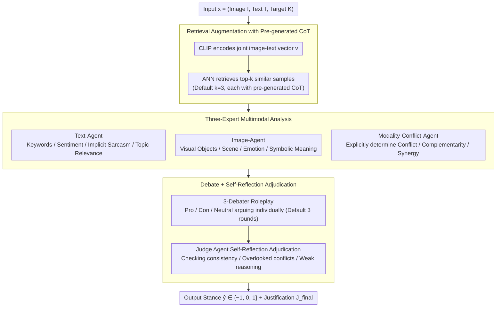

# MM-StanceDet: Retrieval-Augmented Multi-modal Multi-agent Stance Detection

**Conference**: ACL 2026  
**arXiv**: [2604.27934](https://arxiv.org/abs/2604.27934)  
**Code**: https://github.com/luweihai/MM-StanceDet  
**Area**: Multimodal Stance Detection / Multi-agent / RAG  
**Keywords**: Multimodal Stance Detection, Retrieval-Augmented Generation, Multi-agent Debate, Self-reflection, Cross-modal Conflict  

## TL;DR
The authors reconstruct multimodal stance detection into a 4-stage multi-agent pipeline: CLIP retrieval of similar samples providing few-shot CoT, three expert agents (text/image/cross-modal conflict) for analysis, three debater agents (pro/con/neutral) for debating, and a final adjudicator agent for self-reflection and labeling. Across five datasets, it outperforms strong baselines including GPT-4V, TMPT, and MV-Debate in both in-target and zero-shot settings.

## Background & Motivation

**Background**: Stance detection has evolved from pure text (BERT/RoBERTa) to multimodal stance detection (MSD). Existing work mainly falls into two categories: (1) simple feature fusion of independent encoders like BERT+ViT; (2) using prompt tuning (TMPT) to adapt pretrained VLMs for capturing stance features. Recently, using MLLMs like GPT-4V/Qwen-VL as zero-shot judges has emerged as a new direction.

**Limitations of Prior Work**: The authors identify three core bottlenecks: (1) **Contextual Grounding Void**: MLLMs often misjudge nuanced multimodal signals when lacking concrete in-domain samples; (2) **Cross-Modal Interpretation Ambiguity**: When image and text signals conflict or complement each other, MLLMs frequently hallucinate or ignore the conflict (Zhang et al. 2024c empirically showed GPT-4V's significant defects in cross-modal consistency); (3) **Single-Pass Reasoning Fragility**: Directly prompting an LLM for a stance in a single shot lacks a structured process for exploring alternative interpretations, leading to irreversible errors.

**Key Challenge**: While single-model single-pass "emergent reasoning" works in simple scenarios, it has low error tolerance when encountering sarcasm, conflict, or cross-modal nuances. To achieve stability, the human decision-making process of "analysis-debate-reflection" must be explicitly modeled.

**Goal**: To construct a stance detection framework capable of stably processing conflicting multimodal signals through prompt orchestration without fine-tuning any models.

**Key Insight**: Combine RAG (providing concrete examples) + specialized agents (focusing on each modality) + debate (forcing the exploration of three stances) + self-reflection (preventing single-pass errors) to address each pain point individually.

**Core Idea**: Transform "stance judgment" from a single-shot decision into a structured reasoning process using a 4-stage pipeline of multi-agent collaboration, RAG, debate, and reflection.

## Method

### Overall Architecture
For each input $x = (I, T, K)$ (image/text/target), MM-StanceDet executes four sequential stages: (1) **Retrieval Augmentation**: Retrieves top-$k$ similar samples and their pre-generated CoTs from a vector database $\mathcal{D}$; (2) **Multimodal Analysis**: Text-Agent, Image-Agent, and Modality-Conflict-Agent experts output $A_\text{text}$, $A_\text{image}$, and $A_\text{conflict}$ respectively; (3) **Reasoning-Enhanced Debate**: Three debater agents (Support/Oppose/Neutral) receive all analyses and construct arguments for their respective stances; (4) **Self-Reflection and Adjudication**: A judge agent synthesizes the three arguments, the original analyses, and critical reflection to produce the final label $\hat{y} \in \{-1, 0, 1\}$ and justification $J_\text{final}$. All agents use GPT-4o-mini by default; retrieval uses a CLIP encoder + ANN with default $k=3$ and 3 rounds of debate.

### Key Designs

**1. Retrieval Augmentation with Pre-generated CoT: Providing Reasoning Paradigms, Not Just Context**

This step targets the grounding void. The authors use CLIP to encode each training sample $(I_j, T_j)$ into a joint vector $\mathbf{v}_j$ stored in a vector database. Each entry contains the label $y_j$ and an offline MLLM-generated CoT reasoning $C_j$ (explaining the stance logic based on image-text alignment and target relationship). During inference, the query is encoded as $\mathbf{v}$, and ANN retrieves $\mathcal{E}_\text{retrieved} = \text{ANN}(\mathbf{v}, \mathcal{D}, k)$. This differs from traditional RAG by providing the "how to reason" paradigm as knowledge to downstream agents.

**2. Three-Expert Multimodal Analysis: Decomposing Unified MLLM Perception into Complementary Perspectives**

Single-shot MLLMs often suffer from information interference and miss conflict signals when processing text, images, and relationships simultaneously. The authors deploy three specialized agents: Text-Agent $\mathcal{A}_\text{text}(T, K) \to A_\text{text}$ for linguistic features; Image-Agent $\mathcal{A}_\text{image}(I, K) \to A_\text{image}$ for visual semantics; and Modality-Conflict-Agent $\mathcal{A}_\text{conflict}(I, T, K, \mathcal{E}_\text{retrieved}) \to A_\text{conflict}$ to explicitly judge cross-modal consistency. This ensures that capturing sarcasm and irony becomes an explicit output rather than an implicit assumption.

**3. Debate + Self-Reflection Adjudication: Forced Exploration and Hidden Flaw Detection**

To prevent "starting on the wrong foot," three debaters are forced to argue for Pro, Con, and Neutral stances, generating $\text{Arg}_s = \mathcal{A}_s(I, T, K, A_\text{text}, A_\text{image}, A_\text{conflict})$. The final judge agent performs critical self-assessment (inspired by Self-Refine) to check for internal consistency and missed signals from $A_\text{conflict}$, outputting $\hat{y}, J_\text{final} = \mathcal{A}_\text{judge}(\text{Arg}_\text{support}, \text{Arg}_\text{oppose}, \text{Arg}_\text{neutral}, x, A_\text{text}, A_\text{image}, A_\text{conflict})$.

### Loss & Training
This is a fully prompt-based framework that **requires no model training**. Efficiency is optimized through agent prompt design, retrieval parameters, and debate rounds. GPT-4o-mini is the default backbone.

## Key Experimental Results

### Main Results: In-target Macro F1 (%) Excerpt (5 datasets × 12 targets)

| Method | MTSE-DT | MWTWT-AC | MWTWT-AH | MRUC-RUS | MRUC-UKR | MTWQ-MOC |
|------|---------|----------|----------|----------|----------|----------|
| BERT | 48.25 | 63.05 | 59.24 | 41.25 | 46.80 | 57.77 |
| TMPT | 55.41 | 67.25 | 62.92 | 43.56 | 59.24 | 55.68 |
| GPT-4 + CoT | 69.12 | 70.10 | 72.05 | 42.03 | 54.21 | 58.48 |
| GPT-4 Vision | 70.46 | 57.47 | 57.90 | 44.83 | 56.42 | 66.72 |
| MV-Debate | 69.45 | 69.87 | 72.31 | 41.89 | 54.55 | 58.71 |
| BridgeTower | 68.53 | 67.92 | 65.44 | 43.26 | 58.19 | 68.06 |
| **Ours** | **70.12** | **71.93** | 66.50 | **48.34** | **64.02** | **68.13** |

Zero-shot improvements are more significant: gain of +3.3 on MRUC-RUS and +8.2 on MRUC-UKR compared to GPT-4V.

### Ablation Study

| Configuration | MTSE-DT | MWTWT-AC |
|------|---------|----------|
| Text Analysis Agent only | 67.52 | 63.30 |
| Image Analysis Agent only | 42.34 | 57.09 |
| Modality Conflict Agent only | 55.10 | 63.51 |
| Text + Image Analysis | 68.91 | 68.37 |
| Full MM-StanceDet | **70.12** | **71.93** |
| w/o Retrieval Augmentation (RA) | Significant Drop | Significant Drop |
| w/o Multimodal Analysis (MA) | **Largest Drop** | **Largest Drop** |
| w/o Reasoning-Enhanced Debate (RED) | Moderate Drop | Moderate Drop |
| w/o Self-Reflection (SRA) | Minor Drop | Minor Drop |

### Key Findings
- **Multimodal Analysis is the core contributor**: The largest drop occurs when MA is removed, proving that specialized division of labor is superior to unified MLLM perception.
- **Robustness to Retrieval Noise**: Replacing 50% of top-3 retrieved samples with random ones only reduces F1 by 1.2 points on MTSE-DT, as the debate and reflection stages filter out irrelevant noise.
- **Significant Zero-shot Advantages**: The structured reasoning is particularly effective in OOD and low-resource scenarios (e.g., MRUC-UKR).
- **Higher gains on datasets with high cross-modal conflict**: Performance improvements are most pronounced on MRUC (15% conflict rate).

## Highlights & Insights
- **Clear problem-driven modularity**: RA addresses grounding, MA addresses ambiguity, and Debate+Reflection addresses single-pass fragility.
- **CoT as a retrieval unit**: Treating reasoning templates as knowledge (like "analyst notes") is a transferable concept for complex judgment tasks.
- **Explicit conflict signaling**: Making cross-modal consistency a first-class output ensures that downstream logic revolves around these signals, which is highly applicable to fake news detection.

## Limitations & Future Work
- **Limitations**: (1) High latency (~27s per sample) and token cost (~4.8K tokens), unsuitable for real-time applications; (2) Dependency on backbone LLM biases; (3) Reliance on vector database quality for new domains.
- **Future Work**: Exploring mixture retrieval (combining CoT and counterfactual samples) and implementing process reward models for real-time agent scoring.

## Related Work & Insights
- **vs TMPT**: Ours is training-free and significantly outperforms TMPT's prompt tuning (70.12 vs 55.41 on MTSE-DT).
- **vs GPT-4V + CoT**: Single-pass models perform poorly in zero-shot settings, whereas structured debate maintains stability.
- **vs MV-Debate**: While MV-Debate uses multi-view text debate, ours proves that incorporating multimodal analysis provides a substantial performance boost.

## Rating
- Novelty: ⭐⭐⭐
- Experimental Thoroughness: ⭐⭐⭐⭐
- Writing Quality: ⭐⭐⭐⭐
- Value: ⭐⭐⭐⭐

<!-- RELATED:START -->

## Related Papers

- [\[AAAI 2026\] Cross-modal Prompting for Balanced Incomplete Multi-modal Emotion Recognition](../../AAAI2026/social_computing/cross-modal_prompting_for_balanced_incomplete_multi-modal_emotion_recognition.md)
- [\[ICML 2026\] MIND: Multi-Rationale Integrated Discriminative Reasoning Framework for Multi-Modal Fake News](../../ICML2026/social_computing/mind_multi-rationale_integrated_discriminative_reasoning_framework_for_multi-mod.md)
- [\[AAAI 2026\] Multi-modal Dynamic Proxy Learning for Personalized Multiple Clustering](../../AAAI2026/social_computing/multi-modal_dynamic_proxy_learning_for_personalized_multiple_clustering.md)
- [\[AAAI 2026\] T2Agent: A Tool-augmented Multimodal Misinformation Detection Agent with Monte Carlo Tree Search](../../AAAI2026/social_computing/t2agent_a_tool-augmented_multimodal_misinformation_detection_agent_with_monte_ca.md)
- [\[ACL 2026\] Beyond the Crowd: LLM-Augmented Community Notes for Governing Health Misinformation](beyond_the_crowd_llm-augmented_community_notes_for_governing_health_misinformati.md)

<!-- RELATED:END -->
