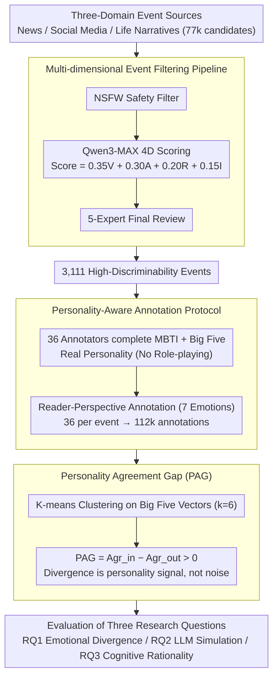

# Persona-E2: A Human-Grounded Dataset for Personality-Shaped Emotional Responses to Textual Events

**Conference**: ACL 2026  
**arXiv**: [2604.09162](https://arxiv.org/abs/2604.09162)  
**Code**: [HuggingFace](https://huggingface.co/datasets/CRIS-Yang/Persona-E2-Dataset)  
**Area**: Social Computing / Affective Computing  
**Keywords**: Personality Modeling, Affective Evaluation, Reader Perspective, MBTI, Big Five

## TL;DR
The authors constructed Persona-E2, the first large-scale dataset linking personality traits (MBTI + Big Five) with reader emotional responses. It contains 112,000 annotations from 3,111 events $\times$ 36 annotators, revealing "personality illusion" in LLMs during simulated emotional responses and demonstrating that Big Five traits mitigate this issue more effectively than MBTI.

## Background & Motivation

**Background**: Affective computing research primarily focuses on emotions expressed by authors in text, overlooking emotional evaluation from the reader's perspective. Most existing datasets aggregate annotations into a single label, obscuring the emotional diversity caused by individual personality differences.

**Limitations of Prior Work**: Role-playing LLMs attempt to simulate personalized responses by injecting personality traits into prompts. However, they often exhibit "personality illusion"—mimicking superficial linguistic styles rather than adopting genuine personality-based cognitive appraisal patterns. Crucially, there is a lack of real human data to verify whether LLMs truly capture personality-driven emotional diversity.

**Key Challenge**: Cognitive appraisal theory suggests that emotions stem from individualized appraisal processes influenced by goals and personality traits. However, the NLP field lacks benchmark datasets systematically linking personality traits with emotional responses. Pseudo-labels generated by LLMs cannot replace real human data for verification.

**Goal**: Construct a reader's emotional response dataset with real personality annotations to: (1) analyze how personality affects emotional appraisal, (2) evaluate LLMs' ability to simulate personalized emotions, and (3) explore whether LLMs can generate psychologically plausible reasoning.

**Key Insight**: Instead of role-playing, real annotators with measured personality traits (MBTI + Big Five) were tasked with annotating emotional responses to events from news, social media, and life narratives. Each event received 36 annotations to ensure dense personality coverage.

**Core Idea**: By combining real personality assessments, dense annotation (36 per event), and cross-domain event coverage, the authors developed the first personality-event-emotion benchmark to evaluate the impact of personality on emotional appraisal and LLM simulation capabilities.

## Method

### Overall Architecture
The construction of Persona-E2 consists of three stages: (1) Event collection and filtering—gathering events from news, social media, and life narratives, filtered through safety checks, multi-dimensional LLM scoring, and expert review to select 3,111 high-quality events from 77,000 candidates; (2) Personalized annotation—recruiting 36 annotators to complete MBTI and Big Five questionnaires and annotate their genuine emotional responses to all 3,111 events; (3) Experimental evaluation of three research questions—analyzing emotional divergence patterns, LLM simulation capabilities, and cognitive plausibility.

### Key Designs

**1. Multi-Dimensional Event Filtering: Retaining events that trigger personality-driven reactions**

For a dataset to distinguish personality differences, the events must trigger diverse reactions. The authors filtered 77,000 candidates down to 3,111 using a three-stage process: an NSFW classifier, a multi-dimensional scoring using Qwen3-MAX ($Score = 0.35V + 0.30A + 0.20R + 0.15I$, where $V$ is personality variability, $A$ is arousal, $I$ is implicitness, and $R$ is source relevance), and final expert review. Prioritizing $V$ ensures the stimuli set is sensitive to personality, making subsequent annotation divergence a structured signal rather than random noise.

**2. Personality-Aware Annotation Protocol: Grounding in real personality rather than stereotypes**

Unlike prior work that asks annotators to simulate a persona (resulting in stereotypical data), this protocol measures the actual personality of 36 annotators using standardized MBTI and Big Five scales. Annotators then provide their genuine reader-perspective responses ("How would you feel when reading this event?") for all 3,111 events across 7 emotion categories. This "no role-playing" design ensures psychological validity as emotional responses are anchored to measured traits.

**3. Personality Agreement Gap (PAG): Verifying that divergence is a personality signal**

To confirm whether disagreement stems from personality or randomness, the authors defined PAG. Annotators were clustered into six groups via K-means based on Big Five vectors. PAG is calculated as the difference between intra-cluster agreement ($Agr_{in}$) and inter-cluster agreement ($Agr_{out}$): $\text{PAG} = Agr_{in} - Agr_{out}$. All clusters yielded positive PAG values (+8.27% to +25.96%), proving that individuals with similar personalities respond more consistently to the same events.

### Loss & Training
This is a dataset paper and does not involve model training. Experimental sections evaluate existing LLMs (GPT-4o, Claude 3.5, Qwen2.5, etc.) in zero-shot and few-shot settings for personalized emotion prediction.

## Key Experimental Results

### Main Results
LLM performance in simulating personalized emotional prediction (Weighted F1):

| Model | News | Social Media | Life Narrative | Average |
|------|------|----------|----------|------|
| GPT-4o (zero-shot) | 0.42 | 0.31 | 0.38 | 0.37 |
| Claude 3.5 | 0.40 | 0.29 | 0.36 | 0.35 |
| Qwen2.5-72B | 0.39 | 0.28 | 0.35 | 0.34 |
| + BFI prompt | 0.45 | 0.34 | 0.41 | 0.40 |
| + MBTI prompt | 0.43 | 0.32 | 0.39 | 0.38 |

### Ablation Study
Impact of personality information on LLM emotion prediction:

| Configuration | Weighted F1 | Description |
|------|---------|------|
| No personality info | 0.37 | Baseline |
| + MBTI Label | 0.38 | 4-letter type provided |
| + BFI Vector | 0.40 | Continuous dimension scores provided |
| + BFI + Cognitive Explanation | 0.42 | Reasoning process required |

### Key Findings
- LLMs perform worst on social media (F1 0.28-0.31) due to textual ambiguity and dependence on personal interpretation.
- Big Five features are significantly more effective than MBTI at mitigating "personality illusion," likely because BFI provides continuous dimensions rather than discrete categories.
- Author-reader emotional divergence is highest in life narratives and lowest in news, suggesting first-person projection amplifies individual differences.
- PAG verification shows ESTP types have the highest personality consistency (+26.98%), while ISTJ is the lowest (+9.68%).

## Highlights & Insights
- A profound insight in the dataset design is that "annotation divergence is a personality signal, not noise." The PAG method can be generalized to any subjective annotation task.
- The scale of 112,000 annotations (36 people $\times$ 3,111 events) is unprecedented, and anchoring each annotation to real traits provides a valuable benchmark for personalized AI.
- The systematic verification of the "personality illusion" reveals that LLMs do not truly understand the impact of personality on cognitive appraisal but rather mimic stereotypes.

## Limitations & Future Work
- The number of annotators (36) is limited; some MBTI types have fewer than 3 participants, preventing robust statistical analysis.
- Only 7 basic emotion categories were used, missing finer-grained dimensions (e.g., mixed emotions, intensity).
- Events are primarily from English sources, limiting cultural diversity.
- Future work could expand the annotator pool and cultural backgrounds to explore the dynamic effects of personality traits.

## Related Work & Insights
- **vs GoodNewsEveryone**: GNE includes author/reader perspectives but lacks personality annotations. Persona-E2 introduces real personality measurements.
- **vs Big5-Chat**: Big5-Chat uses LLMs to generate personalized dialogue data, lacking human verification. Persona-E2 is grounded in genuine human responses.

## Rating
- Novelty: ⭐⭐⭐⭐⭐ First large-scale dataset linking real personality measurements with reader emotional annotations.
- Experimental Thoroughness: ⭐⭐⭐⭐ Comprehensive research questions, though the sample size of 36 is relatively small for psychological standards.
- Writing Quality: ⭐⭐⭐⭐ Clear structure with solid psychological theory.
- Value: ⭐⭐⭐⭐⭐ Provides a much-needed human benchmark for personalized AI and affective computing.

<!-- RELATED:START -->

## Related Papers

- [\[ACL 2026\] Synthia: Scalable Grounded Persona Generation from Social Media Data](synthia_scalable_grounded_persona_generation_from_social_media_data.md)
- [\[ACL 2026\] Imperfectly Cooperative Human-AI Interactions: Comparing the Impacts of Human and AI Attributes in Simulated and User Studies](imperfectly_cooperative_human-ai_interactions_comparing_the_impacts_of_human_and.md)
- [\[ACL 2026\] Point of Order: Action-Aware LLM Persona Modeling for Realistic Civic Simulation](point_of_order_action-aware_llm_persona_modeling_for_realistic_civic_simulation.md)
- [\[ACL 2026\] FigSIM: A Dataset for Fine-grained Suicide Severity and Figurative Language in Suicide Memes](figsim_a_dataset_for_fine-grained_suicide_severity_and_figurative_language_in_su.md)
- [\[ICLR 2026\] BiasFreeBench: a Benchmark for Mitigating Bias in Large Language Model Responses](../../ICLR2026/social_computing/biasfreebench_a_benchmark_for_mitigating_bias_in_large_language_model_responses.md)

<!-- RELATED:END -->
