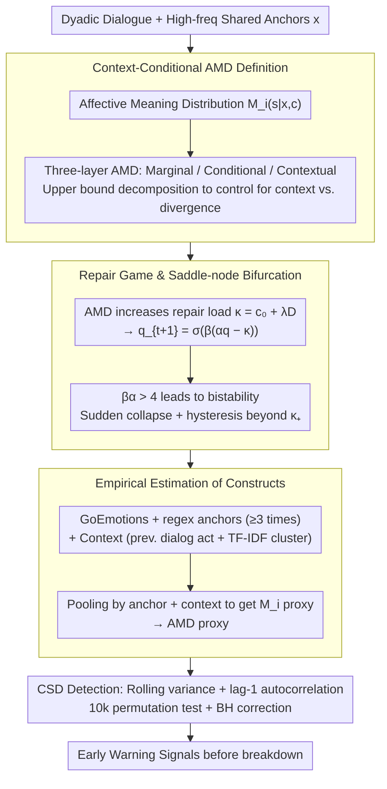

# Phase Transitions in Affective Meaning Divergence: The Hidden Drift Before the Break

**Conference**: ACL2026  
**arXiv**: [2605.09043](https://arxiv.org/abs/2605.09043)  
**Code**: https://github.com/iamdiluxedbutcooler/phase_transition_amd  
**Area**: Social Computing / Dialogue Dynamics / Affective Semantic Modeling  
**Keywords**: Affective Meaning Divergence, Critical Transitions, Dialogue Breakdown, Repair Coordination, Early Warning Signals

## TL;DR
This paper formalizes the phenomenon of "same word, different affective understanding" before dialogue breakdown as Affective Meaning Divergence (AMD). Using entropy-regularized games, it proves that the probability of repair undergoes a saddle-node bifurcation. Empirically, early warning signals of critical slowing down, such as rising variance, are observed in the Conversations Gone Awry (CGA) dataset.

## Background & Motivation
**Background**: Computational research on dialogue breakdown, online harassment, and relationship conflict often examines surface-level toxicity, emotional polarity, lexical differences, or dialogue acts. Datasets like CGA allow researchers to analyze whether a conversation will transition from civil discussion to personal attacks.

**Limitations of Prior Work**: Many metrics only capture explicit conflict that has already manifested, such as toxic words, negative emotions, or intense expressions. However, real-world dialogues often undergo a hidden drift before rupturing: both parties continue to use the same words but have already mapped them to different affective stances. For instance, "Fine" might imply resolution to the speaker but abandonment to the listener.

**Key Challenge**: Dialogue breakdown appears as a sudden event, but many conflicts may result from phase transitions following the accumulation of small, continuous deviations. Traditional linear trends or static classification metrics struggle to explain why a dialogue seems stable initially but collapses abruptly later.

**Goal**: The authors aim to provide both a theoretical and empirical framework: theoretically explaining how affective meaning divergence leads to a sudden collapse of repair coordination from high levels; and empirically testing for signals of critical slowing down (CSD), such as rising rolling variance and autocorrelation, prior to this collapse.

**Key Insight**: The paper synthesizes speech-act theory, common ground, repair theory, appraisal theory, entropy-regularized games, and critical transition theory into a closed loop. The affective uptake of words is modeled as an affective state distribution conditioned on context; as the divergence between these distributions increases, the load on repair actions grows.

**Core Idea**: AMD is measured using the total variation distance between affective distributions conditioned on anchor words. By treating AMD as a load term in a repair game, the paper demonstrates that when interaction gains exceed a threshold, gradual drift triggers a sudden, hysteretic collapse of repair.

## Method
The contribution is divided into two layers: formalization, defining affective meaning divergence and its impact on repair behavior; and estimation/validation, using an NLP pipeline to construct AMD proxies in real dialogue data and detecting critical transition signals.

### Overall Architecture
For a dyadic dialogue, high-frequency shared words are extracted as anchors (e.g., recurring stance words, topic words, or common terms). For each speaker $i$, anchor $x$, and context $c$, affective meaning is defined as $M_i(.|x,c)=P_i(s|x,c)$, representing the distribution of affective states when that speaker uses the anchor in that context. Higher divergence between the two speakers' conditional distributions results in higher AMD.

AMD is then integrated into a minimal repair game. In each round, parties choose to *repair* or *withdraw*. Mutual repair yields a joint benefit, while attempting repair against a withdrawing partner incurs a cost. As AMD increases, repair attempts are more likely to be misread, increasing the effective cost. Entropy-regularized best response yields a one-dimensional dynamical system $q_{t+1}=\sigma(\beta(\alpha q_t - \kappa))$, where $q$ is the repair probability and $\kappa=c_0+\lambda D$ is the load composed of base cost and AMD.

Finally, rolling-window variance and autocorrelation are estimated on the data. Theory predicts that as the system approaches a saddle-node bifurcation, the recovery speed slows down, and noise perturbations persist longer, causing variance and autocorrelation to rise before the breakdown.

### Key Designs

**1. Context-conditional AMD Definition: Distinguishing "same word, different emotion" from "same word, different context"**

Comparing overall emotional distributions of anchor words can be misleading: two people might understand "fine" with the same emotion but use it in different contexts (e.g., closing vs. complaining). The paper decomposes the metric into three layers: marginal AMD (overall distributions $\bar{M}_1(\cdot|x)$ vs $\bar{M}_2(\cdot|x)$), conditional AMD (distributions under the same context $M_1(\cdot|x,c)$ vs $M_2(\cdot|x,c)$), and contextual divergence (where the word is used $P_1(\cdot|x)$ vs $P_2(\cdot|x)$). The paper proves that marginal AMD is upper-bounded by contextual divergence and conditional AMD, implying that empirical estimation must control for context to ensure it measures "the same word sounding different" rather than "using the word in different situations."

**2. Repair Game and Saddle-node Bifurcation: Explaining why gradual drift causes sudden collapse**

To explain why smooth transitions lead to abrupt collapses, repair behavior is modeled as a minimal game: parties choose to repair or withdraw. Mutual repair yields benefit $B$, while unreciprocated repair incurs cost $c_0$. The repair advantage is $\Delta U(q)=Bq-c_0$. Higher AMD increases the risk of misreading repair attempts, raising the load as $\kappa=c_0+\lambda D$. Entropy-regularized best response yields the dynamical system:

$$q_{t+1}=\sigma(\beta(\alpha q_t-\kappa))$$

where $q$ is the repair probability. When $\beta\alpha\le 4$, the fixed point is unique and moves continuously with $\kappa$. If $\beta\alpha>4$, the system develops two stable attractors and an unstable intermediate point. Crossing $\kappa_+$ triggers a sudden jump from a high-repair state to a low-repair state. This provides a testable mechanism for "hidden drift followed by sudden rupture" and naturally introduces hysteresis: once a relationship collapses, lowering the load back to the trigger point is insufficient; it must be lowered below a much smaller $\kappa_-$ to recover.

**3. Empirical Estimation of Constructs: Mapping $P_i(s|x,c)$ to computable proxies**

Since affective distributions are not directly observable, an NLP pipeline approximates them: emotions are represented as 27 classes + neutral distributions from a RoBERTa-base GoEmotions classifier; anchors are shared words appearing $\ge 3$ times; context is defined by previous dialog acts and TF-IDF topic clusters. $M_i$ is the averaged emotional distribution of all utterances by speaker $i$ containing that anchor and context. Crucially, the authors use a context-sensitive classifier rather than static sentiment lexicons to approximate the formal construct, while explicitly labeling these as proxies to maintain theoretical rigor.

### Loss & Training
This paper does not train a generative model but constructs theoretical metrics and statistical tests. The core "objective" involves dynamical system iterations and statistical detection: synthetic experiments iterate the logit best-response map; real-world data involves calculating rolling-window variance and lag-1 autocorrelation. Trends are measured by Kendall's tau over the 5 turns prior to breakdown, with significance derived from 10,000 permutation tests. Repair proxies include dialog-act repair probability `q_DA`, explicit repair markers `q_RM`, and constructive engagement `q_CE=1-P(toxic)`.

## Key Experimental Results

### Main Results
The study includes synthetic validation, CGA-Wiki main experiments, CGA-CMV boundary condition analysis, and lead-time analysis. CGA-Wiki was filtered to 652 dialogues of $\ge 10$ turns (389 derailed, 263 civil); AMD was calculated for 500 dialogues with valid anchor-context cells.

| Synthetic Setting `(alpha,beta)` | `beta alpha` | `kappa_-` | `kappa_+` | Conclusion |
|------|------|------|------|------|
| (2,2) | 4 | Unique fixed point | Unique fixed point | Critical boundary, no bistability |
| (2,3) | 6 | 0.862 | 1.138 | Bistability and hysteresis appear |
| (2,4) | 8 | 0.734 | 1.266 | Bistability region widens |
| (2,5) | 10 | 0.638 | 1.362 | Larger gains lead to more pronounced hysteresis |

| CGA-Wiki Metric | `tau_derail` | `tau_civil` | p | Cohen's d | Interpretation |
|------|------|------|------|---------|------|
| `q_DA` Variance | -0.129 | -0.010 | 0.016 | 0.20 | Dialog-act repair proxy shows CSD |
| `q_RM` Variance | -0.133 | -0.128 | 0.921 | 0.01 | Explicit repair markers are not discriminative |
| `q_CE` Variance | 0.055 | 0.019 | 0.434 | 0.06 | Constructive engagement is not significant |
| AMD Variance | -0.200 | -0.054 | 0.001 | 0.26 | Core theoretical metric is significant |
| Toxicity Variance | 0.055 | 0.019 | 0.444 | 0.06 | Static toxicity dynamics are not significant |
| VADER Variance | 0.086 | 0.007 | 0.093 | 0.14 | Sentiment polarity is weak |
| Lexical Divergence Var | -0.327 | -0.125 | <0.001 | 0.36 | Surface lexical divergence is strongest |
| Lexical Divergence AC1 | 0.081 | -0.061 | <0.001 | 0.29 | Autocorrelation is also significant |

### Ablation Study

| Feature Set | AUC | Gain | Description |
|------|-----|------|------|
| Toxicity trend/mean/max | 0.539 | - | Surface toxicity has weak predictive power |
| + Sentiment | 0.561 | +0.022 | Sentiment means help slightly |
| + Lexical divergence | 0.552 | -0.009 | Static lexical divergence lacks sustained gain |
| + Sentiment AC1 tau | 0.618 | +0.066 | CSD dynamic features bring significant boost |
| + `q_DA` CSD | 0.628 | +0.010 | Repair proxy CSD provides additional contribution |
| + AMD CSD | 0.619 | -0.009 | Highly correlated with other CSD features; no classification gain |

| Boundary Conditions / Lead-time | Result | Meaning |
|------|------|------|
| CGA-CMV `q_CE` Var | p=0.009, d=0.16 | Only hostility dynamics significant in short/noisy threads |
| CGA-CMV `q_DA` Var | p=0.079, d=0.10 | Direction consistent but not significant |
| CGA-CMV AMD Var | p=0.267, d=0.07 | AMD significantly attenuates in this domain |
| CGA-Wiki AMD lead k=0 | p=0.001 | Significant in the final window before breakdown |
| CGA-Wiki AMD lead k=1 | p=0.028, BH ~0.056 | Exploratory evidence for one window in advance |
| Toxicity lead k=2-3 | p=0.005 / 0.001 | Toxicity variance shows "calm before the storm" patterns earlier |

### Key Findings
- Theoretical predictions of bistability and hysteresis were validated through synthetic iterations: when `beta alpha` exceeds 4, small changes in `kappa` trigger jumps from high to low repair states.
- AMD variance is significant on CGA-Wiki even after Benjamini-Hochberg correction, indicating that the proxy for "same word, different affective understanding" captures dynamic signals before breakdown.
- Lexical divergence variance shows the strongest effect, but it measures whether parties use different words; AMD measures different affective uptake of shared words, offering a different level of explanation.
- Ablation shows AMD does not provide additional AUC, suggesting it shares dynamic information with other CSD features. The authors position AMD's value in theoretical grounding and temporal profiling rather than as an independent predictor.
- Replication on CGA-CMV is weaker, supporting the boundary condition that CSD detection requires proximity to the breakdown and clean labels. It suggests the signal is not yet cross-domain robust.

## Highlights & Insights
- The most compelling aspect is the bridge between illocutionary force in pragmatics and phase transitions in dynamical systems. It moves beyond "negative emotions cause fights" to explain why repair mechanisms fail.
- The context-conditional decomposition of AMD is critical. Many semantic drift metrics conflate usage differences with meaning differences; the upper-bound decomposition presented here highlights the necessity of controlling for context in empirical estimation.
- Hysteresis offers high explanatory power for real-world relationships: once a conflict occurs, returning to previous conditions is insufficient for recovery; a stronger intervention is needed to push the system back across the threshold.
- The paper is transparent in distinguishing theoretical constructs from empirical proxies, acknowledging limitations in GoEmotions and anchor extraction, which lends credibility to the findings.

## Limitations & Future Work
- AMD estimation is not a causal online metric. Distributions are estimated using the entire dialogue, including future turns, so lead-time results are not yet a true online early warning system.
- GoEmotions, trained on Reddit, may not capture domain-specific nuances like irony, defensiveness, or face-threatening acts relevant to repair in Wikipedia or CMV.
- Anchor extraction relies on frequency thresholds, potentially including topic words while missing low-frequency but pragmatically crucial expressions. Future work could integrate appraisal lexicons or dialog acts.
- Weak results on CGA-CMV suggest sensitivity to dialogue length, label clarity, and platform domain. More diverse corpora are needed to test generalization.
- Current predictive performance is modest; AMD is better suited as an explanatory dynamic indicator than a high-precision individual-level warning system.

## Related Work & Insights
- **vs. Toxicity Detection**: Toxicity focuses on manifested aggressive content; AMD focuses on the drift in affective uptake of shared words, which is theoretically earlier and more covert.
- **vs. Sentiment/Emotion Trends**: Standard sentiment tracks emotional levels; AMD tracks distributional divergence between individuals on shared terms.
- **vs. Lexical Divergence**: Lexical divergence measures if different words are used; AMD measures if the same word "sounds" different. They are complementary, with the former showing stronger statistical effects and the latter aligning closer to the proposed theory.
- **vs. Dialogue Repair Theory**: Traditional repair analysis is qualitative or rule-based; this work integrates repair probability into a best-response map, enabling testable predictions of critical slowing down.

## Rating
- Novelty: ⭐⭐⭐⭐⭐ Highly original integration of affective divergence, repair games, and saddle-node bifurcations.
- Experimental Thoroughness: ⭐⭐⭐⭐☆ Covers theory, synthesis, and two real-world datasets, though cross-domain replication is weak.
- Writing Quality: ⭐⭐⭐⭐☆ Clear theoretical path with rigorous self-limitation, though formulas may be challenging for general readers.
- Value: ⭐⭐⭐⭐☆ Insightful for social computing and dialogue safety, particularly as an explanatory framework; requires more work for deployment.

<!-- RELATED:START -->

## Related Papers

- [\[ACL 2026\] Justice in Judgment: Unveiling (Hidden) Bias in LLM-assisted Peer Reviews](justice_in_judgment_unveiling_hidden_bias_in_llm-assisted_peer_reviews.md)
- [\[ICLR 2026\] Propaganda AI: An Analysis of Semantic Divergence in Large Language Models](../../ICLR2026/social_computing/propaganda_ai_an_analysis_of_semantic_divergence_in_large_language_models.md)
- [\[ICML 2026\] The Geometric Mechanics of Contrastive Representation Learning: Alignment Potentials, Entropic Dispersion, and Cross-modal Divergence](../../ICML2026/social_computing/the_geometric_mechanics_of_contrastive_representation_learning_alignment_potenti.md)
- [\[ACL 2026\] RV-HATE: Reinforced Multi-Module Voting for Implicit Hate Speech Detection](rv-hate_reinforced_multi-module_voting_for_implicit_hate_speech_detection.md)
- [\[ACL 2026\] PSK@EEUCA 2026: Fine-Tuning Large Language Models with Synthetic Data Augmentation for Multi-Class Toxicity Detection in Gaming Chat](pskeeuca_2026_fine-tuning_large_language_models_with_synthetic_data_augmentation.md)

<!-- RELATED:END -->
