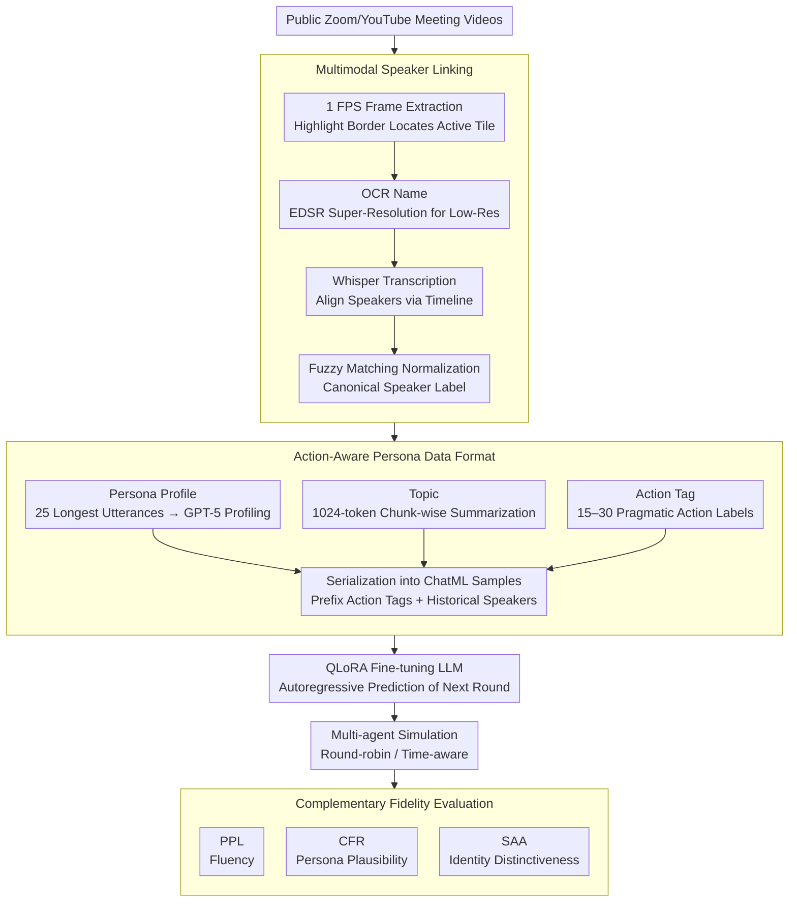

# Point of Order: Action-Aware LLM Persona Modeling for Realistic Civic Simulation

**Conference**: ACL2026  
**arXiv**: [2511.17813](https://arxiv.org/abs/2511.17813)  
**Code**: Not disclosed  
**Area**: Audio & Speech  
**Keywords**: Speaker attribution, action tags, persona modeling, civic deliberation simulation, QLoRA

## TL;DR
This paper converts public Zoom meeting videos into a government deliberation corpus with cross-video traceable speakers, action tags, and persona metadata. By fine-tuning LLMs with QLoRA to generate specific participant utterances, perplexity was reduced by up to 67%, and humans found it difficult to distinguish simulated dialogues from real meeting segments in Turing-style tests.

## Background & Motivation
**Background**: LLM multi-agent simulations can already model debates, negotiations, meetings, and policy discussions. However, many systems still rely on manually written persona prompts: providing each agent with a description of identity, goals, and style, and then letting the models take turns speaking. While this approach has low deployment costs, it struggles to capture stable speaking habits, parliamentary procedures, and long-term interaction structures found in real institutions.

**Limitations of Prior Work**: There are many videos of real public meetings, such as those from courts, school boards, and city councils recorded on Zoom. However, automatic speech recognition (ASR) typically outputs anonymous labels like `Speaker_1`. Without cross-video real identities, models can only learn a generalized "official/board member/judge" speaking style, failing to consistently simulate the issue preferences, phraseology, and procedural actions of a specific individual.

**Key Challenge**: To achieve realistic civic simulation, one needs large-scale real dialogue data, yet this data is naturally noisy: varying video resolutions, switching speaker tiles, ASR errors, and a mix of procedural remarks and extemporaneous debates in multi-party meetings. Simple persona prompts are insufficient, and pure audio diarization cannot provide cross-meeting identities or pragmatic actions.

**Goal**: The authors aim to solve three sub-problems: first, recovering stable speaker identities from ordinary public videos; second, expanding transcripts into training samples containing personas, topics, and action tags; and third, evaluating multi-agent simulations using a set of metrics that measure fluency, persona fidelity, and identity distinctiveness simultaneously.

**Key Insight**: Zoom gallery view provides a usable weak supervision signal: the video tile of the current speaker is highlighted, and the name is usually displayed in the corner of the tile. The authors leverage this visual cue, combining OCR, audio transcription, and textual context to transform anonymous ASR transcripts into speaker-attributed transcripts.

**Core Idea**: Use "traceable identity + action tags + persona metadata" instead of thin persona prompts to allow LLMs to learn who speaks under what agenda using which procedural actions from actual deliberation corpora.

## Method
This paper does not merely propose a prompt but builds a complete pipeline from data construction and metadata extraction to model fine-tuning and simulation evaluation. The key strategy is to first convert public videos into structured dialogue data and then inject this structured information into training and inference, ensuring the model not only speaks "like a government meeting" but also speaks "like a specific participant at a specific stage of the agenda."

### Overall Architecture
The input consists of public YouTube/Zoom meeting recordings. The output includes a speaker-labeled civic deliberation dataset for training and simulation, as well as persona agents fine-tuned for each speaker. The process is divided into four steps: first, identifying active speakers from the video and performing OCR on names; second, transcribing audio with Whisper and aligning segments to normalized speakers; third, extracting persona profiles, meeting topics, and action tags using GPT-5; and finally, serializing context with metadata into ChatML-style samples to fine-tune LLMs with QLoRA to predict the next utterance of the target speaker.

### Key Designs

**1. Multimodal Speaker Linking: Restoring Anonymous `Speaker_1` to Consistent Real Identities**

Pure audio diarization often fragments the identity of the same person in multi-party, noisy, remote meetings. Public meetings often only provide anonymous labels from ASR, causing models to learn a generic "official" tone. This paper exploits the weak supervision signal of the Zoom gallery view: frames are processed at 1 FPS, active tiles are located by highlighted borders, and the name area is cropped for OCR. Low-resolution videos are enhanced with EDSR super-resolution. Whisper transcripts are then assigned to the highlighted speaker based on the timeline, and names are normalized into canonical speaker labels via fuzzy matching. Utilizing UI signals is more stable than pure acoustic features and does not require additional metadata from meeting hosts, enabling the tracking of specific participants.

**2. Action-Aware Persona Data Format: Integrating Style, Agenda, and Pragmatic Actions**

Real deliberation is not free chat; many utterances are procedural actions—proposing motions, asking for clarification, citing materials, or calling for votes. Without these, models cannot learn the "functional" intent of the next sentence. The paper incorporates three types of metadata into training samples: persona profiles (GPT-5 generated summaries of goals, tone, and stances from 25 long monologues), topics (summarized from 1024-token chunks), and action tags (15–30 speech-act labels per utterance). During training, alphabetized action tags and historical speaker labels are prefixed to each utterance, explicitly feeding the "function" of the speech to the model. This explains why action tags reduce perplexity even for non-fine-tuned models—they act as a natural language control signal.

**3. Complementary Fidelity Evaluation: Measuring Plausibility vs. Distinctiveness**

Low perplexity only indicates sentence fluency and does not equate to mimicking a specific person. Since government meetings share standardized phrasing, generating "meeting-like" sentences is easy. The paper adds two metrics beyond PPL: Classifier Fool Rate (CFR), which uses a one-vs-all DeBERTa classifier to see if generated speech is classified as the target speaker's real speech (measuring plausibility); and Speaker Attribution Accuracy (SAA), which uses a multi-class classifier to see if the speech can be correctly attributed to the specific speaker among others (measuring distinctiveness). CFR tests how "human-like" the speaker is, while SAA tests how "unique" they are.

### Loss & Training
The training objective is standard autoregressive language modeling: predicting the target utterance given the speaker-labeled context, persona, topic, and action tags. The authors compared GPT-OSS-120B, LLaMA-3.1-70B, and Qwen-2.5-72B. Fine-tuning utilized QLoRA with learning rates and LoRA alpha tuned via grid search over 5 epochs, selecting the best checkpoint via held-out PPL. Context length was truncated to 1024 tokens. In the simulation phase, agents speak in a round-robin fashion, with a time-aware version including agenda timestamps in the prompt to improve agenda coverage and decision closure.

## Key Experimental Results

### Main Results
The paper constructed three real-world civic deliberation datasets covering courts, school boards, and district councils. While the scale is not massive, each transcript includes identity, topic, action tags, and speaker profiles.

| Dataset | # Transcripts | Avg. Participants | Total Words | Avg. Words/Doc |
| :--- | :--- | :--- | :--- | :--- |
| DC Court of Appeals | 10 | 8.6 | 193,712 | 19,371 |
| Albemarle School Board | 32 | 21.38 | 594,253 | 18,570 |
| Waipā District Council | 80 | 12.125 | 933,272 | 11,666 |

In human validation, utterance speaker identification reached 98.5% and cross-video speaker consistency reached 95.3%. Subjective transcription quality was high, with 55.9% "Strongly agree" and 29.8% "Agree" on accuracy.

| Model/Config | Albemarle PPL↓ | Albemarle CFR↑ | Albemarle SAA↑ | Key Conclusion |
| :--- | :--- | :--- | :--- | :--- |
| GPT baseline w/o tags | 24.68 ± 1.00 | 0.21 ± 0.03 | 0.36 ± 0.02 | Hard to stabilize persona with prompts alone |
| GPT fine-tuned w/o tags | 12.89 ± 0.50 | 0.64 ± 0.04 | 0.48 ± 0.03 | SFT significantly improves style fit |
| GPT fine-tuned w/ tags | 7.73 ± 0.31 | 0.82 ± 0.05 | 0.63 ± 0.04 | Tag-augmented SFT yields maximum gain |
| Qwen baseline w/o tags | 24.64 ± 1.35 | 0.18 ± 0.03 | 0.27 ± 0.02 | Weak speaker traits without SFT |
| Qwen fine-tuned w/ tags | 5.32 ± 0.19 | 0.58 ± 0.03 | 0.31 ± 0.02 | Lowest PPL, but distinctiveness remains hard |

### Ablation Study
The ablation focuses on prompt components, action tags, and time anchoring. System message ablations show that pre-SFT models rely heavily on persona prompts, whereas post-SFT models internalize speaker traits, making excessive prompts potentially noisy.

| Configuration/Analysis | Key Metrics | Description |
| :--- | :--- | :--- |
| Full prompt + baseline w/o tags | PPL 20.37, CFR 0.29, SAA 0.23 | System prompts maintain basic role-play |
| No system prompt + baseline w/o tags | PPL 18.22, CFR 0.08, SAA 0.09 | CFR/SAA drop sharply; model becomes generic |
| Full prompt + fine-tuned w/ tags | PPL 6.64, CFR 0.64, SAA 0.45 | SFT + tags provide most robust quality |
| No micro + fine-tuned w/ tags | PPL 6.53, CFR 0.89, SAA 0.61 | Minimal prompts work better after SFT |
| Time-aware simulation | Topic coverage 71.4%→94.4% (LLaMA) | Anchoring pushes the agenda forward |
| Human Turing test | Correct identification ~44.5% | Near-random performance suggests high realism |

### Key Findings
- Fine-tuning is the primary source of gain: PPL, CFR, and SAA improved across all models and datasets.
- Action tags serve as both training labels and control signals; even without SFT, tags significantly lower PPL.
- CFR is generally higher than SAA, indicating models easily generate speech that "looks like the target" but struggle to replicate styles distinct enough to separate different individuals in the same session.
- Time-aware simulation is more beneficial for LLaMA and Qwen, as GPT already possesses strong inherent planning capabilities.

## Highlights & Insights
- The most ingenious aspect is treating the Zoom UI as a weak supervision sensor. Instead of expensive end-to-end video understanding, the use of highlighted borders and name tiles provides low-cost speaker linking.
- Action tags evolve persona modeling from "speaking like someone" to "speaking like someone during a specific procedural action," which is crucial for civic simulation.
- The CFR/SAA design is insightful: one measures plausibility (fooling a classifier) and the other measures distinctiveness (correct attribution). 
- Time-aware experiments demonstrate that simulation requires agenda-level progress, not just sentence-level realism.

## Limitations & Future Work
- The method depends heavily on the Zoom gallery view layout and public videos with name tiles.
- Whisper ASR may still fail during overlapping speech, noise, or low-quality recordings.
- Persona and action tag extraction rely on GPT-5, raising concerns about cost and annotation bias.
- Simulations use round-robin turn-taking; future work could incorporate next-speaker prediction and interruptions.
- Civic persona simulation is a double-edged sword: useful for policy education but potentially exploitable for forging public discourse.

## Related Work & Insights
- **vs. Traditional Speaker Diarization**: Unlike acoustic clustering, this method uses visual UI cues, which is better for cross-meeting tracking in public videos.
- **vs. Prompt-only Simulation**: While prompt-only methods are lightweight, they suffer from persona drift; SFT internalizes traits into parameters.
- **vs. Reflexion/ReAct Multi-agent Debate**: While those systems focus on reasoning, this work emphasizes style, procedural actions, and agenda progression.

## Rating
- Novelty: ⭐⭐⭐⭐☆
- Experimental Thoroughness: ⭐⭐⭐⭐☆
- Writing Quality: ⭐⭐⭐⭐☆
- Value: ⭐⭐⭐⭐⭐

## Related Papers

- [\[ACL 2026\] Why Are We Moral? An LLM-based Agent Simulation Approach to Study Moral Evolution](why_are_we_moral_an_llm-based_agent_simulation_approach_to_study_moral_evolution.md)
- [\[ACL 2026\] Dynamics of Cognitive Heterogeneity: Investigating Behavioral Biases in Multi-Stage Supply Chains with LLM-Based Simulation](dynamics_of_cognitive_heterogeneity_investigating_behavioral_biases_in_multi-sta.md)
- [\[ACL 2026\] LiveFact: A Dynamic, Time-Aware Benchmark for LLM-Driven Fake News Detection](livefact_a_dynamic_time-aware_benchmark_for_llm-driven_fake_news_detection.md)
- [\[ACL 2026\] Synthia: Scalable Grounded Persona Generation from Social Media Data](synthia_scalable_grounded_persona_generation_from_social_media_data.md)
- [\[ACL 2026\] Persona-E2: A Human-Grounded Dataset for Personality-Shaped Emotional Responses to Textual Events](persona-e2_a_human-grounded_dataset_for_personality-shaped_emotional_responses_t.md)

<!-- RELATED:END -->

<!-- RELATED:START -->

## Related Papers

- [\[ACL 2026\] Why Are We Moral? An LLM-based Agent Simulation Approach to Study Moral Evolution](why_are_we_moral_an_llm-based_agent_simulation_approach_to_study_moral_evolution.md)
- [\[ACL 2026\] Dynamics of Cognitive Heterogeneity: Investigating Behavioral Biases in Multi-Stage Supply Chains with LLM-Based Simulation](dynamics_of_cognitive_heterogeneity_investigating_behavioral_biases_in_multi-sta.md)
- [\[ACL 2026\] LiveFact: A Dynamic, Time-Aware Benchmark for LLM-Driven Fake News Detection](livefact_a_dynamic_time-aware_benchmark_for_llm-driven_fake_news_detection.md)
- [\[ACL 2026\] Synthia: Scalable Grounded Persona Generation from Social Media Data](synthia_scalable_grounded_persona_generation_from_social_media_data.md)
- [\[ACL 2026\] Persona-E2: A Human-Grounded Dataset for Personality-Shaped Emotional Responses to Textual Events](persona-e2_a_human-grounded_dataset_for_personality-shaped_emotional_responses_t.md)

<!-- RELATED:END -->
