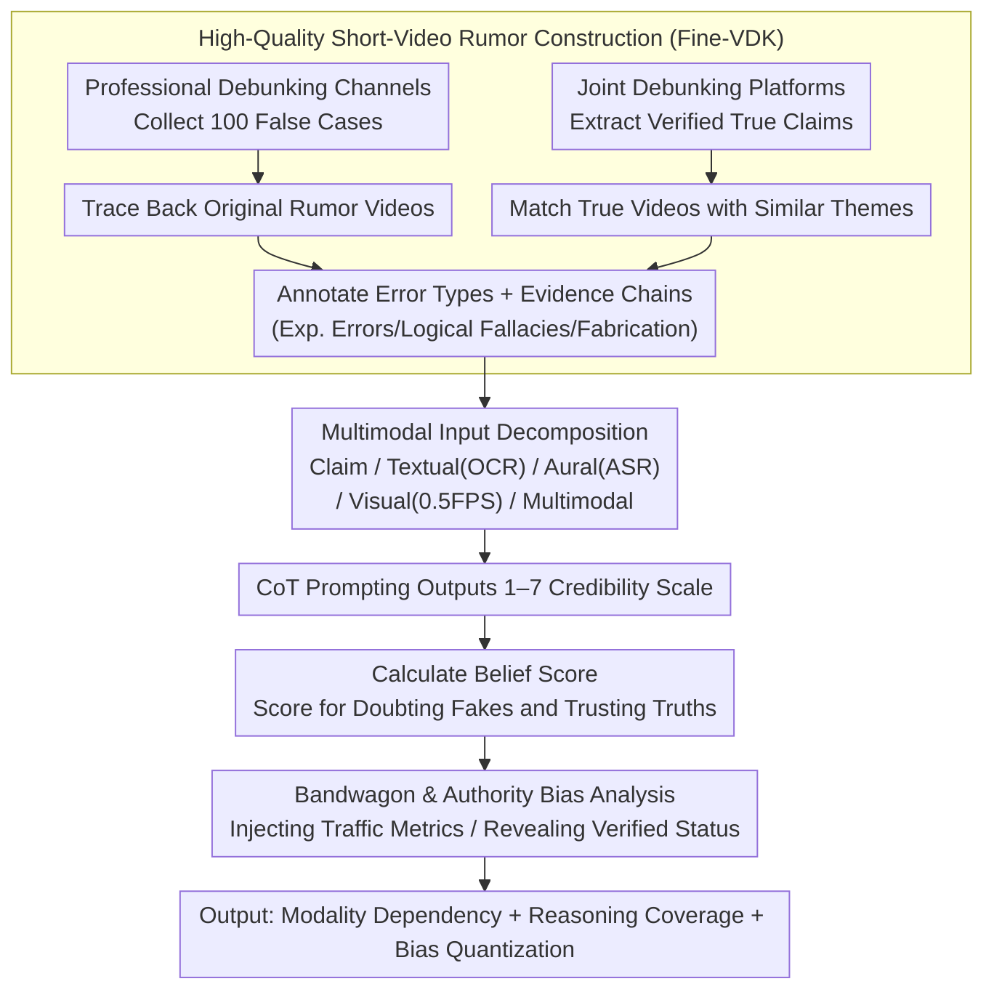

# Probing Multimodal Large Language Models on Cognitive Biases in Chinese Short-Video Misinformation

**Conference**: ACL 2026 Findings  
**arXiv**: [2601.06600](https://arxiv.org/abs/2601.06600)  
**Code**: [GitHub](https://github.com/penguinnnnn/Fine-VDK)  
**Area**: Multimodal VLM / Video Rumor Detection / Model Cognitive Bias Evaluation  
**Keywords**: Short-video rumors, Multimodal Large Language Models, Chinese health information, Cognitive biases, Authority bias

## TL;DR
This paper constructs a high-quality evaluation set of 200 Chinese short health videos. By systematically assessing 8 cutting-edge MLLMs using evidence chains, error types, and social cues, it finds that while Gemini-2.5-Pro is the most robust, most models remain susceptible to label bias, authoritative accounts, and traffic metrics during multimodal rumor judgment.

## Background & Motivation

**Background**: Short-video platforms have become primary channels for disseminating information regarding health, food, and lifestyle. Video rumors are not merely textual; they construct a sense of credibility through experimental demonstrations, subtitles, voiceovers, account certifications, and like counts.

**Limitations of Prior Work**: Existing misinformation benchmarks mostly focus on narrow domains such as news, image-text pairs, or COVID-19, often relying on external fact-checking. This makes it difficult to evaluate whether models can detect errors from the internal experimental logic, argumentation chains, and visual evidence of a video. Many datasets also lack fine-grained annotations for error reasons.

**Key Challenge**: While MLLMs perform strongly on general video understanding benchmarks, short-video rumors resemble "real-world reasoning problems with social signals." Models must simultaneously understand multimodal content and resist human-like heuristic biases, such as perceiving high view counts as higher credibility.

**Goal**: To establish a fine-grained evaluation framework for Chinese short-video rumors and answer three questions: which modality is most critical; whether model reasoning aligns with human-annotated error reasons; and whether models exhibit bandwagon effects or authority biases.

**Key Insight**: The authors start from professional debunking cases to trace back original Douyin/Kuaishou videos. They utilize national standards, academic papers, legal documents, and common sense/Wikipedia as evidence to provide specific error types and reasons for each false video.

**Core Idea**: To elevate short-video rumor evaluation from "binary classification" to a joint diagnosis of "multimodal content + evidence chains + social biases," observing whether models truly understand the errors rather than merely relying on label tendencies.

## Method

### Overall Architecture
The paper constructs the Fine-VDK dataset and designs five input settings and two categories of cognitive bias analysis. The dataset contains 200 short videos (100 false, 100 true) covering four public health-related domains. Each video is decomposed into visual frames, OCR text, and ASR voiceover text, while retaining social metadata like titles, channel IDs, and likes/shares. During evaluation, models provide a credibility score from 1 to 7 via CoT prompts, which is then converted into a Belief Score to measure the model's ability to doubt false content and trust true content.

### Key Designs

**1. High-Quality Data Construction: Trading Scale for Annotation Density**
Automatically crawled or weakly labeled data struggles to pinpoint exactly why a video is false. Existing benchmarks often rely on external fact-checks, bypassing the internal logic of the video. The authors counter-construct Fine-VDK: first collecting 100 false cases from professional debunking sources and finding their original videos. For the truth set, they extract verified claims and match them with videos of similar themes and visual styles. Each false sample is categorized into experimental errors, logical fallacies, or fabricated statements, accompanied by evidence types (e.g., national standards, papers). This high-quality annotation allows for an in-depth evaluation of the reasoning path.

**2. Multimodal Decomposition and Belief Score: Analyzing Information Dependence and Penalizing Label Bias**
In short videos, subtitles, visual experiments, and voiceovers are often redundant yet distracting. Accuracy alone can be inflated by a model's tendency to consistently say "true" or "false." The paper decomposes inputs into five settings—Claim (human-extracted core claim), Textual (OCR), Aural (ASR), Visual (0.5 FPS, max 32 frames), and Multimodal (frames + transcript). For scoring, a 1–7 Likert scale via CoT is converted to a normalized Belief Score: for false videos, a score is only awarded if the judgment is on the "doubt" side of neutral; for true videos, only if it is on the "trust" side. This exposes models that are biased toward "trusting all" or "doubting all."

**3. Bandwagon Effect and Authority Bias Analysis: Testing Influence of Social Cues**
Credibility on real platforms often stems from non-content cues—high view counts and verified accounts. If models replicate this human behavior, they may amplify platform biases. Two controlled experiments were designed: the Bandwagon Effect experiment scales metrics like views and likes in the prompt, while the Authority Bias experiment reveals channel IDs and certification statuses (Unverified, Yellow V Personal, Blue V Enterprise, Red V Organization). By comparing the change in Belief Score before and after including these cues, the influence of social signals can be quantified.

### Loss & Training
This work presents an evaluation framework rather than a newly trained model. The core metric is the normalized Belief Score: for false videos, points are earned only if the model's score is above the neutral point; for true videos, points are earned only if the score is below the neutral point. Otherwise, the score is 0. This design penalizes "always trust" or "always doubt" label biases.

## Key Experimental Results

### Main Results
The All Belief Scores of 8 MLLMs under five input settings are as follows. Note that Claim represents the upper bound reference using human-extracted core statements.

| Model | Claim | Textual | Aural | Visual | Multimodal |
|------|-------|---------|-------|--------|------------|
| GPT-4o-20241120 | 67.5 | 57.3 | 52.0 | 47.3 | 59.3 |
| o3-20250416 | 55.2 | 34.0 | 23.0 | 40.7 | 35.2 |
| Gemini-2.5-Flash | 74.8 | 56.7 | 45.2 | 67.5 | 64.5 |
| Gemini-2.5-Pro | 79.0 | 74.0 | 56.3 | 79.7 | 71.5 |
| Qwen-VL-Max | 55.7 | 55.5 | 55.2 | 60.3 | 50.8 |
| Qwen-2.5-VL-72B | 53.8 | 53.0 | 38.3 | 44.5 | 52.2 |
| Claude-Sonnet-4 | 62.0 | 48.3 | 44.3 | 31.3 | 47.5 |
| Seed-1.6-Thinking | 74.5 | 60.8 | 53.0 | 71.0 | 65.5 |
| **Average** | **65.3** | **55.0** | **45.9** | **55.3** | **55.8** |

### Ablation Study

| Analysis Object | Key Statistic | Conclusion |
|----------|----------|------|
| Domain Difficulty | Avg Multimodal BS: Agriculture 41.5, Food 59.1, Chemistry/Materials 46.8, Health/Medical 66.5 | Health common sense is easiest; material updates are most difficult. |
| Error Type | Logical Fallacy Multimodal BS: 45.9, lower than Exp. Error (51.8) and Fabrication (53.0) | Models struggle most with identifying breaks in argumentation chains. |
| Certification Status | False set avg BS with Channel ID: Unverified 73.0, Organization certified 36.8 | Authoritative accounts significantly reduce the model's skepticism toward fakes. |
| ID Reliability | GPT-4o's reliable ratio: 2.25% for false-set IDs vs. 28.8% for true-set IDs | Models implicitly judge account credibility before determining truthfulness. |

### Key Findings
- Gemini-2.5-Pro is the most consistent model, reaching an All BS of 71.5 in Multimodal, though not all models benefit from multimodal input.
- The Aural setting averages only 45.9, approximately 10 points lower than Textual, Visual, or Multimodal, indicating that voiceover noise significantly impacts performance.
- Qwen models tend to be more "trusting" (high scores on truth, low on fakes), while o3 is overly conservative, failing to trust even true videos.
- While multimodal input does not always yield the highest truth-judgment score, it enhances CoT coverage of human-annotated error reasons, improving explanation quality.
- High traffic metrics do not simply induce models to believe fakes; instead, they tend to reinforce the model's existing judgment confidence.

## Highlights & Insights
- The dataset size is small (200), but the annotation density is high: every false video contains error reasons and evidence types, making it superior to large-scale weakly labeled sets for diagnosing reasoning.
- The Belief Score design effectively exposes label bias. Unlike accuracy, it treats the ability to doubt and the ability to trust as separate dimensions.
- Introducing cognitive bias into MLLM rumor evaluation is highly practical. In short-video scenarios, account metadata and likes are integral parts of the content.
- The observation that "Claim performs best, but Multimodal explains better" suggests that human extraction reduces noise but also removes the real-world complexity models must learn to handle.

## Limitations & Future Work
- The data is sourced from the Simplified Chinese ecosystem; rumors related to specific cultures or platform mechanisms may not generalize across languages.
- The small sample size limits statistical power when cross-analyzing domains, error types, and truth labels.
- Evaluation depends on current cutting-edge models and prompts; future model iterations or video interfaces may shift these conclusions.
- The dataset focuses on health and lifestyle rumors, lacking coverage of high-stakes scenarios like politics or finance.
- Bandwagon and authority experiments are controlled; complex social contexts like comment sections or follower profiles have not yet been integrated.

## Related Work & Insights
- **vs FakeSV / FMNV**: These focus on news or broad fake-video detection; this work emphasizes Chinese health rumors with fine-grained evidence chains.
- **vs Textual Rumor Detection**: Text tasks focus on claim-evidence relations, while this work integrates visual demonstrations and social cues.
- **vs General MLLM Benchmarks**: Benchmarks like MMMU assess multimodal understanding; this work evaluates the robustness of factual judgment under real-world noise.

## Rating
- **Novelty**: ⭐⭐⭐⭐ Combines short-video rumors, fine-grained evidence, and cognitive biases with a realistic problem definition.
- **Experimental Thoroughness**: ⭐⭐⭐⭐ Comprehensive analysis across modalities, domains, and social cues, though limited by sample size.
- **Writing Quality**: ⭐⭐⭐⭐ Clear explanation of data construction and findings; well-structured despite many tables.
- **Value**: ⭐⭐⭐⭐⭐ Highly valuable for assessing factual judgment and platform-context robustness in Chinese multimodal models.

<!-- RELATED:START -->

## Related Papers

- [\[ACL 2026\] Dynamics of Cognitive Heterogeneity: Investigating Behavioral Biases in Multi-Stage Supply Chains with LLM-Based Simulation](dynamics_of_cognitive_heterogeneity_investigating_behavioral_biases_in_multi-sta.md)
- [\[ACL 2026\] Inertia in Moral and Value Judgments of Large Language Models](inertia_in_moral_and_value_judgments_of_large_language_models.md)
- [\[ACL 2025\] A Survey on Proactive Defense Strategies Against Misinformation in Large Language Models](../../ACL2025/social_computing/a_survey_on_proactive_defense_strategies_against_misinformation_in_large_languag.md)
- [\[ACL 2026\] SPAGBias: Uncovering and Tracing Structured Spatial Gender Bias in Large Language Models](spagbias_uncovering_and_tracing_structured_spatial_gender_bias_in_large_language.md)
- [\[CVPR 2026\] Probabilistic Concept Graph Reasoning for Multimodal Misinformation Detection](../../CVPR2026/social_computing/probabilistic_concept_graph_reasoning_for_multimodal_misinformation_detection.md)

<!-- RELATED:END -->
