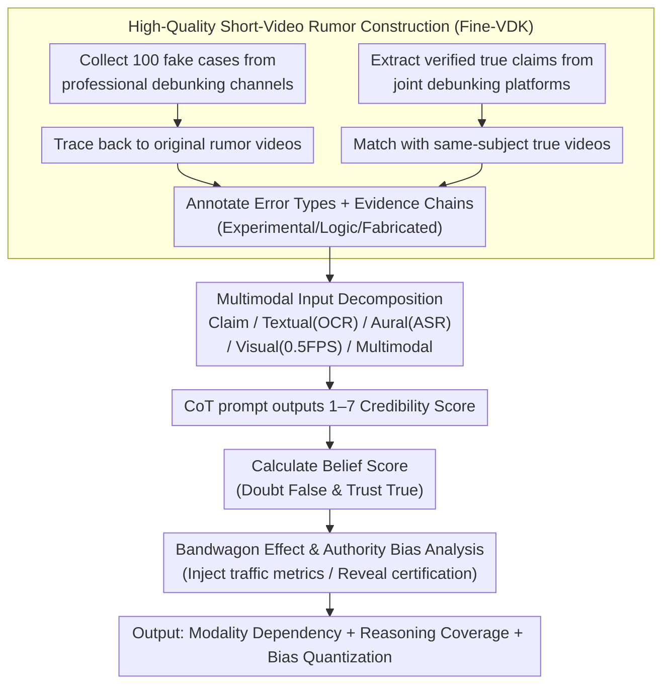

# Probing Multimodal Large Language Models on Cognitive Biases in Chinese Short-Video Misinformation

**Conference**: ACL 2026 Findings  
**arXiv**: [2601.06600](https://arxiv.org/abs/2601.06600)  
**Code**: [GitHub](https://github.com/penguinnnnn/Fine-VDK)  
**Area**: Multimodal VLM / Video Rumor Detection / Model Cognitive Bias Evaluation  
**Keywords**: Short-Video Misinformation, Multimodal Large Language Models, Chinese Health Information, Cognitive Bias, Authority Bias

## TL;DR
This paper constructs a high-quality evaluation set of 200 Chinese health short-video rumors (Fine-VDK). By systematically evaluating 8 cutting-edge MLLMs using evidence chains, error types, and social cues, the study finds that Gemini-2.5-Pro is the most stable. However, most models remain susceptible to label bias, authoritative accounts, and traffic metrics in multimodal rumor judgment.

## Background & Motivation

**Background**: Short-video platforms have become primary channels for health, food, and lifestyle information. Video rumors are not merely textual; they construct credibility through experimental demonstrations, subtitles, voiceovers, account certifications, and "like" counts.

**Limitations of Prior Work**: Existing misinformation benchmarks mostly focus on narrow domains like news, text-image pairs, or COVID-19. They often rely on external fact-checking, making it difficult to assess whether models can detect errors from internal experimental logic, argumentation chains, and visual evidence. Many datasets also lack fine-grained annotations for reasons behind errors.

**Key Challenge**: While MLLMs are powerful in general video understanding benchmarks, short-video rumors represent "real-world reasoning problems with social signals." Models must understand multimodal content while resisting human-like heuristic biases, such as perceiving high view counts as more credible or official accounts as more authoritative.

**Goal**: To establish a fine-grained evaluation framework for Chinese short-video rumors to answer three questions: which modality is most important; whether model reasoning covers human-annotated error reasons; and whether models exhibit bandwagon effects and authority biases.

**Key Insight**: The authors start from professional debunking cases, trace back to the original Douyin / Kuaishou videos, and use national standards, academic papers, legal documents, and common sense/Wikipedia as evidence to annotate error types and reasons for each false video.

**Core Idea**: To elevate short-video rumor evaluation from "binary classification" to a joint diagnosis of "multimodal content + evidence chain + social bias," observing whether the model truly understands the error rather than making judgments based solely on label tendencies.

## Method

### Overall Architecture
The paper constructs the Fine-VDK dataset and designs five input settings and two types of cognitive bias analysis around it. The dataset contains 200 short videos (100 fake, 100 real), covering four public health-related domains. Each video is decomposed into visual frames, OCR text, and ASR voiceover text, while retaining social metadata like titles, channel IDs, and like/share counts. During evaluation, models provide a credibility score from 1 to 7 using CoT prompts. These are converted into Belief Scores to measure the model's ability to doubt false content and trust true content.

### Key Designs

**1. High-Quality Data Construction: Trading Scale for Annotation Density to Verify "Why it's Wrong"**

Automatically crawled or weakly labeled data makes it hard to determine exactly where a video is incorrect, and existing benchmarks often lack internal logic. The authors reverse-construct Fine-VDK: first collecting 100 fake cases from professional debunkers and tracing back to the originals; then extracting verified true claims and matching them with visually similar videos for a balanced set of 200 samples across four health domains. Each fake sample is categorized (Experimental Error, Logical Fallacy, Fabricated Claim) with evidence types. Standardizing quality over quantity allows evaluation of reasoning paths rather than simple classification.

**2. Multimodal Decomposition & Belief Score: Analyzing Modality Dependency and Penalizing Label Bias**

Subtitles, visual experiments, and voiceovers in short videos are often redundant yet distracting. Accuracy alone can be masked by biases like "always saying true." The paper splits inputs into five settings—Claim (human-refined key claim as upper bound), Textual (OCR), Aural (ASR), Visual (0.5 FPS sampling), and Multimodal (frames + transcript). For scoring, models use CoT to give a 1–7 Likert credibility rating, converted to a normalized Belief Score: false videos only score if the rating is towards "doubt," and true videos only score if the rating is towards "trust." This exposes models that consistently over-trust or over-doubt.

**3. Bandwagon Effect & Authority Bias Analysis: Testing Susceptibility to External Social Cues**

Rumor credibility often stems from non-content cues—high view counts and certified accounts. If models mimic human heuristics, they may amplify platform biases. The authors design two controlled experiments: the bandwagon effect experiment scales traffic metrics (likes, shares) in prompts; the authority bias experiment reveals channel IDs and certification levels (Uncertified, Yellow V person, Blue V enterprise, Red V organization). Changes in Belief Score quantify how much social signals drive model judgment compared to video content.

### Loss & Training
This work is an evaluation framework rather than a training task. The core metric is the normalized Belief Score: false videos receive a score only if the model's credibility rating is above the neutral point; true videos receive a score only if the rating is below the neutral point; otherwise, the score is 0. This design penalizes "always trust" or "always doubt" label biases.

## Key Experimental Results

### Main Results
All Belief Scores for 8 MLLMs across five input settings. "Claim" serves as the upper bound reference and does not represent the model's raw video processing capability.

| Model | Claim | Textual | Aural | Visual | Multimodal |
|------|-------|---------|-------|--------|------------|
| GPT-4o-20241120 | 67.5 | 57.3 | 52.0 | 47.3 | 59.3 |
| o3-20250416 | 55.2 | 34.0 | 23.0 | 40.7 | 35.2 |
| Gemini-2.5-Flash | 74.8 | 56.7 | 45.2 | 67.5 | 64.5 |
| Gemini-2.5-Pro | 79.0 | 74.0 | 56.3 | 79.7 | 71.5 |
| Qwen-VL-Max | 55.7 | 55.5 | 55.2 | 60.3 | 50.8 |
| Qwen-2.5-VL-72B | 53.8 | 53.0 | 38.3 | 44.5 | 52.2 |
| Claude-Sonnet-4 | 62.0 | 48.3 | 44.3 | 31.3 | 47.5 |
| Seed-1.6-Thinking | 74.5 | 60.8 | 53.0 | 71.0 | 65.5 |
| **Average** | **65.3** | **55.0** | **45.9** | **55.3** | **55.8** |

### Ablation Study

| Analysis Target | Key Metric | Conclusion |
|----------|----------|------|
| Domain Difficulty | Avg Multimodal BS: Agriculture 41.5, Food 59.1, Chemistry/Materials 46.8, Health/Medical 66.5 | Health common sense is easiest; industrial/material items are harder. |
| Error Type | Logical Fallacy Multimodal BS is 45.9, lower than Experimental (51.8) and Fabricated (53.0) | Models struggle most with broken argumentation chains. |
| Certification | Avg BS for fake subset with Channel ID: Uncertified 73.0, Org-certified 36.8 | Authoritative accounts significantly reduce the model's suspicion of false content. |
| ID Reliability | GPT-4o reliable ratio: 2.25% for false-set IDs, 28.8% for true-set IDs; Qwen-2.5: 1.12% vs 19.2% | Models implicitly judge account credibility first, which then influences truthfulness judgment. |

### Key Findings
- Gemini-2.5-Pro is the most stable model (Multimodal All BS: 71.5), though not all models benefit from multimodal input.
- Aural settings average only 45.9, significantly lower than Textual, Visual, or Multimodal, indicating that noise in voiceover transcripts impacts model judgment significantly.
- The Qwen series tends to trust videos (high true-subset scores, low false-subset scores), while o3 shows excessive conservatism, hesitating to trust even true videos.
- While multimodal input doesn't always yield the highest judgment scores, it improves CoT coverage of human-annotated error reasons, enhancing explanation quality.
- High traffic metrics do not simply induce trust in fake videos but rather boost the model's existing confidence; authoritative accounts more directly influence truthfulness perception.

## Highlights & Insights
- High annotation density despite a small scale (200 samples): each fake video includes error reasons, evidence types, and patterns, making it superior to large weakly labeled sets for diagnosing reasoning.
- The Belief Score design effectively exposes label bias. Unlike accuracy, it separates the assessment of true and false subsets to prevent models from gaming the metric.
- Introducing cognitive bias concepts into MLLM rumor evaluation is highly practical. In short-video scenarios, accounts and engagement metrics are part of the content; models cannot be evaluated only on decontextualized data.
- The "Claim is best, Multimodal is for explanation" phenomenon suggests that human extraction of claims reduces noise but also removes the real-world complexity models need to handle.

## Limitations & Future Work
- Data is sourced from the Simplified Chinese ecosystem; rumors related to specific cultures, platform mechanisms, and habits require re-validation across languages and platforms.
- Small sample size: although significance analysis was performed, statistical power is limited when cross-analyzing domains, error types, and truth labels.
- Evaluation depends on current cutting-edge models and prompt templates; future model versions and CoT strategies may alter conclusions.
- Coverage of high-risk misinformation such as politics, finance, and disasters is insufficient.
- The experiments on Channel IDs and traffic are controlled analyses; complex social contexts like ranking algorithms, comment sections, and follower profiles are not yet integrated.

## Related Work & Insights
- **vs FakeSV / FMNV**: These are oriented toward news or broad fake-video detection; this work emphasizes Chinese health rumors with fine-grained error types and evidence.
- **vs Textual Rumor Detection**: Textual tasks often only judge claim-evidence relations, while this work handles video demonstrations, subtitles, voiceovers, and social cues.
- **vs General MLLM Benchmarks**: MMMU/MMBench evaluate general multimodal understanding; this work evaluates fact-judgment robustness under real-world noise and cognitive biases.

## Rating
- Novelty: ⭐⭐⭐⭐ Combines short-video rumors, fine-grained evidence, and cognitive bias with strong practical relevance.
- Experimental Thoroughness: ⭐⭐⭐⭐ Comprehensive analysis of modalities, domains, and social cues, though limited by sample scale.
- Writing Quality: ⭐⭐⭐⭐ Clear data construction and findings; well-structured despite many tables.
- Value: ⭐⭐⭐⭐⭐ Highly valuable for evaluating factual judgment and platform-context robustness of Chinese multimodal models.

<!-- RELATED:START -->

## Related Papers

- [\[ACL 2026\] Dynamics of Cognitive Heterogeneity: Investigating Behavioral Biases in Multi-Stage Supply Chains with LLM-Based Simulation](dynamics_of_cognitive_heterogeneity_investigating_behavioral_biases_in_multi-sta.md)
- [\[ACL 2025\] A Survey on Proactive Defense Strategies Against Misinformation in Large Language Models](../../ACL2025/social_computing/a_survey_on_proactive_defense_strategies_against_misinformation_in_large_languag.md)
- [\[ACL 2026\] Inertia in Moral and Value Judgments of Large Language Models](inertia_in_moral_and_value_judgments_of_large_language_models.md)
- [\[ACL 2026\] SPAGBias: Uncovering and Tracing Structured Spatial Gender Bias in Large Language Models](spagbias_uncovering_and_tracing_structured_spatial_gender_bias_in_large_language.md)
- [\[ACL 2026\] ToxiTrace: Gradient-Aligned Training for Explainable Chinese Toxicity Detection](toxitrace_gradient-aligned_training_for_explainable_chinese_toxicity_detection.md)

<!-- RELATED:END -->
