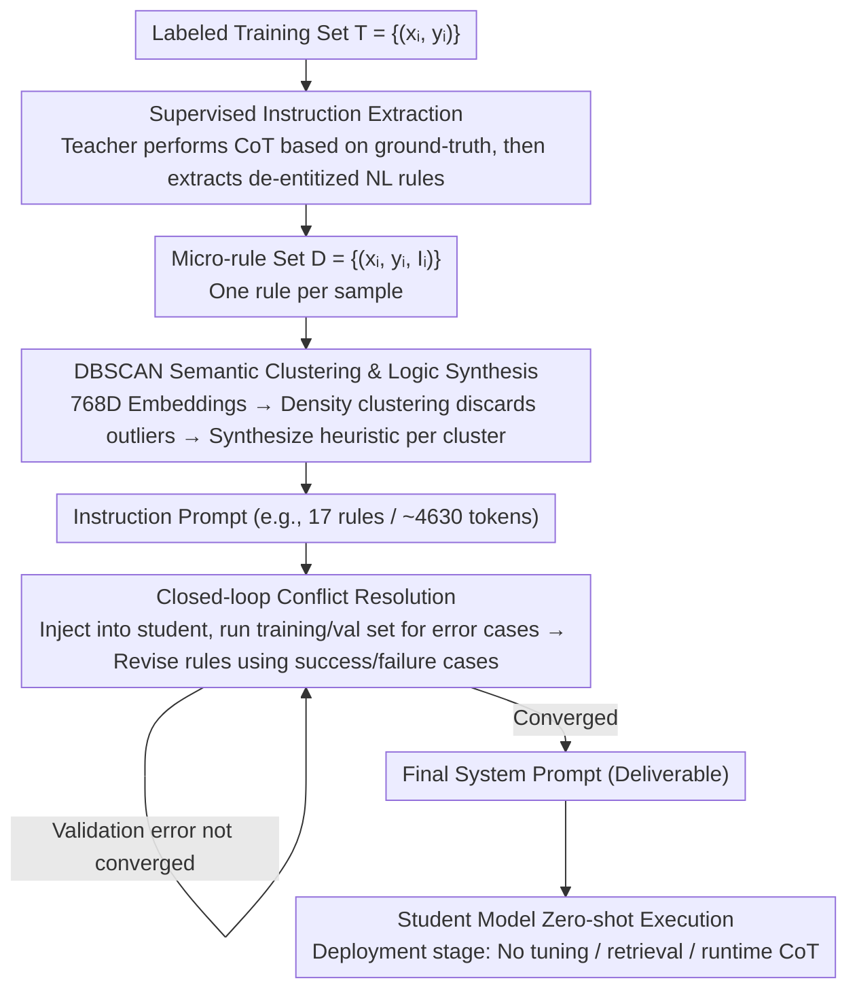

# Prompt-Level Distillation: A Non-Parametric Alternative to Model Fine-Tuning for Efficient Reasoning

**Conference**: ACL2026  
**arXiv**: [2602.21103](https://arxiv.org/abs/2602.21103)  
**Code**: Not disclosed  
**Area**: LLM Efficiency / Prompt Optimization / Reasoning Distillation  
**Keywords**: Prompt Distillation, Non-parametric Fine-tuning, Instruction Clustering, Conflict Resolution, Reasoning Efficiency

## TL;DR
This paper proposes Prompt-Level Distillation (PLD), which extracts, clusters, and resolves reasoning patterns from a teacher model on training samples to generate a system prompt for the student model. This significantly enhances the reasoning and classification capabilities of small models without updating parameters.

## Background & Motivation
**Background**: Complex reasoning tasks typically rely on Chain-of-Thought (CoT) prompting, where models generate intermediate reasoning before the final answer. While effective for logical inference, compliance judgment, and reading comprehension, this approach introduces additional tokens, latency, and inference costs.

**Limitations of Prior Work**: Industrial systems often use fine-tuned small models to replace expensive CoT reasoning. However, fine-tuning requires training data, resources, and model version management. Furthermore, when teacher models are updated or business rules change, student models must be retrained; for closed-source small models or fast-iterating scenarios, maintenance costs are high.

**Key Challenge**: Reasoning capabilities require complex rules, yet production environments demand low latency, auditability, and easy maintenance. Embedding reasoning rules into weights creates a "black box," while runtime CoT is too slow. The authors aim to move "reasoning" to an offline stage, explicitly saving reusable logic in prompts.

**Goal**: Propose a non-parametric distillation framework, PLD, that extracts generalizable natural language instructions from a teacher model using labeled training sets and synthesizes a conflict-free system prompt for student models to execute zero-shot.

**Key Insight**: The paper focuses on reasoning-intensive classification, where input boundaries are relatively static and rules can be summarized (e.g., contract clause relations, bias identification, logical QA). This setting allows for "compressing reasoning into an instruction library."

**Core Idea**: Instead of distilling teacher outputs into student weights, the decision logic of the teacher is distilled into a system prompt, enabling small models to execute pre-mined rules at near zero-shot speeds.

## Method
PLD can be understood as an offline compilation pipeline: extracting micro-rules from each training sample, merging similar rules into general heuristics, and driving conflict resolution using error cases from the student model. The final output is not a new model but a readable, auditable, and replaceable consolidated instruction set.

### Overall Architecture
The input consists of a labeled training set $T=\{(x_i,y_i)\}$, a teacher model, a student model, and the target task format. In the first phase, the teacher model explains why a sample belongs to a label under ground-truth constraints and abstracts a natural language rule without specific entities, forming $D=\{(x_i,y_i,I_i)\}$. In the second phase, these rules are embedded in vector space, semantic clusters are found using DBSCAN, and a strong model synthesizes each cluster into a more general instruction. In the third phase, the current instruction prompt is deployed to the student model to identify errors on training/validation samples, and a conflict resolution model corrects rules based on success and failure cases. During deployment, the final system prompt is injected into the student model without requiring retrieval, fine-tuning, or runtime CoT.

### Key Designs

**1. Supervised Instruction Extraction: Compressing Sample-level Reasoning into Transferable Rules**

Simply letting the teacher generate answers prevents the student from learning discriminative boundaries; saving full CoT is too long and contains sample-specific details. PLD requires the teacher to perform two tasks in one call: conduct a CoT analysis based on ground-truth labels, and then abstract that analysis into a natural language instruction devoid of specific entities. This anchors reasoning in the correct direction via label supervision while stripping sample-specific content to retain reusable logic, resulting in $D=\{(x_i,y_i,I_i)\}$.

**2. DBSCAN Semantic Clustering & Logic Synthesis: Growing Rules from Data Density**

Extraction per sample produces a massive number of redundant, fragmented, and local micro-rules. Merging too aggressively averages out minority classes and edge rules. PLD uses Gemini Embedding to encode each rule into a $768$-dimensional vector, then applies DBSCAN (cosine distance, $\epsilon=0.4$, `min_samples=6`). It does not force every point into a cluster; outlier rules are discarded as noise, preventing sample contamination of the system prompt. Each cluster is then synthesized into a unified heuristic by Gemini 3 Pro. The number of rules "grows" from data density; for Contract-NLI, this converged to 17 rules (approx. 4,630 tokens).

**3. Closed-loop Conflict Resolution: Recovering Long-tail Boundaries via Student Mistakes**

One-time clustering synthesis may average out minority rules and fails to cover rule priorities or exceptions. PLD injects the current instruction set into the student model, runs it on the training/validation set, and specifically identifies cases where the "model followed rules but still predicted incorrectly." These failure cases, along with success cases, are provided to a conflict resolution model to generate revised rules until validation error converges. Providing both success and failure cases is critical to preventing the model from overturning correct behaviors while fixing errors. This step contributes a $\sim 2.5\%$ Macro-F1 gain on Contract-NLI, primarily addressing overlapping boundaries.

### Main Results
Using Contract-NLI as an example: Approximately 7,190 labeled clauses enter the extraction phase; the teacher produces a de-entitized rule for each. After embedding into $768$D vectors, DBSCAN ($\epsilon=0.4$) compresses them into 17 semantic clusters and synthesizes 17 heuristics, forming a system prompt of $\sim 4,630$ tokens. At this stage, Gemma-3 4B achieves a Macro-F1 of 0.81. After closed-loop conflict resolution, the F1 rises to 0.83. No further steps are needed during deployment—the 4,630-token prompt is the final deliverable.

### Loss & Training
PLD does not update student model parameters, so there is no traditional training loss. "Optimization" occurs during prompt searching and error loops. The extraction phase maximizes rule explainability relative to labels; the clustering phase balances prompt length and coverage; the conflict resolution phase stops when the student model's error rate converges. Experiments used Gemini 3 Flash for extraction and Gemini 3 Pro for synthesis/resolution. Student models included Gemma-3 4B, Mistral Small 3.1 24B, and Gemini 2 Flash. Baselines included zero-shot, 5-shot, TextGrad, and LoRA fine-tuning for Gemma/Mistral.

## Key Experimental Results

### Main Results
The paper evaluates PLD on StereoSet, Contract-NLI, and LogiQA. Macro-F1 is reported for StereoSet and Contract-NLI; Accuracy is reported for LogiQA.

| Task / Student Model | Zero-shot | TextGrad | Clustered-Inst. | Post-Conflict | Key Conclusion |
|-----------------|-----------|----------|-----------------|---------------|----------|
| StereoSet / Gemma-3 4B | 0.57 | 0.87 | 0.90 | 0.90 | PLD elevates small models to near-strong model levels |
| Contract-NLI / Gemma-3 4B | 0.67 | 0.74 | 0.81 | 0.83 | Conflict resolution yields gains in logic tasks |
| LogiQA / Gemma-3 4B | 0.67 | 0.69 | 0.69 | 0.70 | Small but stable improvements |
| StereoSet / Mistral Small 3.1 | 0.65 | 0.96 | 0.96 | 0.97 | Effective across different architectures |
| Contract-NLI / Gemini 3 Flash | 0.77 | 0.76 | 0.84 | 0.86 | Teacher-level models also benefit from explicit rules |

### Ablation Study
| Configuration | Key Metric | Description |
|------|----------|------|
| Contract-NLI, $\epsilon=0.2$ / `min_samples=6` | 27 clusters / 6,449 tokens / F1 0.79 | Overly fragmented; prompt is long and performance drops |
| Contract-NLI, $\epsilon=0.4$ / `min_samples=6` | 17 clusters / 4,630 tokens / F1 0.83 | Selected trade-off configuration |
| Contract-NLI, $\epsilon=0.5$ / `min_samples=6` | 14 clusters / 4,068 tokens / F1 0.80 | Coarse merging; fine-grained logic lost |
| Contract-NLI, 1,030 examples | 16 clusters / 4,062 tokens / F1 0.77 | Small data can already identify major themes |
| Contract-NLI, 7,190 examples | 18 clusters / 4,630 tokens / F1 0.83 | More data refines existing clusters rather than growing prompt infinitely |

### Key Findings
- Gemma-3 4B increased from 0.57 to 0.90 on StereoSet and from 0.67 to 0.83 on Contract-NLI, indicating non-parametric prompt distillation can bridge the gap between small and strong models.
- Gemma-3 4B is reportedly $25\times$ cheaper and $80\times$ faster than Gemini 3 Flash; PLD’s value lies in shifting runtime CoT costs to offline prompt compilation.
- Conflict resolution provides a $\sim 2.5\%$ Macro-F1 gain on Contract-NLI but almost no gain on StereoSet, suggesting it primarily aids overlapping boundaries and complex exceptions.
- Dataset-size ablation shows cluster count stabilizes around 18 even at $7,000+$ samples, supporting the claim that more data improves rule quality without linear prompt growth.

## Highlights & Insights
- Shifting distillation from "weights" to "auditable prompts" is ideal for compliance, legal, and finance scenarios requiring human verification of rules.
- DBSCAN is an apt choice: it discards outlier rules to prevent sample contamination while allowing the rule library to grow naturally without a preset cluster count.
- Emphasizing both success and failure cases during conflict resolution prevents regression, making it more suitable for production iteration than many automated prompt optimizers.
- PLD compresses semantic reasoning paths rather than tokens. Unlike prompt compression, it "compiles" a teacher model into a task-specific "precedent manual."

## Limitations & Future Work
- Limited to reasoning classification with static boundaries. Tasks requiring runtime state generation (arithmetic, symbolic proofs, planning) likely need more than concise instructions.
- System prompt scaling limits are not systematically modeled; as rules become more complex, prompts may reach lengths that introduce processing latency.
- Rules extracted by teacher models may solidify data biases or incorrect explanations; auditability increases, but rule fairness is not automatically guaranteed.
- Future work could combine PLD with RAG-based rule libraries: high-frequency rules in the system prompt and long-tail rules retrieved as needed to balance coverage and context length.

## Related Work & Insights
- **vs Chain-of-Thought prompting**: CoT generates reasoning at runtime (accurate but slow); PLD extracts reasoning offline, converting runtime into direct rule execution.
- **vs Knowledge Distillation**: Traditional KD updates weights, which are hard to audit and require managing multiple model artifacts. PLD is non-parametric; updating prompts is sufficient.
- **vs Automatic Prompt Optimization**: APE, OPRO, and TextGrad focus on wording or prompt programs; PLD focuses on mining and merging teacher domain logic.
- **Insight**: For enterprise LLM applications, expert-reviewed error cases can be continuously fed back into PLD to form versioned prompt rule libraries, avoiding frequent retraining of small models.

## Rating
- Novelty: ⭐⭐⭐⭐☆ Non-parametric distillation is not entirely new, but the "extract-cluster-resolve" pipeline is highly practical.
- Experimental Thoroughness: ⭐⭐⭐⭐☆ Covers diverse tasks and student models with solid ablations, though tasks remain classification-centric.
- Writing Quality: ⭐⭐⭐⭐☆ Methods are clear and tables are direct.
- Value: ⭐⭐⭐⭐☆ Highly insightful for low-latency, auditable small model deployment in industry scenarios with stable rules.

<!-- RELATED:START -->

## Related Papers

- [\[CVPR 2025\] Project-Probe-Aggregate: Efficient Fine-Tuning for Group Robustness](../../CVPR2025/social_computing/project-probe-aggregate_efficient_fine-tuning_for_group_robustness.md)
- [\[ACL 2026\] PSK@EEUCA 2026: Fine-Tuning Large Language Models with Synthetic Data Augmentation for Multi-Class Toxicity Detection in Gaming Chat](pskeeuca_2026_fine-tuning_large_language_models_with_synthetic_data_augmentation.md)
- [\[ACL 2026\] BITS Pilani at SemEval-2026 Task 9: Structured Supervised Fine-Tuning with DPO Refinement for Polarization Detection](bits_pilani_at_semeval-2026_task_9_structured_supervised_fine-tuning_with_dpo_re.md)
- [\[ACL 2026\] SMARTER: A Data-efficient Framework to Improve Toxicity Detection with Explanation via Self-augmenting Large Language Models](smarter_a_data-efficient_framework_to_improve_toxicity_detection_with_explanatio.md)
- [\[ACL 2026\] Estimating the Black-box LLM Uncertainty with Distribution-Aligned Adversarial Distillation](estimating_the_black-box_llm_uncertainty_with_distribution-aligned_adversarial_d.md)

<!-- RELATED:END -->
