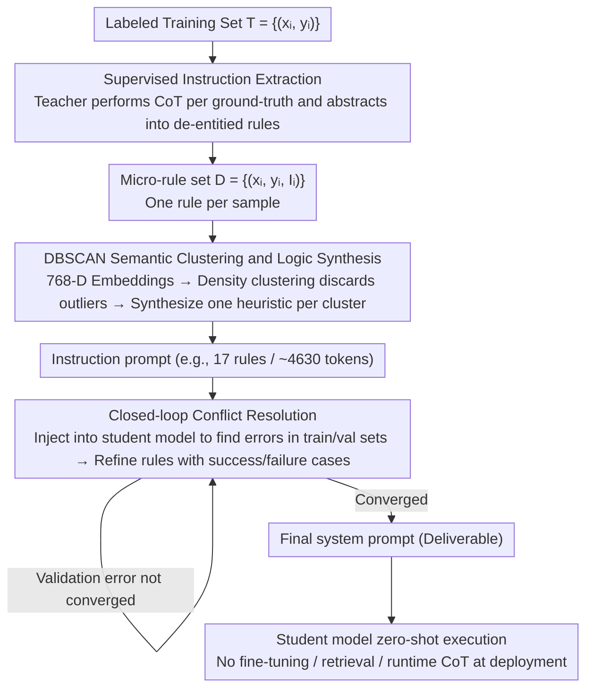

# Prompt-Level Distillation: A Non-Parametric Alternative to Model Fine-Tuning for Efficient Reasoning

**Conference**: ACL2026  
**arXiv**: [2602.21103](https://arxiv.org/abs/2602.21103)  
**Code**: Undisclosed  
**Area**: LLM Efficiency / Prompt Optimization / Reasoning Distillation  
**Keywords**: Prompt Distillation, Non-parametric Fine-tuning, Instruction Clustering, Conflict Resolution, Reasoning Efficiency

## TL;DR
This paper proposes Prompt-Level Distillation (PLD), which extracts, clusters, and de-conflicts reasoning patterns from a teacher model on training samples to construct a system prompt for the student model. This significantly enhances the reasoning and classification capabilities of small models without updating parameters.

## Background & Motivation
**Background**: Complex reasoning tasks typically rely on Chain-of-Thought (CoT) prompting, requiring the model to generate intermediate reasoning before the final answer. While effective in logical inference, compliance judgment, and reading comprehension, this approach introduces additional tokens, latency, and inference costs.

**Limitations of Prior Work**: Industrial systems often use fine-tuned small models to replace expensive CoT reasoning. However, fine-tuning requires training data, resources, and model version management. Furthermore, when teacher models are updated or business rules change, student models must be retrained; this maintenance cost is heavy for closed-source small models or rapidly iterating business scenarios.

**Key Challenge**: Reasoning capabilities require complex rules, yet production environments demand low latency, auditability, and ease of maintenance. Compressing reasoning rules into weights creates a black box, while running CoT at runtime is too slow. The authors aim to shift "reasoning" to an offline phase, explicitly storing reusable logic in prompts.

**Goal**: Propose a non-parametric distillation framework, PLD, that uses labeled training sets to extract generalizable natural language instructions from a teacher model and synthesizes a conflict-free system prompt, enabling student models to execute these rules directly in zero-shot reasoning.

**Key Insight**: The paper focuses on reasoning-intensive classification, where input boundaries are relatively static and rules can be summarized—such as contract clause relationships, bias type identification, and logical Q&A. This setting makes "compressing reasoning into an instruction library" feasible.

**Core Idea**: Instead of distilling teacher outputs into student weights, the decision logic of the teacher is distilled into a system prompt, allowing small models to execute pre-mined rules at near zero-shot speeds.

## Method
PLD can be understood as an offline compilation pipeline: extracting micro-rules for each training sample, merging similar rules into general heuristics, and driving conflict repair through student model error cases. The final product is not a new model, but a readable, auditable, and replaceable consolidated instruction set.

### Overall Architecture
The input consists of a labeled training set $T=\{(x_i,y_i)\}$, a teacher model, a student model, and the target task format. In the first stage, the teacher model explains why a sample belongs to a certain label under ground-truth constraints and abstracts a natural language rule without specific entities, forming $D=\{(x_i,y_i,I_i)\}$. In the second stage, these rules are embedded into a vector space; DBSCAN is used to find semantic clusters, and a strong model synthesizes each cluster into a general instruction. In the third stage, the current instruction prompt is deployed to the student model to identify errors in training/validation samples, and a conflict resolution model corrects rules based on success and failure cases. During deployment, the final system prompt is injected into the student model without requiring retrieval, fine-tuning, or runtime CoT.

### Key Designs

**1. Supervised Instruction Extraction: Compressing teacher reasoning into transferable de-entitied rules**

If the teacher only generates answers, the student cannot learn decision boundaries; if full CoT is saved, it is too long and carries sample-specific details. PLD requires the teacher to perform two tasks in one call: first, perform CoT analysis based on the ground-truth label, then abstract this analysis into a natural language instruction devoid of specific entities. This anchors reasoning in the correct direction via label supervision while stripping sample-specific content, leaving reusable decision logic as $D=\{(x_i,y_i,I_i)\}$.

**2. DBSCAN Semantic Clustering and Logic Synthesis: Letting rule counts grow naturally from data density**

Sample-by-sample extraction produces many redundant, fragmented, or local micro-rules, which would cause the system prompt to explode if combined directly; however, overly coarse merging averages out minority classes and edge rules. PLD encodes each rule into a 768-dimensional vector using Gemini Embedding and applies DBSCAN (cosine distance, $\epsilon=0.4$, `min_samples=6`). Since it doesn't force every point into a cluster, outlier rules are discarded as noise, preventing system prompt contamination by atypical samples. Each cluster is then synthesized into a unified heuristic by Gemini 3 Pro. The number of rules "grows" from data density; for Contract-NLI, this converged to 17 rules (approx. 4,630 tokens).

**3. Closed-loop Conflict Resolution: Recovering long-tail boundaries using student errors**

One-time clustering synthesis often averages out minority class rules and fails to cover rule priorities or exceptions. PLD injects the current instruction set into the student model for evaluation on training/validation samples, specifically picking cases where "the model followed the rules but predicted incorrectly." These failures, alongside success cases, are provided to a conflict resolution model to generate revised rules until validation error converges. Providing both success and failure cases is critical to prevent the model from overturning correct behaviors while fixing one error. This step yielded an approx. 2.5% Macro-F1 gain on Contract-NLI, primarily addressing overlapping boundaries and complex exceptions.

### A Complete Example
Using Contract-NLI: approx. 7,190 labeled contract clauses enter the extraction phase; the teacher generates one de-entitied rule per clause. After embedding into 768-D vectors, DBSCAN ($\epsilon=0.4$) compresses them into 17 semantic clusters synthesized into 17 heuristics, forming a system prompt of ~4,630 tokens. At this stage, Gemma-3 4B achieves a Macro-F1 of 0.81. Injecting this prompt into the student model to find errors for closed-loop resolution raises the F1 to 0.83 by adding overlapping boundary rules. No additional steps occur during deployment—the 4,630-token prompt is the final deliverable for zero-shot execution.

### Loss & Training
PLD does not update student model parameters, so there is no traditional training loss. "Optimization" occurs during prompt search and error feedback loops. The extraction phase maximizes the interpretability of rules relative to labels, the clustering phase balances prompt length and rule coverage, and the conflict resolution phase stops when the student model's error rate on train/val samples converges. In experiments, Gemini 3 Flash thinking mode was used for extraction, while Gemini 3 Pro thinking mode handled synthesis and resolution. Student models included Gemma-3 4B, Mistral Small 3.1 24B, and Gemini 2 Flash. Baselines included zero-shot, 5-shot, TextGrad, and parametric distillation via LoRA on Gemma/Mistral.

## Key Experimental Results

### Main Results
The paper evaluates PLD on StereoSet, Contract-NLI, and LogiQA. Macro-F1 is reported for StereoSet and Contract-NLI; Accuracy is reported for LogiQA.

| Task / Student Model | Zero-shot | TextGrad | Clustered-Inst. | Post-Conflict | Key Findings |
|----------------------|-----------|----------|-----------------|---------------|--------------|
| StereoSet / Gemma-3 4B | 0.57 | 0.87 | 0.90 | 0.90 | PLD lifts small models to near-strong model performance |
| Contract-NLI / Gemma-3 4B | 0.67 | 0.74 | 0.81 | 0.83 | Conflict resolution provides further gains in legal logic |
| LogiQA / Gemma-3 4B | 0.67 | 0.69 | 0.69 | 0.70 | Gains are small but consistent |
| StereoSet / Mistral Small | 0.65 | 0.96 | 0.96 | 0.97 | Equally effective across architectures |
| Contract-NLI / Gemini 3 Flash | 0.77 | 0.76 | 0.84 | 0.86 | Even teacher-level models benefit from explicit rules |

### Ablation Study

| Configuration | Key Metric | Description |
|---------------|------------|-------------|
| Contract-NLI, $\epsilon=0.2$ / `min_samples=6` | 27 clusters / 6,449 tokens / F1 0.79 | Clusters too fragmented; prompt length increases and performance drops |
| Contract-NLI, $\epsilon=0.4$ / `min_samples=6` | 17 clusters / 4,630 tokens / F1 0.83 | Selected trade-off configuration |
| Contract-NLI, $\epsilon=0.5$ / `min_samples=6` | 14 clusters / 4,068 tokens / F1 0.80 | Merging too coarse; fine-grained logic lost |
| Contract-NLI, 1,030 examples | 16 clusters / 4,062 tokens / F1 0.77 | Small data already discovers main themes |
| Contract-NLI, 7,190 examples | 18 clusters / 4,630 tokens / F1 0.83 | More data refines existing clusters rather than infinitely increasing prompt length |

### Key Findings
- Gemma-3 4B improved from 0.57 to 0.90 on StereoSet and 0.67 to 0.83 on Contract-NLI, indicating that non-parametric prompt distillation significantly narrows the gap between small and strong models.
- The authors report that Gemma-3 4B is 25x cheaper and 80x faster than Gemini 3 Flash; PLD’s value lies in shifting runtime CoT costs to offline prompt compilation costs.
- Conflict resolution provided a ~2.5% Macro-F1 gain on Contract-NLI but negligible gain on StereoSet, suggesting its utility lies in overlapping boundaries and complex exceptions.
- Dataset-size ablation on Contract-NLI shows that the cluster count remains stable around 18 even at 7,000 samples, supporting the claim that more data improves rule quality rather than linearly increasing prompt length.

## Highlights & Insights
- The paper shifts the distillation target from "model weights" to "auditable prompts," an ideal perspective for compliance, legal, financial, or content moderation scenarios requiring human rule verification.
- The choice of DBSCAN is apt: it discards outlier rules to prevent system prompt contamination and naturally determines the number of rules based on data density.
- The conflict resolution phase emphasizes providing both success and failure cases to prevent the model from breaking existing correct behaviors—a more production-ready approach than many automatic prompt optimization methods.
- PLD is not compressing tokens, but semantic reasoning paths; its goal differs from prompt compression, resembling the offline compilation of a teacher model into a task-specific "case manual."

## Limitations & Future Work
- The authors explicitly limit PLD to reasoning classification tasks with static decision boundaries. For tasks requiring runtime intermediate states (e.g., complex arithmetic, symbolic proof, planning), concise instructions may be insufficient.
- The scale limit for system prompts is not systematically modeled; as task complexity grows, prompts at the 4,630-token level may increase latency during prompt processing.
- In StereoSet experiments involving bias recognition, the rules extracted by the teacher may solidify data biases or incorrect interpretations into the prompt; auditability improves, but rule fairness is not automatically guaranteed.
- Future work could combine PLD with retrieval-based rule libraries: high-frequency rules in the system prompt and long-tail rules retrieved as needed to balance coverage and context length.

## Related Work & Insights
- **vs Chain-of-Thought prompting**: CoT generates reasoning at runtime (accurate but slow); PLD extracts reasoning offline, turning runtime into direct rule execution.
- **vs Knowledge Distillation**: Traditional KD updates student weights, making auditability and artifact maintenance difficult; PLD updates the prompt without changing parameters.
- **vs Automatic Prompt Optimization**: APE, OPRO, and TextGrad focus on wording or prompt programs; PLD's core is mining and merging teacher domain logic rather than just finding better phrasings.
- **Insights**: For enterprise LLM applications, expert-reviewed error cases can be continuously fed back into PLD to form a version-controlled prompt rule library, avoiding the need to retrain small models frequently.

## Rating
- Novelty: ⭐⭐⭐⭐☆ Non-parametric distillation is not entirely new, but the "extract-cluster-resolve" pipeline is highly practical.
- Experimental Thoroughness: ⭐⭐⭐⭐☆ Covers three task types across multiple student models with solid ablations, though tasks remain classification-focused.
- Writing Quality: ⭐⭐⭐⭐☆ Clear methodology and straightforward tables; some latency results only appear in appendix figures.
- Value: ⭐⭐⭐⭐☆ Highly insightful for low-latency, auditable small model deployment, especially in industry sectors with stable rules.

<!-- RELATED:START -->

## Related Papers

- [\[CVPR 2025\] Project-Probe-Aggregate: Efficient Fine-Tuning for Group Robustness](../../CVPR2025/social_computing/project-probe-aggregate_efficient_fine-tuning_for_group_robustness.md)
- [\[ACL 2026\] PSK@EEUCA 2026: Fine-Tuning Large Language Models with Synthetic Data Augmentation for Multi-Class Toxicity Detection in Gaming Chat](pskeeuca_2026_fine-tuning_large_language_models_with_synthetic_data_augmentation.md)
- [\[ACL 2026\] BITS Pilani at SemEval-2026 Task 9: Structured Supervised Fine-Tuning with DPO Refinement for Polarization Detection](bits_pilani_at_semeval-2026_task_9_structured_supervised_fine-tuning_with_dpo_re.md)
- [\[ACL 2026\] SMARTER: A Data-efficient Framework to Improve Toxicity Detection with Explanation via Self-augmenting Large Language Models](smarter_a_data-efficient_framework_to_improve_toxicity_detection_with_explanatio.md)
- [\[ACL 2026\] Estimating the Black-box LLM Uncertainty with Distribution-Aligned Adversarial Distillation](estimating_the_black-box_llm_uncertainty_with_distribution-aligned_adversarial_d.md)

<!-- RELATED:END -->
