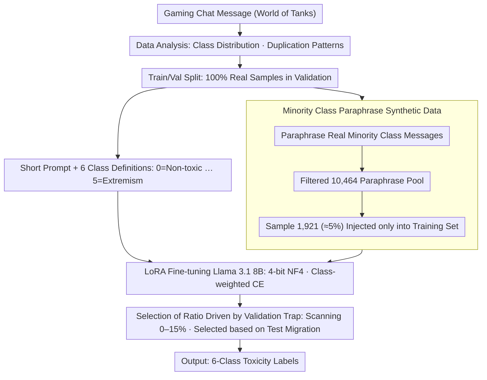

# PSK@EEUCA 2026: Fine-Tuning Large Language Models with Synthetic Data Augmentation for Multi-Class Toxicity Detection in Gaming Chat

**Conference**: ACL2026  
**arXiv**: [2605.07201](https://arxiv.org/abs/2605.07201)  
**Code**: Not open sourced  
**Area**: Social Computing / Gaming Community Toxicity Detection  
**Keywords**: Gaming chat moderation, toxicity classification, synthetic data augmentation, LoRA fine-tuning, class imbalance

## TL;DR
This system paper addresses the EEUCA 2026 gaming chat toxicity identification task. By employing Llama 3.1 8B with LoRA and 5% strictly filtered synthetic paraphrased data for minority classes, the system achieved a macro-F1 of 0.6234 on a six-class classification task. It further reveals the "validation trap," where high validation scores fail to migrate to the test set.

## Background & Motivation
**Background**: Moderation of online gaming community chats is typically modeled as a text classification problem. Current solutions range from fine-tuning encoders like XLM-RoBERTa to parameter-efficient fine-tuning of instruction-tuned LLMs, as well as ensemble or hierarchical classification. The EEUCA 2026 shared task categorizes World of Tanks chat messages into six classes: Non-toxic, Insults/Flaming, Other Offensive, Hate/Harassment, Threats, and Extremism, evaluated by macro-F1.

**Limitations of Prior Work**: The challenge extends beyond identifying profanity. Approximately 81% of the data is Non-toxic, while Threats and Extremism together account for less than 0.2%. Chat text is short, colloquial, contains gaming jargon, and involves multilingual mixing. Semantic boundaries between Insults, Other Offensive, and Hate/Harassment are subtle, causing models to often confuse skill-related mockery with identity-based attacks.

**Key Challenge**: The distribution of the validation set does not fully align with the labeling patterns of the test set. Models that fit the majority class proportions of the validation set appear stable but are overly conservative on minority classes in the test set. The authors define this phenomenon as the "validation trap": high validation F1 often results from "under-predicting minority classes" rather than superior generalization.

**Goal**: To develop a toxicity classification system that stably migrates to the test set in a resource-constrained shared-task scenario, while analyzing which designs cause validation hallucinations and which augmentations improve minority class recall without overfitting.

**Key Insight**: Instead of blindly expanding synthetic data, the authors limit synthetic samples to paraphrases of real minority messages and systematically scan synthesis ratios. The key hypothesis is that while real minority samples are scarce, their surface expressions can be slightly extended; however, excessive synthesis causes the model to learn the generator's style.

**Core Idea**: Use small-dose, synonymous paraphrasing of minority class samples to calibrate the LLM's class bias. This encourages more active identification of difficult minority classes on the test set while avoiding distribution drift caused by large-scale synthetic data.

## Method
This paper functions as a high-quality shared-task system report. Its contribution lies not in a complex new architecture but in systematic comparison, control of synthesis ratios, and analysis of error patterns. The final system uses Llama 3.1 8B as the backbone, trained with 4-bit NF4 quantization and LoRA, explicitly including six-class label definitions in the prompt alongside a minimal proportion of synthetic minority data.

### Overall Architecture
The input is a World of Tanks gaming chat message, and the output is one of six toxicity categories. The workflow begins by analyzing class distributions and duplication patterns in the raw data, followed by a train/val split where synthetic data is only injected into the training partition, keeping the validation set 100% real. The model side utilizes an instruction prompt with definitions for the six categories. Llama 3.1 8B is fine-tuned via LoRA. Experiments compare encoders, Gemma, Llama, hierarchical classification, one-vs-rest, transfer learning, ensembles, and post-calibration, ultimately selecting the Llama 8B + 5% synthetic configuration for its superior test set migration.

### Key Designs

**1. Short Prompt + Explicit Definitions: Establishing clear boundaries between similar toxicity classes**

Gaming chat sentences are naturally short; lengthy instructions would exhaust the 384-token maximum length and clutter the training objective. However, without any category explanation, models tend to confuse boundary-blurring classes like Insults, Other Offensive, and Hate/Harassment. The system uses a short-format prompt listing concise definitions from `0=Non-toxic` to `5=Extremism` before the input `Message: [input text]`. This preserves category semantics and provides a clear reference for the instruction-tuned LLM without overshadowing the input text.

**2. Minority Class Paraphrase Synthetic Data: Supplementing rare signals via synonym rewrite instead of void generation**

Asking LLMs to generate toxic sentences directly often produces generic samples that do not resemble gaming chat, effectively feeding the generator's style to the model. To enhance training signals for rare or confusing classes (Class 2/3/4/5), the system prompts an LLM to perform semantics-preserving paraphrasing on real minority messages. This maintains the original context and short slang style. The filtered synthesis pool contained 10,464 paraphrases (8,348 for Class 2, 1,633 for Class 3, 343 for Class 4, 140 for Class 5). Ultimately, 1,921 samples were subsetted into the training data, representing 4.998% of the total.

**3. Selection of Ratio Driven by Validation Trap: Selecting synthesis ratios based on test migration rather than validation F1**

In this task, the validation set distribution is not a reliable proxy for final generalization. Models fitting the majority class bias of the validation set appear "stable" but are overly conservative regarding minority classes. Consequently, the system scans seven synthesis ratios (0%, 2%, 3%, 5%, 7%, 10%, 15%), comparing validation F1, test F1, and test prediction distributions. The 5% ratio reduced Non-toxic predictions from 79.6% to 79.0% and increased Class 2 from 4.9% to 5.7%, better matching the sensitivity required for the test set. Small-scale synthesis fine-tunes decision boundaries, whereas large-scale synthesis leads the model to overfit the synthetic style.

### Loss & Training
The final model uses Llama 3.1 8B with 4-bit NF4 quantization. LoRA configuration: rank=16, alpha=64, dropout=0.0. Training parameters: learning rate 5e-5 with a cosine schedule, 4 epochs, batch size 4 with gradient accumulation of 4, and a maximum sequence length of 384. The training objective is class-weighted cross-entropy to mitigate severe imbalance. The authors also tested hierarchical classification, one-vs-rest, transfer learning from DOTA 2, ensembles (averaging, voting, confidence routing), and post-calibration methods (Platt scaling, isotonic regression, temperature scaling), none of which outperformed the final single model.

## Key Experimental Results

### Main Results

| System | Val F1 | Test F1 | Remarks |
|------|--------|---------|------|
| XLM-RoBERTa Large | 0.30 | - | Full encoder fine-tuning; weak performance |
| Gemma 2B | 0.63 | 0.52 | High validation but poor test migration |
| Gemma 12B | 0.66 | 0.52 | Typical validation trap |
| Two-stage Hierarchical | 0.67 | 0.47 | Largest generalization gap |
| Llama 8B (No Synthetic) | 0.6554 | 0.5971 | Strong validation, average test |
| Llama 8B + 5% Synthetic | 0.6271 | 0.6234 | Final submission; 4th out of 35 teams |

### Ablation Study

| Synthetic Ratio | Val F1 | Test F1 | Description |
|----------|--------|---------|------|
| 0% | 0.6554 | 0.5971 | One of the best validation results; conservative on minority classes |
| 2% | 0.6247 | 0.5042 | Insufficient augmentation and unstable test migration |
| 3% | 0.6051 | 0.5514 | Still lower than no synthetic data |
| 5% | 0.6271 | 0.6232 | Optimal test migration |
| 7% | 0.6214 | 0.4649 | Clear overfitting or distribution shift |
| 10% | 0.5499 | 0.5851 | Some recovery but inferior to 5% |
| 15% | 0.6045 | 0.5343 | Obvious interference from synthetic style |

### Key Findings
- Per-class F1 varies significantly in the final system: 0.94 for Non-toxic, 0.74 for Insults/Flaming, 0.44 for Other Offensive, 0.43 for Hate/Harassment, 0.33 for Threats, and 0.86 for Extremism. This indicates macro-average performance is primarily dragged down by minority classes.
- The training set contains 40.2% exact duplicates and 13.4% identical texts with different labels. Deduplication actually reduced performance (0.44 vs 0.60 F1), suggesting duplicates act as a form of implicit oversampling.
- High validation F1 is unreliable: Gemma 12B, transfer learning, and two-stage methods reached 0.66–0.68 on validation but only 0.47–0.55 on the test set.
- The value of the 5% synthetic ratio is not to "balance" the data, but to slightly increase the model's propensity to predict confused minority classes (e.g., Class 2/3).

## Highlights & Insights
- The most valuable discovery is the "validation trap." The paper does not merely report leaderboard results but points out that "distribution matching" on validation sets can reward overly conservative classifiers—a practical insight for shared tasks and moderation systems.
- Use of synthetic data is highly restrained. While many augmentation papers assume "more is better," this work demonstrates that 7% or 15% can significantly harm the test set, reminding practitioners that synthetic data is a calibrator, not an infinite expander.
- Observations on duplicate samples are enlightening: in extreme imbalance tasks, standard data cleaning rules may not apply, as duplicates might carry essential labeling frequency and category priors.
- This methodology is transferable to other community governance tasks, such as live stream chat moderation, forum aggression identification, and cross-lingual hate speech detection: first analyze val/test shifts, then use small-dose real-sample paraphrasing to adjust minority class sensitivity.

## Limitations & Future Work
- As a shared-task system report, the innovation stems from engineering choices and analysis rather than new algorithms; it lacks a generalized theoretical explanation for why the optimal synthetic ratio was 5%.
- Experiments are centered on World of Tanks corpora. Gaming genres, community cultures, and linguistic distributions may affect toxicity boundaries, requiring further verification for cross-game generalization.
- The F1 for Class 4 (Threats) is only 0.33, indicating that the rarest but highest safety-risk categories remain difficult to identify reliably.
- The code is not open sourced; details regarding LoRA training, synthetic filtering, and post-processing require more implementation documentation for replication.
- Future work could consider explicitly transforming the validation trap into a model selection criterion, such as using predictive distribution, minority class calibration, or counterfactual test sets for early stopping.

## Related Work & Insights
- **vs XLM-RoBERTa / RoBERTa Toxicity Classification**: Encoder models are lighter but struggle to leverage category semantics in short-text, multilingual, or fine-grained label scenarios. This work injects label definitions via instruction prompts.
- **vs Generative Data Augmentation**: Direct generation can produce formulaic toxic sentences. This paper uses paraphrasing of real messages, emphasizing in-domain style preservation.
- **vs Hierarchical Classification**: Hierarchical methods (toxic vs. non-toxic first) showed high validation F1 but the worst test performance, suggesting error amplification across stages.
- **vs Ensembles / Post-Calibration**: These strategies introduced noise when a strong single model already excelled. This study suggests that understanding data distribution is more critical than stacking models.

## Rating
- Novelty: ⭐⭐⭐ Limited algorithmic novelty, but the analysis of the validation trap and synthetic ratios is highly practical.
- Experimental Thoroughness: ⭐⭐⭐⭐ Solid for a system paper, comparing multiple models, synthetic ratios, and alternative strategies.
- Writing Quality: ⭐⭐⭐⭐ Clear narrative; honest reporting of failed approaches and negative results.
- Value: ⭐⭐⭐⭐ Directly insightful for content moderation, low-resource minority class classification, and synthetic data usage.

<!-- RELATED:START -->

## Related Papers

- [\[ACL 2026\] SMARTER: A Data-efficient Framework to Improve Toxicity Detection with Explanation via Self-augmenting Large Language Models](smarter_a_data-efficient_framework_to_improve_toxicity_detection_with_explanatio.md)
- [\[ACL 2026\] BITS Pilani at SemEval-2026 Task 9: Structured Supervised Fine-Tuning with DPO Refinement for Polarization Detection](bits_pilani_at_semeval-2026_task_9_structured_supervised_fine-tuning_with_dpo_re.md)
- [\[ACL 2026\] Prompt-Level Distillation: A Non-Parametric Alternative to Model Fine-Tuning for Efficient Reasoning](prompt-level_distillation_a_non-parametric_alternative_to_model_fine-tuning_for_.md)
- [\[CVPR 2026\] Learning from Synthetic Data via Provenance-Based Input Gradient Guidance](../../CVPR2026/social_computing/learning_from_synthetic_data_via_provenance-based_input_gradient_guidance.md)
- [\[ACL 2026\] Inertia in Moral and Value Judgments of Large Language Models](inertia_in_moral_and_value_judgments_of_large_language_models.md)

<!-- RELATED:END -->
