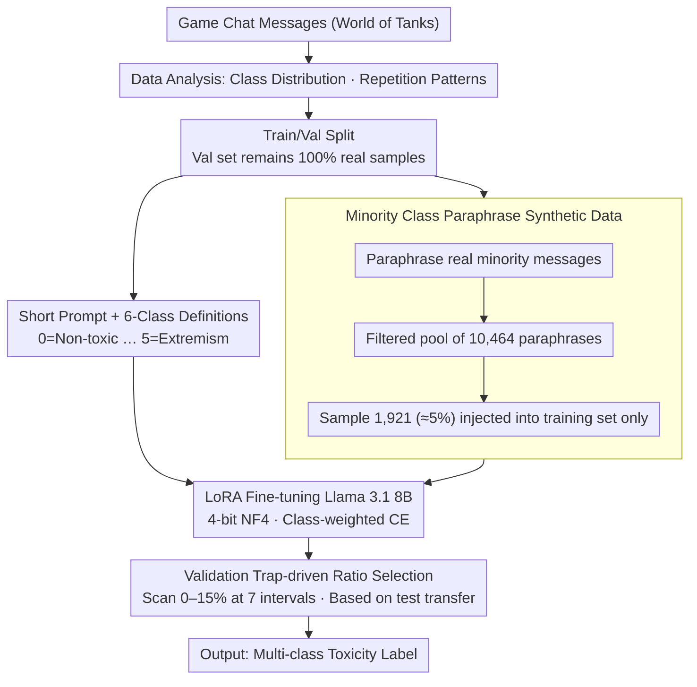

# PSK@EEUCA 2026: Fine-Tuning Large Language Models with Synthetic Data Augmentation for Multi-Class Toxicity Detection in Gaming Chat

**Conference**: ACL2026  
**arXiv**: [2605.07201](https://arxiv.org/abs/2605.07201)  
**Code**: Not open-sourced  
**Area**: Social Computing / Gaming Community Toxicity Detection  
**Keywords**: Game chat moderation, toxicity classification, synthetic data augmentation, LoRA fine-tuning, class imbalance

## TL;DR
This system paper for the EEUCA 2026 gaming chat toxicity identification task utilizes Llama 3.1 8B + LoRA + 5% strictly filtered minority-class synthetic paraphrased data, achieving a macro-F1 of 0.6234 across six classes and revealing the "validation trap" where high validation scores fail to transfer to the test set.

## Background & Motivation
**Background**: Moderating online gaming community chats is typically modeled as a text classification problem. Mainstream solutions range from fine-tuning encoders like XLM-RoBERTa to parameter-efficient fine-tuning of instruction-tuned LLMs, as well as ensemble or hierarchical classification. The EEUCA 2026 shared task categorizes World of Tanks chat messages into six classes: Non-toxic, Insults/Flaming, Other Offensive, Hate/Harassment, Threats, and Extremism, using macro-F1 as the evaluation metric.

**Limitations of Prior Work**: The challenge of this task extends beyond identifying "profanity." In the dataset, 81% is Non-toxic, while Threats and Extremism combined account for less than 0.2%. Chat texts are short, colloquial, contain game-specific jargon, and involve multilingual code-switching. The semantic boundaries between Insults, Other Offensive, and Hate/Harassment are extremely subtle, causing models to easily confuse skill-based mockery with identity attacks.

**Key Challenge**: The validation set distribution is not entirely consistent with the test set labeling patterns. Models that fit the majority class proportions of the validation set too closely appear stable but are overly conservative on minority classes in the test set. The authors refer to this phenomenon as the "validation trap": high validation F1 often stems from "under-predicting minority classes" rather than superior generalization.

**Goal**: To identify a toxicity classification system that transfers stably to the test set within a resource-constrained shared task scenario; simultaneously, to analyze which designs induce validation set hallucinations and which small-scale augmentations improve minority class recall without overfitting.

**Key Insight**: Instead of blindly expanding synthetic data, the authors limit synthetic samples to paraphrases of real minority-class messages and systematically scan the synthesis proportions. The key assumption is that while real minority samples are scarce, their surface expressions can be slightly extended; however, excessive synthesis causes the model to learn the generator's style.

**Core Idea**: Use small doses of synonymous paraphrased synthetic minority samples to calibrate the LLM's class bias, encouraging more active identification of difficult minority classes on the test set while avoiding distribution shifts caused by large-scale synthetic data.

## Method
This paper serves as a high-quality shared-task system report: the contribution lies not in complex new architectures, but in systematic comparison, synthesis ratio control, and error pattern analysis. The final system uses Llama 3.1 8B as the backbone, trained with 4-bit NF4 quantization and LoRA, explicitly including six-class label definitions in the prompt, and incorporating a minimal proportion of synthetic minority data.

### Overall Architecture
The input is a World of Tanks game chat message, and the output is one of six toxicity categories. The training pipeline starts with analyzing class distributions and repetition patterns in the original data, then adds synthetic data only to the training split after the real training/validation split, keeping the validation set 100% real. The model uses an instruction prompt with definitions for the six classes, and Llama 3.1 8B is fine-tuned via LoRA. The experimental phase compares encoders, Gemma, Llama, hierarchical classification, one-vs-rest classification, transfer learning, ensembles, and post-calibration, ultimately selecting the Llama 8B + 5% synthetic configuration for the best test set transfer.

### Key Designs

**1. Short prompt + explicitly defined LLM classifier: Clear discriminative boundaries between similar toxic classes**

Game chat sentences are inherently short; lengthy instructions consume the 384-token maximum length and clutter the training objective. However, providing no class explanations causes models to confuse boundaries between classes like Insults, Other Offensive, and Hate/Harassment. The system uses a short prompt format listing brief definitions from `0=Non-toxic` to `5=Extremism` before the `Message: [input text]`. This preserves class semantics and provides a clear reference for the instruction-tuned LLM without allowing the instructions to overshadow the input.

**2. Minority class paraphrase synthetic data: Supplying rare class signals via paraphrasing rather than generation from scratch**

Directly prompting LLMs to generate toxic sentences often results in samples that are too generic and uncharacteristic of game chat, effectively feeding the generator's style to the model. To enhance signals for rare or confusing classes (Class 2/3/4/5), the system prompts the LLM to perform semantics-preserving paraphrasing on real minority messages, thereby retaining the original context and short slang style. The filtered synthetic pool contains 10,464 paraphrases (8,348 for Class 2, 1,633 for Class 3, 343 for Class 4, and 140 for Class 5), with 1,921 samples (4.998% of training data) finally sampled for training.

**3. Validation-trap-driven ratio selection: Using test transfer instead of validation F1 to select synthesis ratios**

In this task, the validation set distribution is not a reliable proxy for final generalization. Models that perfectly fit the validation set's majority class proportions look "stable" but are overly conservative regarding minority classes. The system scanned seven synthetic ratios: 0%, 2%, 3%, 5%, 7%, 10%, and 15%, comparing validation F1, test F1, and test prediction distributions. The 5% ratio decreased Non-toxic predictions from 79.6% to 79.0% and increased Class 2 from 4.9% to 5.7%, yielding better sensitivity to the test set minority classes. Small-ratio synthesis fine-tunes decision boundaries, whereas high ratios lead to overfitting the synthetic style.

### Loss & Training
The final model employs Llama 3.1 8B with 4-bit NF4 quantization, LoRA rank=16, alpha=64, dropout=0.0, a learning rate of 5e-5 with a cosine schedule, trained for 4 epochs with a batch size of 4 and gradient accumulation of 4, and a maximum sequence length of 384. The training objective is class-weighted cross-entropy to mitigate severe imbalance. The authors also tested hierarchical classification, one-vs-rest, DOTA 2 transfer learning, ensemble methods (averaging, voting, confidence routing), and post-calibration methods (Platt scaling, isotonic regression, temperature scaling), none of which outperformed the final single model.

## Key Experimental Results

### Main Results

| System | Val F1 | Test F1 | Remarks |
|------|--------|---------|------|
| XLM-RoBERTa Large | 0.30 | - | Full encoder fine-tuning; weak performance |
| Gemma 2B | 0.63 | 0.52 | Decent validation but poor test transfer |
| Gemma 12B | 0.66 | 0.52 | Typical validation trap |
| Two-stage Hierarchical | 0.67 | 0.47 | Largest generalization gap |
| Llama 8B (No Synthetic) | 0.6554 | 0.5971 | Strong validation, average test |
| Llama 8B + 5% Synthetic | 0.6271 | 0.6234 | Final submission, 4th out of 35 teams |

### Ablation Study

| Synthesis Ratio | Val F1 | Test F1 | Description |
|----------|--------|---------|------|
| 0% | 0.6554 | 0.5971 | Best validation, but conservative on minority classes |
| 2% | 0.6247 | 0.5042 | Insufficient augmentation and unstable test results |
| 3% | 0.6051 | 0.5514 | Still lower than no synthesis |
| 5% | 0.6271 | 0.6232 | Optimal test transfer |
| 7% | 0.6214 | 0.4649 | Clear overfitting or distribution shift |
| 10% | 0.5499 | 0.5851 | Slight recovery but inferior to 5% |
| 15% | 0.6045 | 0.5343 | Significant interference from synthetic style |

### Key Findings
- Per-class F1 scores in the final system vary significantly: 0.94 for Non-toxic, 0.74 for Insults/Flaming, 0.44 for Other Offensive, 0.43 for Hate/Harassment, 0.33 for Threats, and 0.86 for Extremism. This suggests macro-F1 is primarily dragged down by minority classes.
- The training set contains 40.2% exact duplicates and 13.4% identical texts with different labels. Deduplication severely degraded performance (0.44 vs 0.60 F1), indicating that duplicates act as a form of implicit oversampling here.
- High validation F1 is unreliable: Gemma 12B, transfer learning, and two-stage methods reached 0.66-0.68 on validation but only 0.47-0.55 on the test set.
- The value of the 5% synthesis ratio is not in "balancing" the data, but in slightly shifting the model's predictive bias toward confusing minority classes like Class 2/3.

## Highlights & Insights
- The most valuable insight is the "validation trap." The paper does not just report leaderboard results but points out that "distribution matching" on a validation set might reward overly conservative classifiers, which is highly practical for shared tasks and content moderation systems.
- The use of synthetic data is extremely restrained. While many data augmentation papers assume "more is better," this work demonstrates that 7% or 15% can significantly harm the test set, reminding researchers that synthetic data is a calibrant, not an infinite expander.
- Observations on duplicate samples are enlightening: in extremely imbalanced tasks, conventional data cleaning rules may not apply; duplicates may carry vital information about labeling frequency and class priors.
- This methodology can be transferred to other community governance tasks, such as live stream chat moderation, forum bullying detection, and cross-lingual hate speech identification: first analyze validation/test drift, then use small-dose real-sample paraphrasing to adjust minority class sensitivity.

## Limitations & Future Work
- As a shared-task system report, the methodological innovation stems from engineering choices and analysis, lacking a more generalized theoretical explanation for why the "optimal synthesis ratio" lands exactly at 5%.
- The experiments revolve strictly around World of Tanks corpora. Game genre, community culture, and language distribution may affect toxic category boundaries; cross-game generalization remains to be verified.
- The F1 for Class 4 (Threats) is only 0.33, indicating that the rarest but highest-risk safety categories remain difficult to recognize reliably.
- The code is not open-sourced, and details regarding LoRA training, synthetic filtering, and post-processing require further implementation clarification.
- Future work could explicitly transform the validation trap into a model selection criterion, such as using prediction distributions, minority class calibration, or counterfactual test sets to assist in early stopping.

## Related Work & Insights
- **vs XLM-RoBERTa / RoBERTa Toxicity Classification**: Encoder models are lighter but struggle to leverage category semantics in scenarios with short texts, multiple languages, and fine-grained labels; Ours uses instruction prompts to inject label definitions.
- **vs Direct Generative Augmentation**: Direct generation can produce formulaic toxic sentences; Ours uses real-message paraphrasing to emphasize in-domain style retention.
- **vs Hierarchical Classification**: Hierarchical methods identify "toxic vs non-toxic" first, showing high validation F1 but the worst test results, suggesting error amplification across the two stages.
- **vs Ensemble / Post-calibration**: Such strategies introduce noise when a strong single model dominates; Ours shows that understanding data distribution is more critical than stacking models.

## Rating
- Novelty: ⭐⭐⭐ Limited algorithmic novelty, but the validation trap and synthesis ratio analysis are highly practical.
- Experimental Thoroughness: ⭐⭐⭐⭐ Compared multiple models, synthesis ratios, and alternative strategies; solid for a shared-task system paper.
- Writing Quality: ⭐⭐⭐⭐ Clear narrative, honest about failed approaches and negative results.
- Value: ⭐⭐⭐⭐ Direct insights for content moderation, low-resource minority-class classification, and synthetic data usage.

<!-- RELATED:START -->

## Related Papers

- [\[ACL 2026\] SMARTER: A Data-efficient Framework to Improve Toxicity Detection with Explanation via Self-augmenting Large Language Models](smarter_a_data-efficient_framework_to_improve_toxicity_detection_with_explanatio.md)
- [\[ACL 2026\] BITS Pilani at SemEval-2026 Task 9: Structured Supervised Fine-Tuning with DPO Refinement for Polarization Detection](bits_pilani_at_semeval-2026_task_9_structured_supervised_fine-tuning_with_dpo_re.md)
- [\[ACL 2026\] Prompt-Level Distillation: A Non-Parametric Alternative to Model Fine-Tuning for Efficient Reasoning](prompt-level_distillation_a_non-parametric_alternative_to_model_fine-tuning_for_.md)
- [\[ACL 2026\] Inertia in Moral and Value Judgments of Large Language Models](inertia_in_moral_and_value_judgments_of_large_language_models.md)
- [\[ACL 2026\] RV-HATE: Reinforced Multi-Module Voting for Implicit Hate Speech Detection](rv-hate_reinforced_multi-module_voting_for_implicit_hate_speech_detection.md)

<!-- RELATED:END -->
