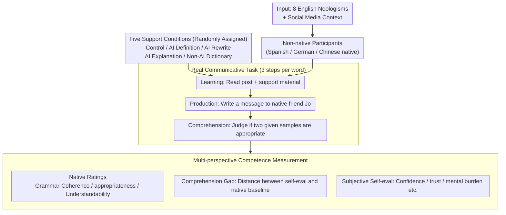

# Reheat Nachos for Dinner? Evaluating AI Support for Cross-Cultural Communication of Neologisms

**Conference**: ACL2026 Findings  
**arXiv**: [2604.23842](https://arxiv.org/abs/2604.23842)  
**Code**: https://github.com/dayeonki/crosscultural_communication  
**Area**: Audio & Speech  
**Keywords**: Cross-cultural communication, Neologisms, AI language learning, Communicative competence, User study

## TL;DR
Through human experiments involving 234 non-native speakers and 144 native evaluators, this paper compares four types of AI and non-AI support. It finds that AI Explanation with contextual information most effectively improves native speaker ratings of neologisms used by non-native speakers, though a significant misalignment remains between learners' confidence and their actual communicative competence.

## Background & Motivation
**Background**: Neologisms and emerging slang have become a core part of daily English communication. Expressions such as "main character energy," "delulu," and "reheat nachos" often carry specific community contexts, tones, and cultural identities. Non-native speakers increasingly turn to AI tools in cross-cultural communication to obtain definitions, rewrite sentences, or explain usage.

**Limitations of Prior Work**: Traditional dictionaries and textbooks update slowly, failing to cover rapidly evolving internet neologisms in a timely manner. Existing AI evaluations often focus on multiple-choice questions, translation, or static understanding tasks, which do not reflect how real users learn, write messages, or judge contextual appropriateness after encountering a new word.

**Key Challenge**: Learning neologisms is not just about literal definitions; it involves knowing when to use them, with whom, and whether the tone is natural. AI outputs may be fluent, but if the explanation lacks context or contains errors, non-native speakers often lack the mechanisms to judge its reliability. This leads to them mistaking "feeling like they learned it" for "native speakers finding it natural."

**Goal**: The authors decompose the problem into three levels: whether different support types help non-native speakers write more natural usage of neologisms; whether self-evaluations by non-native speakers can substitute for native speaker evaluations; and whether AI support can narrow the communicative competence gap between non-native and native speakers.

**Key Insight**: The paper selects a scenario closely mimicking real-world usage: non-native speakers encounter a neologism in a social media post, learn it via some form of support, write a message to a hypothetical native friend "Jo," and then judge the appropriateness of others' writing. This design is closer to the process of "learning a word and integrating it into conversation" than offline Q&A.

**Core Idea**: Evaluate AI neologism support using real cross-cultural communication tasks and native speaker ratings, rather than relying solely on whether the model or the learner deems an explanation "useful."

## Method
This paper does not propose a new model but designs a human experiment with high ecological validity to compare the actual benefits of various AI support methods for learning and using internet neologisms. The experiment decomposes "learning neologisms" into four stages: learning, production, comprehension, and external evaluation, while simultaneously collecting self-evaluations from non-native speakers and ratings from native speakers to observe if AI support translates into communicative competence.

### Overall Architecture
The input consists of a set of English neologisms and their social media contexts. Participants are English non-native speakers whose first language is Spanish, German, or Chinese. Each participant is randomly assigned to one support condition and performs a three-step task for eight neologisms: first, learn the neologism from the post and support materials; second, write a scenario and a message to a native friend Jo; third, judge the appropriateness of neologism usage in two provided writing samples. Subsequently, each non-native speaker's writing sample is rated by two US English native speakers across dimensions such as grammar/coherence, contextual appropriateness, and understandability.

### Key Designs

**1. Real Communicative Task Design: Moving neologism evaluation from "knowing definitions" to "natural usage."**

The difficulty of internet neologisms lies in pragmatics and community context—simple multiple-choice questions cannot measure "whether a native speaker finds the usage natural." Therefore, the experiment places each neologism in a realistic social media post. Non-native speakers learn first, then write a message to an imaginary friend Jo (production task to measure usability), and finally judge whether the neologism is used appropriately in two other provided samples (comprehension task to measure judgment proficiency). The evaluation target thus shifts from "model answers" to "real communicative outcomes."

**2. Controlled Comparison of Five Support Conditions: Unpacking AI usage modes to identify effectiveness.**

In practice, users do not just ask "what does this mean"; they ask for explanations, rewrites, or examples. The experiment sets five groups: Control, AI Definition (dictionary-style), AI Rewrite (simplifies the post containing the neologism), AI Explanation (3-5 sentences explaining meaning, tone, usage scenario, and audience), and Non-AI Dictionary (the full Merriam-Webster page). Comparing these interactive modes reveals whether the effect comes from low-density definitions, simplified contexts, or contextual usage instructions.

**3. Multi-perspective Competence Measurement: Explicitly exposing the mismatch between "increased confidence" and "native rejection."**

AI tools often make users "feel they understand more," but this does not necessarily equate to actual communicative competence. Measurement is conducted at three levels: Native ratings cover three external dimensions: well-formedness, contextual appropriateness, and understandability. Non-native comprehension is measured by the distance between their appropriateness ratings and a native baseline. Subjective self-evaluations include confidence, helpfulness, reliance, future trust, mental burden, and task difficulty. Collecting all three levels makes the misalignment—where confidence rises but native ratings do not—explicitly visible.

### Loss & Training
The study does not train a new model; AI support materials are generated by GPT-4o using preset prompts. Statistical analysis utilizes linear mixed-effects models. Fixed effects include support conditions, language groups, their interaction, frequency of English social media use, and initial familiarity with the neologisms. Random intercepts include participants, native evaluators, and neologisms. The authors report significance using Bonferroni-corrected average marginal effects and supplement interpretations with confidence intervals.

## Key Experimental Results

### Main Results
Native ratings indicate that AI Explanation is the only support method that consistently outperforms the Control across all major communicative dimensions. The Non-AI Dictionary provides the most information but, due to high density and cognitive burden, only significantly improves specific dimensions.

| Condition | Well-formedness | Contextual appropriateness | Understandability | Confidence-related Score |
|------|-----------------|----------------------------|-------------------|--------------|
| Control | 7.05 | 6.44 | 7.17 | 4.17 |
| AI Definition | 7.32 | 6.93 | 7.50 | 4.23 |
| AI Rewrite | 7.42 | 7.06 | 7.62 | 4.24 |
| AI Explanation | 7.74 | 7.43 | 7.98 | 4.23 |
| Non-AI Dictionary | 7.36 | 7.28 | 7.78 | 4.23 |

### Ablation Study
The paper performs "interaction ablations" rather than model ablations. Survey results show learners trust the Non-AI Dictionary most and find AI Rewrite and AI Explanation helpful. however, the subjective improvement from AI Rewrite does not consistently translate into higher native speaker ratings.

| Support Mode | Confidence ↑ | Reliance ↑ | Trust ↑ | Mental Burden ↓ | Task Difficulty ↓ |
|----------|--------------|------------|---------|-----------------|-------------------|
| AI Definition | 3.42 | 2.74 | 3.56 | 3.42 | 3.66 |
| AI Rewrite | 4.02 | 3.60 | 3.67 | 3.31 | 3.51 |
| AI Explanation | 4.04 | 3.40 | 3.88 | 3.44 | 3.46 |
| Non-AI Dictionary | 4.51 | 4.28 | 4.44 | 3.77 | 3.65 |

### Key Findings
- The core advantage of AI Explanation lies in providing context, tone, audience, and usage boundaries, making it more effective than short definitions for helping non-native speakers write messages that native speakers find natural.
- Non-native comprehension judgments did not significantly improve with support conditions; the average distance to the native baseline remained approximately 2.22, suggesting that "being able to write better" does not equal "being able to reliably judge others' usage."
- Non-native self-evaluations are not reliable proxies: AI Rewrite reduces mental burden and increases confidence, but actual native ratings do not show a corresponding significant increase.
- Native speaker writing samples remain significantly higher than most non-native conditions, indicating that single-turn AI support cannot fully bridge the gap in community context and natural expression.

## Highlights & Insights
- The most valuable design is anchoring the evaluation of AI language learning in "how a native speaker judges the output." It serves as a reminder that cross-cultural communication tools should optimize for naturalness and appropriateness in the eyes of the receiver, not just the fluency of the explanation.
- The paper reveals a key risk in neologism learning: incorrect or narrow AI definitions can lead learners to use terms literally. For example, when "reheat nachos" was explained as literally heating food, participants wrote messages that completely missed the slang meaning.
- The success of AI Explanation suggests that lightweight but contextually dense instructions are better suited for real-time communication than full dictionary pages. Future language learning products could adopt "common scenarios, tone, audience, and counter-examples" as a standard output structure.
- The discovery of the mismatch between self-evaluation and external evaluation is transferable to writing assistance, translation, and cross-cultural emailing: just because a user feels AI is helpful doesn't mean the target reader identifies the message as more understandable or appropriate.

## Limitations & Future Work
- The experiment only covers English neologisms and non-native speakers from Spanish, German, and Chinese backgrounds; conclusions may not generalize directly to other language pairs or more formal cross-cultural communication settings.
- AI support was single-turn and provided in English; the study did not test multi-turn follow-ups, native-language explanations, Retrieval-Augmented Generation (RAG), or access to real-time social platform corpora, all of which could change the results.
- While native speaker ratings are closer to real communication than automated metrics, they are still offline scores and do not equate to the dynamic feedback of interaction between actual friends.
- Future work could include "minimal contrastive examples" and "typical misuse alerts," enabling AI to not only explain correct usage but also explicitly inform learners of phrasing that might appear awkward or be misunderstood.

## Related Work & Insights
- **vs. Traditional Neologism Benchmarks**: Traditional work mostly uses MCQs, translation, or model-based comprehension evaluations. This paper directly observes whether non-native speakers can use neologisms in messages, providing higher ecological validity.
- **vs. Dictionary-style Learning Tools**: Dictionaries provide authoritative definitions and etymology, but the high information density increases cognitive load for immediate tasks. AI Explanation is more effective in communicative tasks by providing pragmatic cues in shorter text.
- **vs. LLM-as-judge Evaluation**: The paper's appendix reveals that AI ratings are generally higher than native speaker ratings, suggesting that automated evaluation may overestimate the writing quality of non-native speakers. Cross-cultural communication tasks still require the cautious inclusion of human receiver perspectives.

## Rating
- Novelty: ⭐⭐⭐⭐☆ Evaluating AI neologism support through human communicative experiments is highly insightful, though the model methodology itself is not the primary innovation.
- Experimental Thoroughness: ⭐⭐⭐⭐☆ The sample size, controlled conditions, and native ratings are solid, though constrained by language and scenario scope.
- Writing Quality: ⭐⭐⭐⭐☆ Research questions, experimental procedures, and discussions are clear, with comprehensive supplementary data in the appendix.
- Value: ⭐⭐⭐⭐☆ Directly valuable for AI-assisted language learning, cross-cultural communication aids, and calibrating user confidence.

<!-- RELATED:START -->

## Related Papers

- [\[ACL 2026\] Imperfectly Cooperative Human-AI Interactions: Comparing the Impacts of Human and AI Attributes in Simulated and User Studies](imperfectly_cooperative_human-ai_interactions_comparing_the_impacts_of_human_and.md)
- [\[NeurIPS 2025\] Policy-as-Prompt: Turning AI Governance Rules into Guardrails for AI Agents](../../NeurIPS2025/social_computing/policy-as-prompt_turning_ai_governance_rules_into_guardrails_for_ai_agents.md)
- [\[ICLR 2026\] The Value of Information in Human-AI Decision-Making](../../ICLR2026/social_computing/the_value_of_information_in_human-ai_decision-making.md)
- [\[ICLR 2026\] INTIMA: A Benchmark for Human-AI Companionship Behavior](../../ICLR2026/social_computing/intima_a_benchmark_for_human-ai_companionship_behavior.md)
- [\[AAAI 2026\] Cross-modal Prompting for Balanced Incomplete Multi-modal Emotion Recognition](../../AAAI2026/social_computing/cross-modal_prompting_for_balanced_incomplete_multi-modal_emotion_recognition.md)

<!-- RELATED:END -->
