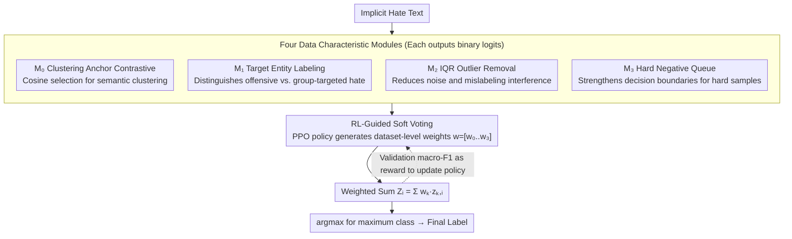

# RV-HATE: Reinforced Multi-Module Voting for Implicit Hate Speech Detection

**Conference**: ACL2026  
**arXiv**: [2510.10971](https://arxiv.org/abs/2510.10971)  
**Code**: https://github.com/leeyejin1231/RV-HATE  
**Area**: Reinforcement Learning / Content Safety / Implicit Hate Speech Detection  
**Keywords**: Implicit Hate Speech Detection, Multi-module Ensemble, PPO, Soft Voting, Contrastive Learning

## TL;DR
RV-HATE decomposes implicit hate speech detection into four BERT contrastive learning modules targeting different data characteristics and uses PPO to learn dataset-specific soft voting weights. It achieves an average macro-F1 of 84.47% across five benchmarks, outperforming SharedCon by an average of 1.8 percentage points.

## Background & Motivation
**Background**: Implicit hate speech detection is more challenging than explicit attacks because it often relies on context, target references, cultural background, and implied stances. Existing methods include cross-entropy classification, supervised contrastive learning, clustering anchor contrastive learning (SharedCon), and methods utilizing hard negatives (LAHN).

**Limitations of Prior Work**: Different hate speech datasets originate from various platforms and annotation norms, differing in linguistic style, degree of implicitness, target boundaries, noise levels, and mislabeling ratios. Many methods adopt a fixed training strategy, assuming a single model can handle all dataset characteristics, which leads to limited gains on certain datasets.

**Key Challenge**: Detecting implicit hate requires simultaneous attention to contextual semantics, target entities, data noise, and boundary samples, but any single module may bias toward a specific feature. Hard-fusing all modules into a single model can result in a loss of specialization.

**Goal**: The authors aim to preserve the complementarity of multiple specialized modules and allow the system to automatically determine the weight of each module in the final prediction based on the specific dataset.

**Key Insight**: RV-HATE treats module combination as a policy optimization problem. Four classifiers learn different data characteristics, a PPO policy generates non-negative weights that sum to 1, and the validation set macro-F1 serves as the reward.

**Core Idea**: Instead of designing a fixed detector, it is better to train multiple biased detectors and let reinforcement learning learn how to weight them at the dataset level.

## Method

### Overall Architecture
RV-HATE addresses the issue where error sources vary across implicit hate datasets, making them difficult for a single model to manage. The approach involves preparing four BERT-base contrastive learning modules, each with different preferences, and then using RL to learn a set of soft voting weights per dataset to merge the binary classification logits into a final prediction. The process consists of three stages: in the first stage, four modules $M_0$ to $M_3$ are trained individually for each dataset; in the second stage, a lightweight PPO policy is trained on the validation set to produce weights $w=[w_0,w_1,w_2,w_3]$ that are non-negative and sum to 1; in the third stage, during inference, each of the four modules outputs logits, and the system calculates a weighted average to select the class with the maximum value as the label. The paper discusses hate speech identification only from the perspective of detection and dataset analysis and does not provide instructions for generating, evading, or amplifying harmful content.

### Key Designs

**1. Four Data Characteristic Modules: Assigning Experts to Specific Error Sources**

Implicit hate datasets do not share the same failure modes—IHC relies more on target references, Hateval is more affected by noise, and Toxigen depends more on boundary samples. Rather than using one model to handle all characteristics, four modules are specialized. $M_0$ follows the clustering anchor contrastive learning of SharedCon but uses cosine similarity for anchor selection to capture semantic clusters; $M_1$ labels target entities such as groups, organizations, and regions in the training data to help distinguish "purely offensive" from "hate against specific groups"; $M_2$ uses IQR to remove outlier samples far from cluster centers, reducing interference from noise and mislabeling; $M_3$ maintains a hard negative queue to strengthen modeling near decision boundaries. The non-overlapping error patterns of these four modules provide the prerequisite for complementary voting.

**2. RL-Guided Soft Voting: Automatic Dataset-Level Weight Allocation**

Individual modules are not necessarily strong on all datasets, and fixed averages or manual tuning cannot adapt to specific dataset characteristics. In RV-HATE, the "module combination" itself is modeled as a policy optimization problem. Each module outputs binary logits $z_{k,i}^{(h)}$ for sample $i$, and the final logit is the weighted sum $Z_i^{(h)}=\sum_{k=0}^{3}w_k z_{k,i}^{(h)}$. The PPO policy generates a weight vector $w$ based on the current state. After soft voting, the validation macro-F1 is used as a reward to update the policy via a clipped objective. Since weights are learned at the dataset level, the system can preserve specialization while emphasizing $M_2$ for noisy datasets or $M_3$ for datasets with many boundary samples.

**3. Interpretable Dataset Characteristic Analysis: Weights as Diagnostic Signals**

In content safety scenarios, understanding why a model is effective on a certain dataset is as important as the F1 score itself. RV-HATE reports not only final scores but also systematic comparisons of single modules, leave-one-out experiments, equal-weight voting, Euclidean distance versions, and PPO-weighted versions. These are compared against entity labeling ratios, outlier removal ratios, and error type distributions. The learned module weights, combined with ablation experiments, provide a coarse-grained but readable diagnosis: if a dataset relies more on target entities or outlier cleaning, the weight distribution and performance drops will expose this dependency.

### Loss & Training
The four detection modules use BERT-base-uncased, with SimCSE-BERT as the text embedding model, trained for 6 epochs. Learning rates are selected from $2e^{-5}$ and $3e^{-5}$, temperature is set to 0.3, and the number of clusters is chosen from 20, 75, or 125. The RL phase runs for 10,000 steps with initial weights of `[0.25, 0.25, 0.25, 0.25]`, constrained to be positive and sum to 1. All experiments use 3 random seeds and report macro-F1 due to class imbalance.

## Key Experimental Results

### Main Results
The paper compares CE, SCL, SharedCon, LAHN, and RV-HATE across five datasets: IHC, SBIC, DYNA, Hateval, and Toxigen.

| Method | IHC | SBIC | DYNA | Hateval | Toxigen | Average macro-F1 |
|------|-----|------|------|---------|---------|---------------|
| CE | 77.70 | 83.80 | 78.80 | 81.11 | 90.06 | 82.29 |
| SCL | 77.81 | 82.92 | 80.39 | 81.28 | 90.75 | 82.63 |
| SharedCon | 78.50 | 84.30 | 79.10 | 80.24 | 91.21 | 82.67 |
| LAHN | 78.40 | 83.98 | 79.64 | 80.42 | 90.42 | 82.57 |
| RV-HATE | 79.07 | 84.62 | 81.82 | 83.44 | 93.41 | 84.47 |

Compared to SharedCon, RV-HATE improves by an average of 1.8 percentage points; it outperforms CE by 2.33 points on Hateval and SharedCon by 2.2 points on Toxigen. Given that this task often plateaus around 80%, these gains are significant.

### Ablation Study

| Configuration | IHC | SBIC | DYNA | Hateval | Toxigen | Average | Description |
|------|-----|------|------|---------|---------|------|------|
| combined modules | 77.32 | 81.31 | 76.50 | 81.26 | 92.02 | 81.64 | Single model fusing all modules; specialization lost |
| equal weights | 78.58 | 84.06 | 81.07 | 82.52 | 92.69 | 83.78 | Fixed 0.25 weights |
| Euclidean version | 78.90 | 82.95 | 81.64 | 83.19 | 93.36 | 84.01 | L2 used instead of cosine |
| RV-HATE | 79.07 | 84.62 | 81.82 | 83.44 | 93.41 | 84.47 | PPO weights + cosine |

| Module Setting | Average macro-F1 | Key Insight |
|----------|---------------|----------|
| $M_0$ alone | 82.68 | Basic cosine clustering contrastive learning module |
| $M_1$ alone | 82.43 | Target entity labeling does not benefit all datasets |
| $M_2$ alone | 82.89 | Outlier handling helps with noisy data |
| $M_3$ alone | 83.00 | Hard negative boundary modeling is the strongest single module |
| RV-HATE (Full) | 84.47 | Optimal after module complementarity |
| w/o $M_3$ | 83.99 | Largest average drop, indicating hard negatives are most critical |

### Key Findings
- Training the four modules into a single "combined model" reduced performance to an average of 81.64, suggesting "module specialization + voting" is more suitable for this task than "hard integration."
- PPO weights improved performance by 0.68 percentage points over equal weights, showing that different datasets require different module combinations.
- Cosine similarity outperformed Euclidean distance by 0.46 points, consistent with the intuition that high-dimensional semantic embeddings prioritize direction.
- Computational overhead primarily comes from the four BERT forward passes; the PPO policy has only ~4.8K parameters, adding 5-10 minutes to training. Inference latency is a linear multiple of a single model.

## Highlights & Insights
- The paper does not treat "generalizing to all datasets" as the sole goal but acknowledges that dataset variance itself is important. This is a realistic view for content safety, where annotation standards and platform context often dictate model behavior.
- RL is used here to learn ensemble weights rather than text generation, making it low-risk and goal-oriented. The PPO action space is small, and the reward directly corresponds to validation macro-F1.
- Module ablation provides interpretability: if a dataset relies more on target entities or outlier cleaning, weights and leave-one-out experiments will expose this dependency.
- For practical systems, content safety classifiers could be designed as "multi-expert + dataset/domain adaptive weights" rather than deploying the same static classifier across all platforms.

## Limitations & Future Work
- The $M_1$ target labeling module is unstable on machine-generated samples, suggesting that entity labeling strategies are sensitive to style and data distribution.
- Inference requires four BERT-base forward passes; while parallelizable, this remains an additional cost for low-latency content moderation systems.
- Weights are optimized at the dataset level, not through per-sample dynamic routing. Finer-grained routing might be needed for different sub-communities or topics within the same dataset.
- Datasets involve intrinsic annotation ambiguity and mislabeling; macro-F1 gains do not fully resolve whether labels are "reasonable." Future work could incorporate uncertainty, human disagreement, and cross-cultural annotation differences into training objectives.

## Related Work & Insights
- **vs SharedCon**: SharedCon learns shared semantic patterns through clustering anchors. RV-HATE inherits this direction but switches to cosine similarity and adds specialized modules for targets, outliers, and hard negatives.
- **vs LAHN**: LAHN emphasizes hard negatives. RV-HATE uses hard negatives as one expert module and complements it with others via voting.
- **vs Single-model multi-function training**: The poor performance of "combined modules" indicates that module specialization is essential in implicit hate detection, as unified training causes conflicting feature preferences.
- **vs Standard ensembles**: While equal-weight voting is effective, PPO weights further capture dataset differences, making the ensemble more interpretable and robust.

## Rating
- Novelty: ⭐⭐⭐⭐☆ Using PPO for module weight learning is not complex but fits the dataset characteristic analysis very well.
- Experimental Thoroughness: ⭐⭐⭐⭐☆ Five datasets, multiple baselines, variants, and module ablations are comprehensive, though cross-lingual and cross-cultural extrapolation requires more validation.
- Writing Quality: ⭐⭐⭐⭐☆ Method decomposition is clear, and module contributions are well-explained.
- Value: ⭐⭐⭐⭐☆ Provides practical reference value for the modular and domain-adaptive design of content safety detection systems, especially for implicit and fuzzy classification tasks.

<!-- RELATED:START -->

## Related Papers

- [\[ACL 2025\] ImpliHateVid: Implicit Hate Speech Detection in Videos](../../ACL2025/social_computing/implihatevid_video_hate.md)
- [\[ACL 2026\] Explain the Flag: Contextualizing Hate Speech Beyond Censorship](explain_the_flag_contextualizing_hate_speech_beyond_censorship.md)
- [\[ACL 2026\] Confident, Calibrated, or Complicit: Safety Alignment and Ideological Bias in LLM Hate Speech Detection](confident_calibrated_or_complicit_safety_alignment_and_ideological_bias_in_llm_h.md)
- [\[ACL 2026\] PSK@EEUCA 2026: Fine-Tuning Large Language Models with Synthetic Data Augmentation for Multi-Class Toxicity Detection in Gaming Chat](pskeeuca_2026_fine-tuning_large_language_models_with_synthetic_data_augmentation.md)
- [\[ACL 2026\] MM-StanceDet: Retrieval-Augmented Multi-modal Multi-agent Stance Detection](mm-stancedet_retrieval-augmented_multi-modal_multi-agent_stance_detection.md)

<!-- RELATED:END -->
