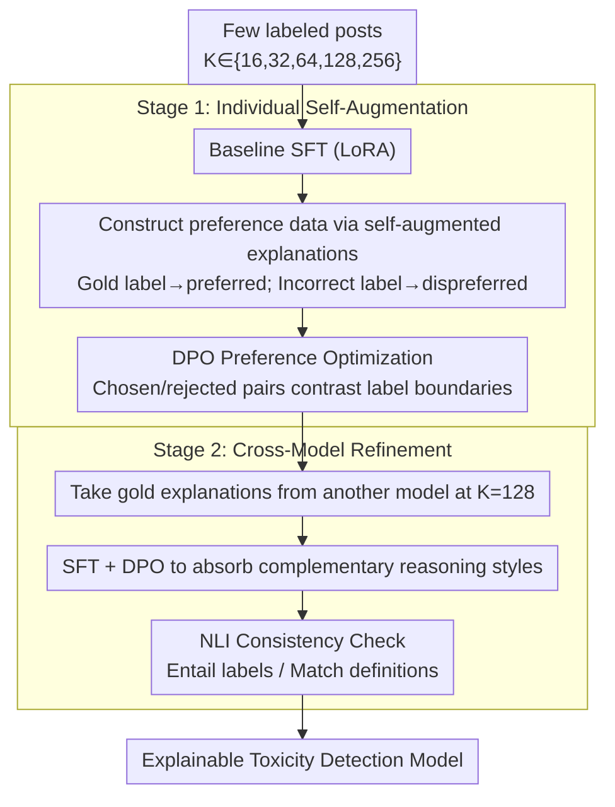

# SMARTER: A Data-efficient Framework to Improve Toxicity Detection with Explanation via Self-augmenting Large Language Models

**Conference**: ACL2026  
**arXiv**: [2509.15174](https://arxiv.org/abs/2509.15174)  
**Code**: https://github.com/hnghiem-nlp/hate_dpo_public  
**Area**: Social Computing / Content Moderation / Explainable NLP  
**Keywords**: Toxicity Detection, Explainable Classification, Self-augmenting training, DPO, Cross-model distillation  

## TL;DR
SMARTER utilizes a few labeled samples to prompt LLMs to generate explanations for both correct and incorrect labels, then improves explainable toxicity detection through preference optimization and cross-model training. It achieves 86%-100% of full-training performance using only 6%-57% of the training data across three datasets.

## Background & Motivation
**Background**: Social platforms need to detect hate speech, offensive language, and implicit toxic expressions. While traditional classifiers provide labels, they often lack readable explanations; LLMs can output both classification and reasoning, making them better suited for moderation scenarios requiring transparency and human review.

**Limitations of Prior Work**: Toxicity detection labels are fine-grained and boundaries are often blurred, particularly for implicit toxicity which relies heavily on context and definitions. High-quality annotated data is expensive, and standards across platforms evolve with linguistic trends. Although zero-shot or few-shot calls to commercial LLMs are convenient, they are costly, offer weak control, exhibit high variance, and may not consistently produce compliant explanations.

**Key Challenge**: Low-resource scenarios require both high accuracy and human-understandable explanations. Direct SFT on small samples prone to overfitting, while pure prompting remains unstable. The core problem is how to enable models to utilize their inherent generation capabilities to construct more useful training signals under minimal supervision.

**Goal**: The authors propose a two-stage framework: first, an individual model improves classification through self-augmented explanations and DPO; second, models with different architectures learn reasoning styles and patterns from one another to obtain explainable, deployable content moderation models with limited data.

**Key Insight**: The paper leverages the structural preference that "an explanation given a correct label should be superior to an explanation given an incorrect label." For every labeled post, the model generates not only an explanation for the gold label but also counter-explanations for other incorrect labels, naturally forming chosen/rejected data.

**Core Idea**: Convert self-generated explanations for correct/incorrect labels into preference optimization data, followed by absorbing complementary explanation capabilities through cross-model refinement.

## Method

### Overall Architecture
SMARTER consists of two stages. Stage 1 is individual self-augmentation: a few training samples $K \in \{16,32,64,128,256\}$ are sampled for each task. The model is first fine-tuned via SFT on these samples, then prompted to generate explanations based on both correct and incorrect labels, followed by preference optimization using DPO or KTO. Stage 2 is cross-model refinement: explanations generated by one model at $K=128$ are used to train another model, allowing a weaker model to absorb the reasoning style of a stronger or complementary model, with NLI used to verify consistency between explanations and labels.

The experiments utilize three tasks: HateXplain, Latent Hate, and Implicit Hate. Models include Llama-3.1-8B-Instruct and COT-T5-XL. Evaluation uses Macro-F1 due to the importance of class imbalance and multi-class semantic boundaries.

### Key Designs

**1. Constructing Preference Data via Self-augmented Explanations: Turning "Explanations for Incorrect Labels" into Training Signals**

High-quality annotations are expensive in low-resource settings, and direct SFT on small samples leads to overfitting. Instead of expanding manual annotations, SMARTER lets the model generate contrastive data. For each post, the model generates one preferred explanation based on the gold label and several dispreferred explanations based on incorrect labels. DPO pairs the correct and incorrect label explanations as chosen/rejected pairs. The key intuition is that moderation explanations are inherently tied to label definitions; explanations for wrong labels expose confusion points between categories, forcing the model to learn category boundaries rather than memorizing positive examples.

**2. DPO Preferred over KTO: Highlighting Fine-grained Label Boundaries with Pairwise Contrast**

The difficulty in toxicity detection often lies in subtle semantic differences between adjacent labels. DPO uses pairwise preferred/rejected explanations to directly answer "which label explanation is more reasonable for the same post." KTO uses listwise binary signals (accept/reject), which is coarser. Because pairwise contrast is better at pushing class boundaries apart, experiments show DPO continues to improve at $K=256$, while KTO is often ineffective or even degrades performance—confirming that for this task, "which of two labels fits the definition better" is more important than "is this single explanation plausible."

**3. Cross-model Refinement and Consistency Checks: Transferring Complementary Advantages while Auditing Explanation Drift**

Models with different architectures have different explanation styles—Llama's explanations are often preferred by humans in specific categories, while T5's encoder-decoder structure may be more stable. SMARTER allows Llama and T5 to cross-generate gold explanations on held-out 128-shot data, then applies SFT and DPO to each model using the other's explanations. To prevent cross-model transfer from causing inconsistency between explanations and labels, NLI is employed to check if explanations entail the predicted labels and match definitions, monitoring drift to ensure "style acquisition" does not come at the cost of "logical consistency."

### Loss & Training
Base SFT utilizes LoRA with rank 64, alpha 128, and dropout 0.05, targeting the q and v projection layers. Base SFT is trained for 3 epochs with a learning rate of $3 \times 10^{-4}$. DPO uses the sigmoid loss from TRL with $\beta=0.1$; KTO also uses $\beta=0.1$. Inference temperature is set to 0. Maximum tokens are 512 for explainable classification and 20 for pure classification.

## Key Experimental Results

### Main Results
Results at K=256 show that SMARTER outperforms commercial model zero-shot and 16-shot ICL in low-data regimes and surpasses the full-training baseline on Latent Hate.

| Method | HateXplain F1 / Data Ratio | Latent Hate F1 / Data Ratio | Implicit Hate F1 / Data Ratio | Observations |
|------|--------------------------|----------------------------|------------------------------|------|
| Llama_DPO-256 | 0.64 / 6% | 0.69 / 7% | 0.60 / 57% | Strongest overall across three tasks; best result on Latent Hate |
| T5_DPO-256 | 0.62 / 6% | 0.65 / 7% | 0.59 / 57% | Weaker than Llama, but data efficiency is equally evident |
| Llama_Full | 0.72 / 100% | 0.62 / 100% | 0.67 / 100% | Full training strongest on HateXplain and Implicit Hate |
| ModernBERT | 0.70 / 100% | 0.61 / 100% | 0.64 / 100% | Strong classifier, but does not generate explanations |
| GPT-4o zero-shot | 0.56 / - | 0.51 / - | 0.58 / - | Commercial model zero-shot is not consistently leading |
| GPT-4o 16-shot ICL | 0.62±0.01 / - | 0.60±0.06 / - | 0.40±0.11 / - | Few-shot ICL shows high variance on complex tasks |

The authors also performed an ablation on contributions: on HateXplain, off-the-shelf Llama scores 0.52; adding HateCOT pre-training brings the K=256 baseline to 0.58; SMARTER's DPO self-augmentation further increases this to 0.64, indicating gains are not merely from general pre-training or seed explanations.

### Ablation Study
Cross-model refinement demonstrates that T5 benefits significantly from Llama's explanations, while Llama often suffers when learning from T5. This suggests "mutual learning" is not unconditionally effective and requires validation set selection.

| Setting | HateXplain F1 | Latent Hate F1 | Implicit Hate F1 | Conclusion |
|------|---------------|----------------|------------------|------|
| T5 Individual DPO-256 | 0.62 | 0.65 | 0.59 | T5 baseline after self-augmentation |
| T5 + Llama Outputs SFT+DPO | 0.66 | 0.66 | 0.61 | Outperforms T5 individual and some Llama individual results |
| Llama Individual DPO-256 | 0.64 | 0.69 | 0.60 | Llama baseline after self-augmentation |
| Llama + T5 Outputs | Not exceeding individual | Brief boost on some tasks | No stable gain formed | T5 outputs not necessarily suitable for Llama enhancement |

Regarding explanation quality, human evaluation on 342 HateXplain samples compared T5 and Llama. In the "Normal" class, Llama explanations were preferred 73 times vs. T5 25 times; performance was similar for "Offensive" and "Hate" classes. NLI consistency checks showed most explanations remained consistent with predicted labels and definitions (Entailment >96%), though cross-model training slightly increased contradiction by 2%-3%.

| Dataset/Model | Training | Label Consistency Entail↑ | Label Contra.↓ | Def. Consistency Entail↑ | Def. Contra.↓ |
|-------------|----------|-------------------|-------------------|--------------------|--------------------|
| HateXplain T5 | DPO | 99.2 | 0.8 | 98.2 | 1.5 |
| HateXplain T5 | XMOD | 96.7 | 1.5 | 99.0 | 0.9 |
| Latent Hate Llama | DPO | 97.3 | 2.7 | 97.3 | 2.3 |
| Latent Hate Llama | XMOD | 96.8 | 3.2 | 97.5 | 2.5 |
| Implicit Hate T5 | DPO | 99.6 | 0.4 | 99.0 | 1.0 |
| Implicit Hate T5 | XMOD | 98.3 | 1.4 | 97.5 | 2.0 |

### Key Findings
- DPO self-augmentation provides gains even at K≤64, demonstrating significant value in low-resource settings; T5 can close the gap with Llama on Latent Hate and Implicit Hate.
- DPO continues to improve at K=256, whereas KTO is ineffective on HateXplain and negatively impacts Latent Hate and Implicit Hate.
- Commercial model 16-shot ICL is not necessarily better than zero-shot; for instance, GPT-4o-mini dropped from 0.50 to 0.29 on HateXplain, indicating that few-shot prompting is fragile for fine-grained toxicity tasks.
- Cross-model training allows weaker models to absorb stronger model reasoning styles but may introduce minor explanation inconsistencies, necessitating periodic human or NLI auditing in deployment.

## Highlights & Insights
- The most ingenious aspect is converting "incorrect label explanations" into training resources. This is not simple data augmentation but an explicit contrast of category boundaries under the same input.
- The superiority of DPO over KTO aligns with task intuition: content moderation often involves judging which label definition fits better, rather than just determining if an explanation "makes sense."
- Cross-model refinement reveals that differences between models go beyond performance to include stylistic reasoning differences. T5 can absorb Llama's reasoning patterns, but Llama does not necessarily benefit from T5.
- The paper does not just chase F1 scores; it uses human preference and NLI consistency to validate explanation quality, which is crucial for explainable content moderation.

## Limitations & Future Work
- Data is entirely in English; cross-lingual toxicity, cultural context, and platform norms could significantly alter label boundaries.
- Only Llama and T5 were compared; cross-model refinement conclusions may not generalize to more architectures or larger models.
- Human evaluation of explanations was limited to HateXplain due to budget constraints; other fine-grained tasks lack equivalent human validation.
- Self-augmentation relies on initial model capability; strong initial biases in the model could lead to incorrect label explanations that reinforce wrong boundaries or biases.
- Content moderation inherently carries risks of abuse. Model outputs must be paired with human review, appeal mechanisms, and bias audits, and should not be the sole basis for automated expression suppression.

## Related Work & Insights
- **vs. Traditional Toxicity Classifiers**: Classifiers like ModernBERT are strong but limited in explanation, whereas SMARTER is better suited for workflows requiring transparent reasoning and human review.
- **vs. Commercial ICL**: Commercial models are easy to deploy but suffer from high few-shot variance, cost, and limited control; SMARTER provides a stable, controllable local solution using open-source models.
- **vs. Self-Instruct / Self-Refine**: These methods typically generate more positive data; SMARTER's unique feature is simultaneously generating both correct and incorrect label explanations to form preference pairs.
- **Insight**: For other fine-grained social computing tasks such as rumor classification, stance detection, and policy violation judgment, "counterfactual explanations" under label definitions can serve as effective low-resource alignment signals.

## Rating
- Novelty: ⭐⭐⭐⭐☆ The idea of self-augmented explanations plus DPO is straightforward but highly practical for explainable toxicity detection.
- Experimental Thoroughness: ⭐⭐⭐⭐☆ Covers three tasks, two model types, commercial baselines, cross-model training, and consistency analysis; however, cross-lingual and broader human evaluation is still missing.
- Writing Quality: ⭐⭐⭐⭐☆ Clear methodology and informative tables; some figures require cross-referencing with the text for full clarity.
- Value: ⭐⭐⭐⭐⭐ Highly valuable for training low-resource, explainable, and controllable moderation models; provides a transferable paradigm for "preference optimization using incorrect explanations."

<!-- RELATED:START -->

## Related Papers

- [\[ACL 2026\] PSK@EEUCA 2026: Fine-Tuning Large Language Models with Synthetic Data Augmentation for Multi-Class Toxicity Detection in Gaming Chat](pskeeuca_2026_fine-tuning_large_language_models_with_synthetic_data_augmentation.md)
- [\[ICML 2026\] Self-Debias: Self-correcting for Debiasing Large Language Models](../../ICML2026/social_computing/self-debias_self-correcting_for_debiasing_large_language_models.md)
- [\[ACL 2026\] Inertia in Moral and Value Judgments of Large Language Models](inertia_in_moral_and_value_judgments_of_large_language_models.md)
- [\[ACL 2025\] BiasGuard: A Reasoning-Enhanced Bias Detection Tool for Large Language Models](../../ACL2025/social_computing/biasguard_a_reasoning-enhanced_bias_detection_tool_for_large_language_models.md)
- [\[ACL 2026\] ToxiTrace: Gradient-Aligned Training for Explainable Chinese Toxicity Detection](toxitrace_gradient-aligned_training_for_explainable_chinese_toxicity_detection.md)

<!-- RELATED:END -->
