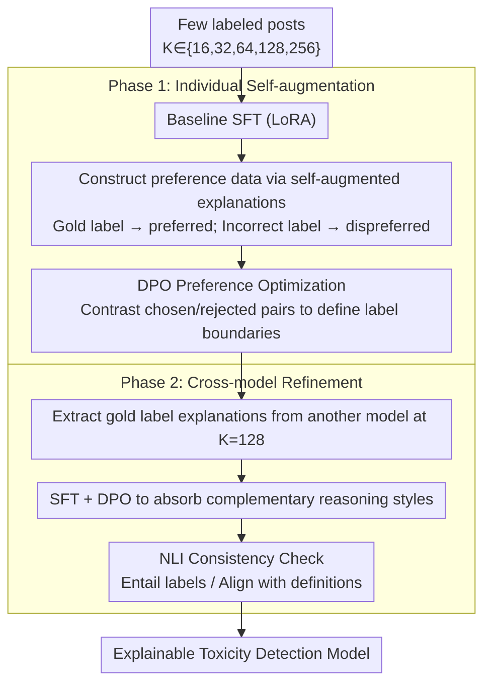

# SMARTER: A Data-efficient Framework to Improve Toxicity Detection with Explanation via Self-augmenting Large Language Models

**Conference**: ACL2026  
**arXiv**: [2509.15174](https://arxiv.org/abs/2509.15174)  
**Code**: https://github.com/hnghiem-nlp/hate_dpo_public  
**Area**: Social Computing / Content Moderation / Explainable NLP  
**Keywords**: Toxicity Detection, Explainable Classification, Self-augmented Training, DPO, Cross-model Refinement

## TL;DR
SMARTER utilizes a small number of labeled samples to prompt LLMs to generate explanations for both correct and incorrect labels. It then enhances explainable toxicity detection through preference optimization and cross-model training. On three datasets, it achieves 86%-100% of the performance of full-data training using only 6%-57% of the training data.

## Background & Motivation
**Background**: Social platforms require the detection of hate speech, offensive language, and implicit harmful expressions. While traditional classifiers provide labels, they often lack human-readable explanations. LLMs can output both classification and reasoning, making them more suitable for content moderation scenarios requiring transparency and human review.

**Limitations of Prior Work**: Toxicity detection features fine-grained label spaces and fuzzy boundaries. Implicit harmful expressions, in particular, rely heavily on context and definitions. High-quality annotated data is expensive, and standards across platforms shift with linguistic trends. Although zero-shot or few-shot prompting of commercial LLMs is convenient, it suffers from high costs, weak controllability, high variance in results, and unstable compliance in generated explanations.

**Key Challenge**: Low-resource scenarios demand both high accuracy and human-understandable explanations. Direct SFT on small samples leads to overfitting, while pure prompting remains unstable. The core problem is how to leverage a model's existing generative capabilities to construct useful training signals under minimal supervision.

**Goal**: The authors propose a two-stage framework. First, an individual model improves its classification via self-augmented explanations and DPO. Second, models with different architectures learn from each other's explanation styles and reasoning patterns to obtain explainable, deployable moderation models using limited data.

**Key Insight**: This paper exploits the structural preference that "an explanation given the correct label should be superior to an explanation given an incorrect label." For each labeled post, the model generates an explanation for the gold label and "counter-explanations" for other incorrect labels, naturally forming chosen/rejected data pairs.

**Core Idea**: Convert explanations self-generated by LLMs for correct/incorrect labels into preference optimization data, then absorb complementary reasoning capabilities through cross-model refinement.

## Method

### Overall Architecture
SMARTER consists of two phases. Phase 1 is individual self-augmentation: a small set of training samples $K \in \{16,32,64,128,256\}$ is sampled for each task. The model is first fine-tuned via SFT on these samples, then prompted to generate explanations based on correct and incorrect labels, followed by preference optimization using DPO or KTO. Phase 2 is cross-model refinement: explanations generated by one model at $K=128$ are used to train another model, allowing a weaker model to absorb the reasoning style of a stronger or complementary model, with NLI used to verify explanation-label consistency.

The experiments utilize three tasks: HateXplain, Latent Hate, and Implicit Hate. Models include Llama-3.1-8B-Instruct and COT-T5-XL. Macro-F1 is used as the evaluation metric due to class imbalance and the importance of multi-class semantic boundaries.

### Key Designs

**1. Preference Data via Self-augmented Explanations: Leveraging "incorrect explanations" as training signals**

In low-resource scenarios, high-quality annotations are costly, and direct SFT on few samples leads to overfitting. Instead of expanding manual annotations, SMARTER lets the model generate contrastive data. For each post, the model generates one preferred explanation based on the gold label and one dispreferred explanation for each incorrect label. DPO pairs the correct and incorrect explanations as chosen/rejected sets. The intuition is that moderation explanations are inherently tied to label definitions; explanations for incorrect labels expose the points of confusion between classes, forcing the model to learn class boundaries rather than memorizing positive examples.

**2. DPO over KTO: Highlighting fine-grained label boundaries via pairwise contrast**

The difficulty in toxicity detection lies in subtle semantic differences between adjacent labels. DPO uses paired preferred/rejected explanations to directly answer "which explanation is more reasonable for the same post," whereas KTO uses list-wise binary signals which are coarser. Pairwise contrast is more effective at pushing class boundaries; in experiments, DPO performance continued to improve at $K=256$, while KTO often became ineffective or even degraded performance. This confirms that "which of two similar labels fits the definition better" is more important than "whether a single explanation is plausible."

**3. Cross-model Refinement and Consistency Checks: Transferring complementary strengths while auditing drift**

Different architectures exhibit different explanation styles—Llama's explanations are preferred by humans in some categories, while T5's encoder-decoder structure may be more stable. SMARTER allows Llama and T5 to generate gold label explanations for each other on held-out 128-shot data, then applies SFT and DPO to the recipient model. To prevent "explanation drift" where models learn style but lose accuracy, NLI is used to check if an explanation entails the predicted label and fits the label definition, ensuring consistency remains high.

### Loss & Training
Base SFT uses LoRA with rank=64, alpha=128, and dropout=0.05, targeting the q and v projection layers. Base SFT is trained for 3 epochs with a learning rate of $3 \times 10^{-4}$. DPO uses the standard sigmoid loss from TRL with $\beta=0.1$; KTO similarly uses $\beta=0.1$. Inference uses temperature 0, with a maximum of 512 tokens for classification with explanation and 20 tokens for classification only.

## Key Experimental Results

### Main Results
At K=256, SMARTER outperforms zero-shot and 16-shot ICL of commercial models and exceeds the full-training baseline on Latent Hate.

| Method | HateXplain F1 / Data % | Latent Hate F1 / Data % | Implicit Hate F1 / Data % | Observation |
|------|--------------------------|----------------------------|------------------------------|------|
| Llama_DPO-256 | 0.64 / 6% | 0.69 / 7% | 0.60 / 57% | Top overall performer; best on Latent Hate |
| T5_DPO-256 | 0.62 / 6% | 0.65 / 7% | 0.59 / 57% | Weaker than Llama but highly data-efficient |
| Llama_Full | 0.72 / 100% | 0.62 / 100% | 0.67 / 100% | Full training strongest on HateXplain and Implicit Hate |
| ModernBERT | 0.70 / 100% | 0.61 / 100% | 0.64 / 100% | Strong classifier, but lacks explanations |
| GPT-4o zero-shot | 0.56 / - | 0.51 / - | 0.58 / - | Unstable performance for zero-shot commercial models |
| GPT-4o 16-shot ICL | 0.62±0.01 / - | 0.60±0.06 / - | 0.40±0.11 / - | High variance for few-shot ICL on complex tasks |

The authors also performed a component breakdown: on HateXplain, off-the-shelf Llama scores 0.52; after adding HateCOT pre-training, the K=256 baseline reaches 0.58; SMARTER’s DPO self-augmentation further raises it to 0.64, proving gains are not solely from pre-training or seed explanations.

### Ablation Study
Cross-model refinement shows that T5 significantly benefits from Llama's explanations, while Llama often suffers when learning from T5. This suggests that "mutual learning" is not unconditionally effective and requires validation-based selection.

| Setting | HateXplain F1 | Latent Hate F1 | Implicit Hate F1 | Conclusion |
|------|---------------|----------------|------------------|------|
| T5 Single Model DPO-256 | 0.62 | 0.65 | 0.59 | Baseline after T5 self-augmentation |
| T5 + Llama Output SFT+DPO | 0.66 | 0.66 | 0.61 | Surpasses single T5 and some Llama results |
| Llama Single Model DPO-256 | 0.64 | 0.69 | 0.60 | Baseline after Llama self-augmentation |
| Llama + T5 Output | No improvement | Brief gain in some tasks | No stable gain | T5 output not ideal for enhancing Llama |

Regarding explanation quality, human evaluation of 342 HateXplain samples compared T5 and Llama. For the "Normal" class, Llama's explanations were preferred 73 times vs. 25 for T5; for "Offensive" and "Hate," they were comparable. NLI checks showed over 96% entailment between explanations and labels, though cross-model training caused contradiction to rise slightly by 2%-3%.

| Dataset/Model | Training | Label Entail↑ | Label Contra.↓ | Def. Entail↑ | Def. Contra.↓ |
|-------------|----------|-------------------|-------------------|--------------------|--------------------|
| HateXplain T5 | DPO | 99.2 | 0.8 | 98.2 | 1.5 |
| HateXplain T5 | XMOD | 96.7 | 1.5 | 99.0 | 0.9 |
| Latent Hate Llama | DPO | 97.3 | 2.7 | 97.3 | 2.3 |
| Latent Hate Llama | XMOD | 96.8 | 3.2 | 97.5 | 2.5 |
| Implicit Hate T5 | DPO | 99.6 | 0.4 | 99.0 | 1.0 |
| Implicit Hate T5 | XMOD | 98.3 | 1.4 | 97.5 | 2.0 |

### Key Findings
- DPO self-augmentation provides significant gains even at $K \le 64$, demonstrating value in low-resource settings. T5 narrows the gap with Llama on Latent Hate and Implicit Hate.
- DPO continues to improve at $K=256$, whereas KTO is ineffective on HateXplain and degrades performance on Latent Hate and Implicit Hate.
- 16-shot ICL for commercial models is not necessarily better than zero-shot; e.g., GPT-4o-mini dropped from 0.50 to 0.29 on HateXplain, indicating few-shot fragility in fine-grained tasks.
- Cross-model training helps weaker models absorb stronger reasoning styles but can introduce slight explanation inconsistencies, requiring NLI or human auditing in deployment.

## Highlights & Insights
- The most clever aspect of SMARTER is treating "incorrect label explanations" as training resources, explicitly highlighting class boundaries.
- The superiority of DPO over KTO aligns with the task's nature: content moderation is less about whether an explanation "sounds plausible" and more about comparing which explanation fits a specific definition better.
- Cross-model refinement reveals that models differ not just in performance but in explanation style. T5 can absorb Llama’s reasoning patterns, but Llama does not necessarily benefit from T5.
- The research goes beyond F1 scores to evaluate quality via human preference and NLI consistency, which is critical for explainable moderation.

## Limitations & Future Work
- The data is entirely in English; cross-lingual toxicity, cultural contexts, and platform norms could significantly alter label boundaries.
- Only Llama and T5 were compared; cross-model refinement findings might not generalize to more architectures or larger scales.
- Human preference evaluation was limited to HateXplain due to budget; other fine-grained tasks lack equivalent human validation.
- Self-augmentation relies on the initial model's ability to generate explanations; strong initial bias might reinforce incorrect boundaries.
- Content moderation inherently carries the risk of misuse; model outputs must be paired with human review and appeal mechanisms rather than used as the sole basis for automated suppression.

## Related Work & Insights
- **vs. Traditional Toxicity Classifiers**: Classifiers like ModernBERT are strong but lack explanation capabilities. SMARTER is better suited for workflows requiring transparent reasoning.
- **vs. Commercial ICL**: Commercial models are easy to deploy but suffer from high variance, cost, and poor controllability. SMARTER offers a more stable and controllable local solution using open-source models.
- **vs. Self-Instruct / Self-Refine**: These methods typically generate more positive data; SMARTER's uniqueness lies in generating explanations for both correct and incorrect labels to form preference pairs.
- **Insights**: For other fine-grained social computing tasks (e.g., rumor detection, stance detection), "counterfactual explanations" under label definitions can serve as effective low-resource alignment signals.

## Rating
- Novelty: ⭐⭐⭐⭐☆ The combination of self-augmented explanations and DPO is a practical framework for explainable toxicity detection.
- Experimental Thoroughness: ⭐⭐⭐⭐☆ Includes three tasks, two model types, commercial baselines, and consistency analysis; however, cross-lingual and broader human evaluations are noted gaps.
- Writing Quality: ⭐⭐⭐⭐☆ Clear methodology and informative tables, though some figures require close reading.
- Value: ⭐⭐⭐⭐⭐ High practical value for training explainable moderation models in limited-data settings; provides a transferable paradigm for using "incorrect explanations" in preference optimization.

<!-- RELATED:START -->

## Related Papers

- [\[ACL 2026\] PSK@EEUCA 2026: Fine-Tuning Large Language Models with Synthetic Data Augmentation for Multi-Class Toxicity Detection in Gaming Chat](pskeeuca_2026_fine-tuning_large_language_models_with_synthetic_data_augmentation.md)
- [\[ICML 2026\] Self-Debias: Self-correcting for Debiasing Large Language Models](../../ICML2026/social_computing/self-debias_self-correcting_for_debiasing_large_language_models.md)
- [\[ACL 2026\] Inertia in Moral and Value Judgments of Large Language Models](inertia_in_moral_and_value_judgments_of_large_language_models.md)
- [\[ACL 2026\] ToxiTrace: Gradient-Aligned Training for Explainable Chinese Toxicity Detection](toxitrace_gradient-aligned_training_for_explainable_chinese_toxicity_detection.md)
- [\[ACL 2026\] ClaimDB: A Fact Verification Benchmark over Large Structured Data](claimdb_a_fact_verification_benchmark_over_large_structured_data.md)

<!-- RELATED:END -->
