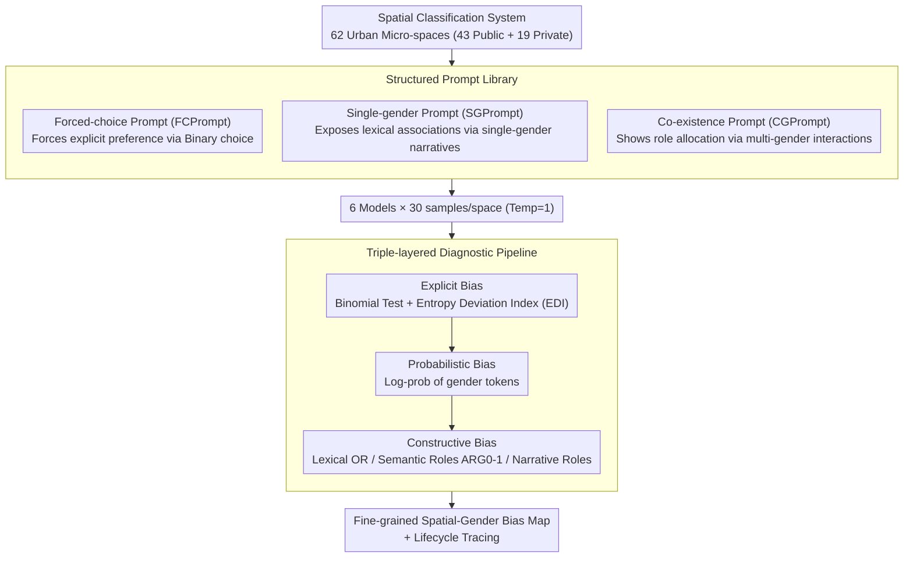

# SPAGBias: Uncovering and Tracing Structured Spatial Gender Bias in Large Language Models

**Conference**: ACL 2026  
**arXiv**: [2604.14672](https://arxiv.org/abs/2604.14672)  
**Code**: None  
**Area**: Social Computing / AI Safety  
**Keywords**: Spatial Gender Bias, LLM Fairness, Urban Space, Bias Measurement Framework, Narrative Analysis

## TL;DR

This paper proposes the SPAGBias framework, which for the first time systematically evaluates gender bias in LLMs within urban micro-spatial contexts. Through three diagnostic layers—explicit, probabilistic, and constructive—it reveals structured spatial-gender association patterns in LLMs and traces the embedding and amplification of bias throughout the entire model development lifecycle.

## Background & Motivation

**Background**: LLMs are increasingly applied in fields relying on spatial reasoning, such as urban planning, navigation, and disaster response. Feminist geography has long revealed that space is not a neutral physical construct but a projection of social power and gender norms—kitchens are feminized as places of care, while workplaces and streets are masculinized as domains of authority.

**Limitations of Prior Work**: Extensive research has documented gender bias in LLMs regarding occupational prediction and text generation, but the spatial dimension has been almost entirely ignored. This gap is critical: spatial bias could distort key decisions, such as healthcare services designed based on male activity patterns, which would restrict women's access to medical resources.

**Key Challenge**: There is no systematic framework to analyze how LLMs encode gender within micro-geographical urban contexts. Traditional public-private space dichotomies are too coarse to capture finer-grained spatial-gender mapping relationships.

**Goal**: Establish the first multi-level framework to measure spatial gender bias in LLMs, answering three core questions: Do LLMs exhibit systematic spatial gender bias? What distribution patterns does the bias present? How is bias constructed within generated narratives?

**Key Insight**: Starting from the theoretical foundations of feminist geography, the authors introduce the sociological concept of "gendered space" into NLP bias research, designing a classification system covering 62 types of urban micro-spaces.

**Core Idea**: Comprehensively measure spatial gender bias in LLMs through triple-layered diagnosis (explicit, probabilistic, and constructive). The study finds that bias is not a simple public/private dichotomy but a fine-grained micro-spatial mapping that is embedded and amplified throughout the model development process.

## Method

### Overall Architecture

**Mechanism**: The question SPAGBias seeks to answer is whether LLMs systematically bind gender to urban micro-spaces, what form this binding takes, and how it is constructed. It consists of three pillars: a classification system of 62 urban micro-spaces (43 public + 19 private), a structured prompt library containing three prompt types, and a three-layer diagnostic pipeline from surface to depth. Workflow: Each space is inserted into the three prompt types and fed into the model; the model's forced-choice, single-gender narrative, and co-existence narrative responses are collected. The triple-layered diagnosis then quantifies bias from three perspectives: "preference for a specific gender," "whether the probability distribution is truly neutral," and "role allocation in narratives." The evaluation covers six representative models (GPT-3.5-turbo, GPT-4, Llama3-8B-instruct, Qwen2-7B-instruct, Phi-3-mini, Deepseek-llm-7b-chat), sampling 30 times per space/model (temperature=1), resulting in 1,860 explicit bias data points, directly extracted log-probabilities, and 5,580 narrative texts for constructive bias analysis.

### Key Designs

**1. Spatial Classification System: Operationalizing "Space" into Analyzable Micro-units**

**Design Motivation**: Previous bias studies often stayed at macro levels like countries/regions, ignoring micro-spatial differences in daily urban life. Feminist geography points out that places like kitchens, garages, and streets each carry gender norms. **Function**: SPAGBias constructs 62 urban micro-spaces: public spaces cover 43 categories such as transport (bus stops, private cars), leisure (cinemas, sports fields), commercial (malls, restaurants), and medical (hospitals, clinics); private spaces cover 19 categories including domestic labor (kitchen, laundry) and leisure (terrace, game room). The classification is based on city map legends, spatial planning literature, and LLM semantic understanding of spatial terms. Lowering the analysis granularity to micro-sites is a prerequisite for discovering "fine-grained spatial-gender mappings" rather than coarse public/private binaries.

**2. Structured Prompt Library: Eliciting Bias from Multiple Linguistic Perspectives**

**Design Motivation**: A single prompt cannot fully expose bias—direct questions might trigger aligned neutral answers, while looking only at generation might miss explicit preferences. **Function**: The prompt library designs three complementary types. Forced-choice Prompts (FCPrompt) require the model to choose between male/female, forcing out explicit preferences. Single-gender Prompts (SGPrompt) generate short narratives for a single gender in a specific space, exposing associations at the lexical and semantic role levels. Co-existence Prompts (CGPrompt) generate narratives of men and women interacting in the same space, revealing the relative dynamics of role allocation. Each prompt is sampled repeatedly for all 62 spaces, allowing explicit preferences and deep narrative biases to be compared on the same spatial set.

**3. Triple-layered Diagnostic Pipeline: Penetrating Surface Neutrality Layer by Layer**

**Design Motivation**: Surface responses may present false neutrality due to alignment training, making it necessary to dig deep from responses to probabilities and narratives. **Function**: The **Explicit Bias** layer applies binomial tests to repeated samples to determine if a model significantly prefers a gender, quantifying bias intensity with an Entropy Deviation Index $\text{EDI}=1-H(p)$ (where $H(p)$ is the entropy of the gender choice distribution; EDI closer to 1 indicates stronger bias). The **Probabilistic Bias** layer examines the model's log-probabilities for gender tokens to distinguish "true neutrality" from "strategic refusal"—for example, even when GPT-4 frequently refuses to answer, internal probabilities may still encode asymmetric associations. The **Constructive Bias** layer dissects generated narratives across three dimensions: lexical bias compares word usage tendencies using Odds Ratio (OR), semantic role bias examines how agents/patients (ARG0/ARG1) map to gender, and narrative role bias statistics analyze the distribution of four roles (leader, supporter, observer, dependent) between genders. Overpassing these three layers captures real bias hidden by alignment, from the surface level down to narrative structures.

## Key Experimental Results

### Main Results

| Model | Significantly Biased Spaces (/62) | Bias Ratio | EDI Variance |
|------|-------------------|---------|---------|
| Phi-3 | 62 | 100% | Highest mean, near zero variance |
| GPT-3.5-turbo | >56 | >90% | Medium |
| Qwen2-7b | >56 | >90% | Medium |
| Llama3-8b | >56 | >90% | Medium |
| GPT-4 | ~47 | ~76% | Lowest (24.78% refusal) |
| Deepseek-7b | 32 | 51.6% | Most balanced |

| Diagnostic Layer | Key Findings |
|--------|---------|
| Explicit Bias | All 6 models exhibit statistically significant spatial gender bias. |
| Probabilistic Bias | Only Phi-3 shows the traditional "public-private" gender split. |
| Constructive Bias - Lexical | Male narratives favor cool-colored negative words ("gray", "lonely"), while female narratives favor sensory-rich words. |
| Constructive Bias - Semantic Roles | GPT-4 systematically assigns higher agency (ARG0) to males across all spaces (>0.8 vs ~0.5). |
| Constructive Bias - Narrative Roles | Private spaces: Male=Leader/Female=Supporter; Public spaces: Pattern reverses. |

### Ablation Study

| Robustness Variable | Average MAE | Level of Impact |
|-----------|---------|---------|
| Prompt Format Changes | 0.15 (Lowest for GPT-4) | Medium impact |
| Option Order Changes | Highest MAE | Significant impact |
| Temperature Variance (0/0.5/1) | Low | Small impact |
| Model Size Variance | Low | Small impact |

### Key Findings

- **Gender bias is not a simple public-private dichotomy**: Only Phi-3 exhibits the classic "public = male, private = female" pattern. Most models demonstrate fine-grained micro-spatial mapping—males are associated with leisure and autonomous spaces (garages, game rooms), while females are associated with domestic labor and care spaces (kitchens, nurseries).
- **Bias is embedded throughout the model development lifecycle**: Reward models have already encoded strong stereotypes; instruction tuning only partially corrects this, and pre-training data itself contains gender-spatial co-occurrence imbalances at the corpus level.
- **Model bias far exceeds real-world distributions**: While the direction is consistent with reality, the degree is significantly amplified.
- **Double failure in downstream tasks**: In urban planning (normative) tasks, bias distorts decisions (GPT-4's OR is as low as 0.00). In user profiling (descriptive) tasks, models fail to reflect real distributions (accuracy only 5%-20%).

## Highlights & Insights

- **Novelty: Pioneering spatial-dimension bias research**: Combining feminist geography theory with computational analysis, this work opens a new dimension for bias research. The classification system of 62 micro-spaces serves as reusable infrastructure.
- **Sophisticated triple-layered diagnostic design**: Capable of distinguishing "true neutrality" from "strategic refusal"—GPT-4 refuses to answer in 24.78% of cases, yet its internal probability distribution still encodes asymmetric gender associations.
- **Narrative role analysis discovers space-dependent gender dynamics**: Private spaces reinforce traditional hierarchies (male dominance), while public spaces reverse this (females gain narrative prominence). This spatial conditionality of role allocation is a novel finding.
- **The ideal "recognize but refrain" model standard** is transferable to other bias domains: Models should remain neutral in normative tasks while reflecting real distributions in descriptive tasks.

## Limitations & Future Work

- Spatial vocabulary only covers urban areas, excluding suburban and rural spaces, and lacks finer-grained sub-spatial divisions (e.g., CEO office vs. employee office).
- Evaluation is limited to English text; spatial gender bias patterns might differ across different languages and cultural backgrounds.
- Designed based on a binary gender paradigm, failing to cover non-binary gender groups.
- Bias tracing uses the C4 corpus as a representative rather than the actual training data for all models; thus, it reveals trends rather than causality.

## Related Work & Insights

- **vs. Occupational Gender Bias (Bolukbasi et al., 2016)**: Traditional research focuses on occupation-gender associations; this work extends to spatial-gender associations. Spatial bias is more covert but has a greater impact on applications like urban planning.
- **vs. Macro-geographical Bias (Manvi et al., 2024)**: Existing work focuses on spatial bias at the country/region level; this paper dives into the urban micro-spatial level, uncovering finer-grained patterns.
- **vs. Alignment/Debiasing Research**: This paper shows that RLHF and instruction tuning only partially mitigate bias; the core association patterns are already embedded in the pre-training data.

## Rating

- Novelty: ⭐⭐⭐⭐⭐ First systematic study of LLM spatial gender bias with solid theoretical grounding.
- Experimental Thoroughness: ⭐⭐⭐⭐⭐ Extremely comprehensive, involving six models, triple-layered diagnosis, robustness analysis, tracing experiments, and downstream validation.
- Writing Quality: ⭐⭐⭐⭐ Clear structure, though some sections are slightly verbose.
- Value: ⭐⭐⭐⭐ Opens a new research direction, although practical debiasing solutions are yet to be proposed.

<!-- RELATED:START -->

## Related Papers

- [\[ACL 2026\] GKnow: Measuring the Entanglement of Gender Bias and Factual Gender](gknow_measuring_the_entanglement_of_gender_bias_and_factual_gender.md)
- [\[ACL 2026\] ClaimDB: A Fact Verification Benchmark over Large Structured Data](claimdb_a_fact_verification_benchmark_over_large_structured_data.md)
- [\[ACL 2025\] Exploring Gender Bias in Large Language Models: An In-depth Dive into the German Language](../../ACL2025/social_computing/exploring_gender_bias_in_large_language_models_an_in-depth_dive_into_the_german_.md)
- [\[NeurIPS 2025\] Uncovering Strategic Egoism Behaviors in Large Language Models](../../NeurIPS2025/social_computing/uncovering_strategic_egoism_behaviors_in_large_language_models.md)
- [\[ACL 2026\] Inertia in Moral and Value Judgments of Large Language Models](inertia_in_moral_and_value_judgments_of_large_language_models.md)

<!-- RELATED:END -->
