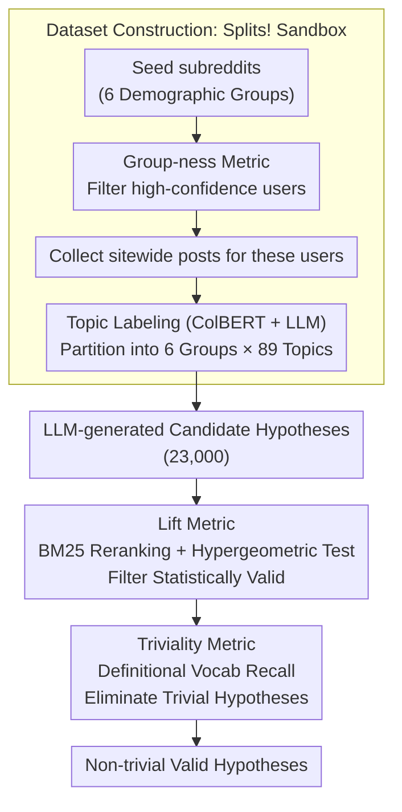

# Splits! Flexible Sociocultural Linguistic Investigation at Scale

**Conference**: ACL 2026  
**arXiv**: [2504.04640](https://arxiv.org/abs/2504.04640)  
**Code**: [GitHub](https://github.com/ecaplan/splits) (Code + Data + Demo)  
**Area**: Sociolinguistics / Computational Social Science  
**Keywords**: Sociocultural linguistic phenomena, Reddit dataset, Hypothesis filtering, Lexical analysis, Demographics

## TL;DR
Ours proposes a method for building a sociolinguistic "sandbox" by constructing Splits!, a dataset of 9.7 million posts from Reddit partitioned by both demographic groups and discussion topics. A two-stage filtering pipeline based on lift and triviality is designed to efficiently screen 23,000 LLM-generated candidate hypotheses for sociocultural linguistic phenomena worthy of in-depth study.

## Background & Motivation

**Background**: Computational Social Science (CSS) investigates differences in language use across various groups via social media data (e.g., AAVE code-switching, Yiddish vocabulary in Jewish English). However, such studies typically require customized data collection and experimental designs for specific groups or topics, which is costly and difficult to prototype rapidly.

**Limitations of Prior Work**: Researchers require significant upfront investment to validate a single sociolinguistic hypothesis. Automated hypothesis generation (e.g., using LLMs) can produce vast numbers of candidates, but the critical bottleneck is how to efficiently identify those truly worth researching from thousands of machine-generated options. Many statistically significant hypotheses are actually trivial (e.g., "Jewish people mention Judaism more often").

**Key Challenge**: Statistical significance $\neq$ research value. A large number of trivial hypotheses can achieve high significance through data validation but offer no insight for social science. An automated method is needed to distinguish "statistically valid" hypotheses from "academically interesting" ones.

**Goal**: (1) Build a flexible "sandbox" dataset for sociolinguistic exploration; (2) Design an automated filtering pipeline to distinguish interesting hypotheses from trivial ones.

**Key Insight**: Formalize a Sociocultural Linguistic Phenomenon (SLP) as "Group A uses lexical set L more than Group B when discussing topic t." Use BM25 retrieval + a lift metric to quantify statistical validity, and semantic similarity to quantify triviality.

**Core Idea**: Construct the sandbox using a dual partition of demographics $\times$ topics, and use a two-stage lift + triviality filter to extract non-trivial, valid hypotheses from a large pool of candidates.

## Method

### Overall Architecture
The framework consists of two main parts: (1) Dataset Construction—Building the Splits! dataset through a pipeline of seed subreddit $\rightarrow$ seed user $\rightarrow$ sitewide post collection $\rightarrow$ topic labeling, partitioned into 6 demographic groups $\times$ 89 topics; (2) Hypothesis Filtering—Calculating lift (data support) and triviality (obviousness) for candidate hypotheses to filter for high-value results.

### Key Designs

**1. Group-ness Metric: Extracting high-confidence group users from noisy subreddit memberships**

Determining group membership solely based on "whether someone posted in a subreddit" introduces noise from casual visitors or trolls. This work assigns a group-ness score to each user: $\text{group-ness}(u) = \sum_{s \in SD} \log(1 + c_{u,s})$, where $c_{u,s}$ is the number of posts by user $u$ in seed subreddit $s$, and $SD$ is the set of seed subreddits for that group. The logarithmic term rewards both high total post counts and activity across multiple related subreddits, preventing single-point spammers from scoring high. To validate this, the authors checked high group-ness users for self-identity phrases (e.g., "I am Catholic"), confirming they indeed express the target identity, which significantly reduces noise compared to naive membership heuristics.

**2. Lift Metric: Quantifying lexical distinctiveness via retrieval reranking**

To determine if lexical set $L$ (e.g., certain Yiddish words) truly distinguishes Group A from Group B, simple frequency comparison is insufficient. This work combines posts from two groups under the same topic into a BM25 index and reranks them using $L$ as a query. The lift is calculated by observing the increased proportion of the target group in the top results relative to their overall proportion:

$$\text{lift}@p\% = \frac{\#A \text{ posts}@p\% / \# \text{posts}@p\%}{\#A \text{ posts overall} / \# \text{posts overall}}$$

A $\text{lift} > 1$ implies $L$ successfully pushes Group A's posts to the top. A hypergeometric test ensures this lift is statistically significant. Lift is a robust association measure from data mining, and adjusting $p\%$ allows capturing phenomena at different granularities—whether extreme usage (top 1%) or general tendencies (top 50%).

**3. Triviality Metric: Automatically removing "statistically significant but academically uninteresting" hypotheses**

The authors found that statistical significance and triviality are positively correlated (Spearman 0.32). Trite hypotheses like "Jews mention Judaism more" are most likely to pass significance tests, burying insightful findings. Consequently, they manually defined a 5–10 word "definitional vocabulary" $\ell_A$ for each group and calculated the recall of the hypothesis lexical set $L$ against $\ell_A$ in an embedding subspace $R_{subspace}(L, \ell_A)$. Higher scores indicate $L$ is closer to the group's definition, thus more trivial. This metric has a Spearman correlation of $\rho = -0.38$ with human "surprisingness" ratings, proving it captures the elusive concept of "interest" and acts as a filter beyond pure significance.

### Loss & Training
No model training. Dataset construction utilizes the ColBERT retrieval model and LLM-assisted topic classification. Hypothesis filtering uses BM25 and semantic similarity calculations in the BERT embedding space.

## Key Experimental Results

### Main Results
Validation via reproduction of known sociolinguistic phenomena:

| Phenomenon | Target Group | Topic | Usage (Ours) | Usage (Control) | p-value |
| :--- | :--- | :--- | :--- | :--- | :--- |
| AAVE Usage | Black | Hip-Hop | 3.16% | 2.00% | <0.001 |
| AAVE Code-switching | Black | Prof.→Hip-Hop | 0.33%→3.16% | - | <0.001 |
| Yiddish Usage | Jewish | Judaism | 0.19% | 0.07% | <0.001 |
| Dance Identity | Hindu/Sikh/Jain | Cultural Identity | 0.44% | 0.36% | <0.001 |

### Ablation Study
Efficiency analysis of the two-stage filtering:

| Triviality Percentile Threshold | Precision | Recall | F1 | Efficiency Gain |
| :--- | :--- | :--- | :--- | :--- |
| Baseline (p-value only) | 0.270 | 1.000 | 0.425 | 1.00× |
| 0.3 | 0.447 | 0.496 | 0.470 | 1.65× |
| 0.5 | 0.398 | 0.741 | 0.518 | 1.47× |

### Key Findings
- The two-stage filtering achieved a total efficiency gain of 15-18×: stage one (statistical filtering) reduced candidates by 10×, and stage two (triviality filtering) further reduced them by 1.5-1.8×.
- Hypotheses from academic literature have a significantly lower triviality distribution (mean 0.585 vs. 0.810 for LLM-generated ones), validating the metric's alignment with "academic interest."
- An interesting non-trivial finding: Jewish users use terms related to "preventative care" and "early detection" more frequently when discussing healthcare, possibly reflecting cultural values regarding worldly focus.

## Highlights & Insights
- While the insight that "statistical significance $\neq$ research value" is intuitive, this work is the first to quantitatively prove the positive correlation between them (Spearman 0.32) and provide a systematic solution. This problem is pervasive in CSS.
- The "sandbox" concept is highly practical—researchers can test new hypotheses at zero marginal cost; providing a lexical set yields immediate cross-group and cross-topic analysis results.
- The combination of the Group-ness metric and self-identity validation provides a reproducible paradigm for demographic inference on social media.

## Limitations & Future Work
- Data is limited to Reddit from 2012-2018, entailing platform and temporal biases.
- Only covers 6 demographic groups and is primarily English-centric.
- The Group-ness method favors users highly active in identity communities, which may amplify linguistic differences between groups.
- Analysis is restricted to the lexical level; syntax, semantic frames, and pragmatic features are not addressed.
- Intersectional identities (e.g., being both Black and Catholic) were not analyzed.

## Related Work & Insights
- **vs. Traditional Sociolinguistics**: Traditional methods rely on fieldwork and deep ethnography, which are costly but provide deep insight; Splits! offers large-scale hypothesis screening as a complement.
- **vs. LLM Hypothesis Generation**: Works like Yang et al. (2024) focus on generating hypotheses with LLMs but lack mechanisms to filter for value; this work fills that gap.

## Rating
- Novelty: ⭐⭐⭐⭐ The sandbox concept and triviality filtering are innovative contributions.
- Experimental Thoroughness: ⭐⭐⭐⭐ Reproduction of 5 known phenomena + filtering 23k candidate hypotheses + human annotation validation.
- Writing Quality: ⭐⭐⭐⭐ Methodology is described clearly, though the paper is long and requires careful reading.
- Value: ⭐⭐⭐⭐ Provides reusable methodology and data resources for Computational Social Science.

<!-- RELATED:START -->

## Related Papers

- [\[CVPR 2025\] As Language Models Scale, Low-order Linear Depth Dynamics Emerge](../../CVPR2025/social_computing/as_language_models_scale_low-order_linear_depth_dynamics_emerge.md)
- [\[ACL 2026\] SPAGBias: Uncovering and Tracing Structured Spatial Gender Bias in Large Language Models](spagbias_uncovering_and_tracing_structured_spatial_gender_bias_in_large_language.md)
- [\[ACL 2026\] Beyond the Crowd: LLM-Augmented Community Notes for Governing Health Misinformation](beyond_the_crowd_llm-augmented_community_notes_for_governing_health_misinformati.md)
- [\[ACL 2026\] Is this chart lying to me? Automating the detection of misleading visualizations](is_this_chart_lying_to_me_automating_the_detection_of_misleading_visualizations.md)
- [\[ACL 2026\] Inertia in Moral and Value Judgments of Large Language Models](inertia_in_moral_and_value_judgments_of_large_language_models.md)

<!-- RELATED:END -->
