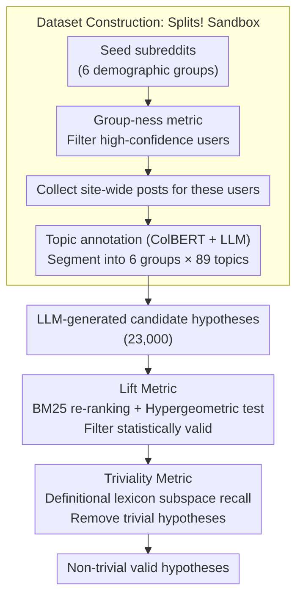

# Splits! Flexible Sociocultural Linguistic Investigation at Scale

**Conference**: ACL 2026  
**arXiv**: [2504.04640](https://arxiv.org/abs/2504.04640)  
**Code**: [GitHub](https://github.com/ecaplan/splits) (Code + Data + Demo)  
**Area**: Sociolinguistics / Computational Social Science  
**Keywords**: Sociocultural linguistic phenomena, Reddit dataset, Hypothesis filtering, Lexical analysis, Demographics

## TL;DR
The paper proposes a method to construct a sociolinguistic "sandbox." It introduces Splits!, a dataset of 9.7 million Reddit posts dual-segmented by demographic groups and discussion topics. A two-stage filtering process based on lift and triviality is designed to efficiently screen noteworthy sociocultural linguistic phenomena from 23,000 LLM-generated candidate hypotheses.

## Background & Motivation

**Background**: Computational social science studies linguistic usage differences across groups (e.g., AAVE code-switching, Yiddish vocabulary in Jewish English) via social media. However, such research typically requires customized data collection and experimental designs for specific groups or topics, making it costly and difficult to prototype rapidly.

**Limitations of Prior Work**: Researchers face significant upfront investment to verify a single sociolinguistic hypothesis. While automated hypothesis generation (e.g., via LLMs) can produce numerous candidates, the key bottleneck is efficiently identifying which of the thousands of machine-generated hypotheses are truly worth in-depth study. Many statistically significant hypotheses are trivial (e.g., "Jewish people mention Judaism more often").

**Key Challenge**: Statistical significance $\neq$ research value. Numerous trivial hypotheses can achieve high significance through data verification but offer no insight for social science. An automated method is needed to distinguish between "statistically valid" and "academically interesting" findings.

**Goal**: (1) Construct a flexible "sandbox" dataset for sociolinguistic exploration; (2) Design an automated filtering pipeline to separate interesting hypotheses from trivial ones.

**Key Insight**: Formalize a Sociocultural Linguistic Phenomenon (SLP) as "Group A uses lexicon $L$ more than Group B when discussing topic $t$." Statistical validity is quantified using BM25 retrieval and the lift metric, while triviality is quantified using semantic similarity.

**Core Idea**: Build the sandbox through dual segmentation of demographics $\times$ topics, and use a two-stage filter of lift + triviality to sieve non-trivial, valid hypotheses from a vast candidate pool.

## Method

### Overall Architecture
The framework consists of two main parts: (1) Dataset construction—a pipeline involving seed subreddits $\rightarrow$ seed users $\rightarrow$ site-wide post collection $\rightarrow$ topic annotation to build the Splits! dataset, segmented into 6 demographic groups $\times$ 89 topics; (2) Hypothesis filtering—calculating lift (data support) and triviality (commonplace nature) for candidate hypotheses to filter for valuable ones.

### Key Designs

**1. Group-ness Metric: Filtering high-confidence group users from noisy subreddit memberships**

Determining group membership solely based on "posting in a subreddit" introduces noise from casual visitors or trolls. This work assigns a group-ness score to each user: $\text{group-ness}(u) = \sum_{s \in SD} \log(1 + c_{u,s})$, where $c_{u,s}$ is the count of posts by user $u$ in seed subreddit $s$, and $SD$ is the set of seed subreddits for that group. The logarithmic term rewards both total post volume and activity across multiple related subreddits, preventing single-point spammers from scoring high.

To validate these scores, the authors checked high group-ness users for self-identification phrases (e.g., "I am Catholic"). Results confirmed a high concentration of target identities, proving that quantitative thresholds significantly reduce noise compared to simple membership.

**2. Lift Metric: Quantifying group distinguishability through retrieval re-ranking**

To determine if lexicon $L$ (e.g., certain Yiddish words) effectively distinguishes Group A from B, simple frequency comparisons are insufficient. The authors combine posts from two groups under the same topic into a BM25 index and use $L$ as a query for re-ranking. They then measure the increase in the target group's proportion within the top results relative to the overall distribution:

$$\text{lift}@p\% = \frac{\#A \text{ posts}@p\% / \# \text{posts}@p\%}{\#A \text{ posts overall} / \# \text{posts overall}}$$

A $\text{lift} > 1$ implies $L$ successfully prioritizes Group A posts. A hypergeometric test ensures this uplift is statistically significant. Lift is a robust measurement from data mining that is more stable than raw frequency and can capture phenomena at different granularities by adjusting $p\%$.

**3. Triviality Metric: Automatically removing "statistically significant but academically uninteresting" hypotheses**

A key pitfall identified is the positive correlation between statistical significance and triviality (Spearman 0.32). "Duh" hypotheses like "Jewish people mention Judaism more" are easiest to pass significance tests, drowning out insightful findings. The authors create a "definitional lexicon" $\ell_A$ (5–10 words) for each group and calculate the recall of the hypothesis lexicon $L$ relative to $\ell_A$ in an embedding subspace: $R_{subspace}(L, \ell_A)$. Higher scores indicate $L$ is closer to the group's definition, thus more trivial. This score correlates with human "unexpectedness" ratings at $\rho = -0.38$, proving it captures the difficult-to-formalize concept of "interestingness."

### Loss & Training
No model training is performed. Dataset construction utilizes the ColBERT retrieval model and LLM-assisted topic classification. Hypothesis filtering uses BM25 and semantic similarity calculations in the BERT embedding space.

## Key Experimental Results

### Main Results
Replication validation of known sociolinguistic phenomena:

| Phenomenon | Target Group | Topic | Usage Rate (Target) | Usage Rate (Control) | p-value |
|------------|--------------|-------|---------------------|----------------------|---------|
| AAVE Usage | Black | Hip-Hop | 3.16% | 2.00% | <0.001 |
| AAVE Code-switching | Black | Job→Hip-hop | 0.33%→3.16% | - | <0.001 |
| Yiddish Usage | Jewish | Judaism | 0.19% | 0.07% | <0.001 |
| Dance Identity | Hindu/Sikh/Jain | Cultural Identity | 0.44% | 0.36% | <0.001 |

### Ablation Study
Efficiency analysis of the two-stage filtering:

| Triviality Percentile Threshold | Precision | Recall | F1 | Efficiency Gain |
|--------------------------------|-----------|--------|----|-----------------|
| Baseline (p-value only) | 0.270 | 1.000 | 0.425 | 1.00× |
| 0.3 | 0.447 | 0.496 | 0.470 | 1.65× |
| 0.5 | 0.398 | 0.741 | 0.518 | 1.47× |

### Key Findings
- The two-stage filtering achieves a 15-18× overall efficiency gain: statistical filtering reduces candidates by 10×, and triviality filtering further reduces them by 1.5-1.8×.
- Hypotheses from academic literature have significantly lower triviality distributions (mean 0.585 vs. 0.810 for LLM-generated), validating the metric's alignment with "academic interest."
- An interesting non-trivial finding: Jewish users use terms related to "preventative care" and "early detection" more frequently in medical discussions, potentially reflecting cultural values regarding proactive health.

## Highlights & Insights
- While the insight "statistical significance $\neq$ research value" is intuitively obvious, this paper is the first to quantitatively prove their positive correlation (Spearman 0.32) and provide a systematic solution. This issue is pervasive in computational social science.
- The "sandbox" design is highly practical—researchers can test new hypotheses with zero marginal cost by simply providing a lexicon to get across-group and across-topic analysis.
- The methodology of Group-ness metrics + self-identification validation provides a reproducible paradigm for demographic inference on social media.

## Limitations & Future Work
- Data is limited to Reddit (2012-2018), entailing platform and temporal biases.
- Only 6 demographic groups are covered, primarily focused on English.
- The Group-ness method favors users highly active in identity-based communities, which may amplify linguistic differences between groups.
- Analysis is restricted to the lexical level, excluding syntax, semantic framing, or pragmatic features.
- intersectional identities (e.g., Black and Catholic) were not analyzed.

## Related Work & Insights
- **vs. Traditional Sociolinguistics**: Traditional methods rely on high-cost field studies and ethnography; Splits! provides large-scale hypothesis screening as a complement.
- **vs. LLM Hypothesis Generation**: Works like Yang et al. (2024) focus on generating hypotheses but lack mechanisms to filter for value; this paper fills that gap.

## Rating
- Novelty: ⭐⭐⭐⭐ The sandbox concept and triviality filtering are innovative contributions.
- Experimental Thoroughness: ⭐⭐⭐⭐ Replication of 5 known phenomena + filtering of 23,000 candidates + manual annotation validation.
- Writing Quality: ⭐⭐⭐⭐ Methodology is described clearly, though the paper is long.
- Value: ⭐⭐⭐⭐ Provides reusable methodology and data resources for computational social science.

<!-- RELATED:START -->

## Related Papers

- [\[ACL 2026\] Understanding the Sociocultural Dimensions of Mental Health Discourse in Arabic-Language X Communities](understanding_the_sociocultural_dimensions_of_mental_health_discourse_in_arabic-.md)
- [\[CVPR 2025\] As Language Models Scale, Low-order Linear Depth Dynamics Emerge](../../CVPR2025/social_computing/as_language_models_scale_low-order_linear_depth_dynamics_emerge.md)
- [\[ACL 2026\] SPAGBias: Uncovering and Tracing Structured Spatial Gender Bias in Large Language Models](spagbias_uncovering_and_tracing_structured_spatial_gender_bias_in_large_language.md)
- [\[ACL 2026\] Beyond the Crowd: LLM-Augmented Community Notes for Governing Health Misinformation](beyond_the_crowd_llm-augmented_community_notes_for_governing_health_misinformati.md)
- [\[ACL 2026\] Is this chart lying to me? Automating the detection of misleading visualizations](is_this_chart_lying_to_me_automating_the_detection_of_misleading_visualizations.md)

<!-- RELATED:END -->
