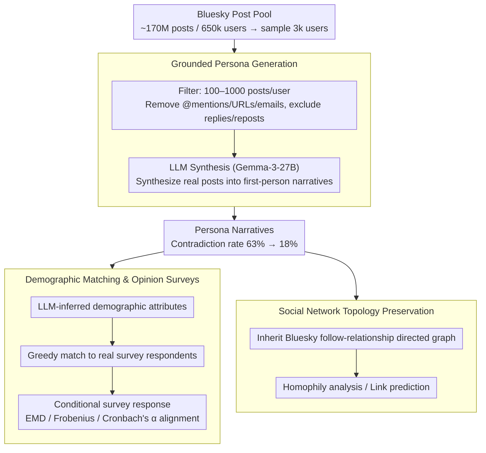

# Synthia: Scalable Grounded Persona Generation from Social Media Data

**Conference**: ACL 2026  
**arXiv**: [2507.14922](https://arxiv.org/abs/2507.14922)  
**Code**: None  
**Area**: Computational Social Science / Persona Modeling  
**Keywords**: Persona Generation, Virtual Populations, Social Media, Social Survey Simulation, Fairness Analysis

## TL;DR
The Synthia framework is proposed to generate grounded LLM persona narratives based on real social media posts (Bluesky). It achieves up to an 11.6% improvement in social survey alignment over SOTA while utilizing smaller models and preserving social network topology for network-aware analysis.

## Background & Motivation

**Background**: Persona-driven LLM simulations are increasingly applied in computational social science to simulate population-level attitudes and behaviors. Methods for persona construction range from simple demographic descriptions to rich life narratives.

**Limitations of Prior Work**: Constructing virtual populations that are both authentic and scalable is a core challenge. Interview-based methods (e.g., Park et al. 2024) offer high authenticity but are resource-intensive and difficult to scale. Fully synthetic methods (e.g., Anthology) are scalable but often introduce systemic artifacts that reduce authenticity, and narratives frequently contain self-contradictory facts (63% of personas have contradictions).

**Key Challenge**: The trade-off between authenticity and scalability. Unconstrained LLM generation, while scalable, lacks real-world anchoring, leading to hallucinations and narrative inconsistency.

**Goal**: Design a persona generation framework that utilizes real social media content as an anchor and LLMs for narrative construction, balancing authenticity, scalability, and fairness.

**Key Insight**: Leveraging public posts from the Bluesky platform as real data sources, Synthia synthesizes user posts into first-person life narratives via LLMs while preserving original social network graph structures.

**Core Idea**: Persona narratives should be anchored in real user-generated content rather than being synthesized from scratch. Anchoring in real data significantly reduces internal narrative contradictions, thereby improving alignment with population opinion distributions.

## Method

### Overall Architecture
A three-stage process: (1) A pool of user posts is collected and filtered from Bluesky (~170 million posts, 650k users), from which 3k users are sampled; (2) An LLM (Gemma-3-27B) synthesizes each user's posts into a first-person persona narrative; (3) The synthetic population is aligned with real survey respondents via demographic matching, and simulated opinion distributions are compared with real distributions. Additionally, each persona inherits the corresponding user's Bluesky follow-relationship graph, allowing the generated virtual population to retain real social network topology.

### Key Designs

**1. Grounded Persona Generation: Synthesizing real posts rather than hallucinating lives**

Fully synthetic personas (e.g., Anthology), while scalable, lack real-world anchors; their narratives often contain self-contradictions, with up to 63% of personas exhibiting conflicting facts. Synthia replaces "creation" with "synthesis": it collects 100–1000 real posts per user (avoiding insufficient context and context window overflow), removes social identifiers like @mentions, URLs, and emails, excludes replies/reposts, and tasks an LLM with synthesizing these posts into a first-person background story.

The key is that real posts act as constraint anchors; the LLM must organize the narrative within the bounds of what the user actually said. Consequently, the proportion of contradictory personas drops from 63% to 18%. Furthermore, this "anchored synthesis" is not heavily dependent on model scale: high-quality personas are generated by Gemma-3-27B and even Phi-4-mini (4B), indicating that data grounding is the primary driver of quality.

**2. Demographic Matching & Opinion Surveys: Anchoring evaluation in human surveys**

To verify if the synthetic population behaves like real individuals, reliable controls are required. Synthia first uses an LLM to infer demographic attributes (age, gender, race, etc.) from each narrative, then uses a greedy matching algorithm to pair each real survey respondent with the closest persona, aligning demographic distributions. The LLM is then conditioned on the persona narrative to answer survey questionnaires, and opinion distributions are compared using EMD, Frobenius norm, and Cronbach's $\alpha$. By using human survey data as the reference frame rather than LLM judgments, the conclusions are more credible.

**3. Social Network Topology Preservation: Personas with original social topology**

Existing methods generate personas in isolation, providing text without relationships, which precludes social network analysis. Synthia allows each persona to directly inherit the directed follow-relationship graph of its corresponding Bluesky user, binding social topology with persona content. This unique feature—combining rich narratives with real network structures—transforms the virtual population into a community with social ties, supporting network-aware studies such as homophily analysis and link prediction.

### Loss & Training
Synthia requires no training and directly utilizes pre-trained LLMs for persona generation and survey response. In the opinion survey stage, non-instruction-tuned models are used (as prior research indicates they outperform instruction-tuned models in survey simulation).

## Key Experimental Results

### Main Results

| Method | EMD ↓ | Frob. ↓ | Cron. $\alpha$ ↑ | Note |
| :--- | :--- | :--- | :--- | :--- |
| Synthia (Gemma-27B) | **0.35** | **2.30** | **0.39** | Best on W34 |
| Anthology (LLaMA-70B) | 0.35 | 2.46 | 0.34 | Used 2.6x larger model |
| Anthology (Gemma-27B) | 0.34 | 2.65 | 0.32 | Synthia leads with same model |
| PChat (Human) | 0.35 | 2.76 | 0.29 | Human-labeled but high variance |
| Synthia (Phi-4B) | 0.38 | 2.43 | 0.38 | 6x smaller model still comparable |

### Ablation Study

| Analysis Dimension | Synthia | Anthology | Note |
| :--- | :--- | :--- | :--- |
| % Contradictory Personas | 18% | 63% | Grounding significantly reduces contradictions |
| Avg. Errors per Persona | 0.221 | 0.959 | 77% reduction in narrative contradictions |
| Cross-wave Frob. Fluctuation | 0.04 | 0.20 | Synthia is more stable |

### Key Findings
- Internal narrative consistency is a critical factor for aligning population opinions—Synthia reduces contradictions by 77% through real data grounding.
- Even with a 4B model (Phi-4-mini), Synthia remains competitive with Anthology generated by a 70B model.
- Fairness analysis shows that Synthia reduces the accuracy gap between the best and worst demographic subgroups by up to 25%.
- Link prediction accuracy improved by 8.3%, and embedding space separability improved by 46%, proving the effectiveness of the network structure.

## Highlights & Insights
- Anchoring persona generation in real social media posts is both simple and effective. The core insight is that internal consistency of persona narratives is more important than narrative richness. Anthology uses high-temperature sampling for richness, but the lack of anchors leads to frequent contradictions, which degrades downstream task quality.
- The preservation of social network topology is a unique contribution, ensuring the virtual population is a community of socially connected individuals rather than a collection of isolated agents. This opens new possibilities for social network simulation.
- Achieving results that meet or exceed larger models using smaller models demonstrates that data quality (grounding in real content) is more impactful than model scale.

## Limitations & Future Work
- Use of English Bluesky data only; the user base may not represent the general population.
- Removal of social identifiers may lead to the loss of useful context.
- Demographic inference relies on LLM accuracy, which may introduce bias.
- Evaluation is limited to U.S. social surveys (ATP); cross-cultural generalization remains to be verified.
- Future work could explore multilingual and multi-platform persona generation.

## Related Work & Insights
- **vs Anthology (Moon et al. 2024)**: Unanchored high-temperature sampling is scalable but prone to contradictions; Synthia improves consistency via real post grounding.
- **vs Park et al. 2024**: Interview-based data is authentic but unscalable; Synthia provides a scalable alternative using social media posts.
- **vs PChat (Zhang et al. 2018)**: Human-written personas have inconsistent quality and are not scalable.

## Rating
- Novelty: ⭐⭐⭐⭐ Grounded data anchoring and network topology preservation are meaningful innovations.
- Experimental Thoroughness: ⭐⭐⭐⭐⭐ 54 experimental configurations, multi-dimensional evaluation, fairness analysis, and network case studies.
- Writing Quality: ⭐⭐⭐⭐ Clear structure and in-depth analysis.
- Value: ⭐⭐⭐⭐ Directly applicable to population simulation in computational social science.

<!-- RELATED:START -->

## Related Papers

- [\[ACL 2026\] Persona-E2: A Human-Grounded Dataset for Personality-Shaped Emotional Responses to Textual Events](persona-e2_a_human-grounded_dataset_for_personality-shaped_emotional_responses_t.md)
- [\[ACL 2026\] Content Fuzzing for Escaping Information Cocoons on Social Media](content_fuzzing_for_escaping_information_cocoons_on_digital_social_media.md)
- [\[ACL 2026\] The Proxy Presumption: From Semantic Embeddings to Valid Social Measures](the_proxy_presumption_from_semantic_embeddings_to_valid_social_measures.md)
- [\[ACL 2026\] Bayesian Social Deduction with Graph-Informed Language Models](bayesian_social_deduction_with_graph-informed_language_models.md)
- [\[ACL 2026\] ClaimDB: A Fact Verification Benchmark over Large Structured Data](claimdb_a_fact_verification_benchmark_over_large_structured_data.md)

<!-- RELATED:END -->
