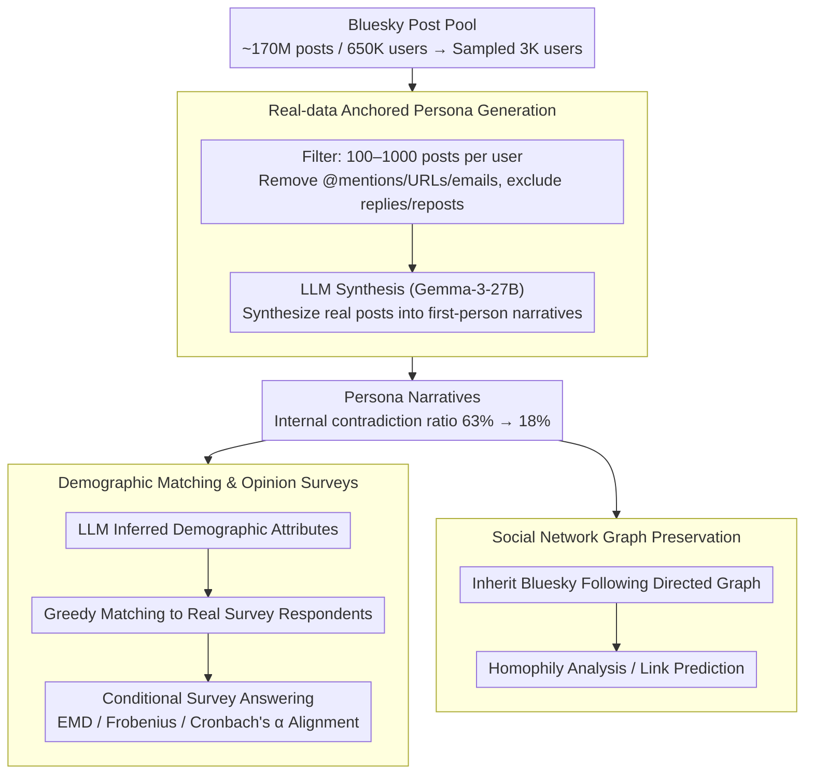

# Synthia: Scalable Grounded Persona Generation from Social Media Data

**Conference**: ACL 2026  
**arXiv**: [2507.14922](https://arxiv.org/abs/2507.14922)  
**Code**: None  
**Area**: Computational Social Science / Persona Modeling  
**Keywords**: Persona Generation, Synthetic Populations, Social Media, Social Survey Simulation, Fairness Analysis

## TL;DR
The Synthia framework is proposed to generate grounded LLM persona narratives based on real social media posts (Bluesky). It improves social survey alignment by up to 11.6% compared to the SOTA while using smaller models and preserving social network topology to support network-aware analysis.

## Background & Motivation

**Background**: Persona-driven LLM simulations are increasingly widely used in computational social science for simulating population-level attitudes and behaviors. Persona construction methods range from simple demographic descriptions to rich life narratives.

**Limitations of Prior Work**: Constructing synthetic populations that are both realistic and scalable is a core challenge. Interview-based methods (e.g., Park et al. 2024) have high realism but are resource-intensive and difficult to scale. Fully synthetic methods (e.g., Anthology) are scalable but often introduce systemic artifacts that reduce realism, and narratives frequently contain self-contradictory facts (63% of personas have contradictions).

**Key Challenge**: The trade-off between realism and scalability. Unconstrained LLM generation is scalable, but a lack of real-world anchoring leads to hallucinations and narrative inconsistency.

**Goal**: Design a persona generation framework that utilizes real social media content as an anchor and LLMs for narrative construction, balancing realism, scalability, and fairness.

**Key Insight**: Utilize public posts from the Bluesky platform as real data sources. Use LLMs to synthesize user posts into first-person life narratives while preserving the original social network graph structure.

**Core Idea**: Persona narratives should be anchored in real user-generated content rather than synthesized from scratch. Real-world data anchoring significantly reduces internal narrative contradictions, thereby improving the alignment of population opinion distributions.

## Method

### Overall Architecture
A three-stage pipeline: (1) Collect and filter a user post pool from Bluesky (~170 million posts, 650k users), sampling 3K users; (2) Use an LLM (Gemma-3-27B) to synthesize each user's posts into a first-person persona narrative; (3) Align the synthetic population with real survey respondents through demographic matching and compare simulated opinion distributions with real distributions. Simultaneously, each persona inherits the corresponding user's Bluesky follow graph, allowing the generated synthetic population to retain real social network topology.

### Key Designs

**1. Real-data Anchored Persona Generation: Summarizing real posts instead of fabricating lives**

Fully synthetic personas (e.g., Anthology) are scalable but lack real-world anchors, often leading to self-contradictory narratives—up to 63% of personas have conflicting facts. Synthia replaces "creation" with "synthesis": it collects 100–1000 real posts per user (too few lacks context, too many exceeds context windows), removes social identifiers like @mentions, URLs, and emails, excludes replies/reposts, and then has an LLM synthesize these posts into a first-person background story. 

The key is that real posts act as constraint anchors; the LLM can only organize narratives within the scope of what the user actually said, preventing hallucinations. Consequently, the proportion of contradictory personas dropped from 63% to 18%. This "anchored synthesis" also lowers the requirement for model capability: high-quality personas were generated not only by Gemma-3-27B but even by Phi-4-mini (4B), indicating that data anchoring, rather than model scale, is the primary factor.

**2. Demographic Matching and Opinion Surveys: Anchoring evaluation on real human surveys**

To verify if the synthetic population "resembles real groups," reliable controls are needed. Synthia first uses an LLM to infer demographic attributes (age, gender, race, etc.) from each narrative. A greedy matching algorithm then pairs each real survey respondent with the closest persona to align the demographic distribution. Subsequently, the LLM answers questionnaires conditional on the persona narratives. Three metrics—EMD, Frobenius norm, and Cronbach’s $\alpha$—are used to compare simulated opinion distributions with real ones. This ensures the evaluation reference is human survey data rather than LLM judgment, making the conclusions more credible.

**3. Social Network Graph Preservation: Personas with original social topology**

Existing methods generate isolated personas with text but no inter-relationships, hindering social network analysis. Synthia allows each persona to directly inherit the corresponding user's directed follow graph from Bluesky, binding social topology with persona content. This unique feature ensures the synthetic population is a community with social relations, supporting network-aware research such as homophily analysis and link prediction, filling the gap of "text without structure."

### Loss & Training
Synthia requires no training and directly uses pre-trained LLMs for persona generation and survey answering. Non-instruction-tuned models are used in the opinion survey phase, as prior research indicates they perform better in survey simulation than instruction-tuned models.

## Key Experimental Results

### Main Results

| Method | EMD↓ | Frob.↓ | Cron.α↑ | Description |
|------|------|--------|---------|------|
| Synthia (Gemma-27B) | **0.35** | **2.30** | **0.39** | Best on W34 |
| Anthology (LLaMA-70B) | 0.35 | 2.46 | 0.34 | Uses 2.6x larger model |
| Anthology (Gemma-27B) | 0.34 | 2.65 | 0.32 | Synthia leads under same model |
| PChat (Manual) | 0.35 | 2.76 | 0.29 | Human labeled but high fluctuation |
| Synthia (Phi-4B) | 0.38 | 2.43 | 0.38 | Comparable with 6x smaller model |

### Ablation Study

| Analysis Dimension | Synthia | Anthology | Description |
|----------|---------|-----------|------|
| Contradictory Persona Ratio | 18% | 63% | Anchoring significantly reduces contradictions |
| Avg Errors per Persona | 0.221 | 0.959 | Reductions in narrative contradictions by 77% |
| Cross-wave Frob. Fluctuation | 0.04 | 0.20 | Synthia is more stable |

### Key Findings
- Internal narrative consistency is a key factor for aligning population opinions—Synthia reduces contradictions by 77% through real-data anchoring.
- Even with a 4B model (Phi-4-mini), Synthia competes with Anthology generated by a 70B model.
- Fairness analysis shows that the accuracy gap between the best and worst demographic subgroups in Synthia is reduced by up to 25%.
- Link prediction accuracy improved by 8.3% and embedding space separability increased by 46%, proving the effectiveness of the network structure.

## Highlights & Insights
- The approach of anchoring persona generation with real social media posts is both simple and effective. The core insight is that internal consistency of the narrative is more important than narrative richness. Anthology uses high-temperature sampling with large models to generate rich narratives, but lack of anchoring leads to frequent contradictions, which degrades downstream task quality.
- Preserving social network topology is a unique contribution, ensuring synthetic populations are no longer just sets of isolated individuals but communities with social relationships. This opens new possibilities for social network simulation.
- Achieving or exceeding the performance of larger models with smaller models demonstrates that data quality (anchoring in real content) is more critical than model scale.

## Limitations & Future Work
- Only English Bluesky data was used; the user base may not represent the general population.
- Removing social identifiers may result in the loss of some useful context.
- Demographic inference relies on LLM accuracy, which may introduce bias.
- Evaluation was limited to American Trends Panel (ATP) social surveys; cross-cultural generalizability remains to be verified.
- Future work could explore multilingual and multi-platform persona generation.

## Related Work & Insights
- **vs Anthology (Moon et al. 2024)**: Unanchored high-temperature sampling, scalable but prone to contradictions; Synthia uses real post anchoring for better consistency.
- **vs Park et al. 2024**: Based on interview data, realistic but not scalable; Synthia uses social media posts as a scalable alternative.
- **vs PChat (Zhang et al. 2018)**: Manually written personas, inconsistent quality, and not scalable.

## Rating
- Novelty: ⭐⭐⭐⭐ Real-data anchoring and network topology preservation are meaningful innovations.
- Experimental Thoroughness: ⭐⭐⭐⭐⭐ 54 experimental configurations, multi-dimensional evaluation, fairness analysis, and network case studies.
- Writing Quality: ⭐⭐⭐⭐ Clear structure and in-depth analysis.
- Value: ⭐⭐⭐⭐ Direct application value for population simulation in computational social science.

<!-- RELATED:START -->

## Related Papers

- [\[ACL 2026\] Persona-E2: A Human-Grounded Dataset for Personality-Shaped Emotional Responses to Textual Events](persona-e2_a_human-grounded_dataset_for_personality-shaped_emotional_responses_t.md)
- [\[ACL 2026\] Content Fuzzing for Escaping Information Cocoons on Social Media](content_fuzzing_for_escaping_information_cocoons_on_digital_social_media.md)
- [\[ICML 2026\] Three Years of r/ChatGPT: Societal Impact Evaluations from Social Media Data](../../ICML2026/social_computing/three_years_of_rchatgpt_societal_impact_evaluations_from_social_media_data.md)
- [\[ACL 2026\] The Proxy Presumption: From Semantic Embeddings to Valid Social Measures](the_proxy_presumption_from_semantic_embeddings_to_valid_social_measures.md)
- [\[ACL 2026\] Bayesian Social Deduction with Graph-Informed Language Models](bayesian_social_deduction_with_graph-informed_language_models.md)

<!-- RELATED:END -->
