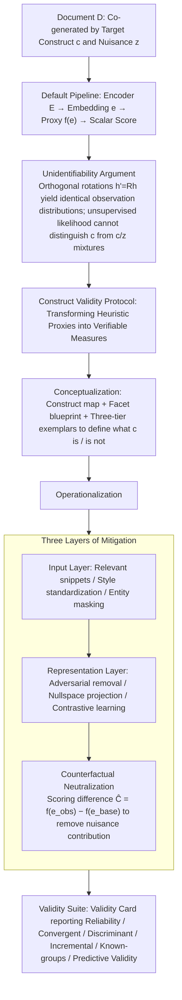

# The Proxy Presumption: From Semantic Embeddings to Valid Social Measures

**Conference**: ACL 2026  
**arXiv**: [2605.07409](https://arxiv.org/abs/2605.07409)  
**Code**: None  
**Area**: Causal Inference / Computational Social Science / Representation Measurement  
**Keywords**: Construct Validity, Semantic Embeddings, Causal Representation, Counterfactual Neutralization, Social Measurement  

## TL;DR
This paper identifies "Proxy Presumption" in NLP—the practice of naming geometric distances in embeddings as social constructs like "creativity" or "bias"—and proposes a Construct Validity Protocol and Counterfactual Neutralization to transform heuristic proxies into verifiable measurement instruments.

## Background & Motivation
**Background**: NLP is evolving from pure prediction tools to measurement instruments in computational social science. Many works utilize sentence vectors, document vectors, or LLM embeddings to measure abstract social constructs such as paper novelty, text creativity, political bias, social norms, or toxicity.

**Limitations of Prior Work**: These works often assume that "cosine distance in embedding space equals a specific social construct." However, embeddings simultaneously encode numerous nuisance factors—topic, style, author, length, register, time, and institution. Geometric distance does not naturally equate to a theoretical variable.

**Key Challenge**: Researchers aim to measure a latent construct $C$, but the model observes text $D$ generated by both $C$ and confounding factors $Z$. Without explicit assumptions, interventions, or validation, identifying $C$ from unsupervised representations of $D$ is impossible.

**Goal**: The paper does not seek to dismiss embedding-based measurement but to establish a minimum methodological standard: "define constructs first, design instruments second, and report validity evidence last."

**Key Insight**: By situating construct validity from social sciences, validity cards from psychometrics, and non-identifiability from causal representation learning within a single framework, the authors argue the core issue in NLP proxies is not model size, but the lack of measurement identification.

**Core Idea**: Rewrite the NLP social measurement workflow using the language of causal identification and psychometrics, transforming "embedding similarity" from a default proxy into a measurement instrument requiring counterfactual, discriminant, and incremental validity testing.

## Method
As a position-and-synthesis paper, the methodological contributions include theoretical formalization, an operational protocol, and a forensic literature analysis. The core logic proceeds from proving why unsupervised embeddings cannot automatically identify social constructs to providing intervention points for mitigating confounding, organized into a Construct Validity Protocol.

### Overall Architecture
The paper conceptualizes a document as being co-generated by a target construct $c$ and a nuisance vector $z$: $p_{\theta}(D \mid c, z)$. Standard NLP measurement pipelines map text to an embedding $e$ via an encoder $E$, then output a scalar score via a proxy function $f(e)$. The authors demonstrate that if $E$ is learned unsupervised, the coordinate system of $e$ can undergo arbitrary rotation, meaning specific dimensions or distance functions do not necessarily correspond to $c$.

In single-document scenarios, this implies a "toxicity score" may conflate dialect, register, and topic. In dual-document scenarios, "paper novelty" (measured by cosine distance) might reflect changes in topic, terminology, or writing style rather than conceptual contribution.

The authors propose a three-layer mitigation path. The first layer performs disentanglement at the input level (e.g., extracting construct-relevant snippets, standardizing style, masking entities). The second layer focuses on the representation level (e.g., adversarial removal, iterative nullspace projection, or contrastive learning). The third layer implements counterfactual neutralization at the scoring function level—subtracting the score of a neutral version of the text (which retains nuisances but weakens the target construct) from the observed score.

These techniques are integrated into the Construct Validity Protocol (CVP) consisting of three phases: Conceptualization, Operationalization, and Validity Suite.

### Key Designs
**1. Unidentifiability Argument: Mathematical proof against "automatic social construct separation"**
Many works assume a simple cut in embedding space corresponds to a social construct. This paper upgrades this empirical critique to an identification problem. By letting latent variables $h=[c;z]$ follow an isotropic Gaussian prior, the authors show that for any orthogonal rotation matrix $R$, the rotated latent space $h'=Rh$ produces the exact same observed distribution. Unsupervised likelihood cannot distinguish the "true construct coordinate" from a linear mixture of constructs and nuisances.

**2. Counterfactual Neutralization: Mitigating nuisance contributions at the scoring layer**
Since embeddings are mixed with nuisances, reporting $f(e_{obs})$ is unreliable. The authors propose constructing counterfactual neutral texts—removing stance, novelty claims, or emotional expressions while preserving topical content—and calculating the differential score $\hat{C}=f(e_{obs})-f(e_{base})$ to isolate the contribution of the target construct.

**3. Construct Validity Protocol: A reportable, reproducible, and auditable workflow**
CVP structures measurement into three phases. Phase 1 (Conceptualization) produces construct maps and exemplars. Phase 2 (Operationalization) details nuisance control. Phase 3 (Validity Card) covers reliability, convergent validity, discriminant and incremental validity, known-groups validity, and criterion-related evidence. Specifically, discriminant and incremental validity are emphasized to expose topic/style surrogacy.

### Loss & Training
Rather than a new end-to-end model, the paper proposes a measurement protocol and pluggable intervention strategies. At the representation layer, adversarial removal or nullspace projection can suppress nuisance labels. At the scoring layer, LLM-based extraction, style standardization, and counterfactual neutralization are used. The optimization goal is improving interpretability, stability, and incremental signal independent of nuisances.

## Key Experimental Results

### Main Results
The empirical evaluation includes a GoEmotions worked example and a forensic audit of 17 social measurement papers.

| Validation Step | Setting | Key Results | Implications |
|----------|------|----------|------|
| Stability Card 1 | GoEmotions gratitude; 8 proxy variants (2 encoders × 2 poolings × 2 normalizations) | AUC: 0.9407-0.9662; ICC(2,1)=0.8467, ICC(2,k)=0.9779 | Proxies are stable across similar implementations, but stability does not imply identification. |
| Discriminant Validity Step 1 | Predicting proxy via length/style and TF-IDF+SVD topic blocks | Length/Style $R^2=0.0245$; Topic $R^2=0.7762$; Full nuisance $R^2=0.7768$ | The embedding proxy is largely recoverable from topic, suggesting high surrogacy risk. |
| Incremental Validity Step 2 | Adding proxy to nuisance-only model to predict gold labels | AUC increased from 0.9658 to 0.9831; $\beta_{inc}>0$ | Despite topic confounding, the proxy carries independent signal; both risk and utility must be reported. |

### Ablation Study
This "ablation" serves as a methodological diagnosis of existing literature.

| Validity Dimension | Yes | Partial | No | Interpretation |
|----------|-----|---------|----|------|
| Construct Validity | 10 | 7 | 0 | Most define constructs, but with varying rigor. |
| Face/Content Validity | 6 | 11 | 0 | Usually relies on expert intuition; lacks systematicity. |
| Reliability / Stability | 11 | 4 | 2 | Most frequently reported via inter-annotator agreement. |
| Convergent Validity | 1 | 12 | 4 | Rarely use independent instruments for the same construct. |
| Discriminant Validity | 0 | 11 | 6 | No paper fully proved proxies aren't just topic/style. |
| Predictive Validity | 1 | 3 | 13 | External criterion evidence is significantly lacking. |
| Handling Confounders | 0 | 14 | 3 | Mostly heuristic controls rather than identification strategies. |

### Key Findings
- In the GoEmotions case, the topic block explains ~77% of the proxy variance, highlighting that embedding proxies often track topical structures.
- Stability is not a sufficient condition; a proxy can be stable across encoders yet stably measure the wrong thing.
- Current literature lacks discriminant validity and confound isolation.
- Counterfactual Neutralization leverages "text-native interventions" (rewriting/masking) as unique NLP tools for construct manipulation.

## Highlights & Insights
- Formally names "Proxy Presumption" and uses causal representation learning to explain it: embedding geometry is an operation on mixed representations, not a social theoretical variable.
- Bringing mature social science "construct validity" language into NLP upgrades paper writing from "defining a score" to "proving the score measures the target within reasonable bounds."
- The framework is vital for downstream causal inference; if the input variables (measured via proxies) are invalid, causal conclusions remain uninterpretable.

## Limitations & Future Work
- The paper primarily provides a methodological framework and lacks a full-scale prospective empirical pipeline for a new social task to quantify CVP costs.
- Counterfactual Neutralization depends on LLM rewriting quality.
- Validity Cards increase the cost of research, particularly for small teams lacking gold instruments or expert samples.
- Future work should establish standardized benchmarks to compare different embedding and counterfactual strategies through discriminant and incremental validity tests.

## Related Work & Insights
- **vs. WEAT / Embedding Bias**: Does not dismiss these tools but notes that association scores require proof that they are not surrogates for frequency or corpus structure.
- **vs. Causal Representation Learning**: Translates the concept of latent factor non-identifiability into social measurement.
- **vs. Psychometrics**: Translates reliability, convergent/discriminant validity, and criterion evidence into an actionable NLP checklist.
- **Insight**: Any paper using LLMs/embeddings to generate "social variables" should report nuisance blocks and the proxy's incremental explanatory power.

## Rating
- Novelty: ⭐⭐⭐⭐☆ Strong conceptual contribution by integrating measurement theory and causal representations.
- Experimental Thoroughness: ⭐⭐⭐☆☆ Case studies support the argument but lack a full prospective empirical pipeline.
- Writing Quality: ⭐⭐⭐⭐☆ Clear structure; effective terminology like "Proxy Presumption" and "Validity Card."
- Value: ⭐⭐⭐⭐⭐ Direct methodological impact on computational social science and LLM-based evaluation.

<!-- RELATED:START -->

## Related Papers

- [\[ACL 2025\] Measuring Social Biases in Masked Language Models by Proxy of Prediction Quality](../../ACL2025/social_computing/measuring_social_biases_in_masked_language_models_by_proxy_of_prediction_quality.md)
- [\[ACL 2026\] Bayesian Social Deduction with Graph-Informed Language Models](bayesian_social_deduction_with_graph-informed_language_models.md)
- [\[ACL 2026\] Synthia: Scalable Grounded Persona Generation from Social Media Data](synthia_scalable_grounded_persona_generation_from_social_media_data.md)
- [\[ICML 2026\] ObjEmbed: Towards Universal Multimodal Object Embeddings](../../ICML2026/social_computing/objembed_towards_universal_multimodal_object_embeddings.md)
- [\[ACL 2026\] Content Fuzzing for Escaping Information Cocoons on Social Media](content_fuzzing_for_escaping_information_cocoons_on_digital_social_media.md)

<!-- RELATED:END -->
