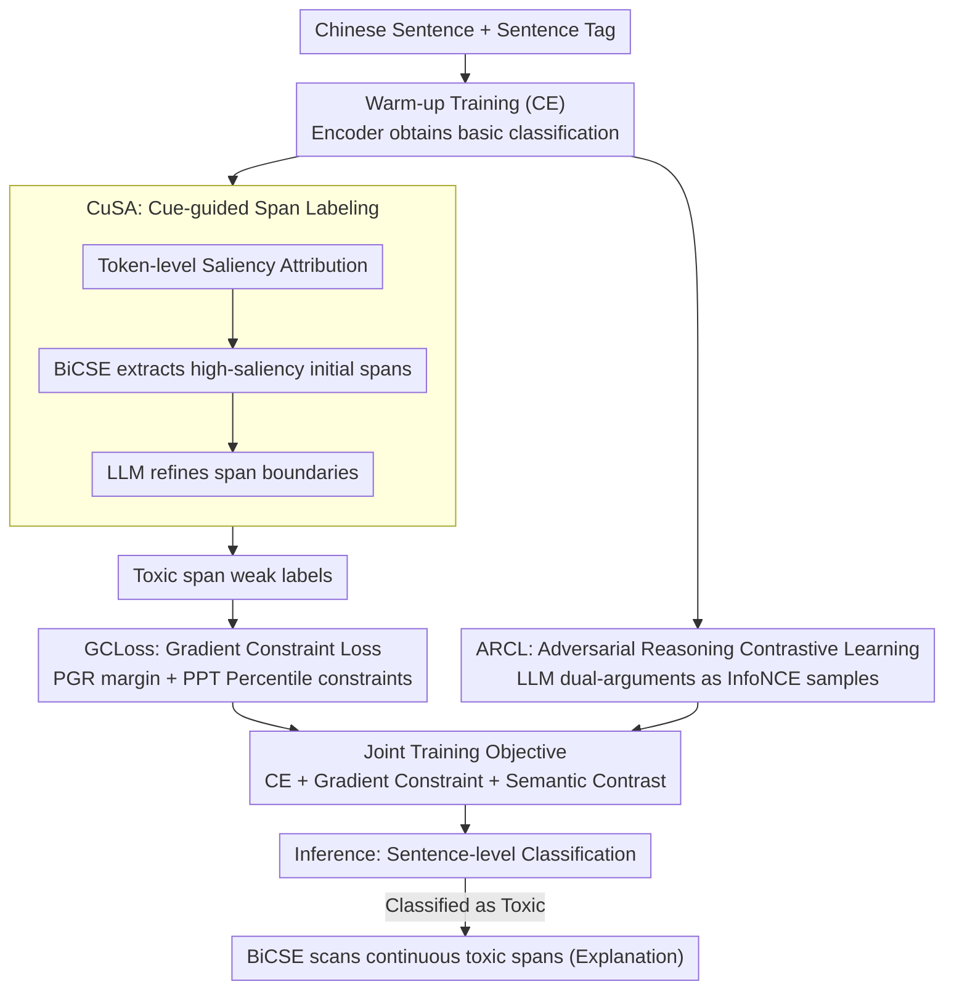

# ToxiTrace: Gradient-Aligned Training for Explainable Chinese Toxicity Detection

**Conference**: ACL 2026 Findings  
**arXiv**: [2604.12321](https://arxiv.org/abs/2604.12321)  
**Code**: [https://huggingface.co/ArdLi/ToxiTrace](https://huggingface.co/ArdLi/ToxiTrace)  
**Area**: Social Computing  
**Keywords**: Chinese Toxicity Detection, Explainability, Gradient Constraint, Fine-grained Evidence Extraction, Contrastive Learning

## TL;DR

ToxiTrace proposes an explainable Chinese toxicity detection method for BERT-like encoders. Through three components—CuSA (LLM-guided weak labeling), GCLoss (Gradient Constraint Loss), and ARCL (Adversarial Reasoning Contrastive Learning)—it achieves dual improvements in sentence-level classification accuracy and continuous toxic span extraction while maintaining efficient encoder inference.

## Background & Motivation

**Background**: Existing Chinese toxicity detection methods primarily target sentence-level classification tasks and have achieved significant performance using pre-trained language models (e.g., RoBERTa, MacBERT) and Large Language Models (LLMs).

**Limitations of Prior Work**:
- Most methods only perform sentence-level classification and cannot identify which specific spans within a sentence are toxic, resulting in a lack of explainability.
- Chinese adopts character-level tokenization; attribution signals like gradients or attention are fragmented across individual characters, making it difficult to form human-readable continuous spans.
- While LLMs possess strong explanatory capabilities, their direct classification performance is often inferior to encoders and involves high inference overhead.

**Key Challenge**: Encoder models are accurate in classification but poor in explainability (fragmented attribution), whereas LLMs are explainable but weaker in classification and slow in inference. The advantages of both cannot be easily combined.

**Goal**: To allow the model to both classify accurately and extract continuous, readable toxic spans as explanations while maintaining the efficient inference of an encoder.

**Key Insight**: By explicitly constraining gradient signals during training, the encoder's token-level attribution naturally focuses on toxic evidence, allowing continuous spans to be extracted directly from saliency maps during inference.

**Core Idea**: Elevate gradient attribution from a "post-hoc explanation" to a "training objective"—using LLM-generated weak labels to guide gradient concentration on toxic tokens, while using contrastive learning to sharpen the semantic boundaries between toxicity and non-toxicity.

## Method

### Overall Architecture

ToxiTrace aims to create a Chinese encoder that can both judge accurately and pinpoint toxic characters. The entire pipeline consists of four steps: first, perform warm-up training using cross-entropy to provide the BERT encoder with basic classification capabilities; next, use CuSA to feed the encoder's own attribution cues to an LLM for refinement, which in turn provides weak labels for toxic spans; with these weak labels, GCLoss explicitly constrains the gradient distribution during training by boosting toxic token gradients and suppressing non-toxic ones; finally, ARCL uses contrastive learning with dual-sided LLM reasoning to sharpen semantic boundaries. During inference, the sentence is first classified; if judged toxic, the BiCSE algorithm scans the saliency map for continuous spans as an explanation.

### Key Designs

**1. CuSA (Cue-guided Span Labeling): Utilizing encoder attributions as cues for LLM refinement**

Most Chinese toxicity datasets only provide coarse sentence-level labels, leaving the model unaware of which specific characters are toxic. Directly asking an LLM to label spans can lead to misalignments due to a lack of localization cues. CuSA complements both: after warm-up training, token-level saliency scores are calculated. The **BiCSE (Bidirectional Cliff Scanning)** algorithm extracts high-saliency initial spans as cues, which are then fed into the LLM (Gemini 2.5 Pro) along with the sentence to refine boundaries. The encoder provides the "approximate location" while the LLM determines the "precise boundaries," producing usable weak supervision signals without fine-grained manual annotation.

**2. GCLoss (Gradient Constraint Loss): Converting "post-hoc attribution" into a "training objective"**

Models trained solely on classification loss often exhibit dispersed and inaccurate token-level attributions, making it impossible to extract clean continuous spans. GCLoss directly constrains gradients during training via two components: PGR Loss enforces a margin between the gradients of toxic and non-toxic tokens; PPT Loss uses intra-sample statistics to bound both ends—constraining the upper bound of non-toxic token gradients at the 15th percentile and the lower bound of toxic token gradients at $\alpha\cdot\max$. Consequently, toxic evidence naturally forms peaks on the saliency map, making BiCSE extraction more reliable. Ablation shows this contributes most to extraction F1 (a 12.75% drop when removed), confirming that "shaping gradients" is the core mechanism.

**3. ARCL (Adversarial Reasoning Contrastive Learning): Generating high-quality contrastive samples through LLM debate**

While GCLoss manages intra-sentence token-level gradient relationships, it does not account for semantic differences between sentences. ARCL fills this gap by tasking an LLM (Gemini 2.5 Flash) to generate dual-sided reasoning for the same text—"support for toxicity" versus "support for non-toxicity"—and using these as positive and negative samples for adaptive InfoNCE contrastive learning. Compared to random perturbation-based data augmentation, LLM-generated arguments are closer to the actual boundaries of toxic semantics, thus more effectively separating toxic and non-toxic representations.

### Loss & Training

Overall training objective: $\mathcal{L} = \mathcal{L}_{CE} + \lambda_{grad}(\mathcal{L}_{PGR} + \mathcal{L}_{PPT}) + \lambda_{sem}\mathcal{L}_{con}$

Training Strategy: Warm-up for 3 epochs (cross-entropy only) $\rightarrow$ Introduce GCLoss + ARCL for joint training. Performance degrades if the warm-up period is too long or too short.

## Key Experimental Results

### Main Results (Classification)

| Dataset | Metric | Ours (RoBERTa+ToxiTrace) | Prev. SOTA (RoBERTa) | Gain |
|--------|------|------|----------|------|
| COLD | Macro-F1 | **83.68%** | 82.56% | +1.12% |
| COLD | Acc | **83.84%** | 82.68% | +1.16% |
| ToxiCN | Macro-F1 | **83.83%** (MacBERT) | 82.81% | +1.02% |

### Span Extraction (CNTP)

| Model | Overlap F1 | Character F1 | IoU | Inference Time |
|------|-----------|-------------|-----|---------|
| RoBERTa+ToxiTrace* | **77.90%** | **77.63%** | **61.56%** | 1m 58s |
| Qwen3-8B | 77.87% | 74.74% | 59.67% | 14m 33s |
| Gemini 2.5 Pro | 80.39% | 79.67% | 66.22% | ~1.5h |

### Ablation Study

| Configuration | Classification Macro-F1 | Extraction F1 | Description |
|------|-------------|---------|------|
| Full model | 83.68% | 77.90% | Complete Model |
| w/o CuSA | 82.90% | 71.96% | Weak labels degrade to vanilla BiCSE; Recall drops significantly |
| w/o ARCL | 83.12% | 75.16% | Lack of semantic contrast; both classification and extraction drop |
| w/o GCLoss | 83.36% | 65.15% | **Largest drop in extraction F1 (-12.75%)** |
| RoBERTa baseline | 82.76% | 65.08% | Baseline |

### Key Findings
- GCLoss contributes significantly more to span extraction than ARCL (-12.75% vs. -2.74%), marking it as the core component of the method.
- Encoder+ToxiTrace achieves span extraction F1 comparable to the strongest LLMs (Qwen3-8B) in approximately 1/7th of the inference time.
- The BiCSE algorithm significantly improves extraction performance over traditional top-k selection (RoBERTa 52.34 $\rightarrow$ 65.08 F1).
- Masking toxic spans leads to a sharp decrease in model confidence, validating the causal faithfulness of the gradient attribution.

## Highlights & Insights
- The approach of elevating gradient attribution from a passive analysis tool to an active training target is novel, closing the loop between "shaping gradients during training" and "extracting spans during inference."
- It cleverly utilizes LLMs in two roles: as a weak label refiner in CuSA and an adversarial reasoning generator in ARCL—neither involving direct classification, thus avoiding the weakness of LLMs in specific classification tasks.
- The BiCSE algorithm addresses the practical issue of fragmented attribution caused by character-level tokenization in Chinese.
- Significant efficiency advantage: Encoder inference (~2min) vs. LLM (~15min) with comparable span extraction quality.

## Limitations & Future Work
- It does not address "invisible toxic expressions" such as homophones or Pinyin confusion.
- Validation is limited to Chinese; applicability to other character-based languages like Japanese or Korean requires further research.
- Applying this via LoRA to decoder-based LLMs shows limited effectiveness, potentially requiring deeper parameter-efficient gradient shaping strategies.
- CuSA relies on external LLMs for label refinement, introducing additional costs.

## Related Work & Insights
- **vs. Traditional Attribution (LIME/IG/Attention)**: Traditional methods are post-hoc and often select scattered tokens; ToxiTrace shapes gradients during training to extract continuous spans.
- **vs. Direct LLM Detection**: LLMs are strong in explanation but weak and slow in classification; ToxiTrace allows the encoder to possess both advantages.
- **vs. CRF Sequence Labeling**: CRF requires explicit supervised labels for training, whereas ToxiTrace achieves this through weak supervision and gradient constraints.

## Rating
- Novelty: ⭐⭐⭐⭐ The combination of gradient attribution as a training target and LLM-debate contrastive learning is highly creative.
- Experimental Thoroughness: ⭐⭐⭐⭐ Complete comparison across multiple datasets, models, and comprehensive ablation and faithfulness validations.
- Writing Quality: ⭐⭐⭐⭐ Clear framework with logically sound motivation and derivation.

<!-- RELATED:START -->

## Related Papers

- [\[ACL 2025\] STATE ToxiCN: A Benchmark for Span-level Target-Aware Toxicity Extraction in Chinese Hate Speech Detection](../../ACL2025/social_computing/state_toxicn_a_benchmark_for_span-level_target-aware_toxicity_extraction_in_chin.md)
- [\[ACL 2026\] Probing Multimodal Large Language Models on Cognitive Biases in Chinese Short-Video Misinformation](probing_multimodal_large_language_models_on_cognitive_biases_in_chinese_short-vi.md)
- [\[ACL 2026\] Estimating the Black-box LLM Uncertainty with Distribution-Aligned Adversarial Distillation](estimating_the_black-box_llm_uncertainty_with_distribution-aligned_adversarial_d.md)
- [\[ACL 2026\] SMARTER: A Data-efficient Framework to Improve Toxicity Detection with Explanation via Self-augmenting Large Language Models](smarter_a_data-efficient_framework_to_improve_toxicity_detection_with_explanatio.md)
- [\[ACL 2026\] PSK@EEUCA 2026: Fine-Tuning Large Language Models with Synthetic Data Augmentation for Multi-Class Toxicity Detection in Gaming Chat](pskeeuca_2026_fine-tuning_large_language_models_with_synthetic_data_augmentation.md)

<!-- RELATED:END -->
