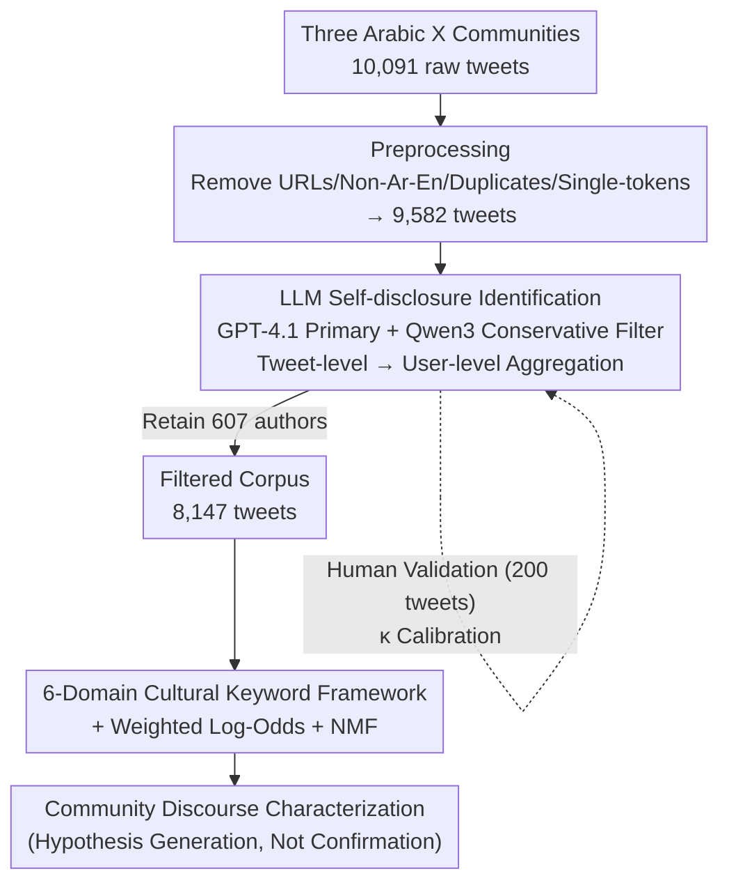

# Understanding the Sociocultural Dimensions of Mental Health Discourse in Arabic-Language X Communities

**Conference**: ACL2026  
**arXiv**: [2606.08307](https://arxiv.org/abs/2606.08307)  
**Code**: https://github.com/amalqahtani/arabic-x-mental-health-discourse  
**Area**: Social Computing / Computational Social Science / Arabic NLP  
**Keywords**: Arabic Mental Health, Self-Disclosure Identification, Cultural Keywords, Weighted Log-Odds, LLM Annotation

## TL;DR
This paper employs a GPT-4.1 self-disclosure identification pipeline to filter 8,147 tweets from "lived-experience" authors across three Arabic X (formerly Twitter) mental health communities. Utilizing weighted log-odds, NMF topic modeling, and a six-domain cultural keyword framework, the study characterizes discursive differences in Borderline Personality Disorder (BPD), Bipolar Disorder, and ADHD communities across dimensions such as religion, medicine, relationships, and identity, explicitly positioning all conclusions as "hypothesis generation" rather than "confirmatory results."

## Background & Motivation
**Background**: Computational mental health research is almost entirely centered on English-speaking populations. The dominant paradigm frames the problem as "supervised classification of high-risk individuals" (e.g., De Choudhury, Coppersmith series). Although strong Arabic baselines like AraBERT and MARBERT exist, research on "discourse characterization within cultural contexts" remains scarce.

**Limitations of Prior Work**: In Arabic societies, mental illness stigma is deeply intertwined with family honor and religious explanatory frameworks, leading to low help-seeking intent. However, condition-specific Arabic social media communities are becoming vital spaces for peer support—a corpus largely untouched by computational research. Furthermore, using "joining a community" as a proxy label for "having a condition" has proven to perform poorly against clinical ground truth.

**Key Challenge**: To study these communities, one must avoid making clinical diagnostic inferences (due to ethics and data constraints) while filtering truly "lived-experience" authors from highly noisy community tweets. Additionally, cultural dimensions (religious, supernatural, or relational attributions) are not present in English datasets and must be explicitly modeled.

**Goal**: The research is divided into two sub-problems: ① How to reliably filter "lived-experience self-disclosure tweets" from community streams without making diagnoses; ② How to use interpretable statistical and lexical methods to characterize the sociocultural discourse features of the three identified communities.

**Key Insight**: The authors move away from the "diagnostic paradigm" in favor of a "characterization-oriented" computational social science approach. Community structure is treated as a **sampling frame** rather than a diagnostic label. Kleinman's (1980) "Explanatory Models" theory (biomedical, psychological, and relational illness explanations) serves as the conceptual anchor for the analysis.

**Core Idea**: Utilizing LLMs for "personal self-disclosure" annotation (instead of clinical classification) combined with a six-domain cultural keyword framework anchored in explanatory models. This allows for the explicit quantification of sociocultural framing in Arabic mental health discourse while maintaining a "hypothesis-only" stance.

## Method

### Overall Architecture
The work follows a pipeline of "Collection → Preprocessing → LLM Self-disclosure Filtering → Human Validation → Multidimensional Exploratory Analysis." The input consists of 10,091 raw tweets scraped from three Arabic X communities (BPD / Bipolar / ADHD), and the output is a filtered corpus of 8,147 "lived-experience" tweets with associated discursive characterizations. The two most critical steps are: using GPT-4.1 to label whether tweets contain personal mental health self-disclosures (aggregated to the user level), and applying four types of analysis (temporal behavior, weighted log-odds, NMF topics, and cultural keywords).

### Key Designs

**1. LLM Self-disclosure Identification Pipeline: Shifting from "Classifying Patients" to "Identifying Expressions of Lived Experience"**

A major pain point is that community membership is an unreliable proxy for diagnosis, while human annotation of 9,582 tweets is cost-prohibitive. The authors utilize GPT-4.1 (`temperature=0.0`, `max_tokens=250`) for tweet-level binary classification—labeling each as Positive (evidence of personal disclosure) or Negative, using the user's bio as supplementary context. The prompt includes hard-coded classification rules, bio-override rules, a "conservative default to Negative" policy, and a 13-label reasoning taxonomy. Simultaneously, Qwen3-235B acts as a "conservative screening model" with the same prompt; disagreements highlight ambiguous samples. Results are aggregated at the user level: "likely lived-experience author" is operationally defined as a user with at least one self-disclosure signal or a bio containing self-identification language. Ultimately, 607 out of 1,286 users (47.2%) were identified as likely authors of lived experience, totaling 8,147 tweets. Crucially, the authors emphasize that this `likely_disclosure` tag is an operational description and **does not constitute a clinical diagnosis**.

**2. Inter-model Consistency $\neq$ Reliability: Exposing Inflated $\kappa$ with Human Gold Standards**

A common pitfall is assuming high inter-model consistency (GPT-4.1 and Qwen3 reached $\kappa=0.84$) implies reliability. To test this, two native speakers independently annotated 200 stratified samples (inter-annotator agreement $\kappa=0.905$). Using the 192 samples where humans agreed as the gold standard, GPT-4.1 achieved $\kappa=0.631$ (precision 0.92 / recall 0.85 / $\mathrm{F}_1=0.88$), while Qwen3 reached only $\kappa=0.329$ (recall 0.61). This indicates that the high inter-model agreement (0.84) primarily stems from consensus on "obvious negative samples" rather than human-level reliability. Consequently, Qwen3 was downgraded to a screening model, and disagreements were used only as ambiguity indicators. This step is central to the methodological honesty of the paper.

**3. 6-Domain Cultural Keyword Framework: Quantifying Sociocultural Framing**

English datasets lack religious, supernatural, and relational attributions specific to the Arabic context. To address this, the authors constructed six Arabic keyword lexicons—Religion, Medical, Family/Social, Emotional Distress, Identity, and Stigma—iteratively refined from the corpus and anchored in Kleinman's explanatory models. Rates are reported as "raw occurrences per 100 tweets." For the religious dimension, a more restricted lexicon + binary hits were used, categorized via framing theory into four layers: Environmental expressions (84.2%, e.g., "Praise be to God," "God willing," largely pragmatic markers), Coping and Practice (9.1%, prayer/recitation), Guilt and Supernatural (4.9%, "sin," "punishment," "Satan"), and Illness Attribution (2.6%, "test," "fate," "spiritual cause"). Analysis was supplemented by weighted log-odds (with informative Dirichlet priors and variance normalization to prevent low-frequency dominance) and NMF (on TF-IDF, optimal at $k=12$ with $C_v=0.5013$) to extract latent themes.

### Example: Why the Bipolar Community Shows "Religion + Medicine" Co-occurrence
The framework demonstrates how conclusions are derived via the Bipolar community. In terms of predictive words, $thun\bar{a}\bar{\imath}\ al\text{-}qu\d{t}b$ ("Bipolar") had the highest $z$-scores ($z=10.30$, $9.94$), while "Allah" ($z=9.79$) surprisingly ranked third, followed by "Depression" ($z=7.83$) and "Mania" ($z=7.72$). Lexically, the Bipolar community's religious keyword rate (41.3/100) was nearly 2.5 times that of BPD (16.7), and its medical keyword rate (28.6/100) was also the highest. To determine if this was "multiculturalism" within individuals or two separate groups, tweet-level intersections were calculated: 10.3% (256/2,479) of Bipolar tweets contained both religious and medical keywords, significantly higher than BPD's 3.0% ($\chi^2(1)=178.4$, $p<10^{-40}$). This tweet-level co-occurrence supports "individual-level explanatory pluralism"—the same author using both religious and medical frameworks—rather than just community-level aggregation.

## Key Experimental Results

### Main Results
Note: This paper does not focus on leaderboards; the core output is the comparative characterization of the three communities.

| Community | Corpus Prop. | Rel. Keyword Rate/100 | Med. Keyword Rate/100 | Rel+Med Co-occurrence | Discourse Features |
| :--- | :--- | :--- | :--- | :--- | :--- |
| BPD | n=5,415 (66.5%) | 16.7 | 11.7 | 3.0% | Relationships, Identity, Emotional Distress |
| Bipolar | n=2,479 (30.4%) | 41.3 (Highest) | 28.6 (Highest) | 10.3% | Religion + Medical + Episode terms |
| ADHD | n=253 (3.1%, low power) | 19.8 | 24.1 | 6.7% (sparse) | Symptom/Medication mgmt, High code-switching |

### Validation & Consistency Analysis

| Target | Metric | Value | Description |
| :--- | :--- | :--- | :--- |
| Inter-annotator | $\kappa$ | 0.905 | Near perfect, clear task definition |
| GPT-4.1 vs Gold | $\kappa$ / F1 | 0.631 / 0.88 | Substantial agreement, used as primary |
| Qwen3 vs Gold | $\kappa$ | 0.329 | Fair agreement, used as screening |
| GPT-4.1 vs Qwen3 | $\kappa$ | 0.84 | Inflated; consensus mostly on negatives |
| GPT Consistency per Community | $\kappa$ | ADHD 0.73 / BPD 0.66 / Bipolar ≈ 0.49 | Bipolar's metaphorical disclosure is hardest |

### Key Findings
- **Distinct Discursive Patterns**: Bipolar discourse favors religious, medical, and episode-specific terms. BPD focuses on relationships, identity, and emotional distress. ADHD centers on symptoms and medication management, with an English code-switching rate of 28.5% (the acronym "ADHD" is used as a global shorthand).
- **Methodological Transparency**: The authors openly discuss confounding factors: 83.5% of the BPD corpus comes from a single 9-month window, the ADHD sub-corpus is small (n=253), and lexicons are unvalidated. Consequently, all findings are framed as "hypotheses to be tested" rather than proven facts.
- **Systemic Blind Spots**: Conservative "Negative" defaults in the LLM pipeline likely lower recall for indirect or metaphorical disclosures, which are particularly prevalent in the Bipolar community.

## Highlights & Insights
- **"Identifying Disclosure" vs. "Classifying Patients"**: This is an ethical and methodological win. It avoids the "community member = patient" trap and leverages LLMs for pragmatic judgment rather than clinical inference, backed by human gold standards.
- **Reliability Cautionary Tale**: The $\kappa=0.84$ inter-model agreement is a "textbook counterexample." It drops to 0.63/0.33 against human gold standards, serving as a warning to researchers using multiple LLMs for cross-validation.
- **Tweet-Level Co-occurrence > Community-Level Aggregation**: Using the 10.3% "Religious $\cap$ Medical" tweet intersection to argue for individual explanatory pluralism is far more robust than looking at aggregate rates, as it filters out the possibility of two separate subgroups.

## Limitations & Future Work
- **Ours**: Prompts were developed on Saudi-centric data; adaptation is needed for other Arabic dialects. The BPD data is temporally concentrated, the ADHD sample size is small, there is no geographic metadata, and bot detection was not performed.
- **Lexical Subjectivity**: The six-domain lexicons involve researcher subjectivity. The fact that religious "environmental expressions" account for 84.2% suggests that many hits are pragmatic habits rather than illness-related beliefs.
- **Future Directions**: Expanding the ADHD corpus, performing multi-annotator validation for cultural keywords and religious framing, adding temporal stratification checks, and conducting sensitivity analyses on model disagreements.

## Related Work & Insights
- **vs. Coppersmith et al. (2014)**: Adopts the "condition-based linguistic comparison" logic but replaces "self-reported diagnosis classification" with "LLM self-disclosure annotation," focuses on Arabic, and maintains an interpretable statistical approach.
- **vs. Arabic Foundation Models (AraBERT/MARBERT)**: While those models focus on representation quality for NLP benchmarks, this work fills the gap in sociocultural discourse characterization.
- **vs. Ernala et al. (2019)**: In response to criticisms that proxy signals perform poorly against clinical truths, this paper treats community structure as a sampling frame rather than a diagnostic label—a caveat that shapes its entire conservative rhetorical style.

## Rating
- Novelty: ⭐⭐⭐⭐ First computational characterization of Arabic multi-community mental health discourse; novel LLM self-disclosure pipeline.
- Experimental Thoroughness: ⭐⭐⭐ Rich analysis dimensions and solid validation, but limited by data imbalance and unvalidated lexicons.
- Writing Quality: ⭐⭐⭐⭐⭐ Exceptional methodological honesty; explicitly labels all confounding factors and biases.
- Value: ⭐⭐⭐⭐ Provides a reusable pipeline and framework for low-resource Arabic mental health NLP, with strong social and ethical significance.

<!-- RELATED:START -->

## Related Papers

- [\[ACL 2026\] Splits! Flexible Sociocultural Linguistic Investigation at Scale](splits_flexible_sociocultural_linguistic_investigation_at_scale.md)
- [\[ICLR 2026\] From Five Dimensions to Many: Large Language Models as Precise and Interpretable Psychological Profilers](../../ICLR2026/social_computing/from_five_dimensions_to_many_large_language_models_as_precise_and_interpretable_.md)
- [\[ACL 2026\] Building Arabic NLP from the Ground Up: Twenty Years of Lessons, Failures, and Open Problems](building_arabic_nlp_from_the_ground_up_twenty_years_of_lessons_failures_and_open.md)
- [\[ACL 2026\] Beyond the Crowd: LLM-Augmented Community Notes for Governing Health Misinformation](beyond_the_crowd_llm-augmented_community_notes_for_governing_health_misinformati.md)
- [\[NeurIPS 2025\] DeepTraverse: A Depth-First Search Inspired Network for Algorithmic Visual Understanding](../../NeurIPS2025/social_computing/deeptraverse_a_depth-first_search_inspired_network_for_algorithmic_visual_unders.md)

<!-- RELATED:END -->
