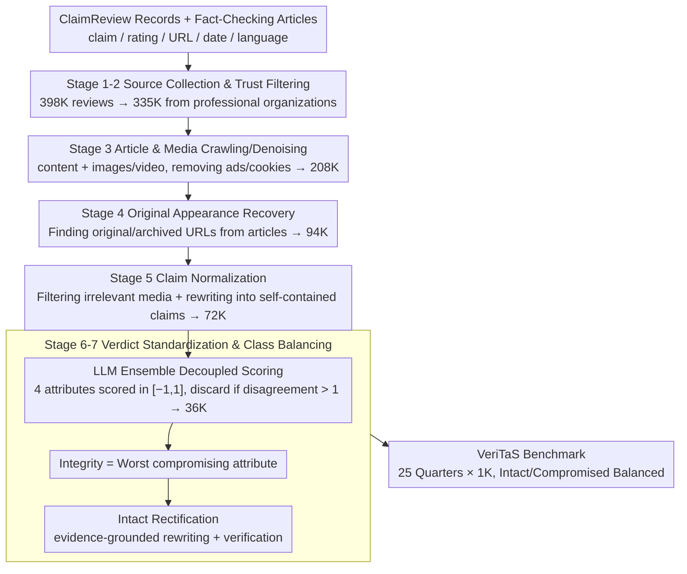

# VeriTaS: The First Dynamic Benchmark for Multimodal Automated Fact-Checking

**Conference**: ACL2026 Oral  
**arXiv**: [2601.08611](https://arxiv.org/abs/2601.08611)  
**Code**: https://veritas.mai.informatik.tu-darmstadt.de  
**Area**: Audio & Speech  
**Keywords**: Multimodal Fact-Checking, Dynamic Benchmark, Data Leakage, ClaimReview, Fact-Checking Evaluation

## TL;DR
VeriTaS utilizes a quarterly updated seven-stage automated pipeline to transform real-world multilingual image-text-video claims from professional fact-checking organizations into a standardized, interpretable, and evaluable multimodal fact-checking benchmark. It demonstrates that the strongest current multimodal models still fall significantly short of reliable AFC.

## Background & Motivation
**Background**: Automated Fact-Checking (AFC) has expanded from pure text verification to images, videos, social media posts, and cross-lingual dissemination. Real-world misinformation is rarely a single sentence; it is a "claim package" composed of text, images, videos, publication dates, original sources, and context. Evaluation systems must therefore cover multimodal evidence, real propagation chains, and professional verdicts.

**Limitations of Prior Work**: Most existing AFC benchmarks are static. Once pre-training corpora cover these public claims and verdicts, test sets can degenerate into memory-based tests. Another issue is coarse labeling: many datasets only provide single labels like true/false/NEI, failing to distinguish between manipulated images, images in wrong contexts, false textual statements, or lack of critical context.

**Key Challenge**: Fact-checking evaluation requires up-to-date, authentic, and interpretable data, but human construction of such data is extremely costly. Relying only on old data leads to contamination by knowledge cutoff dates and data leakage; relying only on synthetic data risks lack of authenticity and ethical issues.

**Goal**: This work aims to simultaneously achieve four goals: construct a dynamic benchmark for continuous updates; cover text, images, video, and multilingual claims; unify heterogeneous fact-checking verdicts into fine-grained scores; and verify alignment between automated labeling and human judgment while measuring the capabilities of state-of-the-art models.

**Key Insight**: This paper leverages ClaimReview as a structured entry point for real-world fact-checking, then employs LLMs for article extraction, original appearance retrieval, claim rewriting, verdict standardization, and "intact claim" rectification. This preserves the evidence base of professional fact-checkers while enabling scale-up to quarterly updates.

**Core Idea**: To transform the real-world fact-checking ecosystem into a continuously updated, fine-grained, interpretable, and leakage-robust multimodal AFC evaluation benchmark via an automated pipeline.

## Method
VeriTaS is not a new fact-checking model, but a data and annotation framework for model evaluation. The core of the paper lies in breaking down messy real-world fact-checking materials into automatically processable stages: finding expert claims via ClaimReview, recovering original content and media, rewriting claims into self-contained forms, and mapping diverse institutional verdicts to a unified continuous score.

### Overall Architecture
The input consists of public ClaimReview structured records and fact-checking articles containing claim text, ratings, review URLs, dates, languages, and some appearance URLs. The pipeline first filters for trusted publishers and crawls the content, then completes original social media appearances and media files. Subsequently, the system uses multimodal LLMs to normalize raw claims into concise, self-contained statements that do not leak the verdict, while retaining necessary media.

The output is the VeriTaS benchmark organized by quarter. Each sample includes the claim, media, date, language, appearance info, an overall Integrity score, underlying attribute scores, and a textual justification. The current release includes 25K claims covering 25 quarters from Q1 2020 to Q1 2026, with 1K claims per quarter, maintaining a balance between Intact and Compromised cases.

### Key Designs

**1. Seven-stage Dynamic Construction Pipeline: Transforming "emerging real-world checks" into evaluable samples**

The main difficulty of dynamism is not just adding new files, but stably extracting clean, usable samples from the real fact-checking production chain. VeriTaS tackles this in seven stages: Stage 1 collects ~398K reviews from ClaimReview; Stage 2 identifies 848 publishers, retaining only professional fact-checking organizations to get 335K trusted reviews; Stage 3 crawls text and media while removing noise like ads; Stage 4 recovers original appearance URLs and archived URLs; Stage 5 filters irrelevant media and rewrites claims into ~72K self-contained statements; Stage 6 standardizes verdicts; Stage 7 generates and verifies Intact versions for balance. The key to this design is integrating credibility, context, media, and labels into an automated pipeline, allowing "quarterly extensions" to be executed reliably without expensive manual maintenance.

**2. Decoupled Verdict and Integrity Scoring: Pinpointing where models fail**

Real-world errors are rarely simple "True/False" binaries—an image might be real but placed in a wrong context, or text might be mostly correct but omit critical context. If compressed into a coarse label, the benchmark cannot detect whether a model failed on media, text, or context. VeriTaS decomposes the judgment into four underlying attributes: Media Authenticity, Media Contextualization, Veracity, and Context Coverage, with "Integrity" representing if the claim is acceptable as a whole. Each attribute takes a continuous score in $[-1, 1]$, where $< -1/3$ is Negative and $> 1/3$ is Positive. Integrity is determined by the worst "compromising property" among attributes (2)–(4). The primary evaluation metric is MSE, as it heavily penalizes True/False flips while allowing for "near-correct" answers, fitting this continuous, interpretable judgment structure better than discrete accuracy.

**3. LLM Ensemble Annotation, Filtering, and Rectification: High consistency and balanced labels without human labor**

Real fact-checking databases contain far more false claims than true ones, leading to class imbalance; however, synthesizing true claims from scratch may detach from reality or introduce ethical risks. In Stage 6, VeriTaS uses an ensemble of GPT-5.2, Gemini 2.5 Pro, Claude Sonnet 4.5, and Llama 4 Maverick to score each attribute and generate justifications, aggregating by mean. Claims are discarded if disagreement between members exceeds 1 to ensure high consistency. To address imbalance, Stage 7 does not generate positive cases unconditionally; instead, it performs "evidence-grounded Intact rectification" based on the justifications of compromising properties, followed by verification of shareability, consistency, and Integrity. This "evidence-based correction" compromises between authenticity and balance—supplementing correct claims while staying close to real sources.

> ⚠️ Note: Model names such as GPT-5.2, Gemini 2.5 Pro, Claude Sonnet 4.5, and Llama 4 Maverick are based on the original text.

### Loss & Training
No new models were trained. The construction side relies on the collaborative calling of multimodal LLMs, ensemble aggregation, and strict filtering. The evaluation side maps model outputs to continuous scores for Integrity and underlying attributes, using MSE as the primary metric, supplemented by MAE and 3-bin/7-bin accuracy. All baseline evaluations require excluding evidence post-dating the claim to prevent retrieval systems from "peeking into the future."

## Key Experimental Results

### Main Results
Experiments were divided into three categories: data scale statistics, human verification, and model baseline evaluation. The most significant conclusion is that the automated pipeline achieves high human consistency, yet current AFC and general multimodal models remain unreliable on the latest quarters.

| Stage / Data Slice | Quantity or Metric | Description | Conclusion |
|--------------------|--------------------|-------------|------------|
| ClaimReview discovery | ~398K reviews | Structured fact-check records from 2016-01 to 2026-03 | The raw ecosystem is sufficiently large |
| Trust Filtering | 335K reviews | Retaining professional organizations from 848 publishers | Controls quality via source credibility |
| Article Cleaning | 208K reviews | Extracting article text and media | Provides context for justifications/rewriting |
| Appearance Recovery | 94K reviews | Only 13.3% of ClaimReviews have appearances; LLM finds extra URLs | Recovery is a primary bottleneck |
| Claim Normalization | 72K claims | Removing leaks, completing media refs, limiting length | Results in self-contained claims |
| Verdict Standardization| 36K claims | Filtering high disagreement cases | Retains consistent fine-grained labels |
| Final Release | 25K claims | 25 quarters, 1K/quarter, Intact/Compromised balanced | Enables dynamic and longitudinal evaluation |
| Media & Language | 8,692 img, 5,334 vid, 54 lang | English 39.0%, Spanish 10.9%, Hindi 5.8% | Coverage exceeds pure English/text benchmarks |

| Setting | MSE↓ | MAE↓ | 7-bin Acc↑ | 3-bin Acc↑ | Interpretation |
|---------|------|------|------------|------------|----------------|
| VeriTaS Full Pipeline | 0.034 | 0.102 | 69.1 | 97.5 | High alignment with human Integrity judgment |
| Ensemble w/o Filter | 0.035 | 0.105 | 68.6 | 97.6 | Filtering contributes mainly to robustness |
| GPT-5.2 (Single) | 0.076 | 0.184 | 51.2 | 95.7 | Single model error is significantly higher |
| Gemini 3.1 Pro (Single)| 0.071 | 0.099 | 73.4 | 95.7 | High 7-bin, but MSE inferior to ensemble |
| Claude Sonnet 4 (Single)| 0.048 | 0.091 | 72.5 | 97.1 | Close to ensemble but inferior to full flow |
| Llama 4 Maverick (Single)| 0.042 | 0.103 | 66.7 | 97.1 | Open-source is usable, ensemble is more stable |

On the latest Q1 2026 split, strong models still show significant error. Without retrieval, Claude Opus 4.6 achieved an MSE of 0.453, the best among general models. With web search, Claude Opus 4.6 dropped to 0.183, Gemini 3 Flash to 0.275, and Qwen 3.5 397B to 0.318. DEFAME with a Claude Opus 4.6 backbone reached 0.282, while Loki became significantly worse across multiple backbones, suggesting "specialized systems" are not automatically superior to strong general multimodal models.

### Ablation Study

| Analysis Item | Key Metric | Description |
|---------------|------------|-------------|
| Knowledge Cutoff Impact | Longitudinal MSE increases from ~0.6 to >0.8 without retrieval | Models degrade significantly on post-cutoff claims; static benchmarks overstate ability |
| Latest Quarter + Retrieval | Claude Opus 4.6 MSE 0.183, Gemini 3 Flash 0.275 | Retrieval helps, but remains far from the 0.1 acceptable threshold |
| Media Subsets | Higher MSE on video claims for most models | Video fact-checking remains a weak link |
| Integrity Subsets | Models tend to label claims as Compromised | Class bias leads to more errors on Intact samples |
| Rectified Claim Quality | ~5.1% of samples have quality concerns in human audit | Evidence-grounded rewriting is generally credible but needs audit |

### Key Findings
- The necessity of dynamic benchmarks is confirmed: MSE rises for claims after the model's knowledge cutoff, proving that old fact-check samples are likely contaminated by parametric memory.
- Human verification shows the full pipeline's Integrity MSE is only 0.034, indicating that LLM ensembles with filtering can map professional verdicts very reliably.
- Retrieval augmentation is not a silver bullet. Even with search tools, the best MSE is 0.183, and evaluations must restrict evidence sources by claim date.
- Video, multilingualism, and Intact samples are the primary challenges; many models have a prior bias toward "false claims," frequently mislabeling true or rectified claims as Compromised.

## Highlights & Insights
- The biggest highlight is treating data leakage as a first-class citizen in benchmark design. Instead of just saying "updates will come," the authors provide a quarterly update pipeline and proof that static AFC evaluations become increasingly distorted over time.
- The Verdict design is highly reusable. Building Integrity on media context, textual veracity, and context coverage is better suited for multimodal information pollution than single binary labels and is easily transferable to other domains (medical, scientific).
- Rectification is cleverly positioned. It doesn't generate positive cases out of thin air but uses evidence from fact-checking articles to convert false claims into shareable true ones, mitigating class imbalance without sacrificing reality.
- The evaluation protocol is "time-sensitive." Requiring that retrieved evidence cannot be later than the claim date is crucial for all tool-augmented AFC/agent evaluations to prevent systems from using future facts to reverse-engineer answers.

## Limitations & Future Work
- VeriTaS depends on the continued accessibility of ClaimReview, Data Commons, and professional fact-checking organizations; changes in platform policies could affect dynamic updates.
- Rectified Intact claims might carry LLM writing styles, which future models could learn as shortcuts.
- Cross-lingual deduplication is incomplete; the same fact-checking event may enter the data in multiple languages, although this reflects real world spread.
- Presently covers text, images, and video; an increase in audio-only misinformation would require the pipeline to expand to audio transcription, deepfake detection, and context judgment.
- Evaluates verdict scores but not the quality of the evidence submitted by the model. Future work could include evaluations for evidence retrieval and justification factuality.

## Related Work & Insights
- **vs. Static AFC benchmarks**: Older benchmarks are usually one-off releases, prone to pre-training contamination; VeriTaS centers evaluation on "emerging claims" through quarterly updates and cutoff analysis.
- **vs. Synthetic misinformation datasets**: Purely synthetic claims are controllable but lack authenticity; VeriTaS claims come from real articles, and rectified samples are constrained by evidence grounding.
- **vs. Single-label binary classification**: Binary tasks are easy to evaluate but have weak explanatory power; VeriTaS's decomposition into media, veracity, and coverage closer follows professional workflows.
- **Heuristics for future work**: Any real-world, long-cycle benchmark should explicitly record sample time, knowledge cutoffs, and tool-evidence time-bounds; otherwise, model capability and memory will be conflated.

## Rating
- Novelty: ⭐⭐⭐⭐⭐ Integration of dynamic, multimodal, multilingual AFC with continuous Integrity scoring is very complete.
- Experimental Thoroughness: ⭐⭐⭐⭐⭐ Statistics, human verification, latest-quarter baselines, and longitudinal analysis are all robust.
- Writing Quality: ⭐⭐⭐⭐ Structure is clear, but construction stages are information-dense, requiring cross-referencing with the appendix.
- Value: ⭐⭐⭐⭐⭐ Significant for fact-checking evaluation, tool-augmented VLM testing, and leakage-proof benchmarking.

<!-- RELATED:START -->

## Related Papers

- [\[ICML 2025\] DEFAME: Dynamic Evidence-based FAct-checking with Multimodal Experts](../../ICML2025/social_computing/defame_dynamic_evidence-based_fact-checking_with_multimodal_experts.md)
- [\[ACL 2026\] LiveFact: A Dynamic, Time-Aware Benchmark for LLM-Driven Fake News Detection](livefact_a_dynamic_time-aware_benchmark_for_llm-driven_fake_news_detection.md)
- [\[ACL 2026\] Diagnosing LLM Arbitration Behavior over Pre-evidence Epistemic States in RAG-based Fact-Checking](diagnosing_llm_arbitration_behavior_over_pre-evidence_epistemic_states_in_rag-ba.md)
- [\[ACL 2026\] ClaimDB: A Fact Verification Benchmark over Large Structured Data](claimdb_a_fact_verification_benchmark_over_large_structured_data.md)
- [\[ACL 2026\] Decide less, communicate more: On the construct validity of end-to-end fact-checking in medicine](decide_less_communicate_more_on_the_construct_validity_of_end-to-end_fact-checki.md)

<!-- RELATED:END -->
