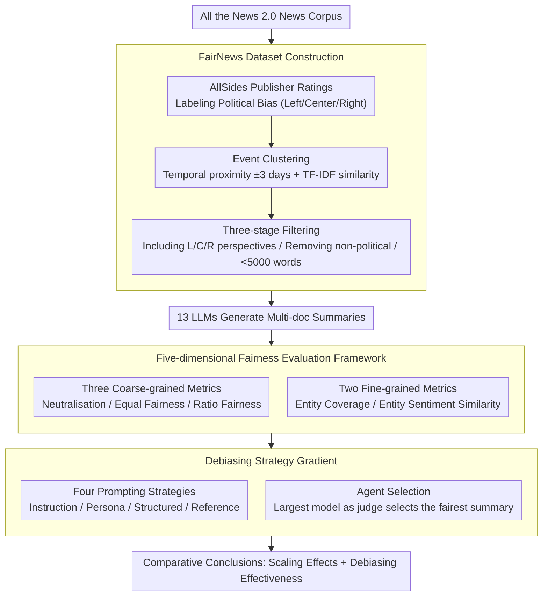

# When Bigger Isn't Better: A Comprehensive Fairness Evaluation of Political Bias in Multi-News Summarisation

**Conference**: ACL 2026  
**arXiv**: [2604.21309](https://arxiv.org/abs/2604.21309)  
**Code**: [https://github.com/nii-yamagishilab-visitors/fair_multi_news_summ](https://github.com/nii-yamagishilab-visitors/fair_multi_news_summ)  
**Area**: AI Fairness / News Summarization  
**Keywords**: Political Bias, Multi-document Summarization, Fairness Evaluation, Debiasing Methods, Model Scaling

## TL;DR

This study constructs FairNews, the first multi-document news summarization dataset with political leaning labels, and evaluates 13 LLMs using a five-dimensional fairness framework. It finds that medium-scale models outperform larger models in both fairness and efficiency, and that entity sentiment similarity is the dimension most resistant to prompting-based debiasing.

## Background & Motivation

**Background**: Multi-document news summarization systems are increasingly popular for helping readers quickly synthesize information from multiple sources. While existing research has identified position bias, entity bias, and gender bias in summaries, systematic evaluation of political bias in multi-document scenarios remains unexplored.

**Limitations of Prior Work**: (1) Existing multi-document summarization datasets lack article-level political leaning labels, preventing systematic evaluation of fairness across the political spectrum; (2) Current evaluation methods lack a framework to simultaneously assess multiple fairness dimensions; (3) The effectiveness of debiasing techniques (e.g., prompt engineering) in multi-document news summarization has not been investigated.

**Key Challenge**: There is a common assumption that "larger models are fairer," but the relationship between fairness and model scale is more complex—larger models may perform worse in certain dimensions.

**Goal**: (1) Construct a multi-document summarization dataset with political labels; (2) Establish a multidimensional fairness evaluation framework; (3) Evaluate the relationship between model scale and fairness; (4) Assess the effectiveness of various debiasing strategies.

**Key Insight**: Using AllSides publisher bias ratings to label news articles (Left/Center/Right) allows for evaluating fairness at both coarse-grained and fine-grained levels through five complementary metrics.

**Core Idea**: Fairness is multidimensional. Neutralisation, Equal Fairness, Ratio Fairness, Entity Coverage, and Entity Sentiment Similarity each capture different aspects, and no single model or debiasing strategy optimizes all dimensions simultaneously.

## Method

### Overall Architecture

This work aims to answer how biased LLMs are in multi-document news summarization and whether scaling or debiasing can resolve these issues. To this end, a complete pipeline from data to evaluation to intervention is established. The FairNews dataset with political labels is first constructed, followed by the quantification of bias using a five-dimensional fairness framework. Finally, the effects of different model scales, four prompting strategies, and one agent selection strategy are systematically compared. The entire pipeline involves zero model training, relying instead on inference and measurement of pre-trained models.

### Key Designs

**1. FairNews Dataset: Filling the Gap in Article-Level Political Labeling**

Existing multi-document summarization datasets either provide only summaries without full articles or lack political leaning labels, making it impossible to systematically evaluate fairness across the political spectrum. FairNews starts from All the News 2.0, utilizing AllSides publisher bias ratings to label each article (categorized as Left/Center/Right). Articles are clustered into "event clusters" based on temporal proximity (±3 days) and TF-IDF semantic similarity. Three filters are applied: each event must include perspectives from all three sides (Left/Center/Right) to ensure cross-spectrum fairness; non-political content (e.g., entertainment, sports) is excluded; and total word count is restricted to <5000 to fit within LLM context windows. This results in samples of real news with inherently complementary perspectives.

**2. Five-dimensional Fairness Evaluation Framework: Dissecting Fairness with Complementary Metrics**

Since single metrics cannot capture all facets of fairness, the framework provides five complementary dimensions. The three coarse-grained metrics are: Neutralisation (percentage of neutral sentences in the summary); Equal Fairness (the maximum-minimum difference in the proportions of L/C/R viewpoints); and Ratio Fairness (the Wasserstein distance between output and input political distributions). The two fine-grained metrics focus on entities: Entity Coverage (retention rate of source entities in the summary) and Entity Sentiment Similarity (difference in sentiment distribution toward the same entity between source and summary). Together, these provide a complete profile of political fairness.

**3. Debiasing Strategies: An Intervention Gradient from Simple Instructions to Agent Selection**

To assess whether bias can be mitigated through prompting, the authors test a gradient of interventions: four prompting strategies—(a) Debiasing Instruction, directly requesting a fair summary; (b) Debiasing Persona, assigning a "fair summarizer" role; (c) Structured Prompting, providing step-by-step guidance to cover the five fairness dimensions; and (d) Debiasing Reference, explicitly feeding publisher bias information to the model. Additionally, a judge-based agent selection strategy is tested: using the largest model in a family to select the "fairest" summary from various family members' outputs.

### Loss & Training

This is an evaluation study and does not involve model training. All experiments use pre-trained models for inference under baseline and debiasing prompts, followed by measurement using the five-dimensional framework.

## Key Experimental Results

### Main Results

**Baseline Fairness (Medium-scale models, normalized to [0,1], higher is better)**

| Model | Neutralisation | Equal Fairness | Ratio Fairness | Entity Coverage | Entity Sentiment |
|------|---------------|---------------|---------------|----------------|-----------------|
| Gemma-3 12B | High | Medium | Medium | **Highest** | Medium |
| Llama-3 8B | Medium | Medium | **Highest** | Medium | **Highest** |
| Qwen2.5 7B | Unbalanced | High | Medium | Medium | Medium |

### Model Scaling Effect

| Model Family | Optimal Fairness Scale | Performance of Largest Scale |
|---------|-------------|------------|
| Gemma-3 | 12B | 27B inferior to 12B |
| Llama-3 | 3B-8B | 70B inferior to 8B |
| Qwen2.5 | 7B | 32B/72B inferior to 7B |

### Key Findings

- **Consistent Superiority of Medium-Scale Models**: Gemma-3 12B, Llama-3 8B, and Qwen2.5 7B demonstrate the most balanced fairness performance within their respective families.
- There is an inherent trade-off among the five fairness metrics—no model achieves high scores across all dimensions simultaneously.
- **Entity Sentiment Similarity is most resistant to intervention**: This dimension remains nearly unchanged regardless of prompting or agent selection, likely because entity sentiment is deeply encoded in model representations beyond the reach of prompt-level intervention.
- Structured Prompting is the most stable debiasing method, avoiding the high variance seen in other strategies.
- Providing exhaustive information (e.g., publisher bias labels) can actually degrade performance; strategic guidance is superior to information dumping.
- Input document order has no significant impact on fairness (t-test not significant).
- All models exhibit inherent polarization bias—systematically under-representing centrist views and over-representing partisan content.

## Highlights & Insights

- The finding that "bigger is not necessarily better" has direct practical implications for LLM deployment; medium-scale models represent an optimal balance between fairness, efficiency, and performance.
- The five-dimensional evaluation framework is highly comprehensive and reusable, with each metric capturing a different layer of fairness.
- The resistance of entity sentiment similarity to prompting suggests a deep mechanism: sentimental attitudes may be encoded as linear directions in the model's representation space, requiring representation-level interventions.

## Limitations & Future Work

- The study is limited to English news and the US political spectrum; applicability to other cultures or languages is unknown.
- Political labels are assigned at the publisher level rather than the individual article level, which may introduce noise.
- The largest Gemma-3 model tested is only 27B, limiting comparisons with 70B+ models from Llama or Qwen families.
- Proprietary models (e.g., GPT-4, Claude) were not tested and may exhibit different fairness characteristics.

## Related Work & Insights

- **vs. Existing Fairness Research**: This is the first systematic evaluation of political bias in multi-document news summarization, providing a multidimensional evaluation framework.
- **vs. Debiasing Prompting**: The study reveals fundamental limitations of prompting-based debiasing in preserving fine-grained sentiment.

## Rating

- Novelty: ⭐⭐⭐⭐ FairNews and the five-dimensional framework fill a significant gap, though the methodology is not a radical departure.
- Experimental Thoroughness: ⭐⭐⭐⭐⭐ Comprehensive coverage includes 13 models, five metrics, four debiasing strategies, and agent selection.
- Writing Quality: ⭐⭐⭐⭐ Clear structure and strong findings, though slightly verbose.
- Value: ⭐⭐⭐⭐⭐ High practical value for LLM fairness evaluation and deployment decisions.

<!-- RELATED:START -->

## Related Papers

- [\[AAAI 2026\] SceneJailEval: A Scenario-Adaptive Multi-Dimensional Framework for Jailbreak Evaluation](../../AAAI2026/social_computing/scenejaileval_a_scenario-adaptive_multi-dimensional_framework_for_jailbreak_eval.md)
- [\[ICML 2026\] MIND: Multi-Rationale Integrated Discriminative Reasoning Framework for Multi-Modal Fake News](../../ICML2026/social_computing/mind_multi-rationale_integrated_discriminative_reasoning_framework_for_multi-mod.md)
- [\[ACL 2026\] MM-StanceDet: Retrieval-Augmented Multi-modal Multi-agent Stance Detection](mm-stancedet_retrieval-augmented_multi-modal_multi-agent_stance_detection.md)
- [\[ACL 2026\] LiveFact: A Dynamic, Time-Aware Benchmark for LLM-Driven Fake News Detection](livefact_a_dynamic_time-aware_benchmark_for_llm-driven_fake_news_detection.md)
- [\[ACL 2026\] GKnow: Measuring the Entanglement of Gender Bias and Factual Gender](gknow_measuring_the_entanglement_of_gender_bias_and_factual_gender.md)

<!-- RELATED:END -->
