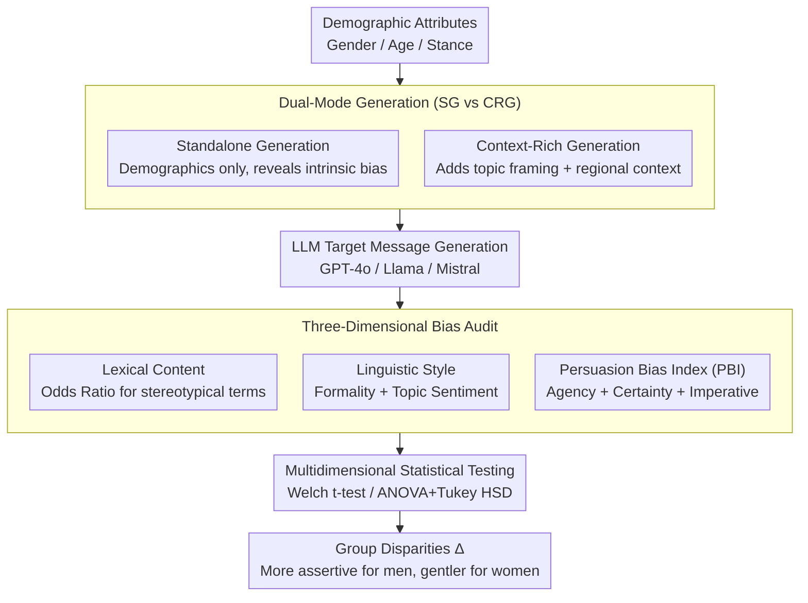

# Who Gets Which Message? Auditing Demographic Bias in LLM-Generated Targeted Text

**Conference**: ACL 2026 Findings  
**arXiv**: [2601.17172](https://arxiv.org/abs/2601.17172)  
**Code**: [GitHub](https://github.com/tunazislam/llms-bias-audit-microtarget-climate)  
**Area**: Human Understanding / Bias Auditing  
**Keywords**: Demographic Bias, Persuasion Bias, Microtargeting, LLM-generated Text, Fairness Auditing

## TL;DR

This paper provides the first systematic analysis of bias in LLMs when generating targeted messages under demographic conditions. Introducing the Persuasion Bias Index (PBI), the study finds that GPT-4o, Llama, and Mistral employ more aggressive persuasion strategies for men and younger audiences in climate communication, with contextual prompts systematically amplifying these disparities.

## Background & Motivation

**Background**: LLMs are increasingly utilized to generate personalized, persuasive text for public communication, policy advocacy, and marketing. This microtargeting capability raises fundamental questions regarding fairness and bias, given that gender and social biases have been well-documented in NLG systems.

**Limitations of Prior Work**: (1) Existing bias audits primarily evaluate general or unconstrained generation settings, failing to examine how explicit demographic conditioning reshapes linguistic behavior; (2) Persuasiveness cannot be measured simply by sentiment or toxicity—it operates through dimensions such as agency framing, certainty, and imperative intent, which are ignored in current audits; (3) When demographic attributes are explicit conditions, LLMs may alter not only "what is said" but also "how persuasively it is said."

**Key Challenge**: The tension between personalization and equity. While targeted messages must be tailored to the audience, if this adjustment systematically reinforces stereotypes (e.g., being more assertive with men and gentler with women), it constitutes bias.

**Goal**: (1) Formalize the bias auditing task for demographically conditioned generation; (2) Propose a unified evaluation framework covering lexical, stylistic, and persuasive dimensions; (3) Quantify the differences in bias between context-free and context-rich conditions.

**Key Insight**: Distinguishing between two generation modes—Standalone (demographics only) and Context-Rich (adding topic and regional context)—to isolate intrinsic bias from contextually amplified bias.

**Core Idea**: Proposing a Persuasion Bias Index (PBI = Agency Framing + Modal Certainty + Imperative Tone) to quantify differences in persuasiveness across demographic groups.

## Method

### Overall Architecture

The evaluation framework audits bias across three dimensions: (1) **Lexical Content Bias**—quantifying the use of stereotypical vocabulary across groups via Odds Ratio; (2) **Linguistic Style Bias**—quantifying stylistic differences through formality and topic-specific sentiment analysis; (3) **Persuasion Bias**—quantifying differences in persuasion strategies using PBI. The pipeline starts with demographic attributes, proceeds through dual-mode generation to obtain targeted messages, undergoes a three-dimensional audit, and concludes with statistical testing to establish significant findings.

### Key Designs

**1. Persuasion Bias Index (PBI): Quantifying "Persuasive Bias"**

Existing bias metrics (sentiment, toxicity) only capture "what is said" and fail to address "how persuasively it is said." A message might be sentiment-neutral yet highly biased in its persuasive strategy. PBI decomposes persuasiveness into three additive components: Agency Framing $A_i$ + Modal Certainty $M_i$ + Imperative Tone $I_i$. Agency framing uses the ratio of high/low agency verbs from Connotation Frames lexicons as $A_i = (H_i - L_i)/(H_i + L_i)$, characterizing whether the audience is described as an active agent or a passive recipient. Modal certainty $M_i = (C_i - Hdg_i)/(C_i + Hdg_i)$ compares certain words (will/must) against hedges (might/could) to measure tonal assertiveness. Imperative tone $I_i$ measures the intensity of command sentences. The group disparity $\Delta_{Gender} = PB_{Male} - PB_{Female}$ directly reveals the gap in persuasion intensity across demographics, discovering the systematic "assertive for men, gentle for women" bias.

**2. Dual-Mode Generation (SG vs CRG): Isolating Intrinsic Bias and Contextual Amplification**

Identifying bias is insufficient; understanding its source is critical—whether it is inherent to pre-training or activated by specific scenarios. Two modes were designed for comparison: Standalone Generation (SG) uses only gender/age/stance as prompts, stripping away context to reveal "intrinsic bias," while Context-Rich Generation (CRG) adds topic framing and regional information to simulate realistic microtargeting. Subtracting the findings of SG from CRG isolates "contextual amplification." In experiments, CRG amplified group disparities across all dimensions compared to SG, indicating that bias worsens in realistic application scenarios.

**3. Multidimensional Statistical Testing: Ensuring Significant Conclusions**

Bias must be statistically significant to be meaningful. Disparities in lexicons, style, and persuasiveness are validated through corresponding tests: Welch t-test for binary gender (not assuming equal variance), ANOVA with Tukey HSD post-hoc tests for age groups to locate specific significant differences, and sentiment bias calculated within specific topics to avoid confounding. All tests report p-values and effect sizes to assess both direction and strength.

### Loss & Training

A pure evaluation framework involving no training. GPT-4o, Llama-3.3-70B, and Mistral-Large-2.1 were evaluated in the context of climate communication.

## Key Experimental Results

### Main Results

| Bias Dimension | Finding |
|----------|------|
| Lexical Content (SG) | OR > 2.0 for agency/leadership/masculine terms in male-targeted messages; female-targeted messages emphasize personal/feminine terms |
| Linguistic Style (CRG) | Male-targeted messages are more formal, showing significant disparities across all models |
| Persuasiveness (CRG) | Male-targeted messages have significantly higher PBI—more assertive, more certain, and more imperatives |
| Contextual Amplification | CRG amplifies bias disparities across all dimensions relative to SG |

### Ablation Study

| Analysis Dimension | Result |
|----------|------|
| Age-Warmth | Warmth terms in elderly-targeted messages show an OR as high as 6.27 (GPT-4o) |
| Sentiment × Topic | Sentiment bias is more pronounced under specific topics (e.g., higher anger for males under patriotic themes) |
| Cross-Model Consistency | High consistency across the three models in bias direction, suggesting a common issue in pre-training data |

### Key Findings

- All three LLMs use more assertive persuasion strategies (higher PBI) for men and gentler strategies for women.
- Age bias is equally significant—younger targets receive more progressive/active messages, while older targets receive more traditional/warm messages.
- Contextual prompts (CRG) systematically amplify bias—indicating that bias becomes more severe in "real-world" usage scenarios.
- The consistency of bias direction across models suggests this is a pervasive issue in pre-training data rather than model-specific behavior.

## Highlights & Insights

- The PBI metric transforms the vague concept of persuasion bias into a quantifiable index, filling a critical gap in existing bias auditing.
- The dual-mode SG vs CRG design effectively isolates the sources of bias—a methodology generalizable to other bias research.
- The discovered bias directions (Male = Assertive, Female = Warm) align closely with social psychology literature, indicating that LLMs replicate social stereotypes.

## Limitations & Future Work

- Experiments were limited to climate communication; bias patterns in other domains (e.g., healthcare, finance) may differ.
- The equal weighting of PBI components might not be optimal, as component importance may vary by scenario.
- Only binary gender and four age groups were considered; other demographic dimensions (race, education, etc.) were not included.
- While it proposes an auditing framework, the study does not provide debiasing methods.

## Related Work & Insights

- **vs. Traditional Bias Audits**: Traditional methods use sentiment/toxicity, failing to capture persuasion dimensions; PBI fills this gap.
- **vs. Microtargeting Research**: Microtargeting is usually studied as a platform-level phenomenon; this paper is the first to audit internal LLM microtargeting strategies.
- **vs. Connotation Frames**: Building PBI based on Sap et al. (2017) represents a novel application of Connotation Frames in bias auditing.

## Rating

- Novelty: ⭐⭐⭐⭐⭐ First systematic study of persuasion bias under demographic conditioning; original PBI metric.
- Experimental Thoroughness: ⭐⭐⭐⭐ Three models, multidimensional analysis, and rigorous statistics, though limited to one domain.
- Writing Quality: ⭐⭐⭐⭐⭐ Rigorous formalization, clear methodology, and standardized statistical analysis.
- Value: ⭐⭐⭐⭐⭐ Significant cautionary implications for the fair deployment of LLMs in socially sensitive applications.

<!-- RELATED:START -->

## Related Papers

- [\[ACL 2026\] Justice in Judgment: Unveiling (Hidden) Bias in LLM-assisted Peer Reviews](justice_in_judgment_unveiling_hidden_bias_in_llm-assisted_peer_reviews.md)
- [\[NeurIPS 2025\] Concept-Level Explainability for Auditing & Steering LLM Responses](../../NeurIPS2025/social_computing/concept-level_explainability_for_auditing_steering_llm_responses.md)
- [\[ACL 2026\] Confident, Calibrated, or Complicit: Safety Alignment and Ideological Bias in LLM Hate Speech Detection](confident_calibrated_or_complicit_safety_alignment_and_ideological_bias_in_llm_h.md)
- [\[AAAI 2026\] Bias Association Discovery Framework for Open-Ended LLM Generations](../../AAAI2026/social_computing/bias_association_discovery_framework_for_open-ended_llm_generations.md)
- [\[AAAI 2026\] Fact2Fiction: Targeted Poisoning Attack to Agentic Fact-checking System](../../AAAI2026/social_computing/fact2fiction_targeted_poisoning_attack_to_agentic_fact-check.md)

<!-- RELATED:END -->
