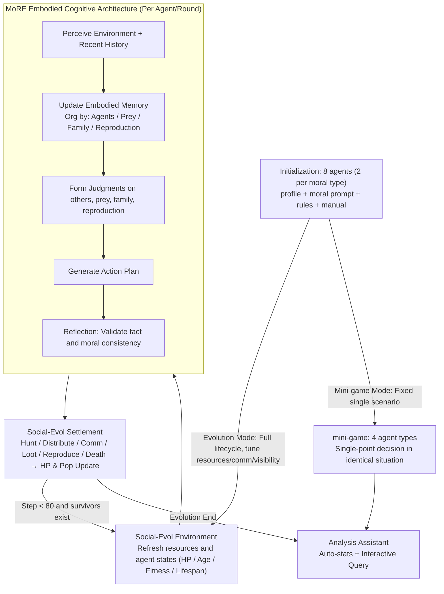

# Why Are We Moral? An LLM-based Agent Simulation Approach to Study Moral Evolution

**Conference**: ACL2026  
**arXiv**: [2509.17703](https://arxiv.org/abs/2509.17703)  
**Code**: https://github.com/MoralAgentSim/Simulation-Engine  
**Area**: Agent Simulation / Social Evolution  
**Keywords**: LLM Agent, Moral Evolution, Social Simulation, Multi-agent Systems, Cognitive Architecture

## TL;DR
This paper constructs a prehistoric hunter-gatherer society simulation platform using LLM agents, incorporating moral types, memory, judgment, cooperation, and reproduction into evolutionary experiments. It finds that cooperation and mutual aid generally enhance survival stability, while the cognitive cost of judging others' moral types dictates which moral strategy prevails.

## Background & Motivation
**Background**: Why morality evolved is a long-standing question in evolutionary biology, social sciences, and ethics. Classical explanations include kin selection, reciprocal altruism, group selection, evolutionary game theory, and the "expanding circle" theory, which demonstrate how cooperation can enhance fitness under certain conditions. Simultaneously, LLM agent simulations have recently been used to model towns, economic behaviors, and social interactions, enabling the explicit inclusion of memory, reasoning, values, and social relationships in agent decision-making.

**Limitations of Prior Work**: Traditional evolutionary games often simplify agents into fixed strategies and environments into payoff matrices. While this abstraction aids mathematical analysis, it struggles to study cognitive factors: how agents remember past interactions, judge trustworthiness, coordinate under limited communication bandwidth, or trigger conflicts due to misjudgment. Existing LLM social simulations rarely systematically model moral types, cooperation/competition, long-term evolution, and reproduction mechanisms.

**Key Challenge**: Moral evolution involves both macro-level group outcomes and micro-level cognitive processes. Relying solely on payoff matrices obscures intermediate mechanisms like "judgment costs," "reputation formation," "misunderstandings," and "self-destructive competition." Conversely, conducting experiments in real societies lacks control over variables, repeatability, and the ability to observe individual reasoning.

**Goal**: The authors propose LLM agent simulation as a new paradigm to complement traditional models. By using agents with higher cognitive realism and richer prehistoric ecological environments, they explore how different moral inclinations affect survival, cooperation, and reproduction under varying resources, communication, and observability.

**Key Insight**: The paper adopts Peter Singer’s "expanding circle" as a framework for moral type design, ranging from self-interest and kin-focus to reciprocal and universal concern. This ensures experimental controllability while covering the spectrum from egoism to generalized altruism.

**Core Idea**: Replace fixed strategies with the cognitive capabilities of LLM agents and 2x2 payoff matrices with configurable hunter-gatherer environments, allowing cooperation, judgment, misunderstanding, and survival pressure to emerge from agent interactions.

## Method
The paper consists of two primary systems: the MoRE agent cognitive architecture and the Social-Evol environmental platform. MoRE defines an agent's values/moral type, perception, memory, judgment, planning, and reflection. Social-Evol provides environmental dynamics including resources, HP, hunting, gathering, distribution, communication, aggression, and reproduction. Together, they support long-term evolutionary games and focused mini-games.

### Overall Architecture
During simulation initialization, each agent receives a personal profile, a moral type prompt, environmental rules, and a common-sense manual. In each round, the environment updates resources and agent states; agents then receive current perceptions and recent history, update embodied memories, form judgments regarding other agents, prey, family members, and reproduction plans, and finally generate specific action plans. Plans are validated by a reflection module before being submitted to the environment, which settles HP, resources, hunting outcomes, distribution, attacks, reproduction, and deaths based on predefined rules.

Moral types are categorized into four classes: *Selfish* (pursues personal survival/reproduction without parental care); *Kin-focused* (prioritizes kin and allocates resources to family); *Reciprocal group-focused* (cares for cooperating group members, remains alert to non-cooperators); and *Universal group-focused* (tilts toward cooperation, sharing, and harm avoidance for all individuals). Initial simulations start with 8 agents (2 per type) and run for up to 80 steps.

The environment is a text-based prehistoric society. Agents gain low-risk resources by gathering plants or high-risk, high-reward resources through hunting. They can also transfer HP, communicate, loot, fight, or reproduce. Offspring inherit parental moral types; this version excludes mutation and cultural transmission to isolate intergenerational selection effects. An automated simulation analysis assistant is provided for results statistics and interactive querying of agent motivations.

### Key Designs

**1. MoRE Moral-driven Embodied Cognitive Architecture: Social relationship memory over fixed strategy tables**
Traditional evolutionary games reduce agents to fixed strategies, ignoring the core of moral evolution—how individuals perceive others. MoRE equips each agent with moral values, perception, memory, judgment, planning, and reflection modules. A key innovation is **entity-organized memory**: agents maintain interaction history, relationship judgments, and coping plans separately for each individual agent, prey type, and family member. This allows precise retrieval of social context (e.g., "this person betrayed me before"), enabling the emergence of reputation and trust. Ablation studies show that removing the memory module causes the largest drop in moral consistency ($0.89 \to 0.78$), identifying it as the architecture's core.

**2. Social-Evol Hunting-Gathering Ecology: Ecological pressure over abstract payoff matrices**
Social-Evol constructs a prehistoric society where agents face constraints on HP, age, fitness, and lifespan. Gathering is stable but low-yield; hunting is high-reward but risky (cooperation increases success and spreads risk). Reproduction requires age and HP thresholds and consumes parental HP, while distribution and communication enable cooperation. Because competition and cooperation are implemented as explicit environmental dynamics, moral consequences are observable: a selfish agent's looting triggers a chain of retaliatory attacks, and a kin-focused agent's sacrifice for offspring is reflected in HP settlements rather than being flattened by a matrix.

**3. Dual Simulation Modes: Emergent outcomes vs. causal mechanisms**
Evolutionary games run full life cycles (up to 80 steps) to observe population trends under variables like resource abundance and communication steps. Mini-games isolate specific scenarios (e.g., parent-child HP allocation) to observe how the four moral types make decisions under identical pressures. This bridges macro-population dynamics with micro-decisions; for instance, the rise or fall of kin-types in long-term runs can be traced back to "kin-parents systematically prioritizing offspring HP" in mini-games.

## Training Strategy
The study does not train new LLMs; it uses GPT-5-mini as the primary simulation engine, with Qwen-3.5 and Kimi-K2.5 for robustness testing. The baseline is set at 80 steps, 8 agents (25% per type), starting HP 20, max HP 40, and 2 social interaction steps per round with moral types visible. Resource abundance is tuned between 1 (scarce) and 2 (abundant). Statistics for long-term evolution are based on 20 runs: 8 for baseline and 4 for each specialized condition.

## Key Experimental Results

### Main Results
The authors first verify if moral types are expressed consistently. Using GPT-5 as an evaluator to infer moral types from behavior, the confusion matrix diagonal accuracy remains around 0.86-0.89 across models.

| Simulation Model | Inference Accuracy | Dominant Type | Final Population | Note |
| :--- | :--- | :--- | :--- | :--- |
| GPT-5-mini | $0.89 \pm 0.03$ | Kin (6/8) | $12.0 \pm 2.0$ | Highest consistency |
| Qwen-3.5 | $0.86 \pm 0.03$ | Kin (7/8) | $11.6 \pm 1.7$ | Consistent trends on open-source model |
| Kimi-K2.5 | $0.87 \pm 0.03$ | Kin (5/8) | $12.1 \pm 1.8$ | Not dependent on a single LLM |

Core evolutionary results (frequency of type survival across runs):

| Setting | Runs | Universal | Reciprocal | Kin | Selfish | Key Phenomenon |
| :--- | :--- | :--- | :--- | :--- | :--- | :--- |
| Baseline | 8 | 4 | 2 | 6 | 2 | Kin-types form self-sustaining families under abundance |
| Scarce Resource | 4 | 2 | 3 | 0 | 1 | Reciprocal types exclude free-riders to maintain fair cooperation |
| High Social Cost | 4 | 2 | 3 | 0 | 1 | Limited communication hinders Kin-grouping; Universal is more stable |
| Moral Type Invisible | 4 | 4 | 2 | 2 | 0 | Universal types avoid misjudgment costs and survive all runs |

### Ablation Study
MoRE segments show that memory, planning, and reflection all contribute to moral consistency.

| Configuration | Accuracy | Change | Note |
| :--- | :--- | :--- | :--- |
| Full Architecture | $0.89 \pm 0.03$ | — | Full MoRE architecture |
| w/o Memory | $0.78 \pm 0.04$ | -0.11 | Memory loss hurts consistency most |
| w/o Plan | $0.82 \pm 0.04$ | -0.07 | Planning module translates morality to action |
| w/o Reflection | $0.84 \pm 0.03$ | -0.05 | Reflection validates facts/morality |
| ReAct Baseline | $0.67 \pm 0.06$ | -0.22 | Basic loop fails to express stable morality |

### Key Findings
- **Cooperation is the most stable survival driver**: Universal and Reciprocal types are consistently stable. Selfish types are disadvantaged and often "self-purge" through internal aggression.
- **Moral judgment costs shift the winners**: When types are visible and communication is high, reciprocal types thrive via selective cooperation. When types are invisible or communication is costly, Universal types prevail due to predictable behavior and clear reputations.
- **Kin-focused strategy is powerful but conditional**: It relies on resource abundance and communication to form mutual-aid families; under scarcity, it fails to initiate effective cooperation.
- **Micro-mechanisms drive macro-trends**: Mini-games confirm kin-parents sacrifice HP for offspring, while selfish parents hoard resources, explaining subsequent population shifts.

## Highlights & Insights
- The primary highlight is the **explicitation of cognitive mediation** in moral evolution. The paper doesn't just re-prove that cooperation is better than egoism; it demonstrates how judgment costs, misunderstandings, and reputation emerge from reasoning.
- **Entity-organized memory** is highly effective for social simulation, allowing LLMs to invoke relevant social relationships more effectively than flat event logs.
- The paper positions LLM simulation as a **complement to mathematical models**, identifying candidate mechanisms that are difficult to express in aggregate equations.
- The **Simulation Analysis Assistant** addresses the "long log" problem in agent simulations, allowing researchers to trace individual motivations via interactive queries.

## Limitations & Future Work
- **Reasoning Fragility**: The system depends on LLMs for fine-grained spatial and causal reasoning; vulnerabilities in LLM logic can propagate to population dynamics.
- **Simplified Evolutionary Mechanics**: Lacks sexual selection, mate competition, cultural transmission, and mutation.
- **Prehistoric Context**: Limited to hunting-gathering; no markets, institutional governance, or advanced technology.
- **Scaling**: Population sizes and run counts are relatively small; larger-scale parameter scanning is needed for stronger statistical conclusions.

## Related Work & Insights
- **vs. Evolutionary Game Theory**: Sacrifices analytical tractability for the ability to model memory, misjudgment, and reputation as observable processes.
- **vs. Generative Agents / Economic Simulations**: Extends these by adding moral types, reproductive pressure, and long-term evolution.
- **vs. Artificial Leviathan**: While others study how order emerges from selfishness, this study examines how different moral inclinations themselves compete under ecological pressure.
- **Insight**: This framework can be extended to norm formation, inter-group conflict, and institutional design. The goal is not to "believe" a single simulation but to use it to discover mechanisms for further testing.

## Rating
- **Novelty**: ⭐⭐⭐⭐☆ Applying LLM agents to moral evolution with the MoRE + Social-Evol framework is highly innovative.
- **Experimental Thoroughness**: ⭐⭐⭐⭐☆ Includes cross-model validation, ablation, and multiple ecological conditions, though the social mechanisms remain simplified.
- **Writing Quality**: ⭐⭐⭐⭐☆ Clear motivation and detailed system design.
- **Value**: ⭐⭐⭐⭐☆ High reference value for social science simulation, LLM agent methodology, and evolutionary hypothesis generation.

## Related Papers

- [\[ACL 2026\] Inertia in Moral and Value Judgments of Large Language Models](inertia_in_moral_and_value_judgments_of_large_language_models.md)
- [\[ACL 2026\] Point of Order: Action-Aware LLM Persona Modeling for Realistic Civic Simulation](point_of_order_action-aware_llm_persona_modeling_for_realistic_civic_simulation.md)
- [\[ACL 2026\] Dynamics of Cognitive Heterogeneity: Investigating Behavioral Biases in Multi-Stage Supply Chains with LLM-Based Simulation](dynamics_of_cognitive_heterogeneity_investigating_behavioral_biases_in_multi-sta.md)
- [\[ACL 2026\] MM-StanceDet: Retrieval-Augmented Multi-modal Multi-agent Stance Detection](mm-stancedet_retrieval-augmented_multi-modal_multi-agent_stance_detection.md)
- [\[ACL 2026\] Estimating the Black-box LLM Uncertainty with Distribution-Aligned Adversarial Distillation](estimating_the_black-box_llm_uncertainty_with_distribution-aligned_adversarial_d.md)

<!-- RELATED:END -->

<!-- RELATED:START -->

## Related Papers

- [\[ACL 2026\] Inertia in Moral and Value Judgments of Large Language Models](inertia_in_moral_and_value_judgments_of_large_language_models.md)
- [\[ACL 2026\] Point of Order: Action-Aware LLM Persona Modeling for Realistic Civic Simulation](point_of_order_action-aware_llm_persona_modeling_for_realistic_civic_simulation.md)
- [\[ACL 2026\] Dynamics of Cognitive Heterogeneity: Investigating Behavioral Biases in Multi-Stage Supply Chains with LLM-Based Simulation](dynamics_of_cognitive_heterogeneity_investigating_behavioral_biases_in_multi-sta.md)
- [\[ACL 2026\] MM-StanceDet: Retrieval-Augmented Multi-modal Multi-agent Stance Detection](mm-stancedet_retrieval-augmented_multi-modal_multi-agent_stance_detection.md)
- [\[ACL 2026\] Diagnosing LLM Arbitration Behavior over Pre-evidence Epistemic States in RAG-based Fact-Checking](diagnosing_llm_arbitration_behavior_over_pre-evidence_epistemic_states_in_rag-ba.md)

<!-- RELATED:END -->
