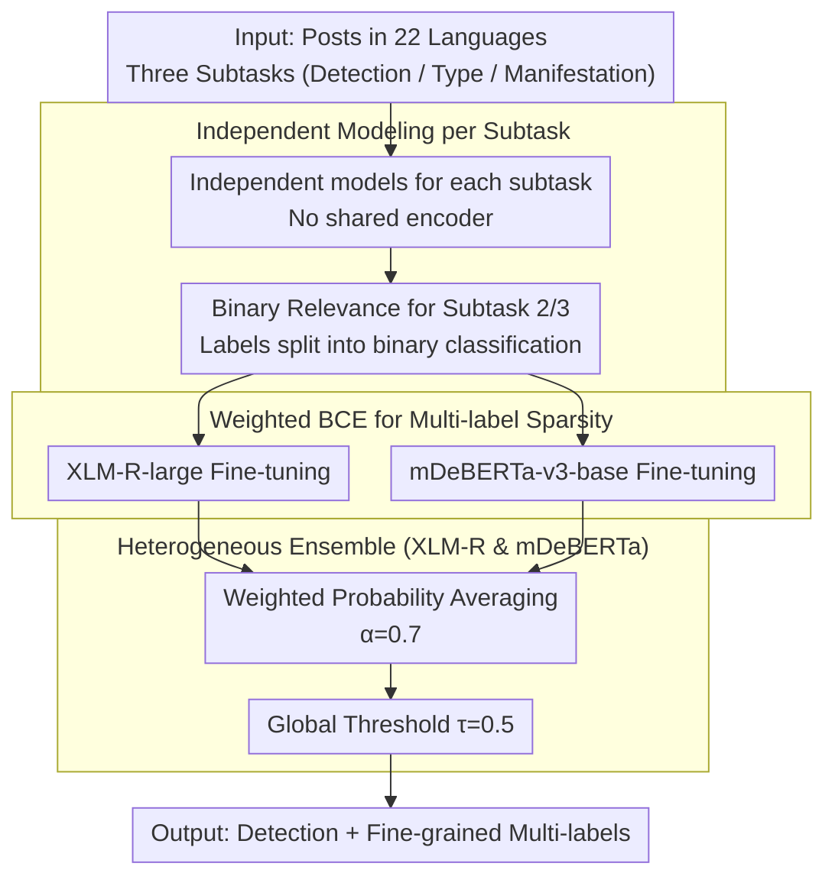

# YEZE at SemEval-2026 Task 9: Detecting Multilingual, Multicultural and Multievent Online Polarization via Heterogeneous Ensembling

**Conference**: ACL2026  
**arXiv**: [2605.06231](https://arxiv.org/abs/2605.06231)  
**Code**: https://github.com/FezeGo/SemEval-2026-Task9-Polar  
**Area**: Multilingual Translation / Multilingual Content Safety / Social Media Analysis  
**Keywords**: Multilingual Polarization Detection, SemEval, Class Imbalance, XLM-R, Heterogeneous Ensembling

## TL;DR
The YEZE system decomposes the online polarization recognition of 22 languages in SemEval-2026 Task 9 into independent subtasks. By fine-tuning XLM-RoBERTa-large and mDeBERTa-v3-base separately and utilizing weighted probability averaging alongside weighted BCE to alleviate multi-label sparsity, the system achieved stable official Top-10 rankings in fine-grained polarization type and manifestation prediction.

## Background & Motivation
**Background**: Online polarization detection has expanded from binary "polarized or not" classification to more granular multi-label problems: identifying the target of polarization and its linguistic manifestation. SemEval-2026 Task 9 places this problem within the context of 22 languages and multiple cultures/events, requiring systems to handle three subtasks: POLARDETECT, POLARTYPE, and POLARMANIFEST.

**Limitations of Prior Work**: Multilingual social media data distribution is highly imbalanced. The proportion of positive polarization instances varies significantly across languages, and fine-grained labels are extremely sparse. When using Macro-F1 as a metric, poor performance on minority classes leads to significant penalties. Furthermore, while multi-task learning (MTL) seemingly shares representations, coarse-grained binary tasks often dominate gradients, drowning out fine-grained target and manifestation labels.

**Key Challenge**: The system must achieve cross-lingual sharing without allowing interference between different languages, subtasks, or labels. It needs to improve recall for low-resource labels without compromising precision through over-prediction.

**Goal**: The authors aim to build a robust shared task system that maintains stable performance across all languages and three subtasks. Specific objectives include selecting robust multilingual encoders, designing optimizations for class-imbalanced multi-label tasks, comparing independent modeling vs. MTL, and analyzing remaining challenges in specific languages and labels.

**Key Insight**: Instead of pivoting to Large Language Model (LLM) prompting, the authors return to supervised multilingual encoders. They argue that under conditions of low resources, class imbalance, and fine-grained multi-labeling, controllable XLM-R/mDeBERTa fine-tuning is more stable than LLM generative approaches.

**Core Idea**: "Independent Modeling per Subtask + Weighted BCE + Heterogeneous Ensembling of XLM-R/mDeBERTa" replaces shared MTL to separately handle cross-lingual robustness and fine-grained label stability.

## Method
This paper is a system description paper focused on a robust engineering pipeline for a multilingual polarization shared task rather than a novel model architecture. The system targets three outputs: Subtask 1 (binary classification of polarization), Subtask 2 (multi-label prediction of five polarization targets), and Subtask 3 (multi-label prediction of six manifestations). Subtask 1/2 covers 22 languages, while Subtask 3 covers 18.

### Overall Architecture
The pipeline is straightforward: independently train XLM-RoBERTa-large and mDeBERTa-v3-base for each subtask. For multi-label subtasks, binary relevance is used, treating each label as an independent binary classification. Weighted BCE handles class sparsity. Ensemble weights for XLM-R and mDeBERTa are searched on the dev set, resulting in a probability average with `alpha=0.7`. During inference, a global threshold of `tau=0.5` is used, as per-label threshold tuning was found to decrease Macro-F1 under extreme sparsity.

The authors also implemented two baselines: single backbone models and an MTL version sharing an XLM-R encoder with task-specific heads. The final submission utilizes heterogeneous ensembles of independently trained subtasks for optimal stability across all tasks.

### Key Designs

**1. Independent Modeling per Subtask: Separating coarse binary detection from fine-grained multi-labels to avoid negative transfer in shared encoders.**

While multi-task learning can share cross-lingual representations, POLARDETECT provides the densest signals and coarsest labels, whereas POLARTYPE / POLARMANIFEST labels are highly sparse. In a shared encoder, the primary task pulls representations toward the binary boundary, overwhelming fine-grained signals. The authors trained separate models for each task; Subtask 2/3 further decomposed into independent binary classifications using binary relevance, where each label outputs its own sigmoid probability. This sacrifices parameter sharing to prevent fine-grained signals from being flattened by gradients dominated by the binary task.

**2. Weighted BCE for Multi-label Sparsity Optimization: Amplifying rare positive instances to align with Macro-F1 rather than overall accuracy.**

Since the SemEval metric is label-wise Macro-F1, failure to learn minority labels results in heavy penalties. Standard BCE often defaults to "always negative" for extremely sparse labels. WBCE calculates a positive weight for each label based on frequency: $w_c = N_{\text{neg},c} / \max(N_{\text{pos},c}, 1)$, applied via `BCEWithLogitsLoss(pos_weight=...)`. This amplifies losses for rare labels, preventing them from being diluted by massive negative samples. Compared to Focal Loss, WBCE specifically targets "positive scarcity," providing significant gains in extremely sparse languages like Telugu ($+0.21$) and Hausa.

**3. Heterogeneous Ensemble of XLM-R and mDeBERTa: Using complementary representations to reduce variance.**

Linguistic scripts, morphology, and social media expressions can create language-specific vulnerabilities in a single backbone. The system calculates $\bar{P} = \alpha\, P_{\text{XLM-R}} + (1-\alpha)\, P_{\text{mDeBERTa}}$ with $\alpha=0.7$. XLM-R serves as the primary model with mDeBERTa providing supplementary signals. A global threshold $\tau=0.5$ was chosen over per-label tuning to avoid overfitting on sparse development data.

### Loss & Training
Training relied solely on official task data. For development, an 85/15 split was used: standard stratification for Subtask 1 and iterative stratification for Subtasks 2/3 to preserve rare label co-occurrences. Post-dev, models were retrained on the combined train+dev sets.

Emojis were retained as sentiment cues, while empty texts were removed. Max length was set to 256 with dynamic padding. Models were fine-tuned using AdamW on A100 GPUs (bf16/tf32). XLM-R: LR `1e-5`, 4 epochs, BS 32. mDeBERTa: LR `2e-5`, 5 epochs, BS 64. Warmup ratio 0.1 and weight decay 0 were used. Translation augmentation via Gemini for Hausa did not yield significant gains.

## Key Experimental Results

### Main Results
Official results indicate that the ensemble model is the most stable choice for average Macro-F1, yielding the highest scores in Subtask 1 and 2, while being nearly identical to the single XLM-R model in Subtask 3.

| Subtask | XLM-R | mDeBERTa | Ensemble | MTL | Conclusion |
|---------|------:|---------:|---------:|----:|------------|
| Subtask 1: POLARDETECT | 0.788 | 0.778 | 0.796 | 0.792 | Ensemble highest, followed by MTL |
| Subtask 2: POLARTYPE | 0.565 | 0.550 | 0.575 | 0.554 | Ensemble clearly best |
| Subtask 3: POLARMANIFEST | 0.485 | 0.456 | 0.484 | 0.476 | XLM-R slightly higher, Ensemble equal |

In terms of official rankings, the system entered the Top 10 for 11/22, 16/22, and 17/18 languages across the three subtasks respectively, demonstrating high competitiveness in fine-grained tasks.

| Metric | Subtask 1 | Subtask 2 | Subtask 3 |
|--------|----------:|----------:|----------:|
| Top-10 Languages | 11/22 | 16/22 | 17/18 |
| Representative Top-5 | Odia 4th | Amharic 4th, Urdu/Odia/Polish 5th | Arabic 3rd, Urdu 3rd, Spanish 4th, English/Khmer 5th |
| Main Weakness | Lower rank in highly competitive English/Arabic | High variance in sparse target labels | Rarest manifestation labels |

### Ablation Study
Ablation of optimization targets shows that WBCE is crucial for low-resource and sparse labels.

| Language/Avg | BCE Base | Focal Loss | WBCE | Gain vs. Base |
|--------------|---------:|-----------:|-----:|---------------:|
| Chinese | 0.6905 | 0.6893 | 0.7218 | +0.0313 |
| Hindi | 0.7724 | 0.8127 | 0.7996 | +0.0272 |
| Telugu | 0.2253 | 0.2986 | 0.4372 | +0.2119 |
| Amharic | 0.3760 | 0.4568 | 0.4589 | +0.0829 |
| Hausa | 0.1115 | 0.2719 | 0.2513 | +0.1398 |
| Average | 0.4351 | 0.5053 | 0.5338 | +0.0987 |

| Design Choice | Observation | Explanation |
|---------------|-------------|-------------|
| Indep. vs MTL | MTL helps Subtask 1 but hurts Subtask 2/3 avg | Binary classification dominates shared encoder; negative transfer |
| Global vs Per-label Threshold | Per-label threshold tuning lowers Macro-F1 | Sparse labels lead to unstable estimates; overfitting dev set |
| Translation Augmentation | No gain from 4k Gemini-translated Hausa samples | "Translationese" and pragmatic shift weaken regional cues |
| Ensemble vs Single | More stable average across languages | Complementary encoders reduce variance at low cost |

### Key Findings
- Binary detection is relatively mature; the primary difficulty lies in the multi-label sparsity of Subtasks 2/3 (e.g., Religious, Dehumanization, Invalidation labels).
- WBCE is more suitable than Focal Loss for extreme sparsity in this task.
- Independent modeling improves robustness but introduces cross-task inconsistency (e.g., a post classified as non-polarized in S1 but given positive labels in S2).
- Multilingual model difficulties extend beyond language coverage to scripts, tokenization, and cultural/political context. Pure translation cannot reliably fill these pragmatic gaps.

## Highlights & Insights
- The system's highlight is its "conservative yet robust" engineering. It focuses on the real bottlenecks—independent modeling, class weighting, and heterogeneous ensembles.
- The reflection on MTL is insightful: shared training is not always beneficial, especially when label densities vary significantly, as it can flatten fine-grained signals.
- The failure of translation augmentation is noteworthy. Multilingual safety is not just about translation; regional political metaphors and pragmatic intensity are often lost.
- Post-hoc analysis identifies calibration and label collapse as the core issues, which is more actionable than simply stating "low-resource languages are hard."

## Limitations & Future Work
- The system primarily relies on supervised encoders and cannot fully exploit LLM cross-cultural reasoning or long-context capabilities.
- The ensemble uses fixed $\alpha$ and $\tau$, which simple but fails to adapt to linguistic or label-level calibration differences.
- Independent modeling leads to hierarchy inconsistency. Future work could implement logical gating or soft constraints.
- Future data augmentation should be "culturally grounded," preserving regional events and specific satirical styles rather than plain translation.

## Related Work & Insights
- **vs. MTL**: While MTL aims to leverage task correlation, the authors found negative transfer for sparse labels; independent modeling prioritized the Macro-F1 of sparse targets.
- **vs. LLMs**: LLMs lack the controllability and calibration of supervised encoders for fine-grained multi-label shared tasks.
- **vs. Focal Loss**: While Focal Loss targets "hard examples," WBCE more directly compensates for positive scarcity in this specific sparse multi-label scenario.

## Rating
- Novelty: ⭐⭐⭐ The combination is standard, but the analysis of MTL negative transfer and augmentation failure is valuable.
- Experimental Thoroughness: ⭐⭐⭐⭐ Coverage of 22 languages and comparison across single/MTL/ensemble/losses is solid for a system paper.
- Writing Quality: ⭐⭐⭐⭐ Clear structure and actionable conclusions derived from error analysis.
- Value: ⭐⭐⭐⭐ Directly relevant for building multilingual content safety systems and handling low-resource multi-label classification.

<!-- RELATED:START -->

## Related Papers

- [\[ACL 2026\] mdok-style at SemEval-2026 Task 9: Finetuning LLMs for Multilingual Polarization Detection](mdok-style_at_semeval-2026_task_9_finetuning_llms_for_multilingual_polarization_.md)
- [\[ACL 2026\] BITS Pilani at SemEval-2026 Task 9: Structured Supervised Fine-Tuning with DPO Refinement for Polarization Detection](bits_pilani_at_semeval-2026_task_9_structured_supervised_fine-tuning_with_dpo_re.md)
- [\[ACL 2026\] PSK@EEUCA 2026: Fine-Tuning Large Language Models with Synthetic Data Augmentation for Multi-Class Toxicity Detection in Gaming Chat](pskeeuca_2026_fine-tuning_large_language_models_with_synthetic_data_augmentation.md)
- [\[ACL 2026\] Why Are We Moral? An LLM-based Agent Simulation Approach to Study Moral Evolution](why_are_we_moral_an_llm-based_agent_simulation_approach_to_study_moral_evolution.md)
- [\[ACL 2026\] Point of Order: Action-Aware LLM Persona Modeling for Realistic Civic Simulation](point_of_order_action-aware_llm_persona_modeling_for_realistic_civic_simulation.md)

<!-- RELATED:END -->
