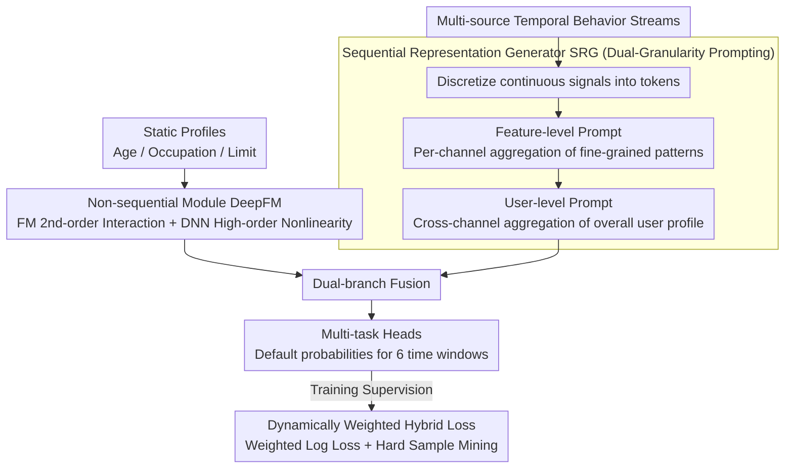

# A Unified Framework for Modeling Heterogeneous Financial Data via Dual-Granularity Prompting

**Conference**: ACL 2026 Oral  
**arXiv**: [2404.13004](https://arxiv.org/abs/2404.13004)  
**Code**: [GitHub](https://github.com/didiglobal-fintech-credit-risk/FinLangNet)  
**Area**: Time Series / Financial NLP  
**Keywords**: Credit Risk Prediction, Heterogeneous Financial Data, Dual-Granularity Prompting, Multi-scale Prediction, Industrial Deployment

## TL;DR

The FinLangNet framework is proposed, utilizing a dual-module architecture (DeepFM for static features and a Transformer with a dual-granularity prompting mechanism for temporal behavior) to achieve multi-scale credit risk prediction. Its deployment on the Didi Finance platform resulted in a 6.3pp increase in KS and a 9.9% reduction in the bad debt rate.

## Background & Motivation

**Background**: Industrial credit scoring systems still rely heavily on statistical learning methods like XGBoost, requiring extensive manual feature engineering. Deep learning methods have not yet stabilized their superiority over traditional methods in this field.

**Limitations of Prior Work**: (1) XGBoost requires time-consuming feature engineering and domain expertise; (2) static models fail to capture temporal dependencies in user behavior; (3) existing methods focus only on point-in-time prediction, failing to model the evolution of creditworthiness across different time windows.

**Key Challenge**: User credit risk is dynamic—users may be safe in the short term but risky in the long term—making a single prediction point insufficient for comprehensive risk management decisions.

**Goal**: To redefine credit scoring from static binary classification to a multi-scale sequence learning problem while processing heterogeneous financial data (static attributes + multi-source temporal behavior).

**Key Insight**: Drawing inspiration from Transformer and prompt technologies in NLP, a dual-granularity prompting mechanism is designed to handle the specificities of financial time series data.

**Core Idea**: Use feature-level prompts to capture channel-specific temporal patterns and user-level prompts to aggregate the overall user profile, achieving a complete risk representation from fine-grained to coarse-grained levels.

## Method

### Overall Architecture

FinLangNet redefines credit scoring from "static binary classification" to "multi-scale temporal prediction" and uses two complementary modules to digest two distinct types of signals in financial data. One branch is a non-sequential module (DeepFM), responsible for processing static user profiles (age, occupation, limit, etc.); the other branch is the Sequential Representation Generator (SRG), which processes multi-source temporal behavior streams using a dual-granularity prompting mechanism. The outputs from both branches are fused and fed into multi-task heads to simultaneously predict default probabilities across 6 different time windows, characterizing the evolution of creditworthiness over time rather than just a snapshot. During training, a dynamically weighted hybrid loss is used to combat class imbalance and mine hard samples.

### Key Designs

**1. Non-sequential Module (DeepFM): Making combinatorial risks in static features explicitly visible**

Risk signals in static profiles often reside in combinations of fields (e.g., the intersection of "age × occupation × income") rather than individual ones. Simply feeding features into an MLP makes it difficult to automatically learn these second-order interactions. Therefore, this module adopts the dual-branch structure of DeepFM: the FM branch explicitly models second-order feature interactions $y_{FM} = \langle w, m \rangle + \sum_{j_1}\sum_{j_2} \langle V_{j_1}, V_{j_2} \rangle m_{j_1} m_{j_2}$, while the DNN branch complements this with high-order non-linear relationships. The combination results in the static embedding $O_m$. This retains the advantages of feature interaction used in the XGBoost era while eliminating the heavy engineering of manual feature construction.

**2. SRG Dual-Granularity Prompting: Capturing temporal profiles at both channel and user granularities**

Financial time series differ significantly from natural language—they are multi-source, highly sparse, and noisy, making direct Transformer application unstable. SRG first discretizes continuous financial signals into tokens to enhance robustness, then introduces two levels of learnable prompts for hierarchical aggregation: the Feature-level Prompt $\widetilde{\phi}_c$ adds an aggregation token for each channel sequence to capture channel-specific global patterns (fine-grained behavior signals); the User-level Prompt $P_s$ aggregates across all channels to refine the overall user behavior profile (coarse-grained risk tendency). By stacking these two levels, the model obtains a complete user representation that preserves both channel details and a global perspective.

**3. Dynamically Weighted Hybrid Loss: Addressing "minority default" and "overwhelmed hard samples" simultaneously**

Credit data is naturally imbalanced (defaults are rare), and sample difficulty varies significantly. Standard losses can be dominated by a vast number of easy-to-classify negative samples. The loss is thus two-fold: Weighted Log Loss (WLL) applies higher penalties to the minority class to counter imbalance, while dynamic hard sample mining calculates sample weights $\omega_i$ in real-time based on the gradient norm $g_i = |\partial \mathcal{L}_i / \partial y'_i|$, automatically up-weighting hard samples that the model has not yet mastered. Both are combined into a hybrid regression + classification objective.

### Loss & Training

The total objective function is $\mathcal{L}_{total} = \frac{1}{n} \sum_{i=1}^{n} \omega_i [\beta(y'_i - y_i)^2 + (1-\beta) \mathcal{L}_{WLL,i}]$, where $\beta$ balances regression smoothness and classification stability, and $\omega_i$ is the dynamic weight. Multi-scale prediction uses independent task heads to predict default probabilities for 6 different time windows.

## Key Experimental Results

### Main Results

| Model | y1 AUC | y1 KS | y2 AUC | y2 KS | y3 AUC | y3 KS |
|------|--------|-------|--------|-------|--------|-------|
| XGBoost | 72.78 | 32.85 | 75.76 | 37.42 | 70.89 | 30.00 |
| Transformer | 72.54 | 32.62 | 75.95 | 37.98 | 70.97 | 30.12 |
| TimesNet | 72.49 | 32.54 | 75.90 | 37.98 | 70.83 | 29.99 |
| GPT-4.1 (Zero-shot) | 55.90 | 10.85 | 56.80 | 12.50 | 55.15 | 9.30 |
| **Ours** | **73.55** | **34.08** | **76.96** | **39.46** | **71.92** | **31.60** |

### Ablation Study

| Configuration | Key Metrics | Description |
|------|---------|------|
| Remove Feature-level Prompt | KS Decrease | Channel-level patterns are vital for precise risk characterization |
| Remove User-level Prompt | KS Decrease | User-level aggregation is necessary for the overall profile |
| Remove Multi-scale Prediction | Long-term worsening | Multi-scale tasks provide mutual gradient signals |
| Industrial Deployment | KS +6.3pp, Bad Debt -9.9% | Significantly outperforms the original XGBoost system |

### Key Findings
- FinLangNet outperforms XGBoost and deep learning baselines across all 6 time scales.
- Zero-shot LLM performance on credit scoring is poor (AUC only 55-56), proving the task requires specialized models.
- Both levels of the dual-granularity prompting mechanism play irreplaceable roles.
- Industrial deployment results are significant; a 6.3pp KS improvement carries substantial commercial value in the financial sector.

## Highlights & Insights
- Migrating the prompt concept from NLP to financial time series processing creatively solves the unified representation problem of heterogeneous multi-source data.
- The redefinition of the problem from "credit scoring as classification" to "credit scoring as multi-scale temporal prediction" is highly insightful.
- Industrial deployment data provides strong evidence of practical value—the 6.3pp KS gain and 9.9% reduction in bad debt translate to significant economic benefits.

## Limitations & Future Work
- Currently only validated in Didi Finance scenarios; generalization to other financial contexts (e.g., banking, insurance) requires further verification.
- Explainability is a mandatory requirement for financial models, which is insufficiently discussed in this paper.
- The strategy for selecting hyperparameters ($\alpha$, $\beta$) for the dynamically weighted loss is not fully explained.
- Future work could combine LLM knowledge to assist feature engineering or explore privacy protection under federated learning frameworks.

## Related Work & Insights
- **vs XGBoost**: Retains the strength of XGBoost in processing static features (via DeepFM) while adding temporal modeling capabilities.
- **vs General Time Series Models (TimesNet, etc.)**: Better adapts to the multi-source heterogeneous nature of financial data through the dual-granularity prompting mechanism.
- **vs LLM Zero-shot Methods**: Demonstrates that credit scoring requires specialized models that general LLMs cannot handle.

## Rating
- Novelty: ⭐⭐⭐⭐ Both the dual-granularity prompting and problem redefinition are innovative.
- Experimental Thoroughness: ⭐⭐⭐⭐⭐ Double validation through public datasets and industrial deployment.
- Writing Quality: ⭐⭐⭐⭐ Clear methodological descriptions and persuasive industrial data.
- Value: ⭐⭐⭐⭐⭐ Significant industrial impact provides an important reference for Financial AI.

<!-- RELATED:START -->

## Related Papers

- [\[ICLR 2026\] A Unified Federated Framework for Trajectory Data Preparation via LLMs](../../ICLR2026/time_series/a_unified_federated_framework_for_trajectory_data_preparation_via_llms.md)
- [\[ICLR 2026\] SuperMAN: Interpretable and Expressive Networks over Temporally Sparse Heterogeneous Data](../../ICLR2026/time_series/superman_interpretable_and_expressive_networks_over_temporally_sparse_heterogene.md)
- [\[ICLR 2026\] pyrregular: A Unified Framework for Irregular Time Series, with Classification Benchmarks](../../ICLR2026/time_series/pyrregular_a_unified_framework_for_irregular_time_series_with_classification_ben.md)
- [\[ICLR 2026\] Towards Robust Real-World Multivariate Time Series Forecasting: A Unified Framework](../../ICLR2026/time_series/towards_robust_real-world_multivariate_time_series_forecasting_a_unified_framewo.md)
- [\[ICLR 2026\] EDINET-Bench: Evaluating LLMs on Complex Financial Tasks using Japanese Financial Statements](../../ICLR2026/time_series/edinet-bench_evaluating_llms_on_complex_financial_tasks_using_japanese_financial.md)

<!-- RELATED:END -->
