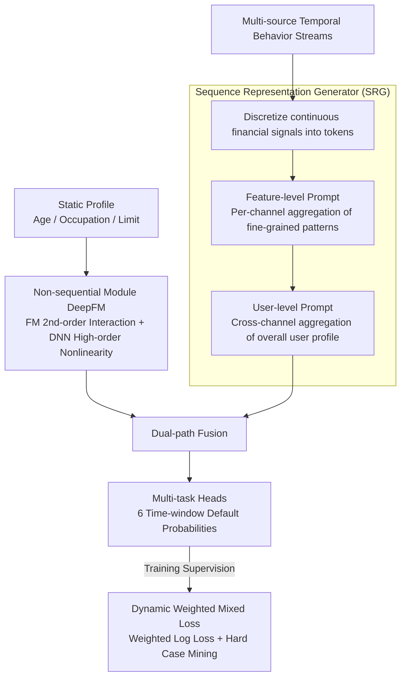

# A Unified Framework for Modeling Heterogeneous Financial Data via Dual-Granularity Prompting

**Conference**: ACL 2026 Oral  
**arXiv**: [2404.13004](https://arxiv.org/abs/2404.13004)  
**Code**: [GitHub](https://github.com/didiglobal-fintech-credit-risk/FinLangNet)  
**Area**: Time Series / Financial NLP  
**Keywords**: Credit Risk Prediction, Heterogeneous Financial Data, Dual-Granularity Prompting, Multi-scale Prediction, Industrial Deployment

## TL;DR

The FinLangNet framework is proposed, utilizing a dual-module architecture (DeepFM for static features and Transformer with a dual-granularity prompting mechanism for temporal behaviors) to achieve multi-scale credit risk prediction. Deployment on the Didi Finance platform resulted in a 6.3pp KS gain and a 9.9% reduction in the bad debt rate.

## Background & Motivation

**Background**: Industrial credit scoring systems still rely heavily on statistical learning methods like XGBoost, which require extensive manual feature engineering. Deep learning methods have not yet stabilized their superiority over traditional methods in this field.

**Limitations of Prior Work**: (1) XGBoost requires time-consuming feature engineering and domain expertise; (2) Static models cannot capture temporal dependencies in user behavior; (3) Existing methods perform only point-in-time prediction, failing to model the evolution of creditworthiness across different time windows.

**Key Challenge**: User credit risk is dynamic—safe in the short term but potentially risky in the long term—making a single prediction point insufficient for comprehensive risk management decisions.

**Goal**: Redefine credit scoring from a static binary classification problem to a multi-scale sequence learning problem, simultaneously processing heterogeneous financial data (static attributes + multi-source temporal behaviors).

**Key Insight**: Drawing inspiration from Transformer and prompt technologies in NLP, a dual-granularity prompting mechanism is designed to handle the specificities of financial time-series data.

**Core Idea**: Use feature-level prompts to capture channel-specific temporal patterns and user-level prompts to aggregate the overall user profile, achieving a complete risk representation from fine-grained to coarse-grained levels.

## Method

### Overall Architecture

FinLangNet redefines credit scoring from "static binary classification" to "multi-scale temporal prediction" and uses two complementary modules to digest two distinct types of signals in financial data. One branch is a non-sequential module (DeepFM), responsible for processing static user profiles (age, occupation, limit, etc.); the other branch is the Sequence Representation Generator (SRG), which processes multi-source temporal behavior streams using a dual-granularity prompting mechanism. The outputs of both paths are fused and fed into multi-task heads to simultaneously predict default probabilities for six different time windows, thereby characterizing the evolution of creditworthiness over time rather than a single snapshot. During training, a dynamic weighted mixed loss is used to combat class imbalance and mine hard samples.

### Key Designs

**1. Non-sequential Module (DeepFM): Making combinatorial risks in static features explicitly visible**

Risk signals in static profiles hidden in feature combinations (e.g., "Age × Occupation × Income") rather than individual fields. Feeding features solely into an MLP makes it difficult to automatically learn these second-order interactions. This module adopts the dual-branch structure of DeepFM: the FM branch explicitly models second-order feature interactions $y_{FM} = \langle w, m \rangle + \sum_{j_1}\sum_{j_2} \langle V_{j_1}, V_{j_2} \rangle m_{j_1} m_{j_2}$, while the DNN branch supplements with high-order nonlinear relationships. These are combined to obtain the static embedding $O_m$. This maintains the advantage of capturing risk through feature crossing from the XGBoost era while eliminating the heavy engineering of manual feature construction.

**2. Dual-Granularity Prompting in SRG: Capturing temporal profiles at both channel and user granularities**

Financial time series differ from natural language—they are multi-source, highly sparse, and noisy, making direct application of Transformers unstable. SRG first discretizes continuous financial signals into tokens to enhance robustness, then introduces two levels of learnable prompts for hierarchical aggregation: the Feature-level Prompt $\widetilde{\phi}_c$ adds an aggregation token for each channel sequence to capture global patterns specific to that channel (fine-grained behavior signals); the User-level Prompt $P_s$ aggregates across all channels to refine an overall user behavior profile (coarse-grained risk propensity). Stacking these two prompts yields a complete user representation that retains both channel details and a global perspective.

**3. Dynamic Weighted Mixed Loss: Addressing both "infrequent defaults" and "overwhelmed hard samples"**

Credit data is naturally imbalanced (defaults are rare), and sample difficulty varies significantly. Standard losses are often dominated by a massive number of easy negative samples. The loss is handled in two ways: Weighted Log Loss (WLL) imposes higher penalties on the minority class to counter imbalance; Dynamic Hard Case Mining calculates sample weights $\omega_i$ in real-time based on the gradient norm $g_i = |\partial \mathcal{L}_i / \partial y'_i|$, automatically increasing the weight of hard samples the model has yet to learn. Combined in a mixed regression + classification objective, this focuses the model's attention on samples with high discriminative value.

### Loss & Training

The total objective function is $\mathcal{L}_{total} = \frac{1}{n} \sum_{i=1}^{n} \omega_i [\beta(y'_i - y_i)^2 + (1-\beta) \mathcal{L}_{WLL,i}]$, where $\beta$ balances regression smoothness and classification stability, and $\omega_i$ is the dynamic weight. Multi-scale prediction utilizes independent task heads to predict default probabilities for six different time windows.

## Key Experimental Results

### Main Results

| Model | y1 AUC | y1 KS | y2 AUC | y2 KS | y3 AUC | y3 KS |
|------|--------|-------|--------|-------|--------|-------|
| XGBoost | 72.78 | 32.85 | 75.76 | 37.42 | 70.89 | 30.00 |
| Transformer | 72.54 | 32.62 | 75.95 | 37.98 | 70.97 | 30.12 |
| TimesNet | 72.49 | 32.54 | 75.90 | 37.98 | 70.83 | 29.99 |
| GPT-4.1 (Zero-shot) | 55.90 | 10.85 | 56.80 | 12.50 | 55.15 | 9.30 |
| **Ours** | **73.55** | **34.08** | **76.96** | **39.46** | **71.92** | **31.60** |

### Ablation Study

| Configuration | Key Metric | Description |
|------|---------|------|
| w/o Feature-level Prompt | KS Decrease | Channel-level patterns are vital for fine-grained risk characterization |
| w/o User-level Prompt | KS Decrease | User-level aggregation is necessary for the overall profile |
| w/o Multi-scale Prediction | Degradation in long-term prediction | Multiple scales provide mutual gradient signals |
| Industrial Deployment | KS +6.3pp, Bad Debt -9.9% | Significantly outperforms the original XGBoost system |

### Key Findings
- FinLangNet outperforms XGBoost and deep learning baselines across all six time scales.
- LLM zero-shot credit scoring performs poorly (AUC only 55-56), proving that this task requires specialized models.
- Both levels of the dual-granularity prompting mechanism play indispensable roles.
- Industrial deployment demonstrates significant value; a 6.3pp KS improvement holds major commercial importance in finance.

## Highlights & Insights
- Migrating the prompt concept from NLP to financial time-series processing creatively solves the unified representation problem for heterogeneous multi-source data.
- The shift from "credit scoring as classification" to "credit scoring as multi-scale temporal prediction" is highly insightful.
- Industrial deployment data validates the actual value—the improvements in KS and bad debt rate translate into substantial economic benefits.

## Limitations & Future Work
- Currently validated only in the Didi Finance scenario; generalization to other financial domains (e.g., banking, insurance) requires further verification.
- Explainability is a hard requirement for financial models, which is not sufficiently discussed.
- The strategy for choosing hyper-parameters ($\alpha$, $\beta$) for the dynamic weighted loss is not fully explained.
- Future work could combine LLM knowledge to assist feature engineering or explore privacy protection under federated learning frameworks.

## Related Work & Insights
- **vs XGBoost**: Retains the strength of handling static features (DeepFM) while adding temporal modeling capabilities.
- **vs General Time Series Models (e.g., TimesNet)**: Better adapts to the multi-source heterogeneous nature of financial data through dual-granularity prompting.
- **vs LLM Zero-shot**: Demonstrates that credit scoring requires specialized models that general LLMs cannot handle.

## Rating
- Novelty: ⭐⭐⭐⭐ Both the dual-granularity prompting and the problem redefinition are innovative.
- Experimental Thoroughness: ⭐⭐⭐⭐⭐ Verified via both public datasets and industrial deployment.
- Writing Quality: ⭐⭐⭐⭐ Clear methodological description and convincing industrial data.
- Value: ⭐⭐⭐⭐⭐ Significant industrial impact, providing an important reference for Financial AI.

<!-- RELATED:START -->

## Related Papers

- [\[ICLR 2026\] Towards Robust Real-World Multivariate Time Series Forecasting: A Unified Framework](../../ICLR2026/time_series/towards_robust_real-world_multivariate_time_series_forecasting_a_unified_framewo.md)
- [\[ICLR 2026\] Delta-XAI: A Unified Framework for Explaining Prediction Changes in Online Time Series Monitoring](../../ICLR2026/time_series/delta-xai_a_unified_framework_for_explaining_prediction_changes_in_online_time_s.md)
- [\[ICLR 2026\] EDINET-Bench: Evaluating LLMs on Complex Financial Tasks using Japanese Financial Statements](../../ICLR2026/time_series/edinet-bench_evaluating_llms_on_complex_financial_tasks_using_japanese_financial.md)
- [\[ICML 2025\] Event-Aware Sentiment Factors from LLM-Augmented Financial Tweets: A Transparent Framework for Interpretable Quant Trading](../../ICML2025/time_series/event-aware_sentiment_factors_from_llm-augmented_financial_tweets_a_transparent_.md)
- [\[ICLR 2026\] Reasoning on Time-Series for Financial Technical Analysis](../../ICLR2026/time_series/reasoning_on_time-series_for_financial_technical_analysis.md)

<!-- RELATED:END -->
